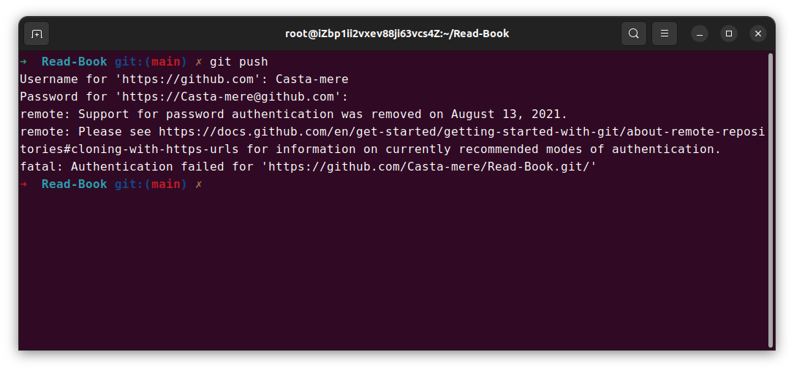
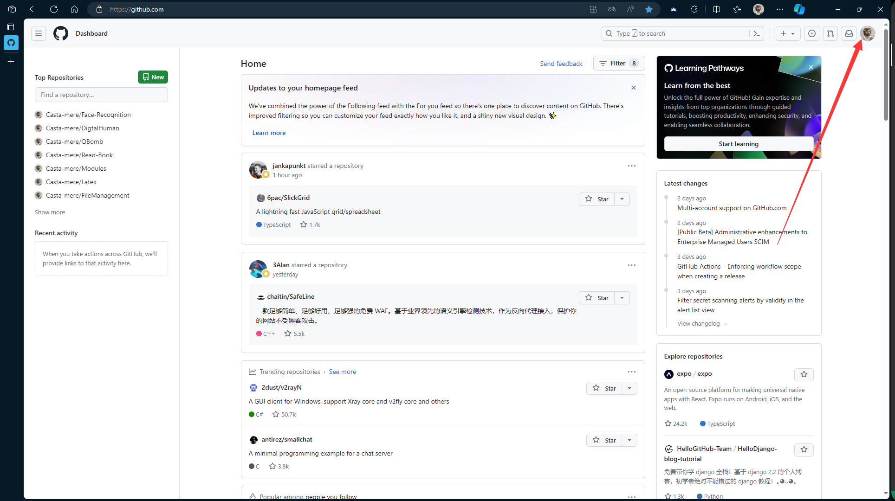
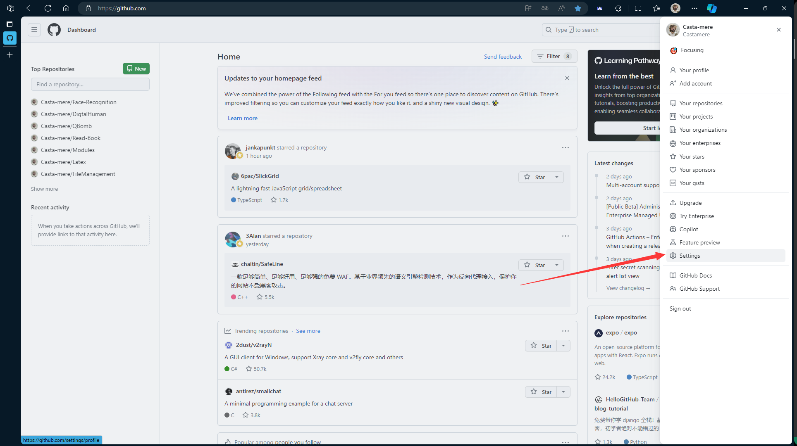
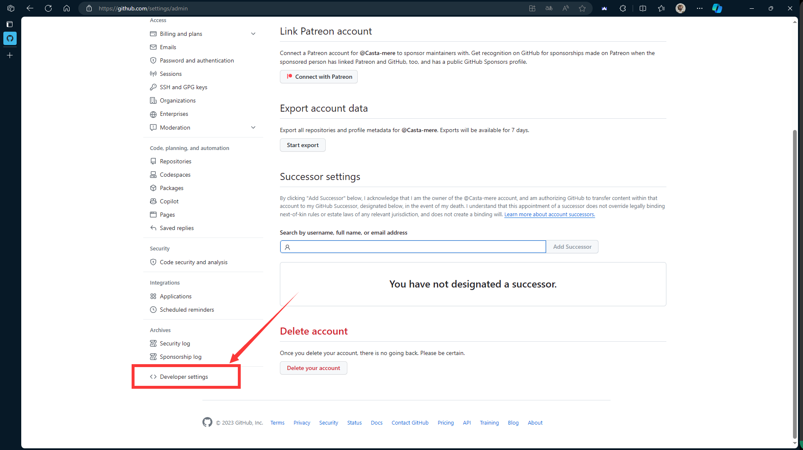
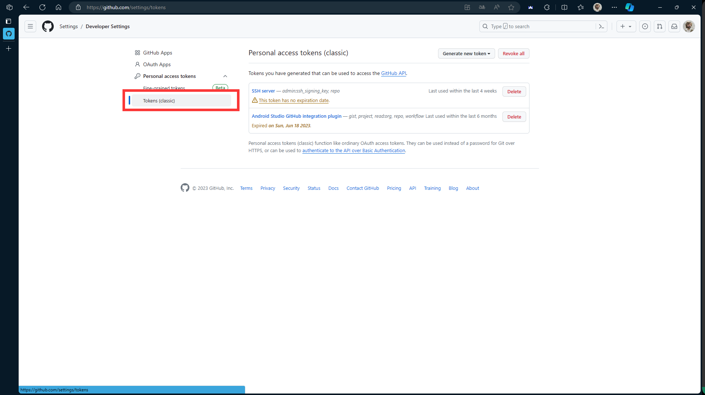
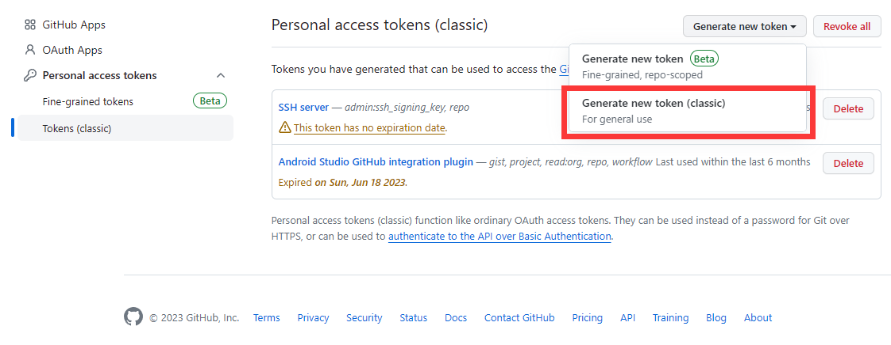
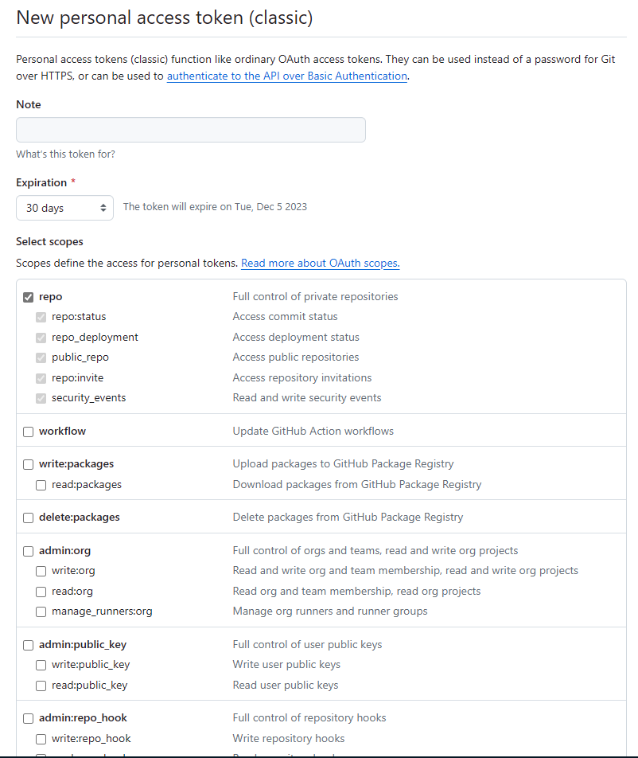
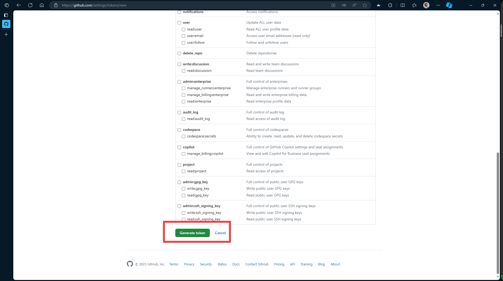
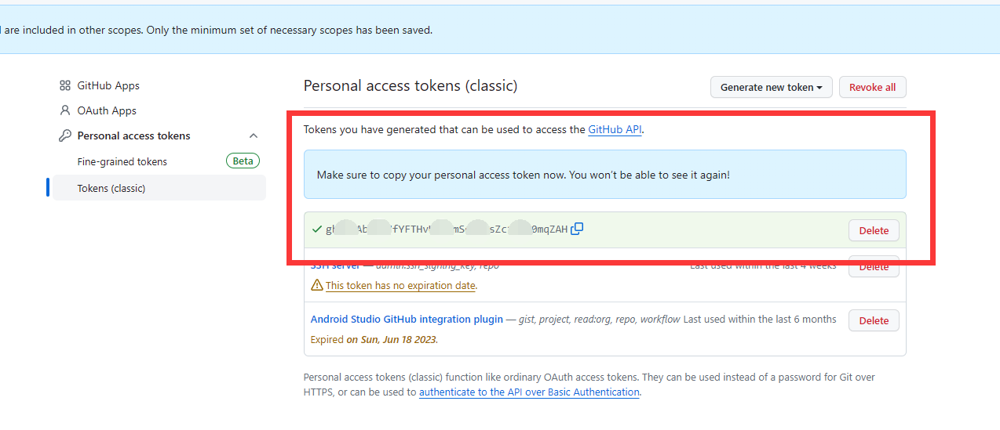
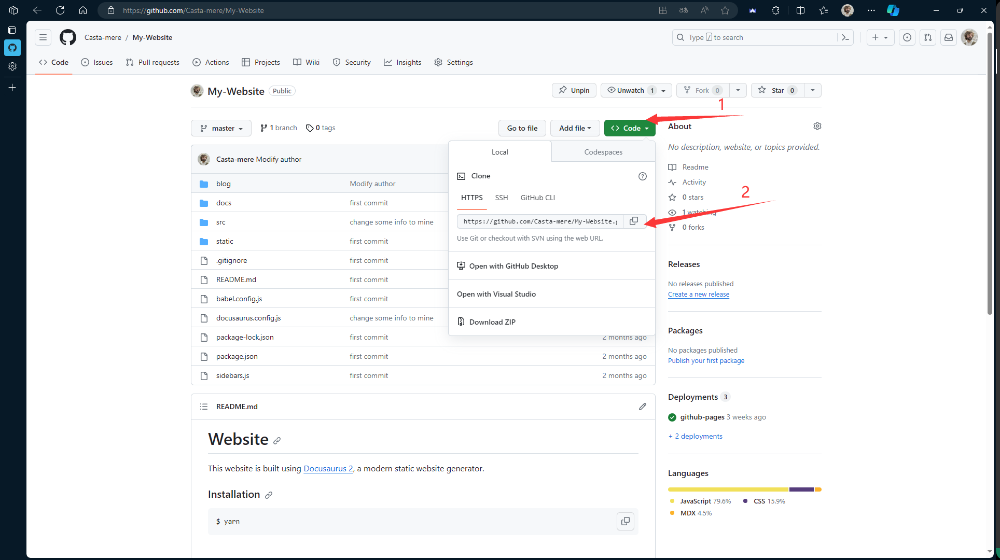

**自2021.8.13开始，Github不再支持使用密码的方式来进行各种远程操作，必须要使用令牌 (token) 进行验证。本文就此问题给出一些指南**

:::danger ERROR

使用 SSH 在 Linux 服务器上 git push 的时候遇到报错

**remote: Support for password authentication was removed on August 13, 2021.**

**fatal: Authentication failed for 'https:<span></span>//github.com/User/Repository.git'**

:::

<!--truncate-->

**不想看分析的同学，可以直接跳到[这里](#解决)看解决方法**

## 缘起

由于之前一直是在本地端用Github Desktop去push，就算是部署的项目，也一般都是本地写代码，然后再上传，所以一直也没有出现过这个问题。但这次使用VS Code连SSH server，而且直接在服务器上build和serve，直接在服务器上写东西也比较方便，就选择了这种纯云开发的形式，但是在push的时候遇到了问题。



## 分析

分析一下报错，大概是说 Github 不再支持只用一个密码来管理所有的内容(就是github网页的登陆密码)。而是使用令牌 (token) 进行验证，当然，这也是大势所趋。在github官方的这篇文章[token-based-authentication]中，详细的为我们解释了个中原因。

<!-- > In recent years, GitHub customers have benefited from a number of security enhancements to GitHub.com, such as **two-factor authentication, sign-in alerts, verified devices, preventing the use of compromised passwords, and WebAuthn support**. These features make it more difficult for an attacker to take a password that’s been reused across multiple websites and use it to try to gain access to your GitHub account. Despite these improvements, for historical reasons customers without two-factor authentication enabled have been able to continue to authenticate Git and API operations using only their GitHub username and password. -->
<!-- > -->
> 近年来，GitHub 客户从 GitHub.com 的一系列安全增强功能中获益匪浅，例如**双因素身份验证、登录提醒、验证设备、避免已泄露密码的重复使用以及 WebAuthn 支持**。这些功能使攻击者更难获取在多个网站上重复使用的密码，并用它来试图访问你的 GitHub 账户。尽管有了这些改进，但由于历史原因，未启用双因素身份验证的客户仍可继续仅使用 GitHub 用户名和密码验证 Git 和 API 操作。

基于 token 的验证方式，相较于密码验证的登陆方式，会有如下优点

+ 唯一性 (Unique) : 对于 Github 来说，每一个 token 都是**唯一的**，而且每一个用户在每一台设备上都可以生成 token (而不重复)
+ 可撤销 (Revocable) : 每个 token 随时都可以被撤销，而不影响其他的 token
+ 权限限制 (Limited) : 每个 token 会包含"权限"，也就是说，可以针对不同场景、用户、设备，设计不同权限的 token 
+ 随机性 (Random) : token 不会受到字典或者暴力尝试的影响，而我们自己所使用的"简单"密码，是有被破解的可能性的

基于 token 的验证方式会影响以下的工作流程

+ 终端 (cmd,git bash) 中使用`git`命令时
+ 使用 Git 的桌面应用程序 ，都需要 token (之前用到过的包括 Android Studio 都是需要。**唯一的例外是 Github Desktop 不需要**)
+ 使用密码直接访问 GitHub.com 上 Git 仓库的任何应用程序/服务

## 解决

### 进入 token 设置页面

:::tip

确保浏览器登陆过 Github 的话可以直接点击这个链接[github-settings-tokens]跳转到 token 设置页面，跳过本小节到[这里](#生成-token)继续

:::

进到 Github 官网，点击右上角头像，在弹出框中点击设置 (settings)



拉到最底下，找到开发人员选项 (Developer settings)


在 Personal access tokens 里面找到 Tokens(classic) 选项


### 生成 token



进入这个界面后有一些选项，包括:
+ **Note** 给这条 token 添加备注，比如用于什么软件，或者用于哪个库等等
+ **Expiration** 该条 token 有效期。出于安全原因，尽量不要设置为永久
+ **Scope** 该条 token 的权限，常见包括库的push, ssh连接, Github Copilot使用等权限。具体可以看这篇官方文档[token-scope]



设置完成后，翻到页面最下方，点击 Generate token 生成令牌



生成完毕之后，复制该令牌

:::danger 重要

Token 生成后，只有这一次复制的机会，出于安全原因，一旦离开该页面将无法再次看到它

:::



### 使用 token

使用 token 有两种方式。第一种是 push 的流程不变，在提示输入密码的时候，输入这个 token 而不是你的 Github 密码。另外一种则是直接把这个 token 记录在远程仓库的链接中，笔者更建议使用后者，这里也就后者的流程进行讲解

首先，找到你库的 .git URL。如下图，可以从库的`code`选项卡中直接复制

```bash
# URL应该是如下的形式
https://github.com/user/my-repository.git
# 比如这个
https://github.com/Casta-mere/My-Website.git
```



终端进入到库的根目录下，输入以下命令

```bash
git remote set-url origin https://token@github.com/user/my-repo.git
# 把上面的 token 那里换成刚刚生成的令牌，如 token 是123456,则命令为
# git remote set-url origin https://123456@github.com/user/my-repo.git
```

设置完成后可以通过`git remote -v`来确认你的设置。建议设置好之后， push 一次试试

:::tip

如果遇到其他问题，建议阅读官方文档[Github-offical]，里面有几个常见问题的解答

:::

## 后记

总之，使用密钥/令牌的身份验证方式是大势所趋，相信后面这种方式使用频率会越来越高

[Github-offical]:https://docs.github.com/zh/authentication/keeping-your-account-and-data-secure/managing-your-personal-access-tokens

[token-based-authentication]:https://github.blog/2020-12-15-token-authentication-requirements-for-git-operations/
[github-settings-tokens]:https://github.com/settings/tokens

[token-scope]:https://docs.github.com/en/apps/oauth-apps/building-oauth-apps/scopes-for-oauth-apps