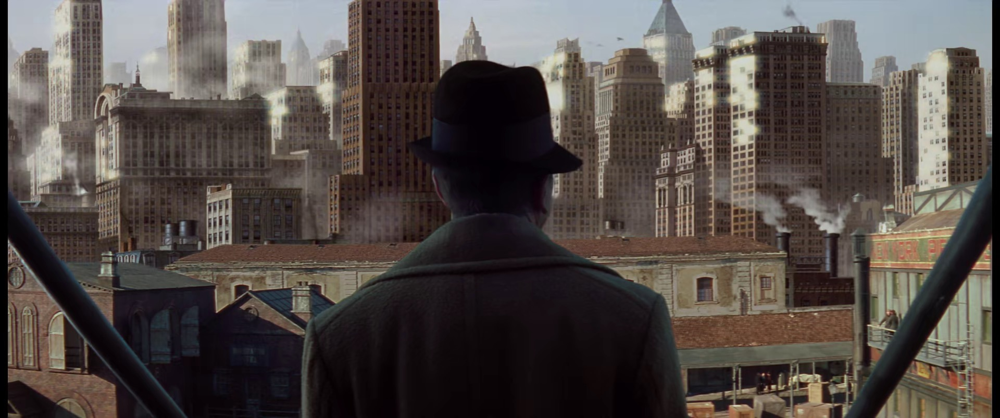
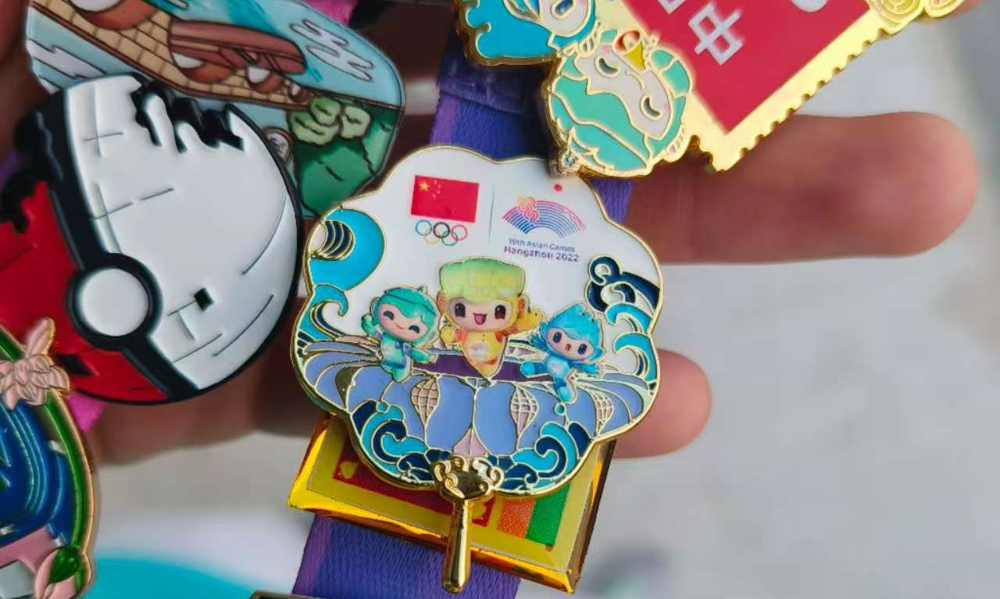

一种迷茫

<!--truncate-->

极度自信却又极度自卑

:::info

本篇作于笔者大四上半学期

:::

## 初见杭州

我来自一个小城市，虽说太原高低是一个省会，但第一次来到浙江，来到杭州，来到大学的时候，还是被“吓”到了。当时提前了几天来杭州，刚上大学嘛，家里人也想趁着这个机会来杭州玩一下。第一次坐飞机，起飞和着陆过程中，俯瞰两个城市，有几分相似。城市都被一条河分成两半，想起了汾河公园，莫名有几分亲切。但从各个方面来说，都是两个世界

2020 年那个时候，杭州地铁 1 号线还只到下沙江滨，下了飞机后，只能打车去酒店。当时坐在出租车上，家里人和司机闲聊的时候，光是房价就被吓到了，比太原高了有四五倍吧。听着听着就开始出神，望着窗外发呆。一个小时左右的车程，看着窗外从农田 + 独栋小别墅到高楼林立，从机场高速到市中心绿化度惊人的城市快速路。想到自己要一个人在诺大的城市里生活，就仿佛是海上钢琴师里面的 1900，在舷梯上望着这个向往却又害怕的世界

> _All that city. You just couldn't see an end to it. &#8195; &#8195; &#8195; &#8195; &#8195; &#8195; — 1900_

初见杭州

## 工作 or 考研

我曾坚定不移的想要读研、读博

但可能并不是你想象的那个样子

从小到大我接受到的教育就是去好好学习，我也算是那种"听话的孩子"。对于我来说，学习是我喜欢的事，也是我擅长的事情。高中时，每天虽然忙忙碌碌，但是目标明确—高考

刚进大学发现这就是一个小的社会，或许有些沉浸其中，失去本心了。也导致了大学生涯最难崩的一段事—高数 A2 只有 1.8 的绩点。其实总体来说，我所有计算机专业课，绩点都不低。编程语言课基本都在 4.0 以上，计算机课程也没有低于 3.0 的，数构、编译原理、计网这些更是 4.5+。但就因为大一下 5 学分的高数 A2，我的 GPA 一蹶不振，最后想来也因此丢了保研 (我的数学也不差，概率论满绩、高数A1 3.7，离散数学 3.0)

我喜欢科研，也不能算是喜欢科研吧。我可能擅长科研，喜欢搞 Latex、搞一些规范化的东西。如果真的有机会的话，科研下去或许也会不错

但没那么简单

Tully 家的族语：Family, duty, honor。种种因素叠加起来，最后还是选择了工作，可能对我来说，还是选择了 easy way。也可能是太 easy 了，没考虑那么多就这样了

下面那节提到，秋招的黄金期，其实我都在做亚运会志愿者。因为疫情的原因推迟了一年，本来是大二下去，变成了大三下，本来招募的很多同级志愿者都选择了退出，去考研、找工作了。我都不记得当时是抱着什么心态选择了继续。总之闭幕式结束后，已经是十月底了，该招的基本都招完了，我也陷入了一个短暂的迷茫期。找呗，剩啥找啥

上面提到我喜欢 Latex，简历也是用 Latex 做的，在时间不多的情况下，当时确实不是一个好选择，因为有各种各样的格式问题。但最后效果也还不错。先是投了恒生的 C 开发，好像是性格测试那个没过，太逆天了。再就是学院领导帮忙投了大华，但接了个电话也没什么后话，第三个就是 10 月 20 号 dp 来学校宣讲，做了笔试。回去电话技术面，10 月 23 hr面，再后面去公司主管面。11 月 9 号就收到了 offer。其实我总共就投了这三家(好像还投了海康，但没啥后话)，然后可能运气不错，表现也还行，就上了船

eazy 吗，确实有点。那么，代价是什么呢

## 亚运会

亚运会做志愿者这段时间，对我来说可能更是一次 break. A break from everything, or maybe just an excuse for me to, I don't know, rest? think maybe? or something like that. 总的来说就是让我有了一个借口，更好的去逃避对生活、对未来、对爱情、对家庭的责任

可能说的夸张了一点，但是从 7 月 21 开始培训，到 9 月 25 开始正式上岗，再到 10 月 28 亚残闭幕结束，横跨 99 天，500 多个小时。培训期间虽说是工作量还没那么大，但也都是每天都有很多事要做。从开幕式正式上岗开始，9 月 23 到 10 月 5 全勤，每天 12 点左右睡觉，5 点左右起床出发，竞走和马拉松的三天 3 点半出发，真的是每一天都很累，某种程度上来说，也很充实。而正是这种"充实"，让我能对自己说得过去，让自己忙于做一件事情而逃避现实中的问题

当然最后搞到了一个浙江省先进个人是后话了，这段经历最好的纪念品还是中国队的团扇徽章

其实这段经历还有很多可以讲的地方，但还是过段时间再说

## 生于忧患 死于安乐

> 舜发于畎亩之中，傅说举于版筑之间，胶鬲举于鱼盐之中，管夷吾举于士，孙叔敖举于海，百里奚举于市
> 
> 故天将降大任于斯人也，必先苦其心志，劳其筋骨，饿其体肤，空乏其身，行拂乱其所为，所以动心忍性，曾益其所不能
> 
> 人恒过，然后能改
> 
> 困于心，衡于虑，而后作；征于色，发于声，而后喻
> 
> 入则无法家拂士，出则无敌国外患者，国恒亡
> 
> 然后知生于忧患，而死于安乐也

