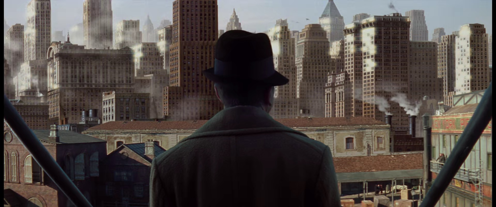

一种迷茫

<!--truncate-->

极度自信却又极度自卑

:::info

本篇作于笔者大四上半学期

:::

## 初见杭州

我来自一个小城市，虽说太原高低是一个省会，但第一次来到浙江，来到杭州，来到大学的时候，还是被“吓”到了。当时提前了几天来杭州，刚上大学嘛，家里人也想趁着这个机会来杭州玩一下。第一次坐飞机，起飞和着陆过程中，俯瞰两个城市，有几分相似。城市都被一条河分成两半，想起了汾河公园，莫名有几分亲切。但从各个方面来说，都是两个世界

2020年那个时候，杭州地铁1号线还只到下沙江滨，下了飞机后，只能打车去酒店。当时坐在出租车上，家里人和司机闲聊的时候，光是房价就被吓到了，比太原高了有四五倍吧。听着听着就开始出神，望着窗外发呆。一个小时左右的车程，看着窗外从农田+独栋小别墅到高楼林立，从机场高速到市中心绿化度惊人的城市快速路。想到自己要一个人在诺大的城市里生活，就仿佛是海上钢琴师里面的1900，在舷梯上望着这个向往却又害怕的世界

> *All that city. You just couldn't see an end to it. &#8195; &#8195; &#8195; &#8195; &#8195; &#8195; — 1900*

初见杭州

## 工作 or 考研

我曾坚定不移的想要读研、读博

但可能并不是你想象的那个样子

从小到大我接受到的教育就是去好好学习，我也算是那种"听话的孩子"。对于我来说，学习是我喜欢的事，也是我擅长的事情。高中时，每天虽然忙忙碌碌，但是目标明确，高考。

## 亚运会

亚运会做志愿者这段时间，对我来说可能更是一次break. A break from everything, or maybe just an excuse for me to, I don't know, rest? think maybe? or something like that. 总的来说就是让我有了一个借口，更好的去逃避对生活、对未来、对爱情、对家庭的责任

可能说的夸张了一点，但是从7月21开始培训，到9月25开始正式上岗，再到10月28亚残闭幕结束，横跨99天，500多个小时。培训期间虽说是工作量还没那么大，但也都是每天都有很多事要做。从开幕式正式上岗开始，9月23到10月5全勤，每天12点左右睡觉，5点左右起床出发，竞走和马拉松的三天3点半出发，真的是每一天都很累，某种程度上来说，也很充实。而正是这种

## 生于忧患 死于安乐