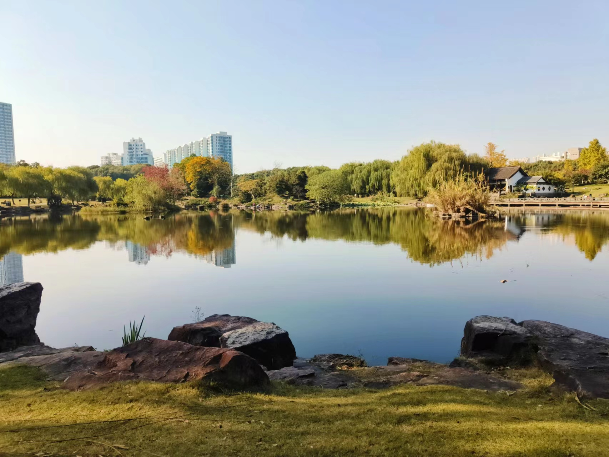
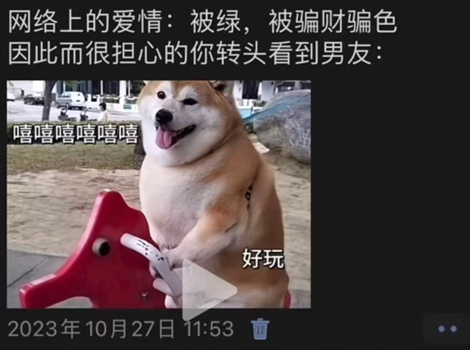

> 你误会我了，我说的是咱这一辈子的终极目标。归根结底，活着是为了什么
> 
> 去码头整点薯条

<!--truncate-->

# 生命的意义

## 恶性循环

最近浑浑噩噩，感觉会经常陷入如此的循环。高压的工作，报复性的摸鱼，再到愧疚感的反思期

中考前压力最大的时候，通了好多个宵。连着看完了四部加勒比海盗（当时还没出5）、八部哈利波特、两部神奇动物在哪里、四部变形金刚

高考前通宵看柯南、老友记，上物理课在下面偷偷把三本『三体』看完了

大四下的这段时间也是这样，11月下旬，秋招告一段落，毕设还没有追的很紧。最近就是到了报复性摸鱼期，有一天晚上刷沙雕短视频到四点半，第二天起来又头疼。有一天吃完午饭回到寝室，真的就是什么都不想干，找一部电影、美剧看都懒的，打一局方舟都懒的。感觉就是浑浑噩噩，做什么事都没有动力，就是各个东西翻一翻，然后无聊上床睡觉，活着看沙雕短视频度日。唯一能让我好好洗漱，出门好好吃饭的原因就是和小韦呆一会了。这样的状态持续了大概十天左右的时间，期间有一天感觉不能这么荒废下去，拉着小韦去学校找了个教室，打算把更新后的 Read-Book 部署一下，但遇到一些 bug。鸡血没撑了一个上午，就溜回去了，午饭后又开始摆烂

## 魔幻的一天

今天算是魔幻的一天

### Love

前几天感觉不能再刷视频到半夜，就把手机放下面再上床，早上睡到11点才迷迷糊糊下床，洗漱出门干饭。杭州这两天的天气主打一个魔幻，有时每天冷的一批，又几天回暖得穿短袖，有时候早晚穿羽绒都冷，中午穿短袖都热…。但今天天气出奇的好，中午主打一个温暖舒适，和小韦去32吃鸡腿饭。小韦也感觉我没什么活力，说着想吃完去旁边高教西公园溜达溜达。就这样，在一个温暖的秋日周一，中午一点多，我们慢慢悠悠走向公园

看着赶着去上课的学弟学妹，越感时光飞逝。刚进公园的时候，看到一个小朋友蹲在那个小道旁边，应该是爷爷奶奶带着，不知道在地上扒拉什么，我俩路过一看，好嘛，小卡片(懂得都懂)，两个人就开始憋笑，等经过他们之后，都憋不住了。想起看到过的一个视频，别的情侣在一起是爱情，我们到后面纯粹是病情。两个人傻到一块，每天笑哈哈

再往前走，腻歪了一会快到湖边，有不少人在湖边草地，帐篷、桌子、野餐布一应俱全。远远看到两只狗子跑来跑去，就开始聊以后是养狗还是养猫，养什么品种啦之类的，结果绕了个弯走到面前发现是两只兔子，尴了个大尬的，差点就远远的嘬嘬嘬呼唤狗子了，还真是头一次见牵着狗链子遛兔子的。看了会继续往前走，湖边找了个树荫坐下来。湖对岸传来有人吹笛子的声音，右面不远处是刚才的那两只兔子在跑来跑去，在旁边还有几对晒太阳的情侣，还有几个大学生样子的小马扎坐着一圈唠嗑，还有人在玩无人机，湖风吹来，小韦枕在我的胳膊上，两个人闭着眼睛享受秋日。惬意、舒适、自由

公园一角有一个区域，摆着滑滑梯、摇摇马、秋千。之前路过的时候，秋千总是有人占着，我们平时就是坐在摇摇马上玩一会，平时基本就是下图这个状态

### F.R.I.E.N.D.S

回去路上碰到大韦，骑着电动车，应该是去考研教室，看到我们喊了一声打招呼

前一天晚上池导刚回学校，五个男生计划晚上去搓一顿。下午四个不考研的在寝室，打开Xbox，Minecraft Dungeon 启动！

五个乐子人，打桌球の快乐完全不在于进球。刘少和池导打的最后一局，史诗级离谱，白球王子刘少，一局打进去六次白球。到最后只剩下黑球和白球的时候，两个旗鼓相当的对手开始发力，一个比一个打的烂，刘少甚至进了3次白球，池导是每次自由球偏一点点。小刚：“还有高手？”，看我们三个笑成sb，旁边工作的小哥，都要tm鳖不住校了

然后今日最离谱事件，晚上买了三杯喜茶的杨枝甘露，花了52，本来打算直接请客好了，也没什么所谓。就在这时，突然，喜茶给我全款退回来了。和池导一说，两个人瞬间要笑死了，光速群里说17，打款。莫名血赚一笔

## 尾声

此时已经晚上十一点多，小韦已经困了要睡觉了，道完晚安，我洗漱完坐在座位上。笑着写完这篇

所以生命的意义是什么，对我来说，活在当下，乐在当下，便是意义