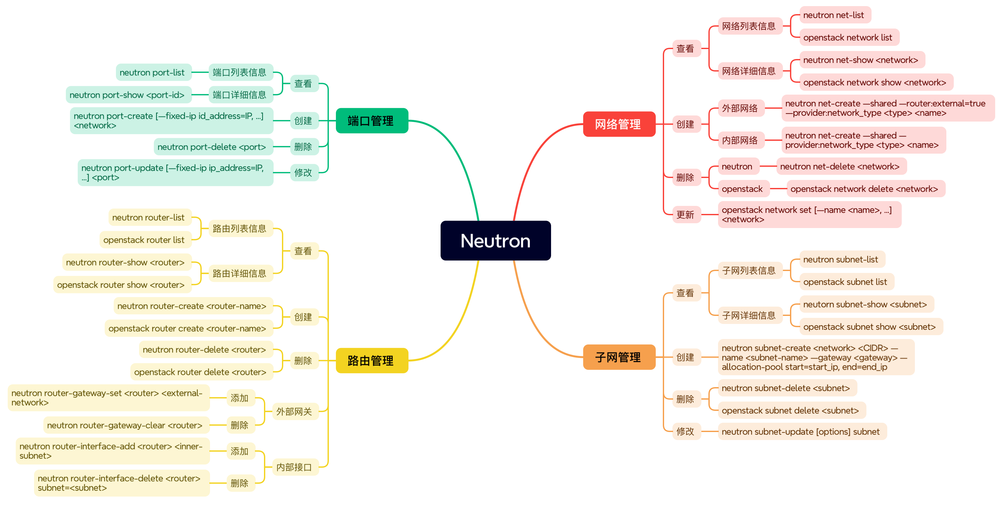

Neutron 常用命令大全



<!--truncate-->

## 网络管理


```bash  title="查看网络"
# 网络列表信息
neutron net-list
openstack network list

# 网络列表信息
neutron net-show <network>
openstack network show <network>
```
```bash title="创建网络"
# 外部网络
neutron net-create --shared --router:external=true --provider:network_type <type> <name>

# 内部网络
neutron net-create --shared --provider:network_type <type> <name>
```
```bash title="删除网络"
# neutron
neutron net-delete <network>

# openstack
openstack network delete <network>
```
```bash title="更新网络"
openstack network set [--name <name>, …] <network>
```

## 子网管理

```bash title="查看子网"
# 子网列表信息
neutron subnet-list
openstack subnet list

# 子网详细信息
neutorn subnet-show <subnet>
openstack subnet show <subnet>
```

```bash title="创建子网"
neutron subnet-create <network> <CIDR> --name <subnet-name> --gateway <gateway> --allocation-pool start=start_ip, end=end_ip
```

```bash title="删除子网"
neutron subnet-delete <subnet>
openstack subnet delete <subnet>
```

```bash title="更新子网"
neutron subnet-update [options] subnet
```

## 路由管理

```bash title="查看路由"
# 路由列表信息
neutron router-list
openstack router list

# 路由详细信息
neutron router-show <router>
openstack router show <router>
```

```bash title="创建路由"
neutron router-create <router-name>
openstack router create <router-name>
```

```bash title="删除路由"
neutron router-delete <router>
openstack router delete <router>
```

```bash title="外部网关"
# 添加
neutron router-gateway-set <router> <external-network>

# 删除
neutron router-gateway-clear <router>
```

```bash title="内部接口"
# 添加
neutron router-interface-add <router> <inner-subnet>

# 删除
neutron router-interface-delete <router> subnet=<subnet>
```

## 端口管理

```bash title="查看端口"
# 端口列表信息
neutron port-list

# 端口详细信息
neutron port-show <port-id> 
```

```bash title="创建端口"
neutron port-create [—fixed-ip id_address=IP, …] <network>
```

```bash title="删除端口"
neutron port-delete <port> 
```

```bash title="修改端口"
neutron port-update [—fixed-ip ip_address=IP, …] <port>
```
