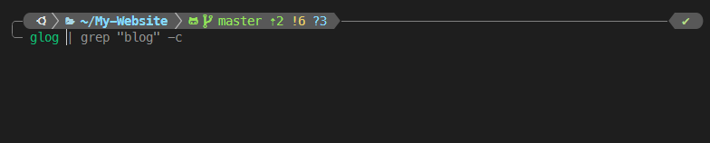
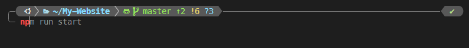
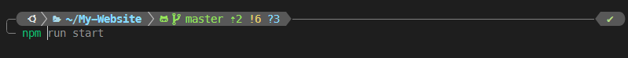

<!--truncate-->

## 缘起

最近配置的新环境比较多，包括 WSL, VsCode, ssh 等等方面，之前也做过很多环境配置，但笔记都比较散，有些更是想不起来了,这篇就把一些常用配置记录一下

## Zsh



## 插件推荐

:::important
**下面先逐个介绍插件，最后安装配置会放在一起说**
:::

### powerlevel10k

[font set]

[MesloLGS NF Font](./files/fonts.zip)

### GIT

### zsh -autosuggestions

[zsh-autosuggestion] 用于在终端中显示历史命令的自动补全建议。它可以帮助你快速找到并执行之前使用过的命令，从而提高工作效率。除此之外，也可以设置根据 tab 会补全哪些命令来提示你，效果如下：



### zsh-syntax-highlighting

[zsh-syntax-highlighting] 用于告诉你当前命令是否合法，如果是绿色，说明命令存在，可以执行，反之显示红色，效果如下：

命令合法：


命令不合法：


相当于在每次运行前提醒你是否输入了正确的命令，避免误操作

### z

oh-my-zsh 内置了 `z` 插件，该插件用于快捷跳转到之前访问过的目录，省去 `cd` 一长串路径了，效果如下：


### extract

oh-my-zsh 内置了 `extract` 插件，该插件用于解压任何格式的压缩文件，不必根据压缩文件的后缀名来记忆压缩软件。使用 `x` 命令即可解压文件，再也不用记 `tar -czvf` 了

### 一键配置插件

```bash
cd /root/.oh-my-zsh/custom/plugins
git clone https://github.com/zsh-users/zsh-autosuggestions.git
git clone https://github.com/zsh-users/zsh-syntax-highlighting.git
```
修改 `~/.zshrc` 
```bash title="~/.zshrc"
...
plugins=(git zsh-autosuggestions zsh-syntax-highlighting z extract)
...
```

修改完成后使用 `source ~/.zshrc` 使配置生效

## 其他玩具

### cowsay

### figlet

### lolcat

### tl

### cmatrix

[font set]:https://github.com/romkatv/powerlevel10k?tab=readme-ov-file#meslo-nerd-font-patched-for-powerlevel10k
[zsh-autosuggestion]:https://github.com/zsh-users/zsh-autosuggestions
[zsh-syntax-highlighting]:https://github.com/zsh-users/zsh-syntax-highlighting