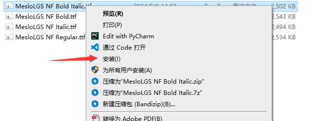
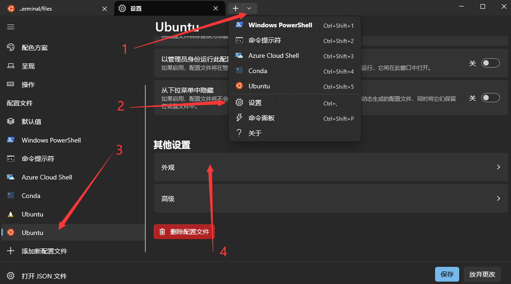
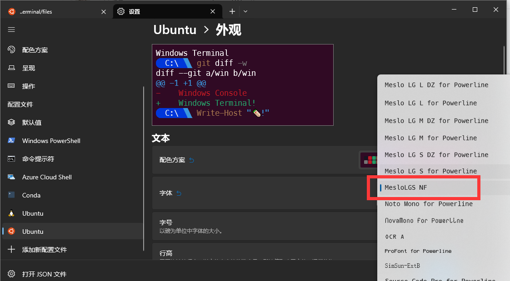
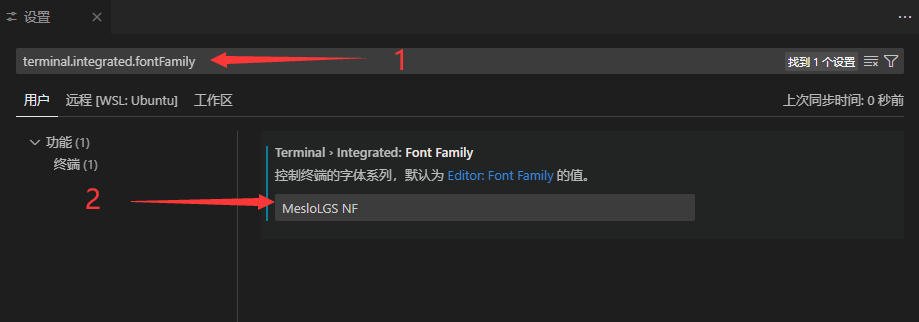
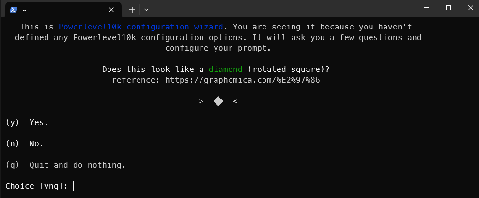

如何**配置**一个高效、美观、有趣的终端


<!--truncate-->

## 缘起

最近配置的新环境比较多，包括 WSL, VsCode, ssh 等等方面，之前也做过很多环境配置，但笔记都比较散，有些更是想不起来了,这篇就把一些常用配置记录一下

## Zsh

[zsh] 是一个类 bash 的 shell，它比 bash 更加强大，功能更丰富，但配置起来也更复杂一些，但一旦配置好，体验会非常好


### 安装

笔者这里使用 Ubuntu 进行演示，其他平台也基本类似，用自己常用包管理器即可

首先使用 `apt` 安装 zsh

```bash
sudo apt update
sudo apt install zsh
```

安装好后，使用以下命令修改默认终端为 zsh

```bash
chsh -s $(which zsh)
```

修改完后重新打开一个终端，即可进入 zsh 界面

### 安装 oh-my-zsh

[oh-my-zsh] 是一个用于管理 Zsh 配置的开源框架，它提供了大量的插件、主题和配置选项，以帮助用户更高效地使用 Zsh 。直接使用 `curl` 安装即可

```bash
sh -c "$(curl -fsSL https://install.ohmyz.sh/)"
```

<details>
  <summary>其他安装方式</summary>

wget

```bash
sh -c "$(wget -O- https://install.ohmyz.sh/)"
```

fetch

```bash
sh -c "$(fetch -o - https://install.ohmyz.sh/)"
```

国内 curl 镜像

```bash
sh -c "$(curl -fsSL https://gitee.com/pocmon/ohmyzsh/raw/master/tools/install.sh)"
```

国内 wget 镜像

```bash
sh -c "$(wget -O- https://gitee.com/pocmon/ohmyzsh/raw/master/tools/install.sh)"
```

</details>

## DIY

### 字体库

配置主题时，最常见的问题就是爆出奇奇怪怪的字符，其原因就是没有安对字体。注意，这里的字体是要安装到**终端所在的环境，而不是运行的环境**，比如你用 Windows Terminal 连 ssh，那你的字体要安装到 Windows 下；或者用 Vs Code 连 WSL，同样也要安装到 Windows 下。

字体可以点击链接直接下载 [MesloLGS NF Font](./files/MesloLGS%20NF%20Font.zip)。下载好后，将四个字体文件都安装即可



安装完成后，要去对应的终端里进行配置，这里列出 Windows Terminal 和 Vs Code 的配置方法，其他终端可以参考 [font configure] 配置(Apple Termina, Jet Brains 系列, MobaXterm, puTTY, xterm, )

#### Windows Terminal



找到字体设置后，选择 MesloLGS NF 字体即可



#### Vs Code

使用 `ctrl + ,` 进入到设置页面，搜索 `terminal.integrated.fontFamily`, 修改为 `MesloLGS NF` 即可



### powerlevel10k

安装好字体库后，我们就可以开始配置主题，[powerlevel10k]

使用如下命令安装

```bash
git clone --depth=1 https://github.com/romkatv/powerlevel10k.git ${ZSH_CUSTOM:-$HOME/.oh-my-zsh/custom}/themes/powerlevel10k

# Github 连不上去也可使用国内源
git clone --depth=1 https://gitee.com/romkatv/powerlevel10k.git ${ZSH_CUSTOM:-$HOME/.oh-my-zsh/custom}/themes/powerlevel10k
```

安装好后下一小节讲如何修改主题

### 如何修改配置

zsh 的配置文件为 `~/.zshrc`, 其中需要我们关注的只有以下两行:

```bash title="~/.zshrc"
...
ZSH_THEME="robbyrussell"
...
plugins=(git)
```

修改 `~/.zshrc` 中的 `ZSH_THEME` 字段，修改完后保存，使用 `source ~/.zshrc` 使配置生效，默认主题为 robbyrussell，还有比较常用的 agnoster, powerlevel10k 等。前面两个都是 oh-my-zsh 内置的，直接修改 `ZSH_THEME="agnoster"` 即可。 powerlevel10k 的话，上一步安装好了之后，需要设置 `ZSH_THEME="powerlevel10k/powerlevel10k"`

首次使用 powerlevel10k 主题，会提示你进行配置，按照提示一步步来即可，效果如下：


:::tip
想要删除 powerlevel10k 主题，参考 [uninstall Powerlevel10k]
:::

:::important
注意，在我们每次修改 `~/.zshrc` 后，都要执行 `source ~/.zshr` 来应用新配置
:::

:::tip
可以在该文件中设置 `alias -g setzsh="source ~/.zshrc"` 和 `catzsh='cat ~/.zshrc | grep -v "^#" | grep -v "^$"'`, 之后可以使用 `setzsh` 命令快速使配置生效，`catzsh` 命令快速查看当前配置。在 `~/.zshrc` 文件最后添加即可，如下：

```bash title="~/.zshrc"
...
alias -g setzsh="source ~/.zshrc"
alias -g catzsh='cat ~/.zshrc | grep -v "^#" | grep -v "^$"'
```

:::

## 插件推荐

:::important
**下面先逐个介绍插件，最后安装配置会放在一起说**
:::

### GIT

### zsh -autosuggestions

[zsh-autosuggestion] 用于在终端中显示历史命令的自动补全建议。它可以帮助你快速找到并执行之前使用过的命令，从而提高工作效率。除此之外，也可以设置根据 tab 会补全哪些命令来提示你，效果如下：


### zsh-syntax-highlighting

[zsh-syntax-highlighting] 用于告诉你当前命令是否合法，如果是绿色，说明命令存在，可以执行，反之显示红色，效果如下：

命令合法：


命令不合法：


相当于在每次运行前提醒你是否输入了正确的命令，避免误操作

### z

oh-my-zsh 内置了 `z` 插件，该插件用于快捷跳转到之前访问过的目录，省去 `cd` 一长串路径了，效果如下：


### extract

oh-my-zsh 内置了 `extract` 插件，该插件用于解压任何格式的压缩文件，不必根据压缩文件的后缀名来记忆压缩软件。使用 `x` 命令即可解压文件，再也不用记 `tar -czvf` 了

### 一键配置插件

```bash
cd /root/.oh-my-zsh/custom/plugins
git clone https://github.com/zsh-users/zsh-autosuggestions.git
git clone https://github.com/zsh-users/zsh-syntax-highlighting.git
```

修改 `~/.zshrc`

```bash title="~/.zshrc"
...
plugins=(git zsh-autosuggestions zsh-syntax-highlighting z extract)
...
```

修改完成后使用 `source ~/.zshrc` 使配置生效

## 其他玩具

### cowsay

### figlet

### lolcat

### tl

### cmatrix

[zsh]: http://zsh.sourceforge.net/
[oh-my-zsh]: http://ohmyz.sh/
[font configure]: https://github.com/romkatv/powerlevel10k?tab=readme-ov-file#manual-font-installation
[powerlevel10k]: https://github.com/romkatv/powerlevel10k
[zsh-autosuggestion]: https://github.com/zsh-users/zsh-autosuggestions
[zsh-syntax-highlighting]: https://github.com/zsh-users/zsh-syntax-highlighting
[uninstall Powerlevel10k]: https://github.com/romkatv/powerlevel10k?tab=readme-ov-file#how-do-i-uninstall-powerlevel10k
