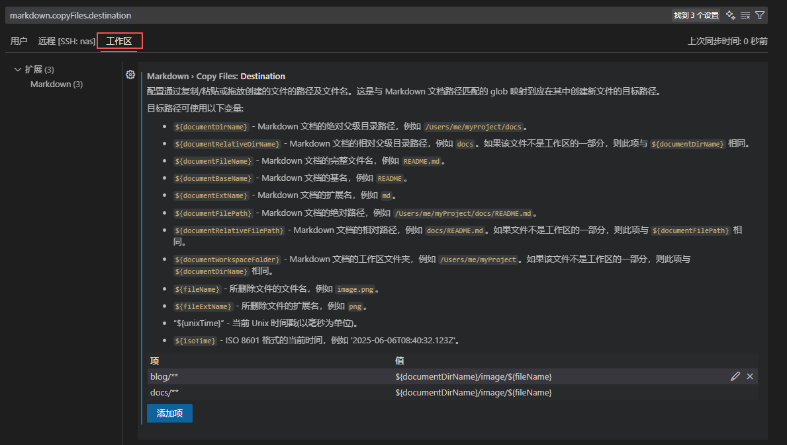

列举一些好用的 VS code 小技巧(**持续更新**)，目前有：

- [列(框)选择](/blog/VScodeTip#列框选择)
- [运行(部分) Python 代码](/blog/VScodeTip#运行部分-python-代码)
- [选中所有匹配项](/blog/VScodeTip#选中所有匹配项)
- [搜索文件名](/blog/VScodeTip#搜索文件名)
- [打开最近工作区](/blog/VScodeTip#选中所有匹配项)
- [设置 Markdown 复制图片的路径](/blog/VScodeTip#设置-markdown-复制图片的路径)

<!--truncate-->

## 安装 VS code

前往 [VS code 官网] 下载安装即可

## 列(框)选择

按住 `shift` + `alt`(或按住鼠标中键), 拖动鼠标, 即可框选, 效果如下, 在选取 Mark:arrow_down: 表格中的内容, 或者在选取多个句中的变量, 想要上下移动, 尤为方便

## 运行(部分) Python 代码

在写 Python 时, 可能会遇到想要和已有的**部分代码**进行交互的场景, 可以直接鼠标选中想要运行的部分, 然后使用 `shift` + `enter` 即可在终端中运行相应代码，并且会进入到交互模式，效果如下：

## 选中所有匹配项

在 VS code 中, 选中一段字符串, 按下 `ctrl` + `shift` + `l`, 即可在该文件中所有相同字符串处添加光标, 方便进行批量修改

:::tip
如果只是要给某个变量重命名, 选中后按下 `F2` 即可, 上述方法更适合批量修改(不只是变量名)
:::

## 搜索文件名

在文件栏中使用 `Ctrl` + `Alt` + `F` 搜索文件名

[VS code 官网]: https://code.visualstudio.com/

## 打开最近工作区  

`ctrl + r`

## 设置 Markdown 复制图片的路径

首先用 `Ctrl + ,` 打开设置，搜索 `markdown.copyFiles.destination`，建议仅修改工作区设置

笔者在这里设置

| 键        | 值                                     |
| --------- | -------------------------------------- |
| `docs/**` | `${documentDirName}/image/${fileName}` |
| `blog/**` | `${documentDirName}/image/${fileName}` |

这样在 `docs` 和 `blog` 目录下的 Markdown 文件复制图片时，图片会自动存储到对应的 `image` 文件夹中，且图片名称和复制前保持一致