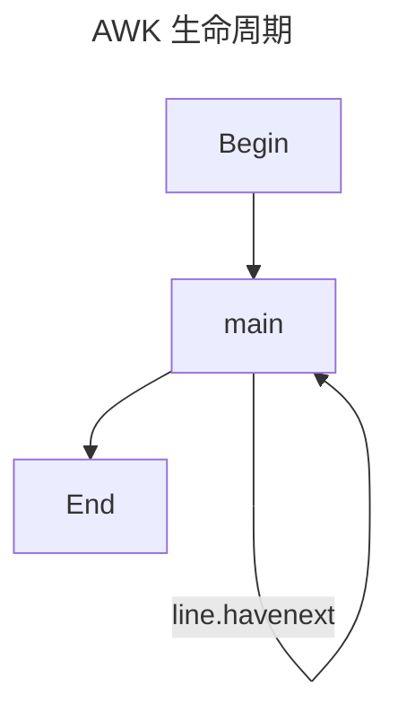

{/* truncate */}

import TabItem from "@theme/TabItem";
import Tabs from "@theme/Tabs";
import Terminal1 from "./components/Terminal1";
import Terminal2 from "./components/Terminal2";
import Terminal3 from "./components/Terminal3";

<Tabs>

<TabItem value="script" label="script">

</TabItem>

<TabItem value="bash" label="bash">

</TabItem>

</Tabs>

## 缘起

最近都在和命令行打交道，基本就是字符串处理，`grep` 功能满足不了需求，发现了一个强大的工具 `awk`，记录一下

## AWK 生命周期

首先来讲一下 AWK 的的生命周期。如下，分为三个阶段：

1. 首先执行 `BEGIN` 块中的语句(optional)
2. 逐行处理文件中的数据
3. 最后执行 `END` 块中的语句(optional)



:::important
请读者着重记住这个**逐行处理**，在 Begin 和 End 中，所有的代码都是只执行一次，而 main 中的代码，**是会对输入数据的每一行都执行一次**

换句话来说，就是下面这个意思

```cpp
Begin();

while(true){
    main(line);
    if(! line.havenext) break;
}

End();
```

:::

比如我们在处理一些数据，想要输出为一个表格的时候，就可以使用 `BEGIN` 块来输出表头，并且定义一些变量，用于统计；在中间处理每一行时，使用刚刚定义的变量来进行存储(求和、计数等)；最后在`END` 块来输出表尾，以及一些统计结果

## 基本用法

:::important
可以直接在命令行中使用 awk 命令，也可写成一个脚本，使用 `-f` 参数指定脚本文件，比如 `awk -f script.awk score.txt`。在下面的演示中，会把两种都列出来
:::

AWK 最基本的语法如下：

```bash
awk options 'pattern {action}' file
```

其中 options, pattern 都是可选的，如果通过管道输入，那么 file 也可以省略，比如：

```bash
cat score.txt | awk '{print}' # 等价于 awk '{print}' score.txt
```

**接下来都用**这个 `score.txt` 文件来举例，文件内容如下：

```txt title="score.txt"
Castamere   21074 78 84 77
TodayRed    21199 78 45 82
Tom         21222 48 77 71
Mike        22373 87 97 95
Bob         23154 40 57 62
```

## Action

Action 是在匹配到模式的行上执行的动作，比如 `print`，`printf` 等，默认是 `print`，也就是打印整行。在这里有一些常用的变量：

- `NR`：表示当前行号
- `NF`：表示当前行的字段数
- `$0`：表示当前行的内容
- `$n`：表示当前行的第 n 个字段

Action 遵循 `c` 语法。即多个语句可以用 `;` 分隔。在 `print` 后面，可以跟多个用逗号分隔的字段，会逐个输出。输出的内容可以是变量，也可以是字符串，字符串需要用双引号包裹。比如：

<Tabs>

<TabItem value="script" label="script">

<Terminal1 />

</TabItem>

<TabItem value="bash" label="bash">

```bash
awk '{print "----------------------------" ; print "Name: " $1 ", ID: " $2}' score.txt
```

</TabItem>

</Tabs>

### 逐行处理

注意笔者在上文提到过的**逐行处理**，可以参考下面的 awk 与 python 代码的对比，理解一下。这里的 `NR` 和 `NF` 就是上文提到的行号和字段数

```bash title="awk"
awk '{print "This is line " NR " ,with " NF " fields"}' score.txt
```

上面的 AWK 命令，与下面的 Python 代码等价

```python title="python" showLineNumbers
with open('score.txt', 'r') as f:
    lines = f.readlines()
    for line in lines:
        NR = lines.index(line) + 1
        NF = len(line.split())
        print(f'This is line {NR}, with {NF} fields')
```

输出均为：

```txt
This is line 1 ,with 5 fields
This is line 2 ,with 5 fields
This is line 3 ,with 5 fields
This is line 4 ,with 5 fields
This is line 5 ,with 5 fields
```

:::success Question
如下命令的输出又会是什么? 为什么?

```bash
awk '{print "This is line " NR " ,with " $NF " fields"}' score.txt
```

:::

### 理解 $

使用 AWK，首先要理解这个 $ 到底是个什么东西

上面我们说过，`$0` 表示当前行的内容，`$n` 表示当前行的第 n 个字段。但这样说或许有点抽象，我们用下面的 python 代码来看

```python title="python" showLineNumbers
with open('score.txt', 'r') as f:
    lines = f.readlines()
    for line in lines:
        # python 里是不能拿 $ 当变量名的，这里只是演示
        $ = [line] + line.split()
```

不难发现，`$` 就是一个数组，第一项为该行完整内容，后面则是 split 之后的内容。而 `$0`, 实际上就是 `$[0]`, `$n` 就是 `$[n]`。回到上一小节最后提出的问题

```bash
awk '{print "This is line " $NR " ,with " $NF " fields"}' score.txt
```

`$NF` 实际上就是 `$[NF]`, 即每行最后一个字段

## options

AWK 命令有几个常用的参数

### -F

最常用的就是 `-F`，他的作用是用来指定分割符，默认来说是用空格分割。有时会使用 `|`, `:` 等作为分隔符，这时就需要使用 `-F` 参数来指定，注意分隔符紧跟着 `-F`，后面没有空格

<Terminal2 />

### -f

在使用 awk 脚本时，使用 `-f` 参数来指定脚本文件，后跟空格 + 脚本文件名

```bash
awk -f script1.awk score.txt
```

### -v

awk 中有很多内置的变量，可以使用 -v 来修改这些变量，比如 `FS`，`OFS` 等。使用 `-v val=val` 的形式，可以修改内置变量，如下。其他的内置变量可以在这里查看

<Terminal3 />

## pattern

## 内置变量
