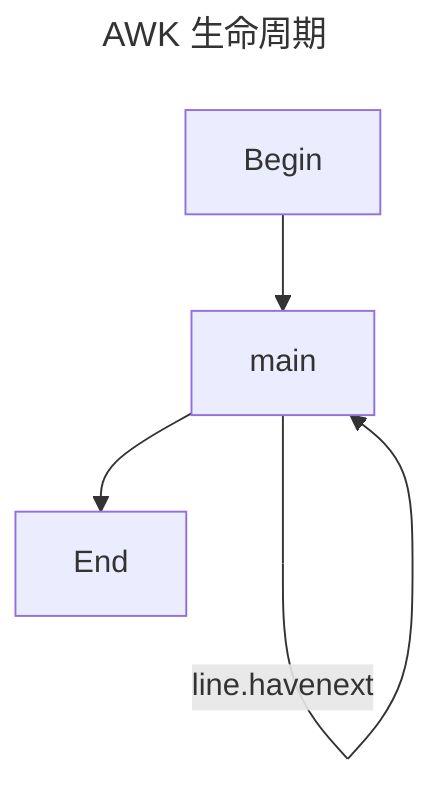

{/* truncate */}

import TabItem from "@theme/TabItem";
import Tabs from "@theme/Tabs";
import Terminal1 from "./components/Terminal1";
import Terminal2 from "./components/Terminal2";
import Terminal3 from "./components/Terminal3";
import Terminal4 from "./components/Terminal4";
import Terminal5 from "./components/Terminal5";

## 缘起

最近都在和命令行打交道，基本就是字符串处理，`grep` 功能满足不了需求，发现了一个强大的工具 `awk`，记录一下

## AWK 生命周期

首先来讲一下 AWK 的的生命周期。如下，分为三个阶段：

1. 首先执行 `BEGIN` 块中的语句(optional)
2. 逐行处理文件中的数据
3. 最后执行 `END` 块中的语句(optional)



:::important
请读者着重记住这个**逐行处理**，在 Begin 和 End 中，所有的代码都是只执行一次，而 main 中的代码，**是会对输入数据的每一行都执行一次**

换句话来说，就是下面这个意思

```cpp
Begin();

while(true){
    main(line);
    if(! line.havenext) break;
}

End();
```

:::

比如我们在处理一些数据，想要输出为一个表格的时候，就可以使用 `BEGIN` 块来输出表头，并且定义一些变量，用于统计；在中间处理每一行时，使用刚刚定义的变量来进行存储(求和、计数等)；最后在`END` 块来输出表尾，以及一些统计结果

## 基本用法

:::important
可以直接在命令行中使用 awk 命令，也可写成一个脚本，使用 `-f` 参数指定脚本文件，比如 `awk -f script.awk score.txt`。在下面的演示中，会把两种都列出来
:::

AWK 最基本的语法如下：

```bash
awk options 'pattern {action}' file
```

其中 options, pattern 都是可选的，如果通过管道输入，那么 file 也可以省略，比如：

```bash
cat score.txt | awk '{print}' # 等价于 awk '{print}' score.txt
```

**接下来都用**这个 `score.txt` 文件来举例，文件内容如下：

```txt title="score.txt"
Castamere   21074 78 84 77
TodayRed    21199 78 45 82
Tom         21222 48 77 71
Mike        22373 87 97 95
Bob         23154 40 57 62
```

## Action

Action 是在匹配到模式的行上执行的动作，比如 `print`，`printf` 等，默认是 `print`，也就是打印整行。在这里有一些常用的变量：

- `NR`：表示当前行号
- `NF`：表示当前行的字段数
- `$0`：表示当前行的内容
- `$n`：表示当前行的第 n 个字段

Action 遵循 `c` 语法。即多个语句可以用 `;` 分隔。在 `print` 后面，可以跟多个用逗号分隔的字段，会逐个输出。输出的内容可以是变量，也可以是字符串，字符串需要用双引号包裹。比如：

<Tabs>

<TabItem value="script" label="script">

<Terminal1 />

</TabItem>

<TabItem value="bash" label="bash">

```bash
awk '{print "----------------------------" ; print "Name: " $1 ", ID: " $2}' score.txt
```

</TabItem>

</Tabs>

### 逐行处理

注意笔者在上文提到过的**逐行处理**，可以参考下面的 awk 与 python 代码的对比，理解一下。这里的 `NR` 和 `NF` 就是上文提到的行号和字段数

```bash title="awk"
awk '{print "This is line " NR " ,with " NF " fields"}' score.txt
```

上面的 AWK 命令，与下面的 Python 代码等价

```python title="python" showLineNumbers
with open('score.txt', 'r') as f:
    lines = f.readlines()
    for line in lines:
        NR = lines.index(line) + 1
        NF = len(line.split())
        print(f'This is line {NR}, with {NF} fields')
```

输出均为：

```txt
This is line 1 ,with 5 fields
This is line 2 ,with 5 fields
This is line 3 ,with 5 fields
This is line 4 ,with 5 fields
This is line 5 ,with 5 fields
```

:::success Question
如下命令的输出又会是什么? 为什么?

```bash
awk '{print "This is line " NR " ,with " $NF " fields"}' score.txt
```

:::

### 理解 $

使用 AWK，首先要理解这个 $ 到底是个什么东西

上面我们说过，`$0` 表示当前行的内容，`$n` 表示当前行的第 n 个字段。但这样说或许有点抽象，我们用下面的 python 代码来看

```python title="python" showLineNumbers
with open('score.txt', 'r') as f:
    lines = f.readlines()
    for line in lines:
        # python 里是不能拿 $ 当变量名的，这里只是演示
        $ = [line] + line.split()
```

不难发现，`$` 就是一个数组，第一项为该行完整内容，后面则是 split 之后的内容。而 `$0`, 实际上就是 `$[0]`, `$n` 就是 `$[n]`。回到上一小节最后提出的问题

```bash
awk '{print "This is line " $NR " ,with " $NF " fields"}' score.txt
```

`$NF` 实际上就是 `$[NF]`, 即每行最后一个字段

### 条件 & 循环语句

一言以蔽之：awk 完全遵循 c 语法

```c
// 条件语句
if(condition) {

} else {

}

// while循环
while(condition) {
  if(condition) {
    break;
  } else if(condition2) {
    continue;
  }
}

// for循环
for(initialization; condition; increment) {

}
```

同样的，大小比较、逻辑判断也完全遵循 c 语法

|              运算符              |   含义   |
| :------------------------------: | :------: |
| `==`, `!=`, `<`, `<=`, `>`, `>=` | 大小比较 |
|        `&&`, `\|\|`, `!`         |  与或非  |

### 变量与数组

上文说到，awk 有很多内置的变量，具体可以在[附录-内置变量](/blog/Awk#内置变量)中查看。除此之外，awk 也支持自定义变量，一般来说就在 Begin 块中定义，其运算也遵循 c 语法

| 运算符             | 含义     |
| :----------------- | :------- |
| `=`                | 赋值     |
| `+`, `-`, `*`, `/` | 四则运算 |
| `%`                | 取模     |
| `^ **`             | 取幂     |
| `++`, `--`         | 自增自减 |
| `in`               | 数组成员 |

这里着重讲一下数组，awk 的数组实际上是一个字典，使用 `arr[key] = value` 的形式赋值，使用 `arr[key]` 的形式取值。数组可以自动扩容，不需要提前声明长度

<Terminal4 />

### print & printf

老规矩，printf 与 c 中的用法完全一致，这里直接贴一个规则

| 格式符 |  含义  |
| :----: | :----: |
|  `%d`  |  整数  |
|  `%f`  | 浮点数 |
|  `%s`  | 字符串 |

- 左右对齐：%默认为右对齐输出，%-表示左对齐；
- 规定输出字符宽度：%后跟数字表示输出宽度，如%5d 表示按右对齐五个字符宽度输出，超出部分不予显示。不够字符宽度，以空格填充，右对齐下填充在左，左对齐下填充在右；
- 保留小数：%.2f 表示保留小数点后两位。%-7.2f 表示左对齐，字符宽度为 7，保留两位小数输出；

## Options

AWK 命令有几个常用的参数

### -F

最常用的就是 `-F`，他的作用是用来指定分割符，默认来说是用空格分割。有时会使用 `|`, `:` 等作为分隔符，这时就需要使用 `-F` 参数来指定，注意分隔符紧跟着 `-F`，后面没有空格

<Terminal2 />

### -f

在使用 awk 脚本时，使用 `-f` 参数来指定脚本文件，后跟空格 + 脚本文件名

```bash
awk -f script1.awk score.txt
```

### -v

awk 中有很多内置的变量，可以使用 -v 来修改这些变量，比如 `FS`，`OFS` 等。使用 `-v val=val` 的形式，可以修改内置变量，如下。其他的内置变量可以在这里查看

<Terminal3 />

## Pattern

所谓 pattern，其实就是我们要匹配的内容。类似 grep，awk 也可以使用正则表达式来匹配。这里仅介绍如何在 awk 中使用 pattern，具体的正则表达式语法，笔者将在另一篇中介绍

上文说到，awk 的基本语法是 `awk options 'pattern {action}' file`。而我们的 pattern 需要使用 `//`进行包裹，具体如下：

比如还是上面的那个 score.txt 文件，我们想要匹配出包含 `Castamere` 的行，可以这样写

```bash
awk '/Castamere/ {print}' score.txt
```

:::important
在 awk 中有一个新的运算符 `~`，表示匹配
:::

刚刚上面的命令，和下面这句是等价的

```bash
# ~ 表示匹配
# 下面两句是等价的
awk '/Castamere/ {print}' score.txt
awk '$0 ~ /Castamere/ {print}' score.txt
# 其实是默认可以省略 $0 ~
```

此时再次回想前面的 `逐行处理`，这里 awk 会逐行将 `pattern` 与每整行进行匹配，如果匹配成功，则执行 `action`，否则跳过该行，继续下一行

那问题来了，如果我们不是想在整行匹配，而是匹配**某一列**。比如我们想要找出第三列在 `70~79` 分的学生，如果理解了上面那个 `省略$0 ~`，就很简单了

```bash
awk '$3 ~ /7./ {print}' score.txt
```

继续深入，以下的两句其实还是等价的

```bash
# 等价
awk '$3 ~ /7./ {print}' score.txt
awk '{if ($3 ~ /7./) print}' score.txt
```

So as to say, awk 的 pattern，其实就是把一个 if 语句单独提取出来放到最前面。应该是考虑到命令行中输入的简洁性，在代码量比较少的时候，少几个括号，看起来会更舒服(当然多起来了，还是写清楚一点比较好)

```bash
# 等价
awk '{if ($0 ~ /Castamere/) print}' score.txt
awk '/Castamere/ {print}' score.txt
```

### 多个 pattern

理解了上面那一堆等价，那么多个 pattern 就很好写了，按照 c 语法应该这么写：

```bash
# 第三列匹配 70-89
awk '{if ($3 ~ /7./ || $3 ~ /8./) print}' score.txt
```

然后我们等价一下(其实就是把多个 pattern 用逻辑词连起来就行)

```bash
awk '$3 ~ /7./ || $3 ~ /8./ {print}' score.txt
```

## E.g

如何实现如下输出

```txt showLineNumbers
NAME       NO.    MATH  ENGLISH  COMPUTER   TOTAL
-------------------------------------------------
Castamere  21074    78       84       77      239
TodayRed   21199    78       45       82      205
Tom        21222    48       77       71      196
Mike       25373    87       97       95      279
Bob        24154    40       57       62      159
-------------------------------------------------
  TOTAL:           331      360      387
AVERAGE:         66.20    72.00    77.40
```

<details>
  <summary>答案</summary>
  <Terminal5 />
</details>

## 附录

### 内置变量

| 变量        | 含义                                               |
| :---------- | :------------------------------------------------- |
| $n          | 当前记录的第 n 个字段，字段间由 FS 分隔            |
| $0          | 完整的输入记录                                     |
| ARGC        | 命令行参数的数目                                   |
| ARGIND      | 命令行中当前文件的位置(从 0 开始算)                |
| ARGV        | 包含命令行参数的数组                               |
| CONVFMT     | 数字转换格式(默认值为%.6g)ENVIRON 环境变量关联数组 |
| ERRNO       | 最后一个系统错误的描述                             |
| FIELDWIDTHS | 字段宽度列表(用空格键分隔)                         |
| FILENAME    | 当前文件名                                         |
| FNR         | 各文件分别计数的行号                               |
| FS          | 字段分隔符(默认是任何空格)                         |
| IGNORECASE  | 如果为真，则进行忽略大小写的匹配                   |
| NF          | 一条记录的字段的数目                               |
| NR          | 已经读出的记录数，就是行号，从 1 开始              |
| OFMT        | 数字的输出格式(默认值是%.6g)                       |
| OFS         | 输出字段分隔符，默认值与输入字段分隔符一致。       |
| ORS         | 输出记录分隔符(默认值是一个换行符)                 |
| RLENGTH     | 由 match 函数所匹配的字符串的长度                  |
| RS          | 记录分隔符(默认是一个换行符)                       |
| RSTART      | 由 match 函数所匹配的字符串的第一个位置            |
| SUBSEP      | 数组下标分隔符(默认值是/034)                       |
