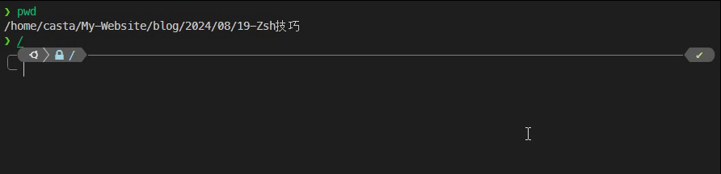
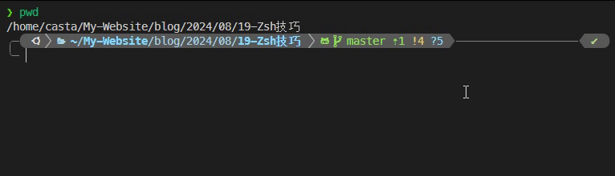

列举一些好用的 Zsh 小技巧(**持续更新**)，目前有：

- [路径与导航](/blog/ZshTip#路径与导航)
  - [路径补全](/blog/ZshTip#路径补全)
  - [路径快速跳转](/blog/ZshTip#路径快速跳转)
  - [文件选择](/blog/ZshTip#文件选择)

<!--truncate-->

## 路径与导航

### 路径补全

在 zsh 中，不需要使用 `cd` 命令，直接输入一个合法的路径即可跳转。除此之外，可以使用缺省进行快速跳转，比如要跳转到 `/home/casta/My-Website/blog/2024/08/19-Zsh技巧` 路径下，可以直接输入 `/h/c/M/b/2/0/19` 再按下 `Tab`, 会自动进行路径的补全(前提是能匹配到的只有这一个路径，如果有多个路径能匹配到，多加几个字母区分开即可)

### 路径快速跳转

在[配置 Linux 终端 (zsh)](./LinuxTerminal)中还提到过 `z` 插件，可以快速跳转到最近访问过的路径

### 文件选择

当使用某些操作文件的命令(例如 `cat`)时，可以按 `Tab` 键进行文件选择。按下 `Tab` 键后，将弹出文件列表，此时再按下 `Tab` 会进行逐个选择，找到想要的文件后按 `Enter` 即可

