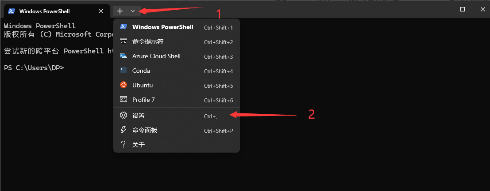
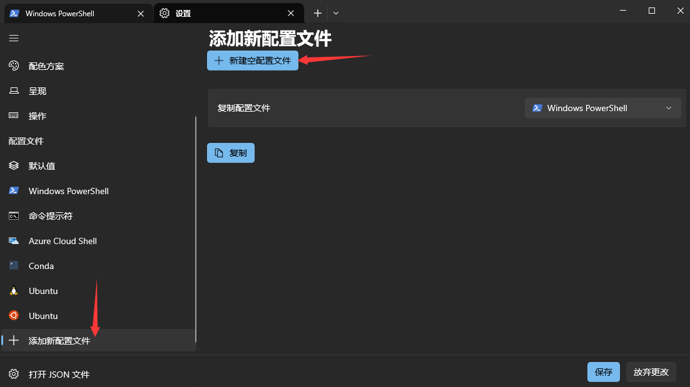
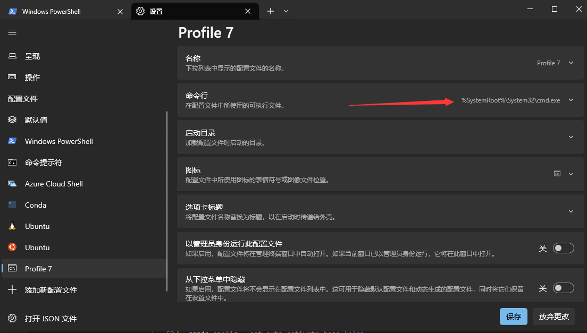
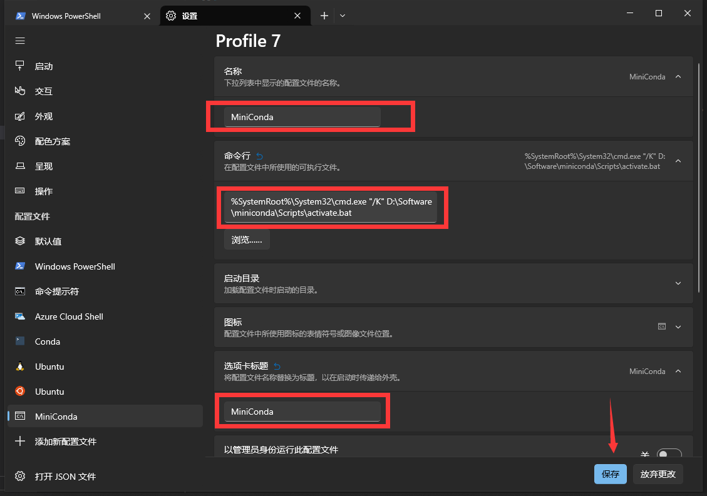
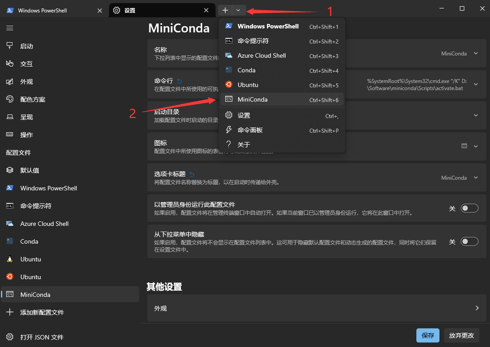
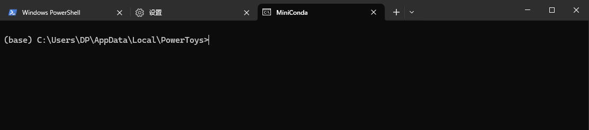
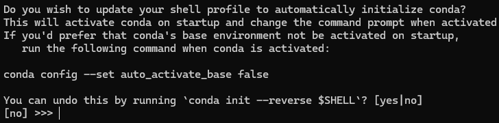

import Terminal1 from './components/Terminal1'
import Terminal2 from './components/Terminal2'
import Terminal3 from './components/Terminal3'
import Terminal4 from './components/Terminal4'
import Terminal5 from './components/Terminal5'

<!-- truncate -->

<!-- ## 缘起 -->

## 安装

### Windows 下安装与配置

点击 [miniconda - windows] 下载即可(链接为 latest, 不必担心过期问题)

下载好后，除了修改一下安装位置，其他一路默认即可

安装完成后，打开 Windows Terminal，输入 `conda`, 大概率是无法识别的，这是因为**没有将其添加到环境变量**当中，but 笔者个人觉得安装 conda 的原因，就是不想污染原有的环境。这里就主要讲一下怎么把 miniconda 配置到 Windows Terminal 下

:::tip
想直接加到环境变量里的话，将 `安装路径\miniconda\condabin` 加到 Path 里即可，记得把安装路径换成 miniconda 的安装路径
:::

接下来讲如何在 Windows Terminal 下配置 Conda 环境。如下图，打开 Windows Terminal，进入到设置(直接 `ctrl` + `,` 也可以)



在弹出的页面中，在左边滚动到最下面，选择 `添加新配置文件`，再选择 `新建空配置文件`



主要修改的是 `命令行` 这一条，正常来说，会有一个默认 `cmd` 的命令，我们在其后**添加** `"/K" 安装路径\miniconda\Scripts\activate.bat `。例如，笔者的安装路径为 `D:\Software\miniconda`，则命令行修改为 `%SystemRoot%\System32\cmd.exe "/K" D:\Software\miniconda\Scripts\activate.bat`



还可以修改一下诸如选项卡名称、配置文件名称等内容，修改完成后，记得点击**保存**



设置完成后，如下图，点击新建右边的下拉菜单，选择刚刚新建的配置文件，点击即可进入到 Conda 的 base 环境了



:::tip
Windows Terminal 自带快捷键，图上也能看到，可以直接使用 `ctrl` + `shift` + `对应编号` 快速新建对应环境命令行，比如 **wsl**, **conda** 等等
:::

可以看到，这里已经进入了 base 环境



:::tip
还可以修改进入 conda 之后，直接进入某个环境；并且也可以修改进入时所在的文件夹，默认为父进程的文件夹。读者可以把常用的环境写成一套配置，方便日后使用
:::

### Ubuntu (zsh) 下安装与配置

点击 [miniconda - linux] 下载即可(链接为 latest, 不必担心过期问题)

下载好后，使用 scp 命令传输到 Ubuntu 下

```bash
scp ./Miniconda3-latest-Linux-x86_64.sh root@ip:/root
```

然后修改权限并安装

```bash
chmod 777 Miniconda3-latest-Linux-x86_64.sh
./Miniconda3-latest-Linux-x86_64.sh
```

根据提示安装即可，安装中会提示是否要自动初始化 conda 环境，默认是 `no`，但笔者建议这里选择 `yes`，原因在下面会提到



#### 常见问题

如果上一步选择了 `yes` 这里会自动进行 `conda init` 并且把相关初始化内容写入到 `~/.zshrc` 中，这样就可以直接运行 `conda` 命令

如果上一步选择了 `no`，则需要手动执行 `conda init` ，而且大概率会写到 `~/.bashrc` 中，这时候就需要手动把 `conda` 命令添加到 `~/.zshrc` 中

而且，大概率会提示 `zsh: command not found: conda`，解决方法如下，首先找到 `conda` 的安装路径。然后 `conda` 的可执行路径为 `安装路径/miniconda3/bin/conda`，比如我这里就是 `/root/miniconda3/bin/conda`

<Terminal1 />

然后就可以使用 `/root/miniconda3/bin/conda init` 来初始化

<Terminal2 />

可以看到，修改的是 `~/.bashrc` 文件，所以需要手动添加到 `~/.zshrc` 中，可以用如下命令快速添加

```bash
tail -n 15 ~/.bashrc >> ~/.zshrc
```

其实就是将如下内容添加到了 `~/.zshrc` 中，然后执行 `source ~/.zshrc` 即可

```bash title="conda init" showLineNumbers
# >>> conda initialize >>>
# !! Contents within this block are managed by 'conda init' !!
__conda_setup="$('/root/miniconda3/bin/conda' 'shell.bash' 'hook' 2> /dev/null)"
if [ $? -eq 0 ]; then
    eval "$__conda_setup"
else
    if [ -f "/root/miniconda3/etc/profile.d/conda.sh" ]; then
        . "/root/miniconda3/etc/profile.d/conda.sh"
    else
        export PATH="/root/miniconda3/bin:$PATH"
    fi
fi
unset __conda_setup
# <<< conda initialize <<<
```

再运行 `conda -V` 就可以看到 conda 已经安装好了

## 使用

### 列出现有环境

```bash
conda env list
```

<Terminal3 />

### 创建环境

```bash
conda create -n <env_name> python=<version>
```

<Terminal4 />

### 激活/退出环境

```bash
conda activate <env_name>
conda deactivate
```

<Terminal5 />

## 一些设置

<!-- ### Conda Python 解释器 -->

### 自动进入 Conda

可以设置进入终端后，自动进入 Conda 环境。如果不想要这个，也可以通过下面的命令来取消

```bash
conda config --set auto_activate_base false
conda config --set auto_activate_base true
```

<!-- ## Conda install VS Pip install

## 后记 -->

[miniconda - windows]: https://repo.anaconda.com/miniconda/Miniconda3-latest-Windows-x86_64.exe
[miniconda - linux]: https://repo.anaconda.com/miniconda/Miniconda3-latest-Linux-x86_64.sh
