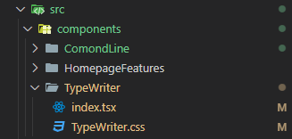

import Typewriter from "@site/src/components/TypeWriter";
import TabItem from "@theme/TabItem";
import Tabs from "@theme/Tabs";
import Typewriter1 from "./demo/TypeWriter1";
import Typewriter2 from "./demo/TypeWriter2";
import Typewriter3 from "./demo/TypeWriter3";
import Typewriter4 from "./demo/TypeWriter4";
import Typewriter5 from "./demo/TypeWriter5";
import Typewriter6 from "./demo/TypeWriter6";
import Typewriter7 from "./demo/TypeWriter7";

一个简单的 React 打字机效果小组件

<h2>
  <Typewriter
    text="Monday left me broken; Tuesday, I was through with hoping; Wednesday, my empty arms are open; Thursday, waiting for love, waiting for love; Thank the stars, it's Friday; I'm burning like a fire gone wild on Saturday; Guess I won't be coming to church on Sunday; I'll be waiting for love, waiting for love; to come around;◢◤"
    delinterval={2000}
  />
</h2>

{/* truncate */}

## 缘起

之前看到一个打字机效果的页面，觉得很有意思，于是想用 React 实现一个类似的效果。刚好最近想做一些好玩的小组件，由此开始吧

:::tip
全文使用的都是**实时编辑器**，在编辑器中修改代码，实时预览效果吧
:::

## 实现

### 打字

<h3>
  <Typewriter1 />
</h3>

想要实现基础的"挨个打字"还是比较简单的，如下面代码，通过 `useEffect` 来更新页面，其中添加一个 `interval` 对象，每隔一定时间，判断当前的 `displayText` 和完整的 `text` 是否相等。如果不相等，就让 `displayText` 加上 `text` 的下一个字符；如果相等，那就证明已经打完，这里添加了一个 `setTimeout` 来重置 `displayText`，实现循环打字的效果

<Tabs>

<TabItem value="live" label="实时编辑器">

```tsx live
function TypeWirter() {
  const text = "Castamere Typing...";

  const [displayText, setDisplayText] = useState(text);

  useEffect(() => {
    const interval = setInterval(() => {
      if (displayText.length < text.length) {
        setDisplayText((prevText) => prevText + text[displayText.length]);
      } else {
        clearInterval(interval);
        // 重置状态以重新开始打字
        setTimeout(() => {
          setDisplayText("");
        }, 1000); // 1 秒后重置状态以实现循环
      }
    }, 100);

    return () => clearInterval(interval);
  });

  return <div>{displayText}|</div>;
}
```

</TabItem>

</Tabs>

### 删除

<h3>
  <Typewriter2 />
</h3>

如果我们想要打的内容比较多，或者需要多次打印。这时就需要添加一个删除的效果，像上面那种整行直接"消除"掉的形式，没那么 cool ，想要打完一整行后，再从后往前挨个删除掉，看起来会更真实

:::tip
下方有实时编辑器和**代码对比**，可以查看相比上一步修改了哪些内容
:::

想要删除也比较简单，首先添加一个 `isDeleting` 的状态，用来表示当前是删除状态还是添加状态。然后修改 `useEffect` 中的逻辑，当 `isDeleting` 为 `true` 时，就挨个删除 `displayText` 的最后一个字符，直到 `displayText` 为空。当 `displayText` 为空时，重置 `isDeleting` 为 `false`，重新开始添加字符，添加满之后，再重置 `isDeleting` 为 `true`，开始删除字符，如此循环

<Tabs>

<TabItem value="live" label="实时编辑器">

```tsx live
function TypeWirter() {
  const text = "Castamere Typing...";

  const [displayText, setDisplayText] = useState(text);
  const [isDeleting, setIsDeleting] = useState(false);

  useEffect(() => {
    let interval;

    if (isDeleting) {
      interval = setInterval(() => {
        setDisplayText((prevText) => prevText.slice(0, -1));
        if (displayText.length === 0) {
          setIsDeleting(false);
        }
      }, 100);
    } else {
      interval = setInterval(() => {
        if (displayText.length < text.length) {
          setDisplayText((prevText) => prevText + text[displayText.length]);
        } else {
          clearInterval(interval);
          setIsDeleting(true);
        }
      }, 100);
    }

    return () => clearInterval(interval);
  });

  return <div>{displayText}|</div>;
}
```

</TabItem>

<TabItem value="code diff" label="代码对比">

```tsx showLineNumbers title="TypeWriter2.tsx"
  function TypeWirter() {
    const text = "Castamere Typing...";

    const [displayText, setDisplayText] = useState(text);
    // git-add-next-line
+   const [isDeleting, setIsDeleting] = useState(false);

    useEffect(() => {
      // git-add-start
+     let interval;
+
+     if (isDeleting) {
+       interval = setInterval(() => {
+         setDisplayText((prevText) => prevText.slice(0, -1));
+         if (displayText.length === 0) {
+           setIsDeleting(false);
+         }
+       }, 100);
+     } else {
      // git-add-end
        // git-remove-next-line
-       const interval = setInterval(() => {
        // git-add-next-line
+       interval = setInterval(() => {
          if (displayText.length < text.length) {
            setDisplayText((prevText) => prevText + text[displayText.length]);
          } else {
            clearInterval(interval);
            // git-add-next-line
+           setIsDeleting(true);
            // git-delete-start
-           // 重置状态以重新开始打字
-           setTimeout(() => {
-             setDisplayText("");
-             setTextIndex(0);
-           }, 1000); // 1 秒后重置状态以实现循环
            // git-delete-end
          }
        }, 100);
      }

      return () => clearInterval(interval);
    });

    return <div>{displayText}|</div>;
  }
```

</TabItem>

</Tabs>

### 等待

<h3>
  <Typewriter3 />
</h3>

在打印结束之后，希望他等待几秒再删除，否则读者可能还没来得及阅读，就结束了，导致体验不好

我们添加一个新的状态 `isTypingFinished`，表示是否打印完成，下图列出了目前三个状态的转换关系，以及对应的标志状态(`isDeleting`, `isTypingFinished`)


根据上面的图，编写逻辑即可，同样的，查看下面的**代码对比**来更直观的理解代码的变化

<Tabs>

<TabItem value="live" label="实时编辑器">

```tsx live
function TypeWirter() {
  const text = "Castamere Typing...";

  const [displayText, setDisplayText] = useState(text);
  const [isDeleting, setIsDeleting] = useState(false);
  const [isTypingFinished, setIsTypingFinished] = useState(false);

  useEffect(() => {
    let interval;

    if (isDeleting) {
      interval = setInterval(() => {
        setDisplayText((prevText) => prevText.slice(0, -1));
        if (displayText.length === 0) {
          setIsDeleting(false);
        }
      }, 100);
    } else if (isTypingFinished) {
      interval = setTimeout(() => {
        setIsDeleting(true);
        setIsTypingFinished(false);
      }, 1000);
    } else {
      interval = setInterval(() => {
        if (displayText.length < text.length) {
          setDisplayText((prevText) => prevText + text[displayText.length]);
        } else {
          clearInterval(interval);
          setIsTypingFinished(true);
        }
      }, 100);
    }

    return () => clearInterval(interval);
  });

  return <div>{displayText}|</div>;
}
```

</TabItem>

<TabItem value="code diff" label="代码对比">

```tsx showLineNumbers title="TypeWriter3.tsx"
  function TypeWirter() {
    const text = "Castamere Typing...";

    const [displayText, setDisplayText] = useState(text);
    const [isDeleting, setIsDeleting] = useState(false);
    // git-add-next-line
+   const [isTypingFinished, setIsTypingFinished] = useState(false);

    useEffect(() => {
      let interval;

      if (isDeleting) {
        interval = setInterval(() => {
          setDisplayText((prevText) => prevText.slice(0, -1));
          if (displayText.length === 0) {
            setIsDeleting(false);
          }
        }, 100);
        // git-add-start
+     } else if (isTypingFinished) {
+       interval = setTimeout(() => {
+         setIsDeleting(true);
+         setIsTypingFinished(false);
+       }, 1000);
+     } else {
        // git-add-end
        interval = setInterval(() => {
          if (displayText.length < text.length) {
            setDisplayText((prevText) => prevText + text[displayText.length]);
          } else {
            clearInterval(interval);
            // git-add-next-line
+           setIsTypingFinished(true);
            // git-remove-next-line
-           setIsDeleting(true);
          }
        }, 100);
      }

      return () => clearInterval(interval);
    });

    return <div>{displayText}|</div>;
  }
```

</TabItem>

</Tabs>

:::important
这一步的关键是要把状态转换理解清楚，就能很好的判断了
:::

### 切换

<h3>
  <Typewriter4 />
</h3>

我们想要打印多个内容，在每次打印完之后，删除，然后打印下一个，直到所有内容打印完，想到一个很好的例子就是想要打 Waiting for love 里面的 Monday ~ Sunday 的歌词，也就是本篇开头的那个效果

因为最后要在 Mark ↓ 里(docusaurus)调用，传入的内容只能是一个字符串，所以如下设计：首先传入的字符串用 ";" 分隔开多个句子，在函数里将其 `split` 开。每次打印一句，在打印完之后，删除，然后打印下一个，直到所有内容打印完

根据下面的状态图，我们在每次删除**结束**之后，切换即可


<Tabs>

<TabItem value="live" label="实时编辑器">

```tsx live
function TypeWirter() {
  const text = "Castamere Typing...;Typing again...;And again...";

  const texts = text.split(";");
  const [displayText, setDisplayText] = useState("");
  const [textIndex, setTextIndex] = useState(0);
  const [isDeleting, setIsDeleting] = useState(false);
  const [isTypingFinished, setIsTypingFinished] = useState(false);

  useEffect(() => {
    const currentText = texts[textIndex];

    let interval;

    if (isDeleting) {
      interval = setInterval(() => {
        setDisplayText((prevText) => prevText.slice(0, -1));
        if (displayText.length === 0) {
          setIsDeleting(false);
          setTextIndex((prevIndex) => (prevIndex + 1) % texts.length);
        }
      }, 100);
    } else if (isTypingFinished) {
      interval = setTimeout(() => {
        setIsDeleting(true);
        setIsTypingFinished(false);
      }, 1000);
    } else {
      interval = setInterval(() => {
        if (displayText.length < currentText.length) {
          setDisplayText(
            (prevText) => prevText + currentText[displayText.length]
          );
        } else {
          clearInterval(interval);
          setIsTypingFinished(true);
        }
      }, 100);
    }

    return () => clearInterval(interval);
  });

  return <div>{displayText}|</div>;
}
```

</TabItem>

<TabItem value="code diff" label="代码对比">

```tsx showLineNumbers title="TypeWriter4.tsx"
  function TypeWirter() {
    const text = "Castamere Typing...;Typing again...;And again...";
    // git-add-next-line
+   const texts = text.split(";");
    // git-add-next-line
+   const [textIndex, setTextIndex] = useState(0);
    const [displayText, setDisplayText] = useState("");
    const [isDeleting, setIsDeleting] = useState(false);
    const [isTypingFinished, setIsTypingFinished] = useState(false);

    useEffect(() => {
      // git-add-next-line
+     const currentText = texts[textIndex];
      let interval;

      if (isDeleting) {
        interval = setInterval(() => {
          setDisplayText((prevText) => prevText.slice(0, -1));
          if (displayText.length === 0) {
            setIsDeleting(false);
            // git-add-next-line
+           setTextIndex((prevIndex) => (prevIndex + 1) % texts.length);
          }
        }, 100);
      } else if (isTypingFinished) {
        interval = setTimeout(() => {
          setIsDeleting(true);
          setIsTypingFinished(false);
        }, 1000);
      } else {
        interval = setInterval(() => {
          // git-add-next-line
+         if (displayText.length < currentText.length) {
          // git-remove-next-line
-         if (displayText.length < text.length) {
            // git-add-next-line
+           setDisplayText((prevText) => prevText + currentText[displayText.length]);
            // git-remove-next-line
-           setDisplayText((prevText) => prevText + text[displayText.length]);
          } else {
            clearInterval(interval);
            setIsTypingFinished(true);
          }
        }, 100);
      }

      return () => clearInterval(interval);
    });

    return <div>{displayText}|</div>;
  }
```

</TabItem>

</Tabs>

### 闪动光标

<h3>
  <Typewriter5 text="第五步：画龙点睛，闪动的光标" />
</h3>

打字机的灵魂，还是这个闪动的光标，这里使用 css 即可实现，在 css 中定义一个 `@keyframes` 动画，然后在光标元素上应用这个动画即可

<Tabs>

<TabItem value="code diff" label="代码对比">

```tsx showLineNumbers title="TypeWriter5.tsx"
  function TypeWirter() {
    ...
    // git-remove-next-line
-   return <div>{displayText}|</div>;
    // git-add-start
+   return (
+     <div>
+       {displayText}
+       <span className="cursor">|</span>
+     </div>
+   );
    // git-add-end
  }
```

</TabItem>

<TabItem value="css" label="TypeWriter.css">

```css
.cursor {
  display: inline-block;
  animation: blink 0.75s step-start infinite;
  font-weight: bold;
  font-size: 1em;
  margin-left: 1px; /* 调整光标与文本的间距 */
}

@keyframes blink {
  50% {
    opacity: 0;
  }
}
```

</TabItem>

</Tabs>

## 优化

到现在可以说这个小组件已初见雏形，但仍有一些可以优化的点

### 参数设置

首先，`text` 变量需要我们传入组件，而且我们可以添加更多可用户自定义的参数，比如打字速度、等待多久删除、分隔符设置等等

<Typewriter6 text="Castamere Typing..." />
`<Typewriter6 text="Castamere Typing..." />`

<Typewriter6 text="Castamere Typing..." typingSpeed={100} />
`<Typewriter6 text="Castamere Typing..." typingSpeed={100} />`

<Typewriter6 text="Castamere Typing..." delinterval={1000} />
`<Typewriter6 text="Castamere Typing..." delinterval={1000} />`

实现代码如下：

```tsx showLineNumbers title="TypeWriter6.tsx"
  import React, { useEffect, useState } from "react";
  import "./TypeWriter.css";

  // git-add-start
+ const SEPERATOR = ";";
+ const INTERVAL = 3000;
+ const TYPING_SPEED = 30;
  // git-add-end

  export default function TypeWirter6({
    // git-add-start
+   text,
+   textSeparator = SEPERATOR,
+   typingSpeed = TYPING_SPEED,
+   delinterval = INTERVAL,
    // git-add-end
  }) {
    // git-remove-next-line
-   const text = "Castamere Typing...";

    const texts = text.split(textSeparator);
    const [displayText, setDisplayText] = useState("");
    const [textIndex, setTextIndex] = useState(0);
    const [isDeleting, setIsDeleting] = useState(false);
    const [isTypingFinished, setIsTypingFinished] = useState(false);

    useEffect(() => {
      const currentText = texts[textIndex];

      let interval;

      if (isDeleting) {
        interval = setInterval(() => {
          setDisplayText((prevText) => prevText.slice(0, -1));
          if (displayText.length === 0) {
            setIsDeleting(false);
            setTextIndex((prevIndex) => (prevIndex + 1) % texts.length);
          }
        // git-remove-next-line
-       }, 100);
        // git-add-next-line
+       }, typingSpeed);
      } else if (isTypingFinished) {
        interval = setTimeout(() => {
          setIsDeleting(true);
          setIsTypingFinished(false);
        // git-remove-next-line
-       }, 500);
        // git-add-next-line
+       }, delinterval);
      } else {
        interval = setInterval(() => {
          if (displayText.length < currentText.length) {
            setDisplayText(
              (prevText) => prevText + currentText[displayText.length]
            );
          } else {
            clearInterval(interval);
            setIsTypingFinished(true);
          }
        // git-remove-next-line
-       }, 100);
        // git-add-next-line
+       }, typingSpeed);
      }

      return () => clearInterval(interval);
    });

    return (
      <div>
        {displayText}
        <span className="cursor">|</span>
      </div>
    );
  }
```

### 删除速度

读者可以看一下以下两个打字机的效果：

<h3>
  <Typewriter6
    text="Monday left me broken; Tuesday, I was through with hoping; Wednesday, my empty arms are open; Thursday, waiting for love, waiting for love; Thank the stars, it's Friday; I'm burning like a fire gone wild on Saturday; Guess I won't be coming to church on Sunday; I'll be waiting for love, waiting for love; to come around;◢◤"
    delinterval={2000}
  />
</h3>
<h3>
  <Typewriter7
    text="Monday left me broken; Tuesday, I was through with hoping; Wednesday, my empty arms are open; Thursday, waiting for love, waiting for love; Thank the stars, it's Friday; I'm burning like a fire gone wild on Saturday; Guess I won't be coming to church on Sunday; I'll be waiting for love, waiting for love; to come around;◢◤"
    delinterval={2000}
  />
</h3>

其实不难发现，正常来说，删除速度应该快于打字速度，无论是从视觉上还是从逻辑上都会让人更舒服，想要实现也很简单。如下，将删除速度设为 `typingSpeed / 3` 即可达到一个较为舒服的区间，尤其是在打多段内容时

```tsx showLineNumbers title="TypeWriter7.tsx"
  ...

  export default function TypeWirter6({
    ...

    useEffect(() => {
      ...

      if (isDeleting) {
        interval = setInterval(() => {
          setDisplayText((prevText) => prevText.slice(0, -1));
          if (displayText.length === 0) {
            setIsDeleting(false);
            setTextIndex((prevIndex) => (prevIndex + 1) % texts.length);
          }
        // git-remove-next-line
-       }, typingSpeed);
        // git-add-next-line
+       }, typingSpeed / 3);
      } else if (isTypingFinished) {
        ...

      } else {
        ...

      }
    ...
  }
```

## 完整代码

最终完整代码如下：

<details>
  <summary>完整代码</summary>

<Tabs>
<TabItem value="tsx" label="TypeWriter.tsx">

```tsx showLineNumbers title="TypeWriter.tsx"
import React, { useEffect, useState } from "react";
import "./TypeWriter.css";

const SEPERATOR = ";";
const INTERVAL = 3000;
const TYPING_SPEED = 30;

function Typewriter({
  text,
  textSeparator = SEPERATOR,
  typingSpeed = TYPING_SPEED,
  delinterval = INTERVAL,
}) {
  const texts = text.split(textSeparator);
  const [displayText, setDisplayText] = useState("");
  const [textIndex, setTextIndex] = useState(0);
  const [isDeleting, setIsDeleting] = useState(false);
  const [isTypingFinished, setIsTypingFinished] = useState(false);

  useEffect(() => {
    const currentText = texts[textIndex];
    let interval;

    if (isDeleting) {
      interval = setInterval(() => {
        setDisplayText((prevText) => prevText.slice(0, -1));
        if (displayText.length === 0) {
          clearInterval(interval);
          setIsDeleting(false);
          setIsTypingFinished(false);
          setTextIndex((prevIndex) => (prevIndex + 1) % texts.length);
        }
      }, typingSpeed / 3);
    } else if (isTypingFinished) {
      interval = setTimeout(() => {
        setIsDeleting(true);
      }, delinterval);
    } else {
      interval = setInterval(() => {
        if (displayText.length < currentText.length) {
          setDisplayText(
            (prevText) => prevText + currentText[displayText.length]
          );
        } else {
          clearInterval(interval);
          setIsTypingFinished(true);
        }
      }, typingSpeed);
    }

    return () => {
      clearInterval(interval);
    };
  }, [
    texts,
    typingSpeed,
    displayText,
    isDeleting,
    isTypingFinished,
    textIndex,
  ]);

  return (
    <div className="typewriter">
      <span>{displayText}</span>
      <span className="cursor">|</span>
    </div>
  );
}

export default Typewriter;
```

</TabItem>
<TabItem value="css" label="TypeWriter.css">

```css showLineNumbers title="TypeWriter.css"
.typewriter {
  display: inline-block;
  position: relative;
}

.cursor {
  display: inline-block;
  animation: blink 0.75s step-start infinite;
  font-weight: bold;
  font-size: 1em;
  margin-left: 1px;
}

@keyframes blink {
  50% {
    opacity: 0;
  }
}
```

</TabItem>
</Tabs>
</details>

### docusaurus 中使用

想在 docusaurus 中使用自定义组件也很简单，将其放到 `src/components` 目录下，然后在 md/mdx 文件中引入即可



```md
import Typewriter from "@site/src/components/Typewriter";

<Typewriter text="Hello, world!" />
```

## 后记

笔者也是写到一半发现，这是一个很好的 React 教学机会，于是决定把每一步拆解出来，希望读者能真正理解并写出来，而不仅仅是复制粘贴

希望这篇文章能帮助到你，如果你有任何问题，欢迎在评论区留言
