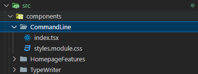

import {
  Args,
  Cmd,
  Comment,
  Emph,
  Line,
  TerminalLine,
  TerminalResponse,
  TerminalRoot,
  Tunnel,
} from "@site/src/components/CommandLine";
import TabItem from "@theme/TabItem";
import Tabs from "@theme/Tabs";
import Terminal from "./components/Terminal";

<Terminal />
{/* truncate */}

## 缘起

从刚接触 docusaurus 开始，就一直想做一个模拟终端的小组件，最初是看到了 [prismjs] 中的 `command-line` 插件，也了解到 docusaurus 中就是用 prismjs 进行代码块高亮的。但苦于一直没搞明白怎么用这个插件(而且后面觉得也没那么好看)，遂动手写一个

首先来讲效果与如何使用，代码实现先放到了最后

## 使用

使用方式大致如下(在 docusaurus 中)，首先将组件放到 `src/components` 目录下(组件在[完整代码](#完整代码)处查看)，然后在文件中将必要的组件 import 进来



```tsx showLineNumbers
import {
  Line,
  TerminalLine,
  TerminalResponse,
  TerminalRoot,
} from "@site/src/components/CommandLine";
import Terminal from "./components/Terminal";
```

然后在需要使用的地方添加 `TerminalRoot` 组件，只有唯一参数 `title`，然后在其中根据需求使用 `TerminalLine` 和 `TerminalResponse` 即可，这里给出一个样例：

<Tabs>

<TabItem value="terminal" label="效果">
  <Terminal />
</TabItem>

<TabItem value="tsx" label="代码样例">
```tsx showLineNumbers
import {
  Args,
  Cmd,
  Line,
  TerminalLine,
  TerminalResponse,
  TerminalRoot,
} from "@site/src/components/CommandLine";
import React from "react";

<TerminalRoot title={"终端模拟器"}>
  <TerminalLine userName="casta" dir="">
    <Cmd text="conda init" />
  </TerminalLine>
  
  <TerminalLine userName="casta" dir="" conda="base">
    <Cmd text="ps" />
    <Args text="-a" />
  </TerminalLine>
  <TerminalResponse userName="casta" dir="" conda="base" response_style="NEWLINE">
    <Line text="PID TTY          TIME CMD" />
    <Line text=" 12 tty1     00:00:00 sh" />
    <Line text=" 13 tty1     00:00:00 sh" />
    <Line text=" 18 tty1     00:00:00 sh" />
    <Line text=" 22 tty1     00:00:08 node" />
  </TerminalResponse>

  <TerminalLine userName="casta" dir="" conda="base">
    <Cmd text="conda activate" />
    <Line text="torch" />
  </TerminalLine>
  <TerminalLine userName="casta" dir="" conda="torch">
    <Cmd text="ll" />
  </TerminalLine>
  <TerminalResponse
    userName="casta"
    dir=""
    conda="torch"
    response_style="NEWLINE"
  >
    <Line text="total 1" />
    <Line text="drwxr-xr-x 2 root root 4096 Sep  3 10:00 ./" />
  </TerminalResponse>
</TerminalRoot>;
```
</TabItem>

</Tabs>

接下来挨个讲两个关键组件 `TerminalLine` 和 `TerminalResponse`

## 自定义内容 (参数)

`TerminalLine` 和 `TerminalResponse` 都有以下的几个参数

- `userName`：用户名，默认为空
- `dir`：当前目录，默认为 `~`
- `conda`：当前 conda 环境，默认为空

接下来挨个演示参数

### 用户

默认不包含用户，当添加用户后，在路径前会有 `userName@` 的标识符，效果如下：

<TerminalRoot title={"用户"}>
  <TerminalLine userName="castamere" dir="">
    <Comment text="# 有用户" />
  </TerminalLine>
  <TerminalLine dir="">
    <Comment text="# 无用户" />
  </TerminalLine>
</TerminalRoot>

代码如下：

```tsx showLineNumbers
<TerminalRoot title={"用户"}>
  <TerminalLine userName="castamere" dir="">
    <Comment text="# 有用户" />
  </TerminalLine>
  <TerminalLine dir="">
    <Comment text="# 无用户" />
  </TerminalLine>
</TerminalRoot>
```

### 路径

有时，我们可能想演示切换路径的操作，比如 `cd`, `z` 等命令，这时就可以添加 `dir` 参数，效果如下：

<TerminalRoot title={"路径"}>
  <TerminalLine dir="home">
    <Cmd text="cd" />
    <Line text="./castamere/My-Website" />
  </TerminalLine>
  <TerminalLine dir="home/castamere/My-Website">
    <Line text="" />
  </TerminalLine>
</TerminalRoot>

代码如下：

```tsx showLineNumbers
<TerminalRoot title={"路径"}>
  <TerminalLine dir="home">
    <Cmd text="cd" />
    <Line text="./castamere/My-Website" />
  </TerminalLine>
  <TerminalLine dir="home/castamere/My-Website">
    <Line text="" />
  </TerminalLine>
</TerminalRoot>
```

### conda

同样的，AI 深度学习这方面，我们很有可能会演示 `conda` 的操作，这里笔者也添加了一个 `conda` 的参数，效果如下：

<TerminalRoot title={"conda"}>
  <TerminalLine>
    <Cmd text="conda activate" />
    <Line text="base" />
  </TerminalLine>
  <TerminalLine conda="base">
    <Line text="" />
  </TerminalLine>
</TerminalRoot>

代码如下：

```tsx showLineNumbers
<TerminalRoot title={"conda"}>
  <TerminalLine>
    <Cmd text="conda activate" />
    <Line text="base" />
  </TerminalLine>
  <TerminalLine conda="base">
    <Line text="" />
  </TerminalLine>
</TerminalRoot>
```

:::important
读者们如果有其他好玩的需求，在评论区里留言，笔者会尽量满足大家的需求，目前笔者也就还想到了一个 git 的样式，可能后期会加上去
:::

## 输入 (TerminalLine)

`TerminalLine` 输入的一般为一串命令，其中包括命令、参数、路径/文件、管道、注释等元素，这里逐个演示

:::important
注意，`TerminalLine` 的所有 `children` 都会渲染到同一行，并且每个元素直接会自动添加空格，读者们不需要手动添加空格
:::

### 命令

首先是命令，组件为 `<Cmd>`，效果如下：

<TerminalRoot title={"命令"}>
  <TerminalLine>
    <Cmd text="ll" />
  </TerminalLine>
  <TerminalLine>
    <Cmd text="grep" />
  </TerminalLine>
  <TerminalLine>
    <Cmd text="mysql" />
  </TerminalLine>
</TerminalRoot>

代码如下：

```tsx showLineNumbers
<TerminalRoot title={"命令"}>
  <TerminalLine>
    <Cmd text="ll" />
  </TerminalLine>
  <TerminalLine>
    <Cmd text="grep" />
  </TerminalLine>
  <TerminalLine>
    <Cmd text="mysql" />
  </TerminalLine>
</TerminalRoot>
```

### 参数

参数的组件为 `<Args>`，效果如下：

<TerminalRoot title={"参数"}>
  <TerminalLine>
    <Cmd text="ps" />
    <Args text="-a" />
  </TerminalLine>
  <TerminalLine>
    <Cmd text="awk" />
    <Args text="-F'|'" />
    <Line text="'{print $1}'" />
  </TerminalLine>
</TerminalRoot>

代码如下：

```tsx showLineNumbers
<TerminalRoot title={"参数"}>
  <TerminalLine>
    <Cmd text="ps" />
    <Args text="-a" />
  </TerminalLine>
  <TerminalLine>
    <Cmd text="awk" />
    <Args text="-F'|'" />
    <Line text="'{print $1}'" />
  </TerminalLine>
</TerminalRoot>
```

### 管道

管道的组件为 `<Tunnel>`，效果如下：

<TerminalRoot title={"管道"}>
  <TerminalLine>
    <Cmd text="docker ps" />
    <Args text="-a" />
    <Tunnel text="|" />
    <Cmd text="grep" />
    <Line text="neutron" />
  </TerminalLine>
  <TerminalLine>
    <Cmd text="cat" />
    <Line text="/etc/ssh/sshd_config" />
    <Tunnel text="|" />
    <Cmd text="grep" />
    <Line text="-v '^#'" />
    <Tunnel text="|" />
    <Cmd text="grep" />
    <Line text="-v '^$'" />
  </TerminalLine>
  <TerminalLine>
    <Cmd text="cat" />
    <Line text="./id_rsa.pub" />
    <Tunnel text="&gt;&gt;" />
    <Line text="authorized_keys" />
  </TerminalLine>
</TerminalRoot>

代码如下：

<details>
  <summary>管道演示代码</summary>

```tsx showLineNumbers
<TerminalRoot title={"管道"}>
  <TerminalLine>
    <Cmd text="docker ps" />
    <Args text="-a" />
    <Tunnel text="|" />
    <Cmd text="grep" />
    <Line text="neutron" />
  </TerminalLine>
  <TerminalLine>
    <Cmd text="cat" />
    <Line text="/etc/ssh/sshd_config" />
    <Tunnel text="|" />
    <Cmd text="grep" />
    <Line text="-v '^#'" />
    <Tunnel text="|" />
    <Cmd text="grep" />
    <Line text="-v '^$'" />
  </TerminalLine>
  <TerminalLine>
    <Cmd text="cat" />
    <Line text="./id_rsa.pub" />
    <Tunnel text="&gt;&gt;" />
    <Line text="authorized_keys" />
  </TerminalLine>
</TerminalRoot>
```

</details>

### 注释

注释的组件为 `<Comment>`，效果如下：

<TerminalRoot title={"注释"}>
  <TerminalLine>
    <Comment text="# 这是一条注释" />
  </TerminalLine>
</TerminalRoot>

代码如下：

```tsx showLineNumbers
<TerminalRoot title={"注释"}>
  <TerminalLine>
    <Comment text="# 这是一条注释" />
  </TerminalLine>
</TerminalRoot>
```

## 输出 (TerminalResponse)

`TerminalResponse` 输出的是命令执行后的结果，这里有两种输出方式。分别为换行顶格输出和对齐输出，当前缀内容比较长时，应该用换行顶格输出，效果在后面有演示

:::important
注意，`TerminalResponse` 的 `children` 中的每一个 `child` 都会被渲染到一个新的行
:::

### 换行顶格输出

换行顶格输出，即不显示前缀的任何内容，包括路径，用户等内容，直接开一个新行输出，效果如下：

<TerminalRoot title={"输出方式1: 换行顶格输出"}>
  <TerminalLine
    userName="castamere"
    dir="home/castamere/My-Website"
    conda="py26"
  >
    <Comment text="# 当前缀比较长，建议用👇这种方式" />
  </TerminalLine>
  <TerminalLine
    userName="castamere"
    dir="home/castamere/My-Website"
    conda="py26"
  >
    <Cmd text="ps" />
    <Args text="-a" />
  </TerminalLine>
  <TerminalResponse response_style="NEWLINE">
    <Line text="PID TTY          TIME CMD" />
    <Line text=" 12 tty1     00:00:00 sh" />
    <Line text=" 13 tty1     00:00:00 sh" />
    <Line text=" 18 tty1     00:00:00 sh" />
    <Line text=" 22 tty1     00:00:08 node" />
  </TerminalResponse>
  <TerminalLine
    userName="castamere"
    dir="home/castamere/My-Website"
    conda="py26"
  >
    <Comment text="# 对比这个👇就会觉得很丑" />
  </TerminalLine>
  <TerminalLine
    userName="castamere"
    dir="home/castamere/My-Website"
    conda="py26"
  >
    <Cmd text="ps" />
    <Args text="-a" />
  </TerminalLine>
  <TerminalResponse
    userName="castamere"
    dir="home/castamere/My-Website"
    conda="py26"
  >
    <Line text="PID TTY          TIME CMD" />
    <Line text=" 12 tty1     00:00:00 sh" />
    <Line text=" 13 tty1     00:00:00 sh" />
    <Line text=" 18 tty1     00:00:00 sh" />
    <Line text=" 22 tty1     00:00:08 node" />
  </TerminalResponse>
</TerminalRoot>

代码如下：

<details>
  <summary>换行顶格输出演示代码</summary>

```tsx showLineNumbers
<TerminalRoot title={"输出方式1: 换行顶格输出"}>
  <TerminalLine
    userName="castamere"
    dir="home/castamere/My-Website"
    conda="py26"
  >
    <Comment text="# 当前缀比较长，建议用👇这种方式" />
  </TerminalLine>
  <TerminalLine
    userName="castamere"
    dir="home/castamere/My-Website"
    conda="py26"
  >
    <Cmd text="ps" />
    <Args text="-a" />
  </TerminalLine>
  <TerminalResponse response_style="NEWLINE">
    <Line text="PID TTY          TIME CMD" />
    <Line text=" 12 tty1     00:00:00 sh" />
    <Line text=" 13 tty1     00:00:00 sh" />
    <Line text=" 18 tty1     00:00:00 sh" />
    <Line text=" 22 tty1     00:00:08 node" />
  </TerminalResponse>
  <TerminalLine
    userName="castamere"
    dir="home/castamere/My-Website"
    conda="py26"
  >
    <Comment text="# 对比这个👇就会觉得很丑" />
  </TerminalLine>
  <TerminalLine
    userName="castamere"
    dir="home/castamere/My-Website"
    conda="py26"
  >
    <Cmd text="ps" />
    <Args text="-a" />
  </TerminalLine>
  <TerminalResponse
    userName="castamere"
    dir="home/castamere/My-Website"
    conda="py26"
  >
    <Line text="PID TTY          TIME CMD" />
    <Line text=" 12 tty1     00:00:00 sh" />
    <Line text=" 13 tty1     00:00:00 sh" />
    <Line text=" 18 tty1     00:00:00 sh" />
    <Line text=" 22 tty1     00:00:08 node" />
  </TerminalResponse>
</TerminalRoot>
```

</details>

### 前缀空格，对齐输出

<TerminalRoot title={"输出方式2: 前缀空格，对齐输出"}>
  <TerminalLine dir="">
    <Comment text="# 大部分时候，用这个👇会比较舒服" />
  </TerminalLine>
  <TerminalLine dir="">
    <Cmd text="ps" />
    <Args text="-a" />
  </TerminalLine>
  <TerminalResponse dir="">
    <Line text="PID TTY          TIME CMD" />
    <Line text=" 12 tty1     00:00:00 sh" />
    <Line text=" 13 tty1     00:00:00 sh" />
    <Line text=" 18 tty1     00:00:00 sh" />
    <Line text=" 22 tty1     00:00:08 node" />
  </TerminalResponse>
</TerminalRoot>

代码如下：

<details>
  <summary>对齐输出演示代码</summary>

```tsx showLineNumbers
<TerminalRoot title={"输出方式2: 前缀空格，对齐输出"}>
  <TerminalLine dir="">
    <Comment text="# 大部分时候，用这个👇会比较舒服" />
  </TerminalLine>
  <TerminalLine dir="">
    <Cmd text="ps" />
    <Args text="-a" />
  </TerminalLine>
  <TerminalResponse dir="">
    <Line text="PID TTY          TIME CMD" />
    <Line text=" 12 tty1     00:00:00 sh" />
    <Line text=" 13 tty1     00:00:00 sh" />
    <Line text=" 18 tty1     00:00:00 sh" />
    <Line text=" 22 tty1     00:00:08 node" />
  </TerminalResponse>
</TerminalRoot>
```

</details>

## 其他功能

### 高亮

给读者介绍时，如果输出内容较多，有时可能想高亮某一行，使用 `<Emph>` 组件即可，效果如下

<TerminalRoot title={"高亮"}>
  <TerminalLine dir="">
    <Comment text="# 给读者介绍时，有时可能想高亮某一行" />
  </TerminalLine>
  <TerminalLine dir="">
    <Cmd text="ps" />
    <Args text="-a" />
  </TerminalLine>
  <TerminalResponse dir="">
    <Line text="PID TTY          TIME CMD" />
    <Line text=" 12 tty1     00:00:00 sh" />
    <Emph text=" 13 tty1     00:00:00 sh" />
    <Line text=" 18 tty1     00:00:00 sh" />
    <Line text=" 22 tty1     00:00:08 node" />
  </TerminalResponse>
</TerminalRoot>

### 滚动

内置了横向滚动条，如果输出太长，或者在移动端查看，也不用担心格式问题

<TerminalRoot title={"滚动"}>
  <TerminalLine dir="">
    <Comment text="# 这是一条很长很长很长很长很长很长很长很长很长很长很长很长很长很长很长很长很长很长很长很长很长很长很长很长很长很长很长很长很长很长很长很长很长很长很长很长很长很长很长很长很长很长很长很长很长很长很长很长很长很长很长很长很长很长很长很长的命令" />
  </TerminalLine>
</TerminalRoot>

## 完整代码

最终完整代码如下，也可访问 [github] 下载

<details>
  <summary>完整代码</summary>

<Tabs>
<TabItem value="tsx" label="CommandLine.tsx">

```tsx showLineNumbers title="CommandLine.tsx"
import React from "react";
import styles from "./styles.module.css";

const USERNAME = "";
const CONDA = "";
const DIR = "castamere";
const RESPONSE_STYLE = "PLAIN";

export const TerminalLine = ({
  children,
  conda = CONDA,
  userName = USERNAME,
  dir = DIR,
}) => {
  const userNamePath = userName === "" ? `~/${dir} ` : `${userName}@~/${dir} `;
  const env = conda === "" ? "" : `(${conda}) `;
  const frontMatterContent = (
    <>
      <span className={styles.env}>{env}</span>
      <span className={styles.rightArrow}>→ </span>
      <span className={styles.userNamePath}>{userNamePath}</span>
      <span className={styles.dolar}>$ </span>
    </>
  );

  return (
    <div>
      {frontMatterContent}
      {children}
    </div>
  );
};

export const TerminalResponse = ({
  children,
  conda = CONDA,
  userName = USERNAME,
  dir = DIR,
  response_style = RESPONSE_STYLE,
}) => {
  const childrenArray = React.Children.toArray(children);
  const userNamePath = userName === "" ? `~/${dir} ` : `${userName}@~/${dir} `;
  const env = conda === "" ? "" : `(${conda}) `;
  const frontMatterContent = (
    <>
      <span className={styles.env}>{env}</span>
      <span className={styles.rightArrow}>+ </span>
      <span className={styles.userNamePath}>{userNamePath}</span>
    </>
  );

  switch (response_style) {
    case "NEWLINE":
      return (
        <>
          <div style={{ lineHeight: "1.5rem", alignItems: "" }}>
            {childrenArray.map((child, index) => (
              <div key={index}>{child}</div>
            ))}
          </div>
        </>
      );

    case "PLAIN":
      return (
        <div style={{ lineHeight: "1.5rem", alignItems: "" }}>
          {childrenArray.map((child, index) => {
            const frontMatter =
              index === 0 ? (
                frontMatterContent
              ) : (
                <span style={{ opacity: 0 }}>{frontMatterContent}</span>
              );

            return (
              <div key={index}>
                {frontMatter}
                {child}
              </div>
            );
          })}
        </div>
      );

    default:
      break;
  }
};

export const TerminalHeader = ({ title }) => {
  return (
    <div className={styles.toolBar}>
      <div className={styles.dot} style={{ backgroundColor: "#fb5f57" }} />
      <div className={styles.dot} style={{ backgroundColor: "#fdbf2d" }} />
      <div className={styles.dot} style={{ backgroundColor: "#27cb3f" }} />
      <div className={styles.title}>{title}</div>
    </div>
  );
};

export const Line = ({ text }) => {
  return <span className={styles.line}>{text} </span>;
};

export const Cmd = ({ text }) => {
  return <span className={styles.command}>{text} </span>;
};

export const Tunnel = ({ text }) => {
  return <span className={styles.tunnel}>{text} </span>;
};

export const Emph = ({ text }) => {
  return <span className={styles.emph}>{text} </span>;
};

export const Comment = ({ text }) => {
  return <span className={styles.comment}>{text} </span>;
};

export const Args = ({ text }) => {
  return <span className={styles.args}>{text} </span>;
};

export const TerminalRoot = ({ children, title }) => {
  return (
    <div className={styles.card} aria-hidden="true">
      <TerminalHeader title={title} />
      <div className={styles.main}>{children}</div>
    </div>
  );
};
```

</TabItem>

<TabItem value="css" label="styles.module.css">

```css title="styles.module.css" showLineNumbers
.card {
  width: 100%;
  font-size: 0.875rem;
  line-height: 1.25rem;
  background-color: rgba(255, 255, 254, 1);
  border: 1px solid #e5e7eb;
  border-bottom-color: #00000026;
  border-radius: 0.375rem;
  box-shadow: 0 0 0 #0000, 0 0 0 #0000, 0 0 0 #0000, 0 0 0 #0000,
    0 30px 100px -4px #336fef33;
  transition-property: color, background-color, border-color,
    text-decoration-color, fill, stroke;
  transition-timing-function: cubic-bezier(0.4, 0, 0.2, 1);
  transition-duration: 0.15s;
  font-family: MesloLGS NF Regular;
  src: url("@site/src/fonts/MesloLGS NF Font/MesloLGS NF Regular.ttf");
  margin-bottom: 20px;
}

.toolBar {
  padding: 0.5rem;
  background-color: hsla(0, 0%, 100%, 0.001);
  border-bottom: 1px solid #e5e7eb;
  display: flex;
  align-items: center;
  position: relative;
  gap: 6px;
}

.toolBar .dot {
  border-radius: 9999px;
  cursor: no-drop;
  width: 0.7rem;
  height: 0.7rem;
}

.toolBar .title {
  position: absolute;
  top: 0;
  bottom: 0;
  width: 100%;
  display: flex;
  align-items: center;
  justify-content: center;
  opacity: 0.5;
  color: rgb(28, 30, 33);
}

.main {
  padding: 1rem;
  overflow-x: auto;
  white-space: nowrap;
}

.main .rightArrow {
  color: rgb(234, 74, 170);
  line-height: 1.5rem;
  font-weight: 700;
}

.main .userNamePath {
  color: rgb(102, 231, 119);
  font-weight: 700;
}

.main .env {
  color: rgb(160, 147, 147);
  font-weight: 700;
}

.main .dolar {
  font-weight: 700;
  color: rgb(55, 65, 81);
  transition-duration: 0.2s;
}

.main .command {
  color: rgb(13, 188, 92);
}

.main .args {
  color: rgb(160, 147, 147);
}

.main .line {
  color: rgb(28, 30, 33);
  white-space: pre;
}

.main .tunnel {
  color: rgb(193, 156, 0);
}

.main .emph {
  font-weight: 700;
  color: rgb(55, 111, 234);
  white-space: pre;
}

.main .comment {
  font-style: italic;
  color: rgb(82, 153, 73);
  white-space: pre;
}

.main .fontBold {
  font-weight: 700;
}

.main a {
  color: inherit;
  text-decoration: none;
}
```

</TabItem>
</Tabs>
</details>

## 后记

希望这篇文章能帮助到你，如果你有任何问题，欢迎在评论区留言

P.S: 如果有什么好的需求与建议，也欢迎留言

[prismjs]: https://prismjs.com/plugins/command-line/
[github]: https://github.com/Casta-mere/My-Website/tree/master/src/components/CommandLine
