Docusaurus 侧边栏详解

> **程序员 101：_Read The Fucking Manual_**

<!--truncate-->

## 缘起

:::important
当前最新 docusaurus 版本为 3.5.2，笔者觉得目前 docusaurus 的侧边栏有些细枝末节还是很混乱，希望后期可以改进
:::

起因是笔者最近看了一些博客，并且做了几个小组件，想在 Navbar 中添加一个新的链接指向 snippet 即一个代码片段的页面。经过一些研究，发现大部分作者，以及 FaceBook 官方使用的方法都是在 doc 中添加一个新的文件夹，并为其创建一个新的 sidebar，但笔者在刚接触 docusaurus 时并没有去研究过这个 sidebar 的具体内容，并且有点急于求成，脑子越来越乱。查资料过程中又发现了新的功能，整理一下所有内容，记录一下整个的心路历程

:::tip
**建议有兴趣的读者，先完整读一遍，笔者会进行详细的分析，并在最后给出推荐的配置，没必要一步一步跟着试错**
:::

## 侧边栏 root

侧边栏 root 指的是侧边栏中，这种能折叠的页面：

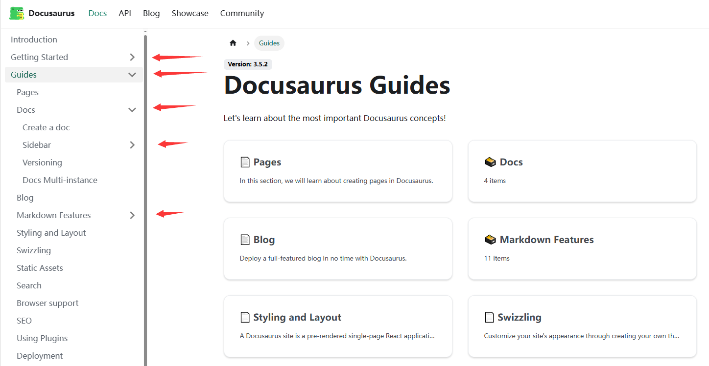

这种页面在文档中起的作用很显而易见，即将文档分类，方便读者查找。不仅如此，在阅读官方文档时，还发现了一个新的功能：提供一个页面的总结

### 侧边栏 root 的三种形式

经过观察，发现侧边栏 root 有三种形式：

1. 侧边栏 root 仅作为一个下拉框，并不指向任何页面

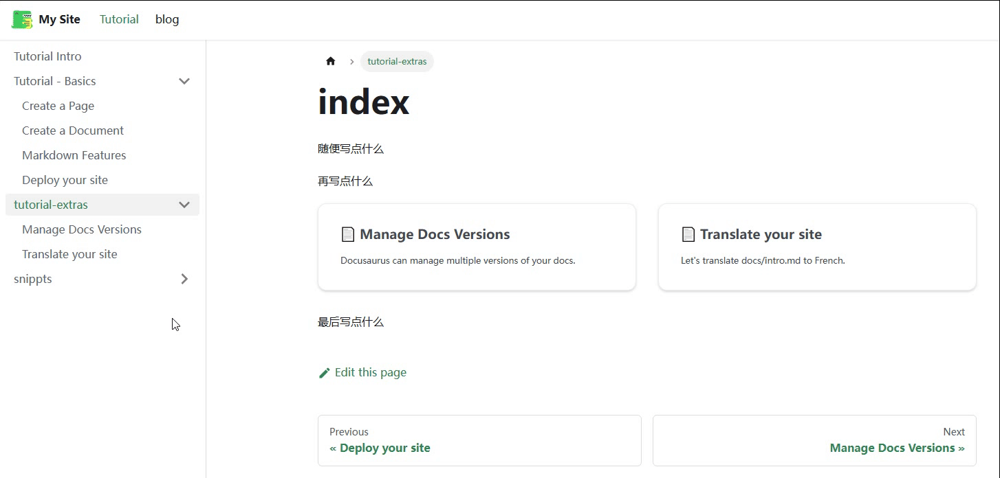

2. 侧边栏 root 作为一个链接，指向一个页面，且该页面只包含一个 description 和一个 Toc

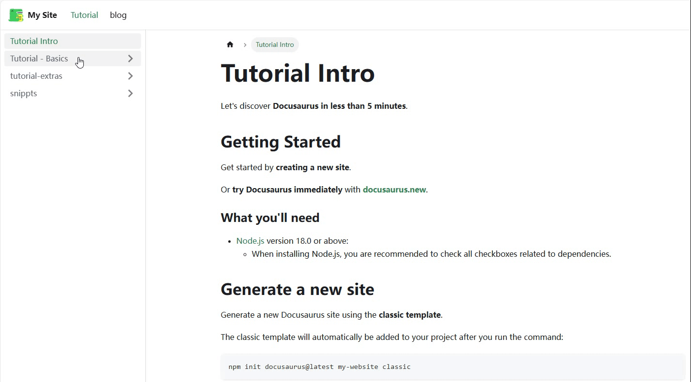

3. 侧边栏 root 作为一个链接，指向一个页面，但该页面为一个完整的文档

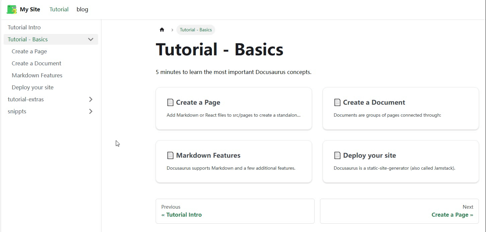

### 第一种形式

:::important

**此处仅讨论当 sidebar.ts/js 为默认的情况**，即如下。sidebar.ts/js 对侧边栏的影响，笔者将在后面详细写

```ts showLineNumbers title="sidebar.ts"
import type { SidebarsConfig } from "@docusaurus/plugin-content-docs";

const sidebars: SidebarsConfig = {
  tutorialSidebar: [{ type: "autogenerated", dirName: "." }],
};

export default sidebars;
```

:::

当在 doc 中创建一个文件夹时(并且其中至少有一个文档时)，docusaurus 会自动为我们创建一个侧边栏 Root，但此时的侧边栏 root 并不会指向任何页面，仅作为一个下拉框

### 第二种形式

使用 `npm init docusaurus@latest my-website classic` 创建一个默认的 docusaurus 项目时，我们可以发现，在 `tutorial-basics` 和 `tutorial-extra` 目录下，都有一个 `_category_.json`。在 [category metadata] 一节中，官方给我们介绍了该文件可以为该文件夹下的所有文档添加一些元属性，如下所示

```json title="docs/demo/_category_.json" showLineNumbers
{
  "position": 2.5, // 相对位置，数字越小越靠上
  "label": "Tutorial", // 侧边栏 root 的名称
  "collapsible": true, // 是否可折叠
  "collapsed": false, // 是否默认初始折叠
  "className": "red", // html 类名说是
  "link": {
    // 侧边栏 root 指向的页面
    "type": "generated-index",
    "description": "5 minutes to learn the most important Docusaurus concepts."
  },
  "customProps": {
    "description": "This description can be used in the swizzled DocCard"
  }
}
```

其中比较重要的两个，一个是 `position` ，用来对所有的文件夹进行排序，笔者之前就是使用的这种方式，给每个文件夹下都添加 `position` 后，会按照这个数字从小到大进行排序。但当文档多起来之后，复杂度 O(n)真受不了，每次想要插入一个新的类别，都要把后面的挨个 +1，实在是难崩；另一个就是 `link` 中的 `description`，只要这里有类型为 `generated-index` 的 `link` ，并且包含 `description`，那么该侧边栏 root 就会指向一个页面，且该页面会包含这个 description 和一个目录

样例如下：

```json title="docs/tutorial-basics/_category_.json" showLineNumbers
{
  "label": "Tutorial - Basics",
  "position": 2,
  "link": {
    "type": "generated-index",
    "description": "5 minutes to learn the most important Docusaurus concepts."
  }
}
```

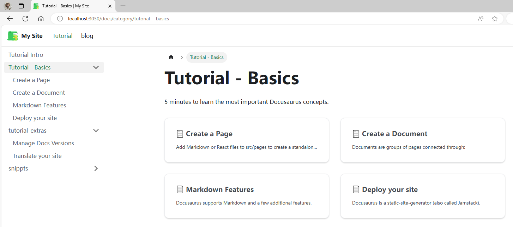

相信大多数 docusaurus 用户，使用的都是第二种形式 (因为模板里就是这样(好吧，因为我就是这样的 😅))，甚至有些是第一种的简陋形式。but 官方其实还有第三种形式

### 第三种形式

第三种形式是在浏览官方文档时发现的，(怎么你的这么花里胡哨，是一个完整的页面)

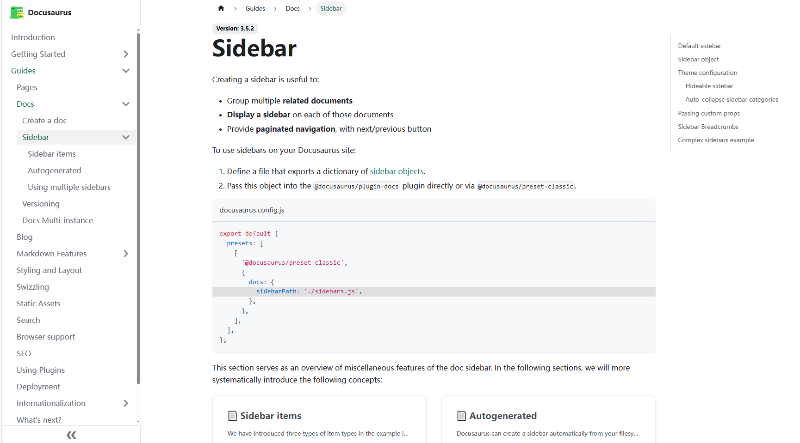

最终在 [category-index-convention] 这里找到了答案，但在使用中还是踩了好几个坑...

首先，这种形式，是将一个约定俗成的页面，作为侧边栏 root 的页面，官方设置了如下了的几个约定俗成：

- 命名为 index (case-insensitive): docs/Guides/index.md
- 命名为 README (case-insensitive): docs/Guides/README.mdx
- 与父文件夹同名: docs/Guides/Guides.md

将你的文件命名为以上任何一种，接下来是第二步，需要将之前的 `_category_.json` 中的 `link` 字段去掉，建议只保留 `position` 字段，即可。因为 index.md/README.md/Guides.md 中的 `title` 字段会自动覆盖掉 `_category_.json` 中的 `label` 字段

:::info
如果不想用约定俗成的命名(我也不知道为啥，万一有人想呢)可以这样做：

将 `_category_.json` 中的 `link` 字段的 `type` 改为 `doc`，添加 `id` 字段，修改为文件名(P.S. 写错了不怕，错了会列出来可用的所有文件名，替换即可)，并且去掉 `description` 字段，即可，如下：

```json title="docs/tutorial-basics/_category_.json" showLineNumbers
{
  "label": "Tutorial - Basics",
  "position": 2,
  "link": {
    "type": "doc",
    "id": "tutorial-basics/deploy-your-site"
  }
}
```

这样就可以将 `deploy-your-site.md` 作为侧边栏 root 的页面了

:::

此时还注意到一点，我们大概率还是要在这个 root 页面里，显示原有的那个目录的(下图这个东西)

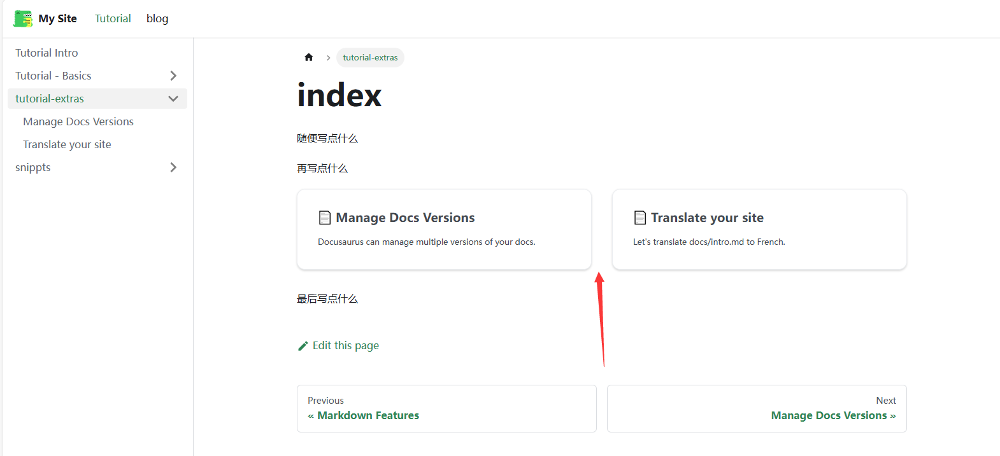

方法也很简单，上面这个演示的代码如下，把对应的组件 import 进来，在需要的地方使用即可

```md {9,11} title="docs/tutorial-extras/index.md" showLineNumbers
---
sidebar_label: "tutorial-extras"
---

随便写点什么

再写点什么

import DocCardList from '@theme/DocCardList';

<DocCardList />

最后写点什么
```

## 初次尝试

程序员的第一课，_RTFM_。前文说到，笔者最开始是因为想在 Navbar 中添加一个路径，单独显示一个代码片段的页面。这里就以此为例，讲解一下笔者的心路历程

### sidebar.js/ts

首先，根据官方 [sidebar] 第一节的内容，要实现上述功能分两步：

1. 修改 `sidebar.js/ts` ，添加一个新的 `sidebar` ，如下：

```ts showLineNumbers title="sidebar.ts"
  import type { SidebarsConfig } from "@docusaurus/plugin-content-docs";

  const sidebars: SidebarsConfig = {
    tutorialSidebar: [{ type: "autogenerated", dirName: "." }],
    // git-add-next-line
+   snippetsSidebar: [{ type: "autogenerated", dirName: "Snippets" }],
  };

  export default sidebars;
```

这里解释一下，原有的 `tutorialSidebar` 是将 `doc/` 目录下的文件自动生成为侧边栏，而笔者新添加的 `snippetsSidebar` 则是将 `doc/Snippets/` 目录下的文件自动生成为另一个侧边栏(也就是这里的 `dirName` 的作用)

2. 修改 `docusaurus.config.ts/js` ，在 Navbar 中添加一个新的链接，如下：

```js showLineNumbers title="docusaurus.config.ts"
  themeConfig: {
    ....
    navbar: {
      ....
      items: [
        {
          type: "docSidebar",
          sidebarId: "tutorialSidebar",
          position: "left",
          label: "Tutorial",
        },
        // git-add-start
+       {
+        type: "docSidebar",
+        sidebarId: "snippetsSidebar",
+        position: "left",
+        label: "Snippets",
+       },
        // git-add-end
        { to: "/blog", label: "blog", position: "left" },
        ....
      ],
    },
    ....
  }
```

效果如下：


但这时发现了一个 bug ，在原有的 `tutorialSidebar` 下仍然有 `Snippets` 的目录，并且在点击时，会自动跳转到刚刚的 `Snippets` 的侧边栏，如下：

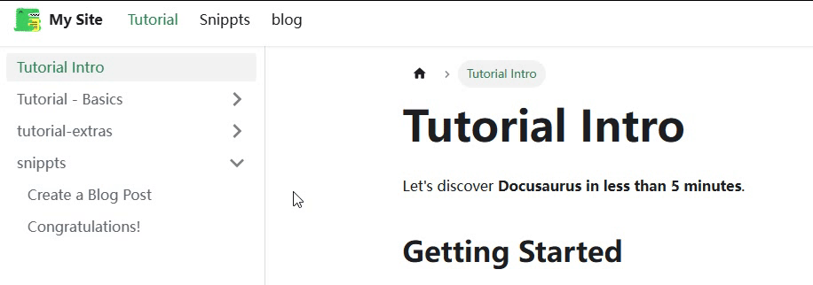

### 问题分析

现在来详细分析一下这个 bug 的原因，首先看一下项目的目录结构：

```txt showLineNumbers
docs
├── intro.md
├── snippets
│   ├── congratulations.md
│   └── create-a-blog-post.md
├── tutorial-basics
│   ├── _category_.json
│   ├── create-a-document.md
│   ├── create-a-page.md
│   ├── deploy-your-site.md
│   └── markdown-features.mdx
└── tutorial-extras
    ├── _category_.json
    ├── img
    │   ├── docsVersionDropdown.png
    │   └── localeDropdown.png
    ├── index.md
    ├── manage-docs-versions.md
    └── translate-your-site.md
```

对应的 `sidebar.ts` 文件如下：

```ts showLineNumbers title="sidebar.ts"
import type { SidebarsConfig } from "@docusaurus/plugin-content-docs";

const sidebars: SidebarsConfig = {
  tutorialSidebar: [{ type: "autogenerated", dirName: "." }],
  snippetsSidebar: [{ type: "autogenerated", dirName: "Snippets" }],
};

export default sidebars;
```

其编译逻辑如下：`tutorialSidebar` 会将 `docs/` 目录下的文件自动生成侧边栏，而 `snippetsSidebar` 则会将 `docs/Snippets/` 目录下的文件自动生成侧边栏。笔者一开始以为，聪明的 docusaurus 会自动处理这种 `dirName` 有包含关系的情况，但显然没有

在 [sidebar-assosiation] 一节，官方详细解释了**文档**和**侧边栏**之间的关联关系，并解释了如果有这种 **交集** 或者 **包含** 关系下，docusaurus 会怎样处理

答案很简单，docusaurus 不会处理...

官方介绍了一种手动解决这个问题的办法，但要讲解这个办法需要先说明另一个很重要的内容 `sidebar items`

## sidebar items

我们再来看一下这个 `sidebar.ts` 文件，如下：

```ts showLineNumbers title="sidebar.ts"
import type { SidebarsConfig } from "@docusaurus/plugin-content-docs";

const sidebars: SidebarsConfig = {
  tutorialSidebar: [{ type: "autogenerated", dirName: "." }],
  snippetsSidebar: [{ type: "autogenerated", dirName: "Snippets" }],
};

export default sidebars;
```

笔者一直没有介绍这个 `{ type: "autogenerated", dirName: "." }` 到底是什么，还有什么别的 type, 又有什么区别，现在就来详细介绍一下，这个其实就是 **docusaurus** 的 **sidebar item**

在 [sidebar item] 一节，详细的介绍了六种 sidebar item，这里笔者就按自己的理解来总结一下

- Doc: 文章，比如 `docs/intro.md`
- Link: 链接，可以链接到内部或者外部网页
- Category: 分类，即本文最开始提到的 sidebar root
- Autogenerated: 自动生成侧边栏切片
- HTML: HTML 元素
- \*Ref: 文章链接(但不添加到翻页导航中)

其实很好理解，整个目录为树状结构，所有的非叶子节点都是 Category 类型；所有的叶子节点是其他的五种之一

### Doc

Doc 类型，就是单独的一篇文档，比如 `docs/intro.md`，其对应的 sidebar item 有如下参数：

```tsx showLineNumbers title="Doc"
type SidebarItemDoc =
  // Normal syntax
  | {
      type: "doc";
      id: string;
      label: string; // Sidebar label text
      className?: string; // Class name for sidebar label
      customProps?: Record<string, unknown>; // Custom props
    }

  // Shorthand syntax
  | string; // docId shortcut
```

:::info
id 为文档的 id(用于导航，这个 id 是包括文件名和路径的，但 docusaurus 会将序号/时间等内容处理掉，比如 `docs/tutorial-basics/01-create-a-document.md` 的 id 就是 `tutorial-basics/create-a-document`)
:::

除此之外，由于 `doc` 为常用类型，设置了简写语法，即直接使用 `docId` 即可，如下的两种形式为等价的：

```ts showLineNumbers title="sidebar.ts"
export default {
  mySidebar: [
    // Normal syntax:
    {
      type: "doc",
      id: "doc1", // document ID
      label: "Getting started", // sidebar label
    },

    // Shorthand syntax:
    "doc2", // document ID
  ],
};
```

比如当有多个文档时，如下的方式就会显得很方便：

```ts showLineNumbers title="sidebar.ts"
export default {
  mySidebar: ["doc1", "doc2", "doc3", "doc4"],
};
```

:::note
P.S. 一般想要添加自定义属性(上面的 customProps?)时，也只是在文章中直接添加，而不是在 `sidebar.ts/js` 中添加
:::

### Link

Link 类型，即链接，其对应的 sidebar item 有如下参数：

```tsx showLineNumbers title="Link"
type SidebarItemLink = {
  type: "link";
  label: string;
  href: string;
  className?: string;
  description?: string;
};
```

这里需要的注意的只有 `href`，内部链接使用 `/` 开头，外部链接使用 `http://` 或者 `https://` 开头

### Category

Category 类型，即上文提到过的 sidebar root，其对应的 sidebar item 有如下参数：

```tsx showLineNumbers title="Category"
type SidebarItemCategory = {
  type: "category";
  label: string; // Sidebar label text.
  items: SidebarItem[]; // Array of sidebar items.
  className?: string;
  description?: string;
};
```

其中，`items` 为一个数组，里面可以包含任意类型的 sidebar item，包括 Category 类型，即可以嵌套

```ts showLineNumbers title="sidebar.ts"
export default {
  docs: [
    {
      type: "category",
      label: "Guides",
      items: [
        {
          type: "doc",
          id: "doc1",
          label: "Getting started",
        },
        {
          type: "category",
          label: "Docs",
          items: ["introduction", "sidebar", "markdown-features", "versioning"],
        },
      ],
    },
  ],
};
```

同样，Category 也有简写语法，即直接使用一个字典的形式，下面的这种形式与上面是等价的

```ts showLineNumbers title="sidebar.ts"
export default {
  docs: [
    "Guides": [
        "doc1",
        "Docs": ["introduction", "sidebar", "markdown-features", "versioning"]
        ],
  ],
};
```

:::important
category 中还有一个很重要的属性，即 `link` ，在上文中的[侧边栏 root](/blog/DocusaurusSidebar#侧边栏-root)一节中，第二种和第三种形式都使用了 `link` 属性
:::

### Autogenerated

Autogenerated 类型，即自动生成，会根据给出的文件夹结构，递归生成 Category 和 doc 类型的 sidebar item，其对应的 sidebar item 有如下参数：

```tsx showLineNumbers title="Autogenerated"
type SidebarItemAutogenerated = {
  type: "autogenerated";
  dirName: string; // Source folder to generate the sidebar slice from (relative to docs)
};
```

比如我们最最最早接触的就是这种形式，他会根据 `docs` 文件夹下的文件结构，自动生成。但相对的，他的参数少得可怜，也相对 "没那么智能" (上文提到的，不会自动处理交集的问题)

```ts showLineNumbers title="sidebar.ts"
const sidebars: SidebarsConfig = {
  tutorialSidebar: [{ type: "autogenerated", dirName: "." }],
};
```

### HTML

HTML 类型，即在你的 sidebar 中插入一段 HTML，一般用于打广告，加分隔符，图片之类的

```tsx showLineNumbers title="HTML"
type SidebarItemHtml = {
  type: "html";
  value: string;
  defaultStyle?: boolean; // Use default menu item styles
  className?: string;
};
```

这个其实没什么好说的，插入个 button，image 之类的都可以

```ts showLineNumbers title="sidebar.ts"
export default {
  myHtmlSidebar: [
    {
      type: "html",
      value: '', // The HTML to be rendered
      defaultStyle: true, // Use the default menu item styling
    },
  ],
};
```

### \*Ref

ref 和 doc 几乎一样，区别只有 ref 格式不会参与到 "上一篇" "下一篇" 的导航中，官方称用于在多个 sidebar 中有对同个文章的链接

## 再次尝试

:::important
现在开始要疯狂用前面的内容了，虽然比较多，但建议读者先理解上面的内容，再往下看
:::

### 聪明的方法

看了 n+ 文档后，机智的我想到了一个很聪明的的方法，再回看一下前面的方式：

```txt showLineNumbers title="文档结构"
docs
├── intro.md
├── snippets
│   ├── congratulations.md
│   └── create-a-blog-post.md
├── tutorial-basics
│   ├── _category_.json
│   ├── create-a-document.md
│   ├── create-a-page.md
│   ├── deploy-your-site.md
│   └── markdown-features.mdx
└── tutorial-extras
    ├── _category_.json
    ├── img
    │   ├── docsVersionDropdown.png
    │   └── localeDropdown.png
    ├── index.md
    ├── manage-docs-versions.md
    └── translate-your-site.md
```

对应的 `sidebar.ts` 文件如下：

```ts showLineNumbers title="sidebar.ts"
import type { SidebarsConfig } from "@docusaurus/plugin-content-docs";

const sidebars: SidebarsConfig = {
  tutorialSidebar: [{ type: "autogenerated", dirName: "." }],
  snippetsSidebar: [{ type: "autogenerated", dirName: "Snippets" }],
};

export default sidebars;
```

之前遇到的问题，是两个之间有交集，导致两边都生成了 Snippets，那思路也很简单，不产生交集不就行了。交集只有在 `doc` 文件夹下的第一层会产生，那把第一次显式写出来，第二层开始自动生成不就好了

```ts showLineNumbers title="sidebar.ts"
  import type { SidebarsConfig } from "@docusaurus/plugin-content-docs";

  const sidebars: SidebarsConfig = {
    // git-remove-next-line
-   tutorialSidebar: [{ type: "autogenerated", dirName: "." }],
    // git-add-start
+   tutorialSidebar: [
+     "intro",
+     {"tutorial-basics": [{ type: "autogenerated", dirName: "tutorial-basics" }]},
+     {"tutorial-extras": [{ type: "autogenerated", dirName: "tutorial-extras" }]},
+   ],
    snippetsSidebar: [{ type: "autogenerated", dirName: "Snippets" }]
  };
  // git-add-end
  export default sidebars;
```

效果很不错：

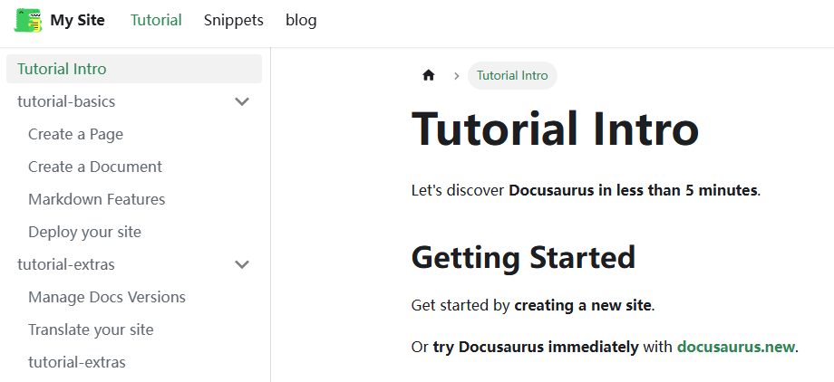

但此时又发现了一个 bug...怎么我的 sidebar root 退化回第一种形式了呢，我页面去哪了

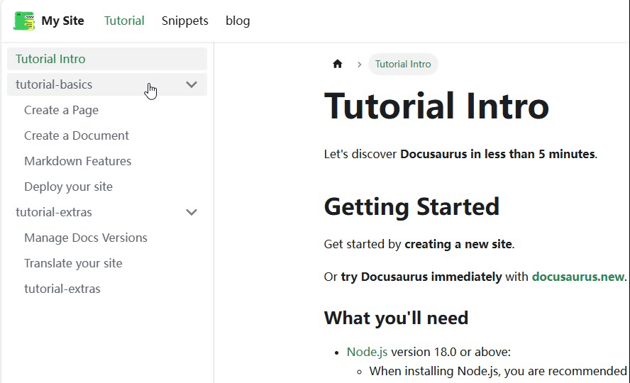

### 不太聪明的 docusaurus

笔者也不知道 why，但好在是想到了一个解决办法，虽然 `_category_.json` 文件没用了，但我可以在 `sidebar.ts` 文件显式给 `category` 加 `link` 呀(显然笔者这时候也没想到，约定俗成的 index.md 那些都会出问题)。但这样就不能用缩写了

```ts showLineNumbers title="sidebar.ts"
  import type { SidebarsConfig } from "@docusaurus/plugin-content-docs";

  const sidebars: SidebarsConfig = {
    tutorialSidebar: [
      "intro",
        // git-remove-next-line
-     {"tutorial-basics": [{ type: "autogenerated", dirName: "tutorial-basics" }]},
      // git-add-start
+     {
+       type: "category",
+       label: "tutorial-basics",
+       items: [{ type: "autogenerated", dirName: "tutorial-basics" }],
+       link: {
+           type: "doc",
+           id: "tutorial-basics/deploy-your-site",
+       },
+     },
      // git-add-end
      {"tutorial-extras": [{ type: "autogenerated", dirName: "tutorial-extras" }]},
    ],
    snippetsSidebar: [{ type: "autogenerated", dirName: "Snippets" }]
  };
  export default sidebars;
```

像上面这样，应该会将 `tutorial-basics/deploy-your-site` 这篇文档作为 `tutorial-basics` 的 root，让我们看一下不太聪明的 docusaurus 给我们的效果:

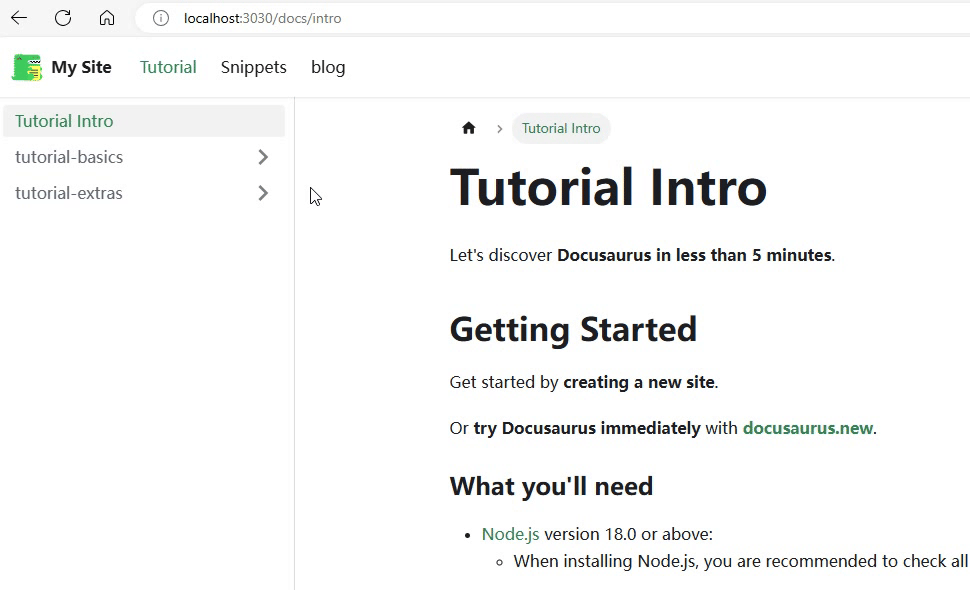

我的评价只有两个字：出院！他同时把这个页面渲染到了子目录，以及 sidebar root，而且两边还是同一个页面...

## 最终解法

到这里，笔者已经被折磨了很久了，把官方的四篇文章读了又读，也看了官方的 `sidebar.ts`，参考一下他们是怎么做的。不知道读者还记不记得，在上文笔者写道，使用 `_category_.json` 给文件夹排序，以及用命名给文件排序的问题。插入一篇新的文档，复杂度为 O(n)。

其实到这里也很明了了，笔者无意中发现，`sidebar.ts/js` 中显式写出来的内容，全部是有序的，会按照你的排序进行渲染，最终解法就是(也是官方和几个博主在用的方法)：**全部显式写出来**

```ts showLineNumbers title="sidebar.ts"
import type { SidebarsConfig } from "@docusaurus/plugin-content-docs";

const sidebars: SidebarsConfig = {
  tutorialSidebar: [
    "intro",
    {
      "tutorial-basics": [
        "create-a-document",
        "create-a-page",
        "markdown-features",
      ],
    },
    {
      "tutorial-extras": ["mamage-docs-versions", "translate-your-site"],
    },
  ],
  snippetsSidebar: [{ type: "autogenerated", dirName: "Snippets" }],
};

export default sidebars;
```

这也是笔者所推荐的方法，首先，对于默认的 doc 内容，全部都手动写出来，而额外加的页面，因为我们可以确定他只有一个根目录(这里的 Sinppets 目录)，使用 `autogenerated` 也没什么问题(而且他是一个新的页面，而不作为一个 sidebar root，那自动生成带来的无 index 问题也不存在)。这种方式几乎没有任何弊端(只要从一开始就使用这种方法，否则写了很多文章之后再改是有点麻烦的)，优点如下：

- 每个 sidebar root 都可以自定义页面
- 每个 sidebar item 都是有序的
- 插入一个新的页面/分类，修改复杂度为 O(1)
- 可以添加任意个分页，而不需要修改其他任何内容

## 后记

_Read the Fucking Manual!_

刚上手 docusaurus 的时候，官方的文档实在是太多了，笔者一知半解就开始了。但渐渐的问题也越来越多，绕了很多弯路，是看完所有文档再开始？还是一边学一边做？怎么取舍效率，也是读者和笔者都需要考虑的问题。谨以此文互勉吧

:::note
文章中有一个单词全程拼写错误，最后才发现，也不太好改，不知道读者发现了没有 😅。找到可以评论区说下
:::

[category metadata]: https://docusaurus.io/docs/sidebar/autogenerated#category-item-metadata
[category-index-convention]: https://docusaurus.io/docs/sidebar/autogenerated#category-index-convention
[sidebar]: https://docusaurus.io/docs/sidebar
[sidebar-assosiation]: https://docusaurus.io/docs/sidebar/multiple-sidebars#sidebar-association
[sidebar item]: https://docusaurus.io/docs/sidebar/items
