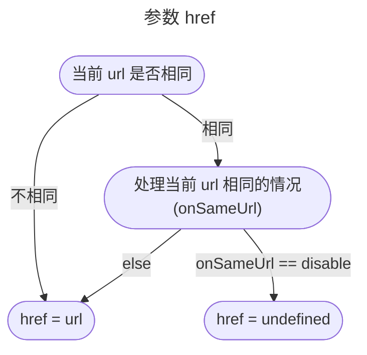
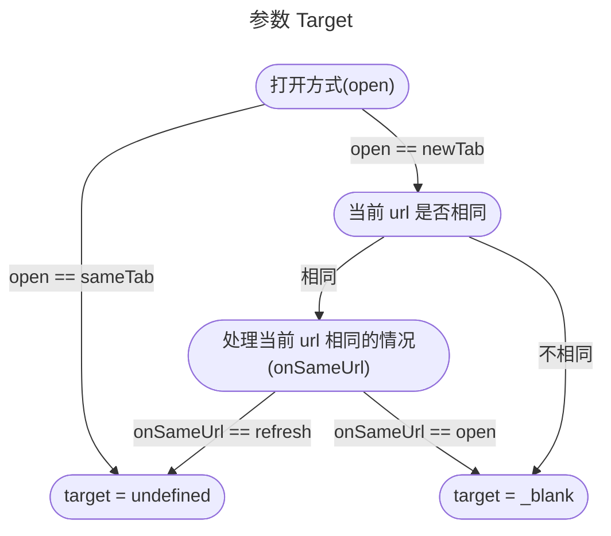

import Link from "@site/src/components/Link/Link";
import Link2 from "./components/Link2";

一个超链接小组件

<div className="tailwind">
  <div className="text-2xl">
    <Link title="这是一个超链接" url="/blog/Link" />
  </div>
</div>

{/* truncate */}

## 缘起

最近想制作一个参考文献的小组件，用于在文末显示所有的参考文献。过程中又想搞一个好看点的超链接小组件，于是就有了本篇

## 实现

### 基础功能

基础功能其实很简单，我们只需要传入一个标题和一个链接，然后渲染一个`<a>`标签即可

```tsx showLineNumbers title="基础功能"
import React from "react";

interface Props {
  title: string;
  url: string;
}

const Link = ({ title, url }: Props) => {
  return (
    <a href={url} target="_blank" rel="noopener noreferrer">
      {title}
    </a>
  );
};

export default Link;
```

### 点击参数

这一部分是修改链接点击时的操作，比如是否打开一个新的标签页，以及当链接和当前 url 相同时的操作等

:::info
Docusaurus 中获取当前 url 的方法可参考[这里](/docs/Server/Docusaurus-FAQ#获取当前-url)
:::

我们需要处理的是 `<a>` 链接的两个参数，`href` 和 `target`，逻辑如下





效果如下：

1.  打开新页面跳转到主页

    <Link2 title="超链接小组件" url="/" /> `<Link2
      title="超链接小组件"
      url="/"
    />`

2.  在当前页面跳转到主页

    <Link2 title="超链接小组件" url="/" open="sameTab" /> `<Link2
      title="超链接小组件"
      url="/"
      open="sameTab"
    />`

3.  在新页面打开本页

    <Link2 title="超链接小组件" url="/blog/Link" onSameUrl="open" /> `<Link2
      title="超链接小组件"
      url="/blog/Link"
      onSameUrl="open"
    />`

4.  关闭链接

    <Link2 title="超链接小组件" url="/blog/Link" onSameUrl="disable" /> `<Link2
      title="超链接小组件"
      url="/blog/Link"
      onSameUrl="disable"
    />`

5.  刷新本页

    <Link2 title="超链接小组件" url="/blog/Link" open="sameTab" /> `<Link2
      title="超链接小组件"
      url="/blog/Link"
      open="sameTab"
    />`

```tsx showLineNumbers title="点击参数"
import { useLocation } from "@docusaurus/router";
import React from "react";

interface Props {
  title: string;
  url: string;
  open?: "newTab" | "sameTab";
  onSameUrl?: "open" | "refresh" | "disable";
}

const Link = ({
  title,
  url,
  open = "newTab",
  onSameUrl = "refresh",
}: Props) => {
  const isSameUrl = useLocation().pathname === url;

  return (
    <a
      href={isSameUrl ? (onSameUrl === "disable" ? undefined : url) : url}
      target={
        open === "newTab"
          ? isSameUrl
            ? onSameUrl === "open"
              ? "_blank"
              : undefined
            : "_blank"
          : undefined
      }
      rel="noopener noreferrer"
    >
      {title}
    </a>
  );
};

export default Link;
```

### 样式

#### 颜色

#### 动态下划线
