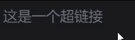
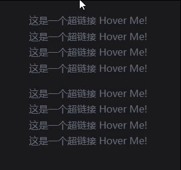
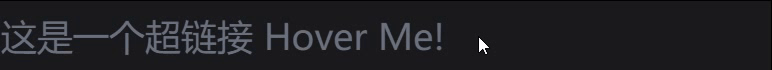

import Link from "@site/src/components/Link/Link";
import Link10 from "./components/Link10";
import Link2 from "./components/Link2";
import Link3 from "./components/Link3";
import Link4 from "./components/Link4";
import Link5 from "./components/Link5";
import Link6 from "./components/Link6";
import Link7 from "./components/Link7";
import Link8 from "./components/Link8";
import Link9 from "./components/Link9";

一个超链接小组件

<div className="tailwind">
  <div className="text-2xl">
    <Link title="这是一个超链接" url="/blog/Link" open="sameTab" />
  </div>
</div>

{/* truncate */}

## 缘起

最近想制作一个参考文献的小组件，用于在文末显示所有的参考文献。过程中又想搞一个好看点的超链接小组件，于是就有了本篇

## 实现

### 基础功能

基础功能其实很简单，我们只需要传入一个标题和一个链接，然后渲染一个`<a>`标签即可

```tsx showLineNumbers title="基础功能"
import React from "react";

interface Props {
  title: string;
  url: string;
}

const Link = ({ title, url }: Props) => {
  return (
    <a href={url} target="_blank" rel="noopener noreferrer">
      {title}
    </a>
  );
};

export default Link;
```

### 点击参数

这一部分是修改链接点击时的操作，比如是否打开一个新的标签页，以及当链接和当前 url 相同时的操作等

:::info
Docusaurus 中获取当前 url 的方法可参考[这里](/docs/Server/Docusaurus-FAQ#获取当前-url)
:::

我们需要处理的是 `<a>` 链接的两个参数，`href` 和 `target`，逻辑如下


效果如下：

1.  打开新页面跳转到主页

    <Link2 title="超链接小组件" url="/" /> `<Link2
      title="超链接小组件"
      url="/"
    />`

2.  在当前页面跳转到主页

    <Link2 title="超链接小组件" url="/" open="sameTab" /> `<Link2
      title="超链接小组件"
      url="/"
      open="sameTab"
    />`

3.  在新页面打开本页

    <Link2 title="超链接小组件" url="/blog/Link" onSameUrl="open" /> `<Link2
      title="超链接小组件"
      url="/blog/Link"
      onSameUrl="open"
    />`

4.  关闭链接

    <Link2 title="超链接小组件" url="/blog/Link" onSameUrl="disable" /> `<Link2
      title="超链接小组件"
      url="/blog/Link"
      onSameUrl="disable"
    />`

5.  刷新本页

    <Link2 title="超链接小组件" url="/blog/Link" open="sameTab" /> `<Link2
      title="超链接小组件"
      url="/blog/Link"
      open="sameTab"
    />`

```tsx showLineNumbers title="点击参数"
import { useLocation } from "@docusaurus/router";
import React from "react";

interface Props {
  title: string;
  url: string;
  open?: "newTab" | "sameTab";
  onSameUrl?: "open" | "refresh" | "disable";
}

const Link = ({
  title,
  url,
  open = "newTab",
  onSameUrl = "refresh",
}: Props) => {
  const isSameUrl = useLocation().pathname === url;

  return (
    <a
      href={isSameUrl ? (onSameUrl === "disable" ? undefined : url) : url}
      target={
        open === "newTab"
          ? isSameUrl
            ? onSameUrl === "open"
              ? "_blank"
              : undefined
            : "_blank"
          : undefined
      }
      rel="noopener noreferrer"
    >
      {title}
    </a>
  );
};

export default Link;
```

## 样式

:::important
若想在你的 docusaurus 网站中使用下面的样式，请先参考[这里](/docs/Server/Docusaurus-Theme)，配置好如下内容

- tailwindcss
- classNames

:::

:::note
由于只演示样式，笔者在下面都关闭了链接的跳转功能(即设置为`onSameUrl="disable"`)
:::

## 颜色

笔者使用了 [tailwindcss](https://tailwindcss.com/docs/customizing-colors) 的颜色来进行演示。这里使用了 useColorMode 钩子来获取当前主题颜色，然后通过 `classNames` 来动态设置颜色，效果如下。会随着主题颜色的变化而变化，并且会在 hover 时改变颜色

<div className="tailwind">
  <div className="text-2xl mb-4">
    <Link3
      title="超链接小组件 Hover Me!"
      url="/blog/Link"
      onSameUrl="disable"
    />
  </div>
</div>

```tsx showLineNumbers title="颜色"
  import { useLocation } from "@docusaurus/router";
  // git-add-start
+ import { useColorMode } from "@docusaurus/theme-common";
+ import classNames from "classnames";
  // git-add-end
  import React from "react";

  interface Props {
    title: string;
    url: string;
    open?: "newTab" | "sameTab";
    onSameUrl?: "open" | "refresh" | "disable";
  }
  // git-add-start
+ const colors = [
+   {
+     main: "text-blue-500",
+     hover: "hover:text-blue-600",
+   },
+   {
+     main: "text-gray-500",
+     hover: "hover:text-gray-400",
+   },
+ ];
  // git-add-end

  const Link = ({
    title,
    url,
    open = "newTab",
    onSameUrl = "refresh",
  }: Props) => {
    // git-add-next-line
+   const color = colors[useColorMode().colorMode === "dark" ? 1 : 0];
    const isSameUrl = useLocation().pathname === url;

    return (
      <a
        // git-add-start
+       className={classNames({
+         "relative inline-block transition-all duration-300 ": true,
+         [color.main]: true,
+         [color.hover]: true,
+       })}
        // git-add-end
        href={isSameUrl ? (onSameUrl === "disable" ? undefined : url) : url}
        target={
          open === "newTab"
            ? isSameUrl
              ? onSameUrl === "open"
                ? "_blank"
                : undefined
              : "_blank"
            : undefined
        }
        rel="noopener noreferrer"
      >
        {title}
      </a>
    );
  };

  export default Link;
```

## 动态下划线

接下来是实现一个动态下划线的效果，效果如下。其特点为，当鼠标进入时，下划线会从左向右画出，而当鼠标离开时，下划线会从右向左擦除



接下来就来一步步讲如何实现

### 1. 添加一个下划线

<div className="tailwind">
  <div className="text-2xl mb-4">
    <Link5 title="这是一个超链接" url="/blog/Link" onSameUrl="disable" />
  </div>
</div>

这一步其实还算比较简单，在之前的组件中，显示 title 的下方加一个 span，添加如下样式即可

```tsx showLineNumbers title="下划线"
  ...
  const colors = [
    {
      main: "text-blue-500",
      hover: "hover:text-blue-700",
      // git-add-next-line
+     underScore: "bg-blue-400",
    },
    {
      main: "text-gray-500",
      hover: "hover:text-gray-400",
      // git-add-next-line
+     underScore: "bg-gray-300",
    },
  ];

  const Link = ({
    ...
  }: Props) => {
    ...

    return (
      <a
        ...
      >
        {title}
        //  git-add-start
+       <span
+         className={classNames({
+           "absolute left-0 bottom-0 h-0.5": true,
+           "w-full": true,
+           [color.underScore]: true,
+         })}
+       />
        //  git-add-end
      </a>
    );
  };
```

:::info
在这里就体现出了使用 `classNames` 这个库的好处，可以更条例的写样式，并且可以很方便的条件渲染样式，在接下来的步骤更会体现出他的优点
:::

### 2. 添加 hover 动画

接下来就是添加在 hover 时的动画效果

<div className="tailwind">
  <div className="text-2xl mb-4">
    <Link6
      title="这是一个超链接 Hover Me!"
      url="/blog/Link"
      onSameUrl="disable"
    />
  </div>
</div>

我们首先添加一个 `hover` 的状态，当鼠标进入时，将 `hover` 设置为 `true`，当鼠标离开时，将 `hover` 设置为 `false`

然后根据 `hover` 的值来决定下划线的宽度，当 `hover` 为 `true` 时，下划线的宽度为 100%，当 `hover` 为 `false` 时，下划线的宽度为 0，再添加一个 `transition-all` 的过渡动画，就可以实现 hover 动画了

```tsx showLineNumbers title="hover 动画"
  ...
  const Link = ({
    ...
  }: Props) => {
    // git-add-next-line
+   const [hover, setHover] = useState(false);
    const color = colors[useColorMode().colorMode === "dark" ? 1 : 0];
    const isSameUrl = useLocation().pathname === url;

    return (
      <a
        ...
        // git-add-start
+       onMouseEnter={() => setHover(true)}
+       onMouseLeave={() => setHover(false)}
        // git-add-end
      >
        {title}
        <span
          className={classNames({
            // git-remove-next-line
-           "absolute left-0 bottom-0 h-0.5": true,
            // git-add-next-line
+           "absolute left-0 bottom-0 h-0.5 transition-all duration-500": true,
            // git-remove-next-line
-           "w-full": true,
            // git-add-next-line
+           "w-full": hover,
            // git-add-next-line
+           "w-0": !hover,
            [color.underScore]: true,
          })}
        />
      </a>
    );
  };
```

但这个效果并不是笔者想要的，笔者想要的是当鼠标离开时，下划线可以从右向左擦除

### 3. 添加擦除动画

我们可以发现，上一步的擦除是从左向右，那我们直接将左对齐改成右对齐试一下。为了方便演示，笔者将两个下划线都添加上去，看一下效果

<div className="tailwind">
  <div className="text-2xl mb-4">
    <Link7
      title="这是一个超链接 Hover Me!"
      url="/blog/Link"
      onSameUrl="disable"
    />
  </div>
</div>

看着似乎不错，我们只要在进入 hover 时，设置为左对齐，离开时，设置为右对齐即可，让我们试一下

<div className="tailwind">
  <div className="text-2xl mb-4">
    <Link8
      title="这是一个超链接 Hover Me!"
      url="/blog/Link"
      onSameUrl="disable"
    />
  </div>
</div>

```tsx showLineNumbers title="擦除动画"
  <span
    className={classNames({
      // git-remove-next-line
-     "absolute left-0 bottom-0 h-0.5 transition-all duration-500": true,
      // git-add-next-line
+     "absolute bottom-0 h-0.5 transition-all duration-500": true,
      // git-remove-next-line
-     "w-full": hover,
      // git-add-next-line
+     "w-full left-0": hover,
      // git-remove-next-line
-     "w-0": !hover,
      // git-add-next-line
+     "w-0 right-0": !hover,
      [color.underScore]: true,
    })}
  />
```

### 4. 优化

到目前已经看着很完美了，但还没达到笔者的预期。读者们可以试一下以下两组超链接的区别，试着用鼠标快速扫过所有链接

<div className="tailwind">
  <div className="mb-4">
    <Link8
      title="这是一个超链接 Hover Me!"
      url="/blog/Link"
      onSameUrl="disable"
    />
    <br />
    <Link8
      title="这是一个超链接 Hover Me!"
      url="/blog/Link"
      onSameUrl="disable"
    />
    <br />
    <Link8
      title="这是一个超链接 Hover Me!"
      url="/blog/Link"
      onSameUrl="disable"
    />
    <br />
    <Link8
      title="这是一个超链接 Hover Me!"
      url="/blog/Link"
      onSameUrl="disable"
    />
  </div>
</div>

<div className="tailwind">
  <div className="mb-4">
    <Link
      title="这是一个超链接 Hover Me!"
      url="/blog/Link"
      onSameUrl="disable"
    />
    <br />
    <Link
      title="这是一个超链接 Hover Me!"
      url="/blog/Link"
      onSameUrl="disable"
    />
    <br />
    <Link
      title="这是一个超链接 Hover Me!"
      url="/blog/Link"
      onSameUrl="disable"
    />
    <br />
    <Link
      title="这是一个超链接 Hover Me!"
      url="/blog/Link"
      onSameUrl="disable"
    />
  </div>
</div>

效果应该如下：



笔者想要的是下面这种效果，即不管是鼠标快速扫过还是悬浮不动，下划线都会先全拉满，再进行下一步的操作。而上一步中的动画，仅仅是检测鼠标是否 hover，当离开 hover 的一瞬间，就会切换到擦除，这样会有一种动画未完成的割裂感

<div className="tailwind">
  <div className="text-2xl mb-4">
    <Link9
      title="这是一个超链接 Hover Me!"
      url="/blog/Link"
      onSameUrl="disable"
    />
  </div>
</div>

其实现方式如下。首先，在 onMouseEnter 中，我们设置 hover 为 true，同时设置一个 500ms(笔者的 span 动画为 500ms) 的定时器。在 onMouseLeave 中，我们先判断 timeoutId 是否存在，如果存在，则说明刚刚的定时器还没跑完(即进入的动画还没完成)，此时我们就等个 300ms，再设置 hover 为 false。如果 timeoutId 不存在，则说明刚刚的定时器已经跑完，此时我们直接设置 hover 为 false 即可。代码如下

```tsx showLineNumbers title="优化动画"
  // git-remove-next-line
- import React, { useRef } from "react";
  // git-add-next-line
+ import React, { useRef, useState } from "react";

  const Link = ({...}: Props) => {
    const [hover, setHover] = useState(false);
    const color = colors[useColorMode().colorMode === "dark" ? 1 : 0];
    const isSameUrl = useLocation().pathname === url;
    // git-add-next-line
+   const timeoutId = useRef<number | null>(null);

    return (
      <a
        ...
        onMouseEnter={() => {
          setHover(true);
          // git-add-start
+         if (timeoutId.current) {
+           clearTimeout(timeoutId.current);
+         }
+         timeoutId.current = window.setTimeout(() => {
+           timeoutId.current = null;
          }, 500);
          // git-add-end
        }}
        onMouseLeave={() => {
          // git-add-start
+         if (timeoutId.current) {
+           clearTimeout(timeoutId.current);
+           timeoutId.current = window.setTimeout(() => setHover(false), 300);
+         } else setHover(false);
          // git-add-end
        }}
      >
      ...
      </a>
    );
  };
```

### 5. 更有甚者

其实到上一步已经差不多了，但无奈笔者有点强迫症，又发现了一点不太舒服的地方。读者可以再试试下面两个超链接，看下划线有什么不同

<div className="tailwind">
  <div className="text-2xl mb-4">
    <Link9
      title="这是一个超链接 Hover Me!"
      url="/blog/Link"
      onSameUrl="disable"
    />
  </div>
  <div className="text-2xl mb-4">
    <Link
      title="这是一个超链接 Hover Me!"
      url="/blog/Link"
      onSameUrl="disable"
    />
  </div>
</div>

答案揭晓，上一步做出的效果中，假如用户在下划线擦除的过程中，又进入到了 hover 状态，那么会直接打断施法，直接进入下划线拉满的状态...。而下面优化过的版本是，在这种情况下，会直接开一个新的动画，且对上一个的擦除也没有影响，即可能存在一边擦除，一边在画下划线的情况

旧：


新：



笔者只能说，这是一个很细的东西，其实不去管他也无妨。但这里还是给出笔者的解决方案，下面把动画放慢，并切换一下颜色，相信聪明的读者就能看出来是怎么实现的了

<div className="tailwind">
  <div className="text-2xl mb-4">
    <Link10
      title="这是一个超链接 Hover Me!"
      url="/blog/Link"
      onSameUrl="disable"
    />
  </div>
</div>

其实就是把原来的一个 `<span>` 拆成了两个，一个负责画下划线，一个负责擦除下划线。而两个动画的逻辑，才是需要着重考虑的，这里笔者直接给出代码，有兴趣的读者可以自行研究

<details >

<summary>最终优化</summary>

```tsx showLineNumbers title="最终优化"
import { useLocation } from "@docusaurus/router";
import { useColorMode } from "@docusaurus/theme-common";
import classNames from "classnames";
import React, { useRef, useState } from "react";

interface Props {
  title: string;
  url: string;
  open?: "newTab" | "sameTab";
  onSameUrl?: "open" | "refresh" | "disable";
}

const colors = [
  {
    main: "text-blue-500",
    hover: "hover:text-blue-700",
    underScore: "bg-blue-400",
  },
  {
    main: "text-gray-500",
    hover: "hover:text-gray-400",
    underScore: "bg-gray-300",
  },
];

const Link = ({
  title,
  url,
  open = "newTab",
  onSameUrl = "refresh",
}: Props) => {
  const [hover, setHover] = useState(false);
  const [leaving, setLeaving] = useState(true);
  const timeoutId = useRef<number | null>(null);
  const color = colors[useColorMode().colorMode === "dark" ? 1 : 0];
  const isSameUrl = useLocation().pathname === url;

  return (
    <a
      href={isSameUrl ? (onSameUrl === "disable" ? undefined : url) : url}
      className={classNames({
        "relative inline-block transition-all duration-300 ": true,
        [color.main]: true,
        [color.hover]: true,
      })}
      onMouseEnter={() => {
        setHover(true);
        if (timeoutId.current) {
          clearTimeout(timeoutId.current);
        }
        timeoutId.current = window.setTimeout(() => {
          timeoutId.current = null;
          setLeaving(false);
        }, 500);
      }}
      onMouseLeave={() => {
        if (timeoutId.current) {
          clearTimeout(timeoutId.current);
          timeoutId.current = window.setTimeout(() => {
            setHover(false);
            setLeaving(false);
          }, 300);
          window.setTimeout(() => {
            setLeaving(true);
          }, 350);
        } else {
          setHover(false);
          setLeaving(true);
        }
      }}
      target={
        open === "newTab"
          ? isSameUrl
            ? onSameUrl === "open"
              ? "_blank"
              : undefined
            : "_blank"
          : undefined
      }
      rel="noopener noreferrer"
    >
      {title}

      <span
        className={classNames({
          "absolute right-0 bottom-0 h-0.5 ": true,
          [color.underScore]: true,
          "w-0 transition-all duration-500": leaving,
          "w-full": !leaving,
        })}
      />
      <span
        className={classNames({
          "absolute left-0 bottom-0 h-0.5": true,
          [color.underScore]: true,
          "w-full transition-all duration-500": hover,
          "w-0": !hover,
        })}
      />
    </a>
  );
};

export default Link;
```

</details>

这里有一个比较有意思的点要提一下，通过把 `transition-all duration-500` 从总是 `true`，切换到 `hover` 下，我们就实现了在鼠标进入的时候，会有过渡效果，而在鼠标离开的时候，没有过渡效果(瞬间消失)。而擦除的效果则是反过来，这个使用 `classNames` 和样式的技巧，在其他地方或许也可以用到

```tsx showLineNumbers
  <span
    className={classNames({
      // git-remove-next-line
-     "absolute left-0 bottom-0 h-0.5 transition-all duration-500": true,
      // git-add-next-line
+     "absolute left-0 bottom-0 h-0.5": true,
      // git-remove-next-line
-     "w-full ": hover,
      // git-add-next-line
+     "w-full transition-all duration-500": hover,
      [color.underScore]: true,
      "w-0": !hover,
    })}
  />
```
