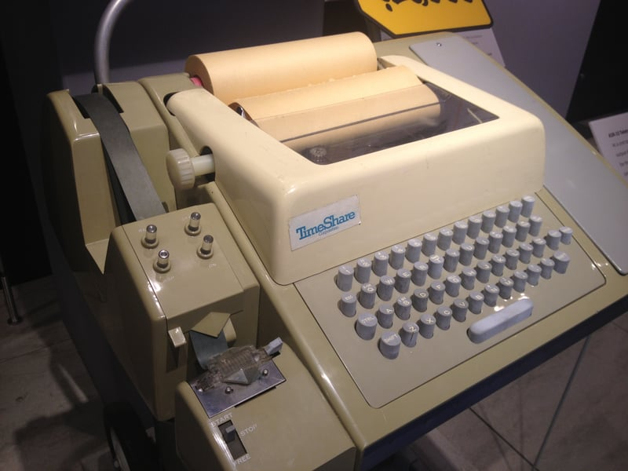

import { RoughNotation } from "react-rough-notation";
import GoToComment from "@site/src/components/Comment/GoToComment"

shell, console, <RoughNotation type="box" show={true} color="#FFA500" strokeWidth={2} animationDelay={0} >tty</RoughNotation>, pty, terminal

&, <RoughNotation type="box" show={true} color="#4169E1" strokeWidth={2} animationDelay={1000} >nohup</RoughNotation>, screen, disown

详解这依托东西的区别与联系，以及 Liunx 中让人头大的**后台运行**

<!-- truncate -->

## 缘起

最近的一个任务中遇到的需求如下:

1. ssh 连接到 linux 服务器上运行某个压力测试脚本
2. 需要在 ssh 断开后继续运行脚本
3. 运行的结果也需要获取，存到文件中即可
4. 该服务器没有 screen, 且无法连接至互联网

之前在 [Screen] 这篇中，讲到了类似的问题。当时是在自己的 web 服务器中运行多个项目，进行管理。但现在的需求不太一样，而且也不太好安 Screen。在寻找解决方法时也学到了一些新的东西，记录一下

:::tip
本篇包含的内容，并不一定都是"正确的"，有部分为笔者对其的理解，可能存在偏差。旨在扫盲与抛砖引玉，有任何问题也可在下方<GoToComment text="评论区"/>留言
:::

很多东西其实都是随着时代改变而淡化了原意，就像现在的孩子没见过座机，就不理解为什么大人用手比划电话时，是在耳朵旁比个 6

## 从 Terminal 开始

Terminal 在牛津字典中一条解释如下:

> terminal _noun_ [C] (COMPUTER)
>
> a piece of equipment consisting of a keyboard and screen, used for communicating with the part of a computer system that deals with information
>
> 由键盘和屏幕组成的设备，用于和计算机系统中处理信息的部分通信

正如上面的翻译所说，在计算机刚出现的年代，Terminal 其实就代表计算机的**物理** I/O 设备，即键盘(输入)、显示器(输出)。当然，早期的时候显示方式还是打印到纸上，当时的这种商业化产品就叫做 Teletypewriter(电传打字机)，也就是我们下文会讲到的 TTY

电传打字机

## 总结

|                        | &              | nohup                      | screen                     | disown         |
| :--------------------- | -------------- | -------------------------- | -------------------------- | -------------- |
| 是否与 TTY 关联        | √              | ×                          | √(虚拟终端)                | ×              |
| 终端关闭后进程是否终止 | √              | ×                          | ×                          | ×              |
| 输入输出               | 仍然连接到 TTY | 输入关闭，输出重定向到文件 | 仍然连接到虚拟终端         | 仍然连接到 TTY |
| 是否需要额外操作       | ×              | 需要结合 &                 | 需要手动管理会话           | 需要先使用 &   |
| 是否支持多任务管理     | ×              | ×                          | √                          | ×              |
| **适用场景**           | 临时后台任务   | 长期运行的任务             | 长期运行的任务; 多任务管理 | 长期运行的任务 |

## 后记

[Screen]: /docs/Server/Screen
