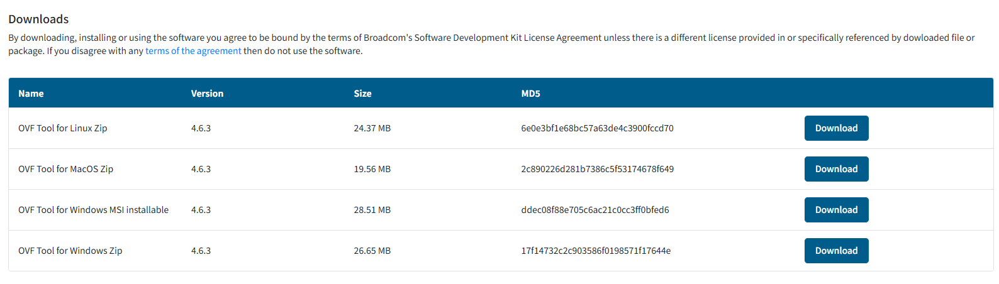
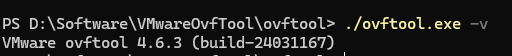

import Terminal1 from "./components/Terminal1";
import Terminal2 from "./components/Terminal2";
import Terminal3 from "./components/Terminal3";
import Terminal4 from "./components/Terminal4";

# VMware ESXI 虚拟机导出

在 ESXI web 页面导出较大虚拟机时，可能由于网络问题等多种原因，导致导出失败，耗时耗力。本篇介绍另一种成功率较高的方法

<!--truncate-->

## 通过 ESXI 命令行导出

首先在[这里](https://developer.broadcom.com/tools/open-virtualization-format-ovf-tool/latest)下载自己操作系统对应的 ovftool



下载安装完成后，进入到 ovftool.exe 所在目录，用终端打开(或者打开命令行，cd 到该目录也 ok)

使用 `./ovftool.exe -v` 查看安装是否完成



### 列出虚拟机

ESXI 命令行的 url 格式如下

```bash
vi://<user>:<password>@[ip]/<vm>
```

最前面的 `vi` 是 vmware 的协议名，尖括号中的都是可选参数，如果没有在 url 中指定用户名和密码，会在执行命令时弹出输入，下面给出几个例子

```bash
vi://192.168.0.1
vi://root:password@192.168.0.1
vi://root:password@192.168.0.1/vm1
```

当你的用户名或密码中有特殊字符时，可能导致 url 解析错误，有两种解决办法。一个是 url 编码，另一种是在弹出的输入框中输入，比如:

密码为 `pass@word`, 就可以编码为 `vi://root:pass%40word@192.168.0.1/vm1`。当然，在弹出的输入框中输入还是更简单的

:::important
当不指定 vm 时，会列出所有的虚拟机
:::


<Terminal1 />

### 查看虚拟机信息

当你知道要导出的虚拟机名字后，**要先去 web 页面关掉虚拟机**

使用 `./ovftool.exe vi://root:password@192.168.0.1/vm1` 先查看虚拟机信息。如果没问题再导出。下面这种情况就是虚拟机没关

<Terminal2 />

关掉之后，再次执行，虚拟机信息如下：

<details>

<summary>虚拟机信息</summary>

<Terminal3 />

</details>

### 导出虚拟机

至此，虚拟机已经准备好到处。导出的命令格式如下

```bash
./ovftool.exe url filedir
```

其实就是上一步查看虚拟机信息的命令，后面加一个要导出的目录，例如

```bash
./ovftool.exe vi://root:password@192.168.0.1/vm1 ./export
```

该命令就会将 vm1 导出到当前目录下的 export 文件夹中，慢慢等待即可，最终效果如下

<Terminal4 />