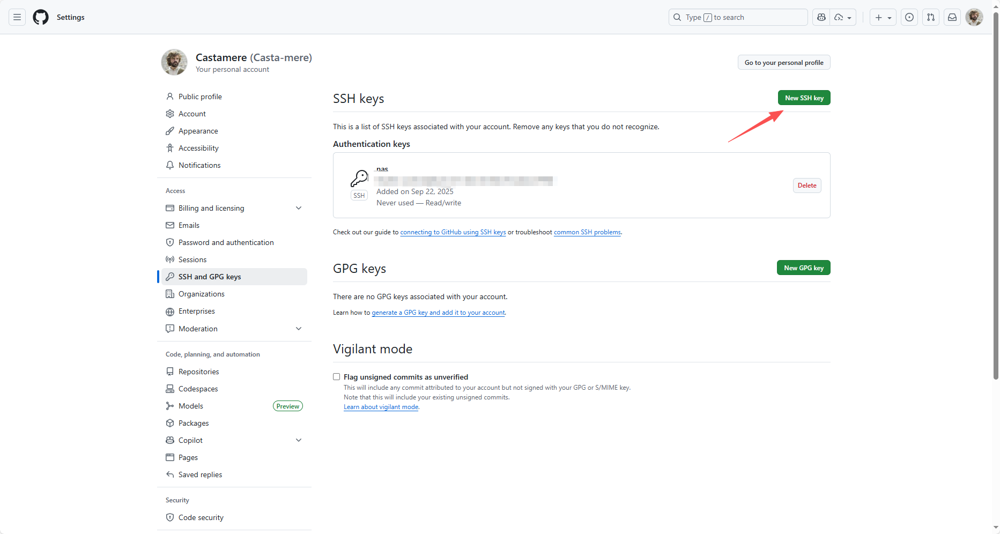

记录一些常用的 Git 和 Github 操作

<!--truncate-->

# Git & Github

## Tag

使用 Git 的 `tag` 和 Github Actions 可以形成很好的自动化

```bash
git tag Vx.x.x
git push origin Vx.x.x
```

如果部署出现问题可以用下面的命令来撤回

```bash
git tag -d Vx.x.x
git push origin :refs/tags/V0.2
```

## Github 回滚

如果 Github 上出现某些误操作，导致历史记录变乱，可以通过以下方式来"回滚"

首先把代码拉到本地，然后使用 `git reset --hard <commit_hash>` 在本地回滚

再使用 `git push origin <branch_name> --force` 推送

## SSH 连接 Github

1. 先在本机生成 ssh key

```bash
cd ~/.ssh
ssh-keygen -t ed25519 -C "castamerego@gmail.com" # 换成你的邮箱
```

会生成 `id_ed25519` 和 `id_ed25519.pub` 两个文件，复制下来 `id_ed25519.pub` 的内容

2. 登录 [Github Settings - SSH and GPG keys](https://github.com/settings/keys)

点击 "New SSH key"，把刚才复制的内容粘贴进去，保存



3. 在本机修改 `~/.ssh/config` 文件

```
Host github.com
    User git
    IdentityFile ~/.ssh/id_ed25519  
```

### 测试连接

```bash
ssh -T git@github.com
```

### FAQ

#### 连接超时

若超时可能是 dns 问题，可以直接把 ip 加到 `/etc/hosts` 里

```
Host github.com
    HostName 20.205.243.166
    User git
    IdentityFile ~/.ssh/id_ed25519
```

#### 切换现有库的 remote URL

```bash
git remote set-url origin git@github.com:Casta-mere/repo-name.git
```