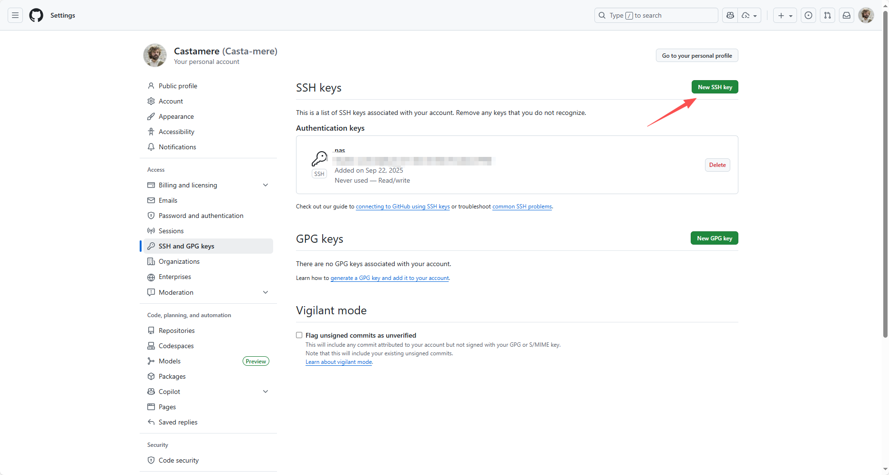

记录一些常用的 Git 和 Github 操作

<!--truncate-->

# Git & Github

## Git 常用命令

```bash
git checkout -b new-branch # 创建并切换到新分支 
```

## Git Rebase

> rebasing is the process of moving or combining a sequence of commits to a new base commit

在工作中常遇到的一个场景是：我们在某个分支上创建了一个分支，在经过几天的修改、commit 后，发现原分支上已经有了新的 commit。此时我们想保持工作环境整洁，以及确保用的是最新的代码，就会用到 `git rebase`，来看下面这个例子

在 `main` 分支中，我们在 C2 commit 后创建了新分支 `feature`，在 `feature` 分支上又做了两个 commit F1 和 F2。此时，我们想让我们的分支也和 main 分支保持最新，就可以在 `feature` 分支上执行 `git rebase main`，这样就会把 F1 和 F2 这两个 commit 移动到 C4 后面，保持了提交历史的整洁



在 `rebase` 之后，你会发现你的 commit hash 发生了变化(上图 F1 和 F2 变成了 F1' 和 F2')，也就是说 `rebase` 是通过创建新的 commit 来实现的。这也导致了一个问题：如果你的分支已经 `push` 到远程的话，那么本地和远程就会有冲突，此时使用下面的命令来强制推送

```bash
git push --force-with-lease
```

## Tag

使用 Git 的 `tag` 和 Github Actions 可以形成很好的自动化

```bash
git tag Vx.x.x
git push origin Vx.x.x
```

如果部署出现问题可以用下面的命令来撤回

```bash
git tag -d Vx.x.x
git push origin :refs/tags/Vx.x.x
```

## Github 回滚

如果 Github 上出现某些误操作，导致历史记录变乱，可以通过以下方式来"回滚"

首先把代码拉到本地，然后使用 `git reset --hard <commit_hash>` 在本地回滚

再使用 `git push origin <branch_name> --force` 推送

## SSH 连接 Github

1. 先在本机生成 ssh key

```bash
cd ~/.ssh
ssh-keygen -t ed25519 -C "castamerego@gmail.com" # 换成你的邮箱
```

会生成 `id_ed25519` 和 `id_ed25519.pub` 两个文件，复制下来 `id_ed25519.pub` 的内容

2. 登录 [Github Settings - SSH and GPG keys](https://github.com/settings/keys)

点击 "New SSH key"，把刚才复制的内容粘贴进去，保存



3. 在本机修改 `~/.ssh/config` 文件

```
Host github.com
    User git
    IdentityFile ~/.ssh/id_ed25519  
```

### 测试连接

```bash
ssh -T git@github.com
```

### FAQ

#### 连接超时

若超时可能是 dns 问题，可以直接把 ip 加到 `/etc/hosts` 里

```
Host github.com
    HostName 20.205.243.166
    User git
    IdentityFile ~/.ssh/id_ed25519
```

#### 切换现有库的 remote URL

```bash
git remote set-url origin git@github.com:Casta-mere/repo-name.git
```

## Cherry-pick

Cherry-pick 是 Git 中一个非常有用的命令，可以将特定的提交从一个分支应用到另一个分支，而不需要合并整个分支。这对于修复错误、引入特定功能或在**不同分支之间共享代码**非常有帮助

遇到的一个场景是：在某个分支上创建了一个新的分支，在新分支上做了一些修改后，发现原有分支已经有了新的提交，并且已经合并了。在代码不冲突的情况下，我们可以这样做：

```bash
git checkout original-branch
git branch new-branch
git checkout new-branch
git cherry-pick <commit-hash>
``` 