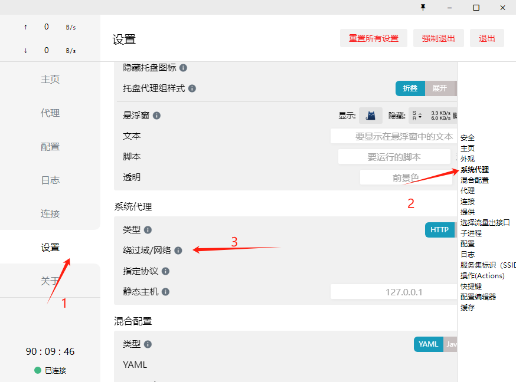

Clash 配置特定网站不走代理

<!--truncate-->

# Clash 配置特定网站不走代理

## 配置方式



## 配置内容

在最下方添加新的匹配规则，支持通配符，如任何以 `zhihu.com` 结尾的网站

```yml
bypass:
  - localhost
  - 127.*
  ...
  - 192.168.*
  - <local>
  - zhihu.com
  - "*.zhihu.com"
  - baidu.com
  - "*.baidu.com"
```

## 国内常用

:::tip
有一些是网站不支持代理，有一些是不加代理会快一些
:::

```yml
  - zhihu.com
  - "*.zhihu.com"
  - baidu.com
  - "*.baidu.com"
  - bilibili.com
  - "*.bilibili.com"
```