# fzf

fzf (fuzzy finder) 是一个**命令行模糊查找工具**。这是一个很强大的工具，发挥你的想象力，和我一起探索 fzf


目前搞定了以下有趣的功能:

- [选择并进入 Docker 容器](/blog/fzf#选择并进入容器)
- [选择并删除 Docker 容器](/blog/fzf#选择并删除容器)
- [grep 并预览结果](/blog/fzf#grep)
- [查看并杀死进程](/blog/fzf#进程)
- [进入 Conda 环境](/blog/fzf#进入-conda-环境)
- [搜索 Conda 环境](/blog/fzf#搜索-conda-环境)

<!--truncate-->

:::tip
若有新功能建议，欢迎在 [GitHub](https://github.com/Casta-mere/fzf_scripts/issues) 提交 issue
:::

import Terminal1 from "./components/Terminal1";
import Terminal2 from "./components/Terminal2";
import Terminal3 from "./components/Terminal3";

:::important 重要
笔者使用的 `fzf` 的版本为 `0.62.0 (d226d841)`，不同的版本可能有所差异
:::

## 缘起

起因是在冲浪时看到了这样一个可视化命令行的轻量软件，当时还没意识到 `fzf` 有多么强大，包含了可视化、高效搜索、预览等功能。一边看发行说明，一边觉得可以有好多有趣的应用，遂研究

读者可以全篇读一遍，再去[一键配置](/blog/fzf#一键配置)进行安装

## 安装 fzf

建议直接去 github 下载安装，点击[链接](https://github.com/junegunn/fzf/releases)直达 release

Linux 下的包管理器中的版本都很旧。笔者建议用 `uname --all` 查看系统信息，去 github 下载对应版本

下载完成后，上传到服务器，解压。将 fzf 复制到 `/usr/bin` 目录下

### Linux

```bash
tar -xzf xxx.tar
cp fzf /usr/bin
```

## fzf 入门

安装好 `fzf` 之后，直接在终端输入 `fzf`，可以看到，`fzf` 会自动将该目录下的所有文件及子文件夹下的文件递归列出来，并转为一个**可以选择**的列表


这个工具的功能很强大，笔者暂时无法完全进行详解，仅带各位入门。笔者将分为四部分来介绍 `fzf` 的基本功能: **输入**、**搜索**、**预览**、**输出**

`fzf` 对于初学者来说比较乱的一点是：它有**两个**输入和**两个**输出


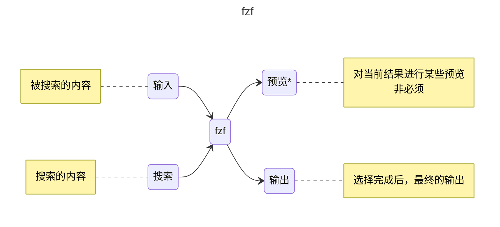

可能看起来比较复杂，笔者来逐一介绍

### 输入

这里的"输入"，就是被搜索的内容。我们一般通过管道来输入到 `fzf`，比如这里我们演示，从所有进程中进行搜索

:::important 重要
为了方便演示，笔者这里就只用最简单的命令，避免输出过长影响效果
:::

这里可以看到，将 `ps` 的输出通过管道传递给 `fzf`，就可以进行选择

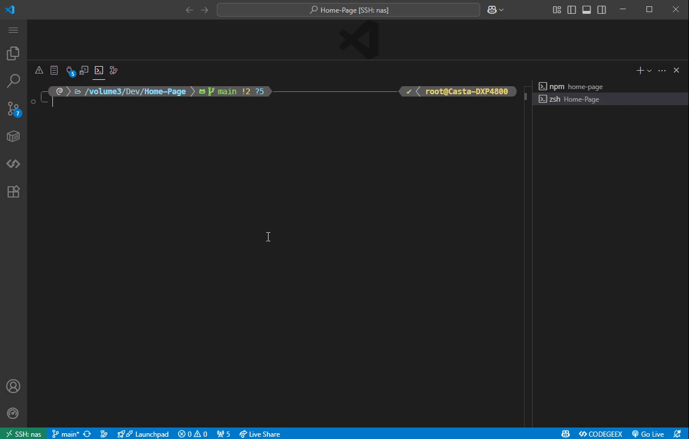

但存在以下几个常见问题。首先我们对比一下单独执行 `ps`(左) 和通过管道传递给 `fzf`(右) 的效果

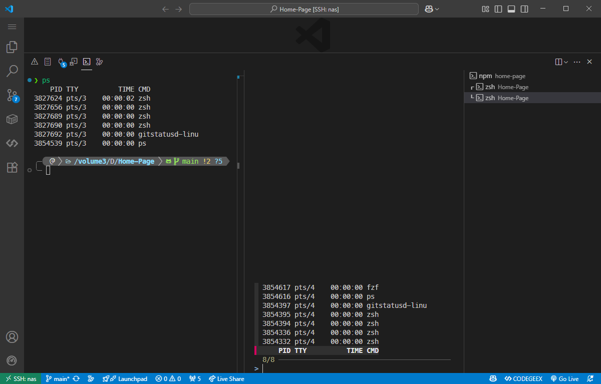

先忽略 `tty` 和 `pid` 的不同，不难发现，`fzf` 的输入输出是类栈的，即先进后出，顺序是反的。这样的设计应该是为了在行数较多时，更好的显示和选择，但在需要关注顺序时，就会有些麻烦

我们可以通过添加 `--reverse` 参数来反转顺序，注意该参数会将输入行改到最上方

左边为 `ps | fzf --reverse`，右边为 `ps | fzf`

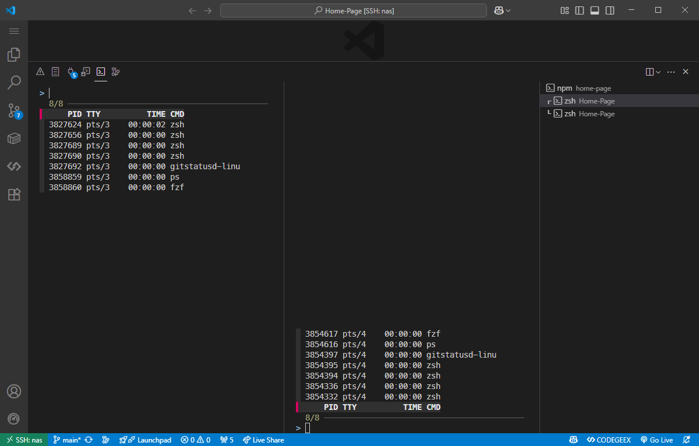

第二个问题是，回看上面的图片，`ps` 输出是一个表格，我们明显不想让表头也成为被搜索的一部分。一方面，可能造成歧义，另一方面，当搜索内容列表过长时，在翻到下面的时候，就看不到表头了

我们可以通过添加 `--header-lines=` 参数来指定表头的行数

可以测试一下 `ps -aux | fzf --reverse --header-lines=1` 的效果


可以看到，表头是无法被选中的，而且在滚动时也不会消失

`--header-lines=` 是指定**前 n 行**作为表头，在某些需求下会有奇效

### 搜索

搜索，就类似你 grep 的内容，从上面的输入中进行匹配

这里偷个懒，引用一下[官方](https://junegunn.github.io/fzf/search-syntax/)给出的搜索逻辑，类似正则规则

- `'`: 精确匹配
- `^`: 开头
- `$`: 结尾
- `!`: 否
- `|`: 或

| Token   | 匹配类型         | 描述                                       |
| ------- | ---------------- | ------------------------------------------ |
| sbtrkt  | 模糊匹配         | 包含 sbtrkt 字符，并且**字符出现顺序一致** |
| 'wild   | 精确匹配         | 包含单词 wild（非单词边界也匹配）          |
| 'wild'  | 边界精确匹配     | 包含完整单词 wild，要求单词边界匹配        |
| ^music  | 前缀精确匹配     | 以 music 开头的项                          |
| .mp3$   | 后缀精确匹配     | 以 .mp3 结尾的项                           |
| !fire   | 反向精确匹配     | 不包含 fire 的项                           |
| !^music | 反向前缀精确匹配 | 不以 music 开头的项                        |
| !.mp3$  | 反向后缀精确匹配 | 不以 .mp3 结尾的项                         |

比较常用的就是加 `'` 进行精确匹配，下图就是一个例子

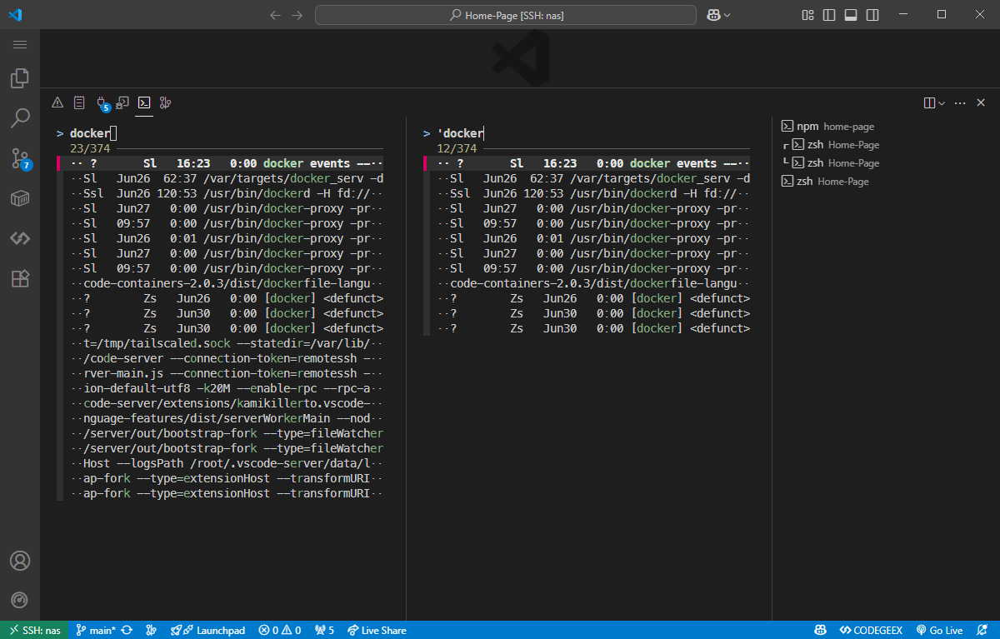

当需要多个匹配条件时，空格隔开即可; 如果是要 `or` 逻辑的话，就用 `|` 隔开

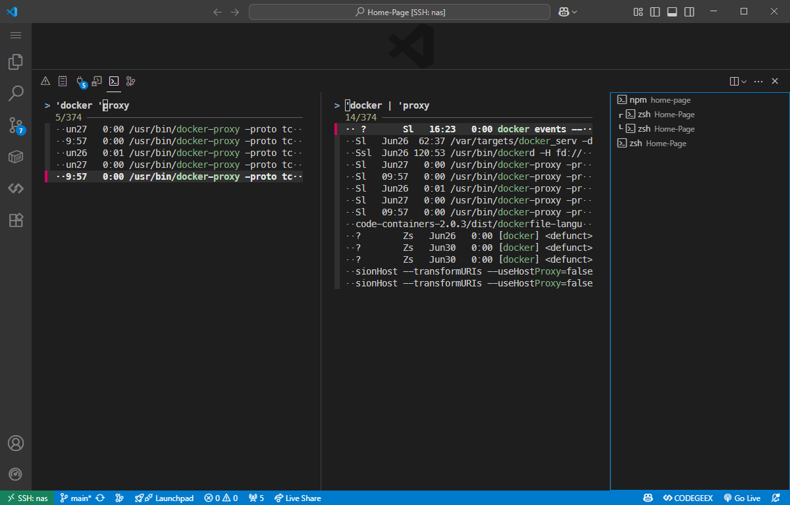

### 预览

`fzf` 另一个强大的功能就是预览，也正是这个预览，可以让我们玩出很多花样来

这个**预览**，就是对**当前选中**的选项，进行某些操作。比如这样的一个需求：我们想要选择一个文件，在预览中查看该文件的内容，就可以用下面的命令

```bash
fzf --preview="cat {}"
```

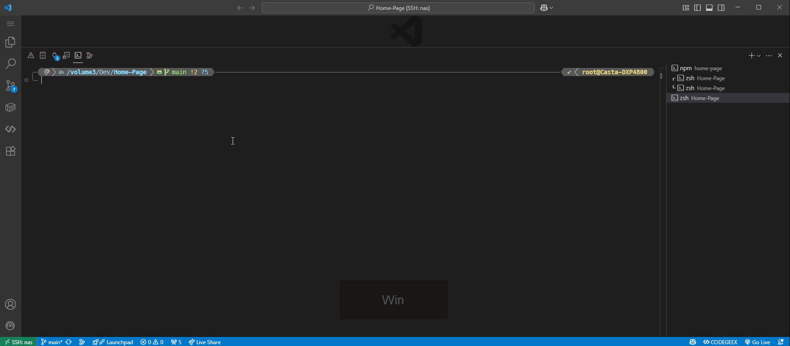

这里的 `batcat` 是一个类似 `cat` 的命令，对代码高亮有更好的支持

接下来重点讲解一下预览的语法

`--preview` 后面是一个命令，其中的 `{}` 是一个占位符，会替换为当前选中的选项。比如上面的演示中，选中的是文件名，就会被替换为类似 `cat /path/to/file` 的命令。然后将这个输出显示在预览框里

需要注意的是，这个命令可以是一个很完整的 sh 命令或脚本，这就给了我们很高的可玩性，下面我用一个例子抛个砖

```bash showLineNumbers title="fzf preview"
docker ps | fzf \
  --header-lines=1 \
  --preview="echo {} | awk '{print \$1}' | xargs docker logs -n 100"
```

:::tip
这里还有一种更简单的方法，`--preview="docker logs {1}"` 在后面会继续讲
:::

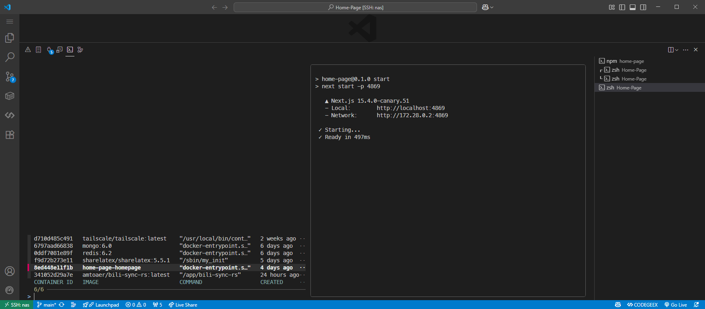

这个命令的作用是，列出所有的 docker 容器，并在预览中显示该容器的日志。这里的 `{}` 会被替换为选中的容器信息，然后通过 `awk` 提取出容器 ID，再通过 `xargs` 将其传递给 `docker logs` 命令，最后显示最近 100 行日志

这只是一个很简陋的例子，还有很多可以优化的点，但也不难看出，可玩性真的很高，下面笔者列几个很常见的点

- 预览样式: 在[这里](https://junegunn.github.io/fzf/releases/0.58.0/)可以找到有关预览的边框，间隔，颜色等内容
- 跳转预览行数: 在预览时，我们有时会想初始直接跳转到某一行，比如在集成 grep 时，自动跳转到 grep 到的那行；或者在显示日志时，直接跳转到末尾

```bash
--preview-window=follow # 跳转到末尾
--preview-window=+100 # 跳转到第 100 行
```

- 修改预览窗口位置与比例

```bash showLineNumbers
--preview-window=right:60% # 预览窗口在右面，占整个界面 60%
--preview-window=down:50% # 预览窗口在下面，占整个界面 50%

# preview window help 中的其他选项
PREVIEW WINDOW
  --preview=COMMAND        Command to preview highlighted line ({})
  --preview-window=OPT     Preview window layout (default: right:50%)
                            [up|down|left|right][,SIZE[%]]
                            [,[no]wrap][,[no]cycle][,[no]follow][,[no]info]
                            [,[no]hidden][,border-STYLE]
                            [,+SCROLL[OFFSETS][/DENOM]][,~HEADER_LINES]
                            [,default][,<SIZE_THRESHOLD(ALTERNATIVE_LAYOUT)]
  --preview-border[=STYLE] Short for --preview-window=border-STYLE
                            [rounded|sharp|bold|block|thinblock|double|horizontal|vertical|
                            top|bottom|left|right|line|none] (default: rounded)
  --preview-label=LABEL
  --preview-label-pos=N    Same as --border-label and --border-label-pos,
                            but for preview window
```

:::important 重要
使用 `fzf --help` 查看更多参数
:::

### 输出

最后就来到了我们的输出，默认的输出就是你选中的内容，比如选中 `docker ps` 的结果:

<Terminal1 />

但我们可能只想要某一项，用于后续操作。当然，我们可以用管道 + `awk` 来实现，但 `fzf` 给了我们一个更简单的解决办法 `--accept-nth <n>` ，可以让我们选择输出第几项，默认用空格隔开，比如:

<Terminal2 />

只输出了容器的 ID，我们就可以进行后续的操作，比如: 选择容器 -> 删除容器

```bash
docker ps | fzf --accept-nth 1 | xargs docker rm 
```

上文我们有讲到，在 `preview` 中，可以通过 `{}` 或 `{n}` 来获取选择的整行，或者某项。同样也是默认用空格隔开，比如

```bash showLineNumbers title="fzf preview"
docker ps | fzf \
  --header-lines=1 \
  --preview="docker logs -n 100 {1}"
```

我们把刚刚的两步结合起来，就可以实现: 选择容器(选择时预览容器日志) -> 删除容器

```bash
docker ps | fzf \
  --accept-nth 1 \
  --header-lines=1 \
  --preview="docker logs -n 100 {1}" \
  | xargs docker rm 
```

但有时候可能不是空格隔开的内容

<Terminal3 />

可以看到，`grep` 的输出是由 `:` 分隔的，每一项分别是: 文件名、行号、内容。其中的每一项我们都可以用到，具体在下面的[grep 并预览结果](/blog/fzf#grep)会讲。这里主要关注如何使用 `:` 作为分隔符

我们可以添加 `--delimiter ':'` 参数来指定分隔符。注意这样过后，不论是在 `--preview` 中使用 `{1}` 还是在 `--accept-nth 2` 中，都是按照 `:` 作为分隔符，有时可能造成混淆

## Docker

目前 Docker 实现了如下功能

:::important 重要
可以跳转到[一键配置](/blog/fzf#一键配置)进行安装，下面内容只做演示，不需要一个一个复制
:::

### 从所有容器中选择

从所有容器中选择，并可以预览最后 100 行日志，输出为容器 ID


<details>
  <summary>完整代码</summary>

```bash showLineNumbers title="从所有容器中选择"
ContainerAll () {
    # choose from all containers
    local header=$'NAME\tCONTAINER ID\tIMAGE\tSTATUS'
    local data combined selected preview_lines
    data=$(docker ps -a --format '{{.Names}}|{{.ID}}|{{.Image}}|{{.Status}}' | \
        awk -F'|' '{
            name = length($1) > 20 ? substr($1, 1, 17) "..." : $1;
            printf "%-20s\t%s\t%s\t%s\n", name, $2, $3, $4
        }')
    combined="$header"$'\n'"$data"
    formatted=$(echo "$combined" | column -t -s $'\t')

    preview_lines=100

    selected=$(echo "$formatted"| fzf \
        --reverse \
        --height 80% \
        --header-lines="1" \
        --preview-label="🐳 Preview" \
        --preview="docker logs -n $preview_lines {1}" \
        --preview-window=follow\
        --accept-nth=2 
    )

    echo $selected 
}
```

</details>

### 从所有运行容器中选择

从所有运行容器中选择，并可以预览最后 100 行日志，输出为容器 ID，可以用于衔接进入容器，或 `inspect` 容器

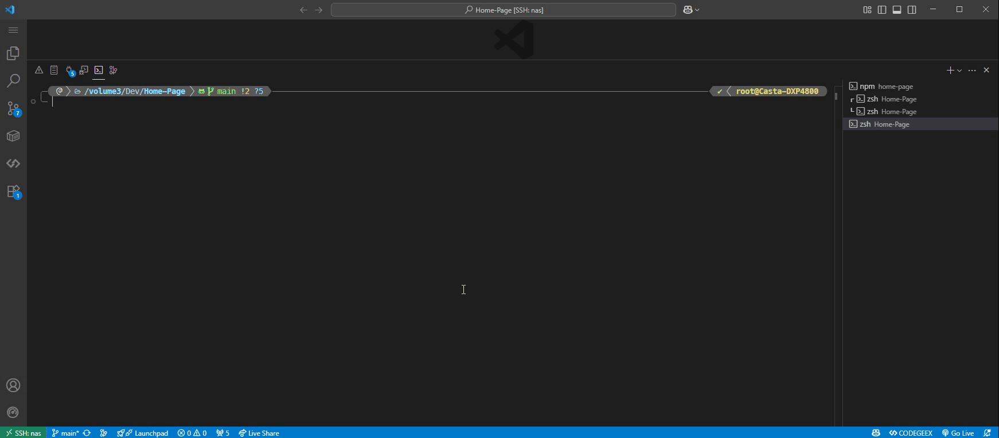

<details>
  <summary>完整代码</summary>

```bash showLineNumbers title="从所有运行容器中选择"
ContainerUP () {
    # choose from all up containers
    local header=$'NAME\tCONTAINER ID\tIMAGE\tSTATUS'
    local data exited running combined selected
    data=$(docker ps -a --format '{{.Names}}|{{.ID}}|{{.Image}}|{{.Status}}' | \
        awk -F'|' '{
            name = length($1) > 20 ? substr($1, 1, 17) "..." : $1;
            printf "%-20s\t%s\t%s\t%s\n", name, $2, $3, $4
        }')
    exited=$(echo "$data" | awk -F'\t' '$4 ~ /^Exited/ { print }')
    running=$(echo "$data" | awk -F'\t' '$4 !~ /^Exited/ { print }')
    combined="$header"$'\n'"$exited"$'\n'"$running"
    formatted=$(echo "$combined" | column -t -s $'\t')

    preview_lines=100
    exited_count=$(echo "$exited" | grep -c '^')

    selected=$(echo "$formatted"| fzf \
        --reverse \
        --height 80% \
        --header-lines=$((1 + exited_count)) \
        --preview-label="🐳 Preview" \
        --preview="docker logs -n $preview_lines {1}" \
        --preview-window=follow\
        --accept-nth=2 
    )

    echo $selected
}
```

</details>

### 从所有停止容器中选择

从所有停止容器中选择，并可以预览最后 100 行日志，输出为容器 ID，可以用于删除容器等

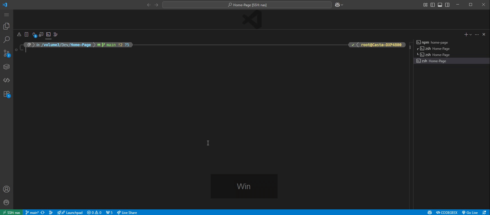

<details>
  <summary>完整代码</summary>

```bash showLineNumbers title="从所有停止容器中选择"
ContainerDown () {
    # choose from all down containers
    local header=$'NAME\tCONTAINER ID\tIMAGE\tSTATUS'
    local data exited running combined selected
    data=$(docker ps -a --format '{{.Names}}|{{.ID}}|{{.Image}}|{{.Status}}' | \
        awk -F'|' '{
            name = length($1) > 20 ? substr($1, 1, 17) "..." : $1;
            printf "%-20s\t%s\t%s\t%s\n", name, $2, $3, $4
        }')
    exited=$(echo "$data" | awk -F'\t' '$4 ~ /^Exited/ { print }')
    running=$(echo "$data" | awk -F'\t' '$4 !~ /^Exited/ { print }')
    combined="$header"$'\n'"$running"$'\n'"$exited"
    formatted=$(echo "$combined" | column -t -s $'\t')

    preview_lines=100
    running_count=$(echo "$running" | grep -c '^')

    selected=$(echo "$formatted"| fzf \
        --reverse \
        --height 80% \
        --header-lines=$((1 + running_count)) \
        --preview-label="🐳 Preview" \
        --preview="docker logs -n $preview_lines {1}" \
        --preview-window=follow\
        --accept-nth=2 
    )

    echo $selected
}
```

</details>

### 选择并进入容器

效果如下，搭配了前面的 ContainerUP。使用 `docker exec -it [CONTAINERID] bash` 连接容器

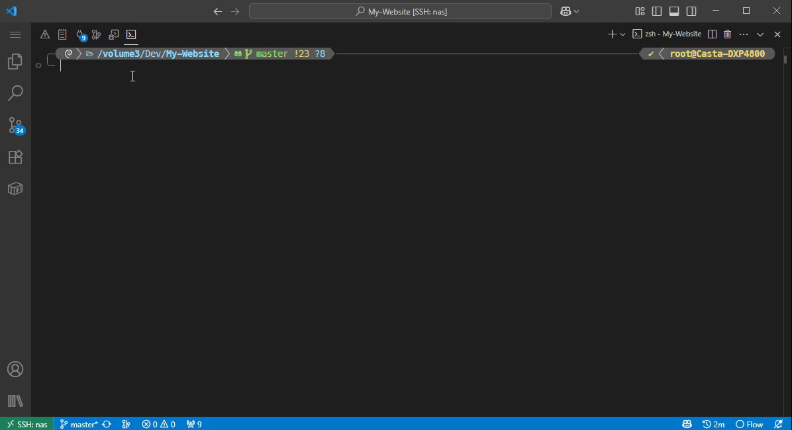

```bash showLineNumbers title="选择并进入容器"
enter() {
  local selected=$(ContainerUP)
  if [ -z "$selected" ]; then
    echo "Canceled"
    return 1
  fi
  docker exec -it $selected bash
}
```

### 选择并删除容器

删除就不演示了，搭配了前面的 ContainerDown

```bash showLineNumbers title="选择并删除容器"
ddel() {
  local selected=$(ContainerDown)
  if [ -z "$selected" ]; then
    echo "Canceled"
    return 1
  fi
  docker rm $selected
}

# 强制删除(可以删运行中的)
dfdel() {
  local selected=$(ContainerAll)
  if [ -z "$selected" ]; then
    echo "Canceled"
    return 1
  fi
  docker rm -f $selected
}
```

## grep

:::important 重要
可以跳转到[一键配置](/blog/fzf#一键配置)进行安装，下面内容只做演示，不需要一个一个复制
:::

效果如下，右边的窗口可以进行预览，并会直接跳转到对应的行数附近

:::warning
需要安装 `batcat` 实现高亮
:::


<details>
  <summary>完整代码</summary>

```bash showLineNumbers title="grep 并预览结果"
ffgrep() {
  local query="$*"
  local ans
  local cmd_height=$(awk "BEGIN { printf \"%d\", $(tput lines) * 0.8 - 6 }") 
  local offset=$(awk "BEGIN { printf \"%d\", $cmd_height * 0.5 }")

  ans=$(grep -rnI --color=always -E "$query" . 2>/dev/null | \
    fzf --ansi \
        --delimiter ':' \
        --height=80% --reverse \
        --preview='batcat --color=always --paging=never {1} --highlight-line={2} --wrap=character' \
        --preview-window=right:60%,wrap,+{2}-$offset \
    )
    
    if [[ -n "$ans" ]]; then
      echo $ans | head -n1 | awk -F: '{print $1":"$2}'
    fi
}
```

</details>

## 进程

:::important 重要
可以跳转到[一键配置](/blog/fzf#一键配置)进行安装，下面内容只做演示，不需要一个一个复制
:::

```bash showLineNumbers title="查找并杀死进程"
fkill() {
  local pid
  pid=$(ps aux | fzf --accept-nth 2)
  if [ -n "$pid" ]; then
    kill -9 "$pid"
  fi 
}
```

## Conda

:::important 重要
可以跳转到[一键配置](/blog/fzf#一键配置)进行安装，下面内容只做演示，不需要一个一个复制
:::

### 进入 Conda 环境

效果如下，在选择环境时，可以预览该环境有哪些 `pip` 包

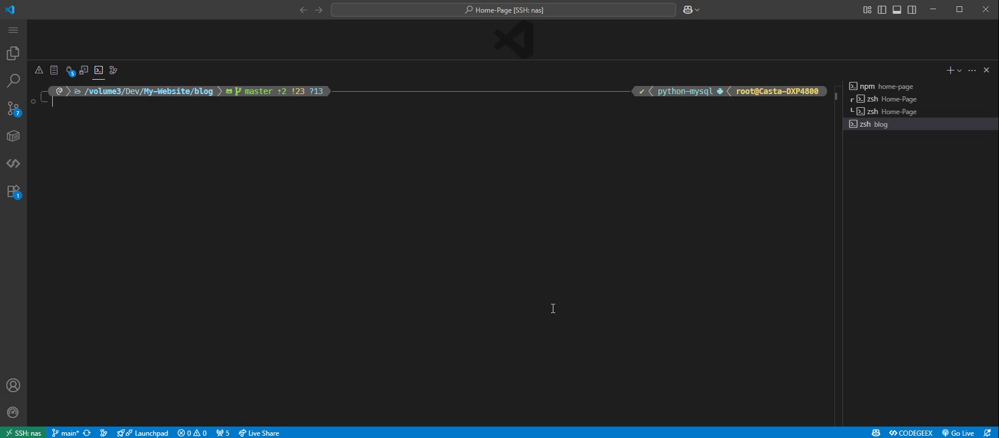

<details>
  <summary>完整代码</summary>

```bash showLineNumbers title="进入 Conda 环境"
conda_activate() {
    local env envs
    envs=$(conda env list | awk 'NF && $0 !~ /^#/')
    env=$(echo "$envs" | fzf \
        --preview='
            pippath={-1}/bin/pip
            "$pippath" list
        ' \
        --prompt="Activate Conda Env > " \
        --height=80% \
        --reverse \
        --accept-nth 1 \
    )

    if [[ -n "$env" ]]; then
        echo "🔄 Activating Conda environment: $env"
        conda activate $env
    else
        echo "❌ Cancelled."
    fi
}
```

</details>

### 搜索 Conda 环境

效果如下，在所有 Conda 环境中搜索 pip 包，并预览 `pip show`。在 Conda 环境多起来之后，十分好用

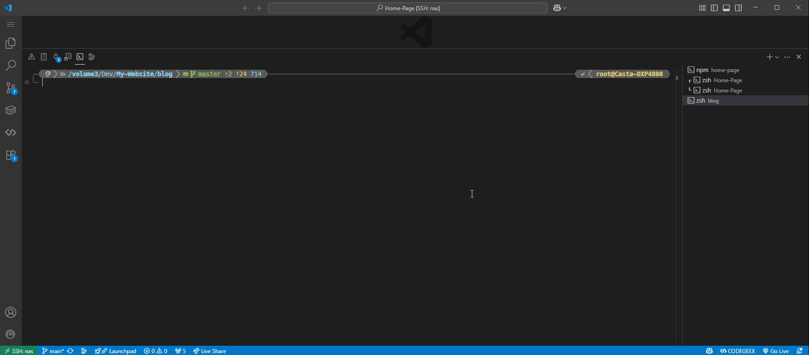

<details>
  <summary>完整代码</summary>

```bash showLineNumbers title="搜索 Conda 环境"
conda_search() {
    local rows=""
    local envs
    envs=$(conda env list | awk 'NF && $0 !~ /^#/' | awk '{print $1}')

    while read -r env; do
        while IFS=$'\t' read -r name version; do
            [[ -n "$name" ]] && rows+="$env\t$name\t$version"$'\n'
        done < <(conda run -n "$env" pip list --format=columns 2>/dev/null | awk 'NR > 2 {print $1 "\t" $2}')
    done <<< "$envs"

    if [[ -z "$rows" ]]; then
        echo "⚠️ Nothing Here"
        return 1
    fi

    {
        echo -e "ENV\tPACKAGE\tVERSION"
        echo -e "$rows"
    } | column -t -s $'\t' | \
    fzf \
        --prompt="🔎 Search pip packages > " \
        --header-lines=1 \
        --reverse \
        --nth 2 \
        --accept-nth 2 \
        --color nth:regular,fg:dim \
        --height=90% \
        --preview='
            env=$(echo {} | awk "{print \$1}")
            pkg=$(echo {} | awk "{print \$2}")
            conda run -n $env pip show $pkg 2>/dev/null || echo "📦 Nothing Here"
        '
}
```

</details>

## 一键配置

脚本本身需要 fzf 以及一些其他依赖, 请确保在使用这些脚本前安装了这些依赖

本项目在 GitHub 上开源，地址为 [Casta-mere/fzf_scripts](https://github.com/Casta-mere/fzf_scripts/)，可访问并下载

这里提供两种安装方法

### 命令安装

该方式需要设备能连接到 github, 若无法连接或下载超时请使用[手动安装](/blog/fzf#手动安装)

```bash
curl -fsSL https://github.com/Casta-mere/fzf_scripts/releases/download/V0.1.0/install.sh -o ./install.sh
chmod +x ./install.sh
./install.sh --install
```

### 手动安装

1. 点击 [fzf_scripts](https://github.com/Casta-mere/fzf_scripts/releases/tag/latest) 下载 **install_pack.tar.gz**
2. 上传文件到设备并切换到该目录
3. 使用 `tar -xzvf install_pack.tar.gz` 解压
4. 使用 `chmod +x ./install.sh && ./install.sh --install` 安装

## 后记

fzf 确实是一个很好玩的工具，笔者也是根据自己的实际需求写了以上小工具，读者若有新功能建议，欢迎提交 issue 到 [GitHub](https://github.com/Casta-mere/fzf_scripts/issues)