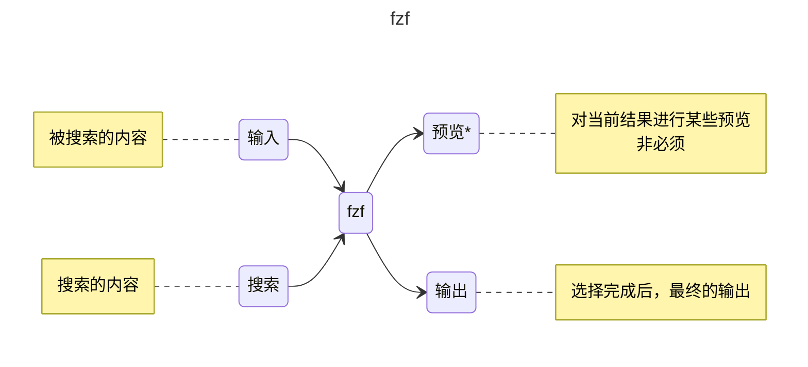

# fzf

fzf (fuzzy finder) 是一个**命令行模糊查找工具**。这是一个很强大的工具，发挥你的想象力，和我一起探索 fzf


目前搞定了以下有趣的功能:

- [选择并进入 Docker 容器](/blog/fzf#docker)
- [grep 并预览结果](/blog/fzf#grep)
- [查看并杀死进程](/blog/fzf#进程)

<!--truncate-->

:::important
笔者使用的 `fzf` 的版本为 `0.62.0 (d226d841)`，不同的版本可能有所差异
:::

## 缘起

## 安装

建议直接去 github 下载安装，点击[链接](https://github.com/junegunn/fzf/releases)直达 release

Linux 下的包管理器中的版本都很旧，用 `uname --all` 查看系统信息，下载对应版本

下载完成后，上传到服务器，解压。将 fzf 复制到 `/usr/bin` 目录下

### Linux

```bash
tar -xzf xxx.tar
cp fzf /usr/bin
```

## fzf 入门

安装好 `fzf` 之后，直接在终端输入 `fzf`，可以看到，`fzf` 会自动将该目录下的所有文件及子文件夹下的文件递归列出来，并转为一个**可以选择**的列表


这个工具的功能很强大，笔者暂时无法完全进行详解，仅带各位入门。笔者将分为四部分来介绍 `fzf` 的基本功能: **输入**、**搜索**、**预览**、**输出**

`fzf` 对于初学者来说比较乱的一点是：它有**两个**输入和**两个**输出




可能看起来比较复杂，笔者来逐一介绍

### 输入

这里的"输入"，就是被搜索的内容。我们一般通过管道来输入到 `fzf`，比如这里我们演示，从所有进程中进行搜索

:::important
为了方便演示，笔者这里就只用最简单的命令，避免输出过长影响效果
:::

这里可以看到，将 `ps` 的输出通过管道传递给 `fzf`，就可以进行选择


但存在以下几个常见问题。首先我们对比一下单独执行 `ps`(左) 和通过管道传递给 `fzf`(右) 的效果


先忽略 `tty` 和 `pid` 的不同，不难发现，`fzf` 的输入输出是类栈的，即先进后出，顺序是反的。这样的设计应该是为了在行数较多时，更好的显示和选择，但在需要关注顺序时，就会有些麻烦

我们可以通过添加 `--reverse` 参数来反转顺序，注意该参数会将输入行改到最上方

左边为 `ps | fzf --reverse`，右边为 `ps | fzf`


第二个问题是，回看上面的图片，`ps` 输出是一个表格，我们明显不想让表头也成为被搜索的一部分。一方面，可能造成歧义，另一方面，当搜索内容列表过长时，在翻到下面的时候，就看不到表头了

我们可以通过添加 `--header-lines=` 参数来指定表头的行数

可以测试一下 `ps -aux | fzf --reverse --header-lines=1` 的效果


可以看到，表头是无法被选中的，而且在滚动时也不会消失

`--header-lines=` 是指定**前 n 行**作为表头，在某些需求下会有奇效

### 搜索

这里偷个懒，引用一下[官方](https://junegunn.github.io/fzf/search-syntax/)给出的搜索逻辑，类似正则规则

| Token   | 匹配类型         | 描述                                       |
| ------- | ---------------- | ------------------------------------------ |
| sbtrkt  | 模糊匹配         | 包含 sbtrkt 字符，并且**字符出现顺序一致** |
| 'wild   | 精确匹配         | 包含单词 wild（非单词边界也匹配）          |
| 'wild'  | 边界精确匹配     | 包含完整单词 wild，要求单词边界匹配        |
| ^music  | 前缀精确匹配     | 以 music 开头的项                          |
| .mp3$   | 后缀精确匹配     | 以 .mp3 结尾的项                           |
| !fire   | 反向精确匹配     | 不包含 fire 的项                           |
| !^music | 反向前缀精确匹配 | 不以 music 开头的项                        |
| !.mp3$  | 反向后缀精确匹配 | 不以 .mp3 结尾的项                         |

比较常用的就是加 `'` 进行精确匹配，下图就是一个例子


当需要多个匹配条件时，空格隔开即可; 如果是要 `or` 逻辑的话，就用 `|` 隔开


### 预览

### 输出

## Docker

## grep

## 进程