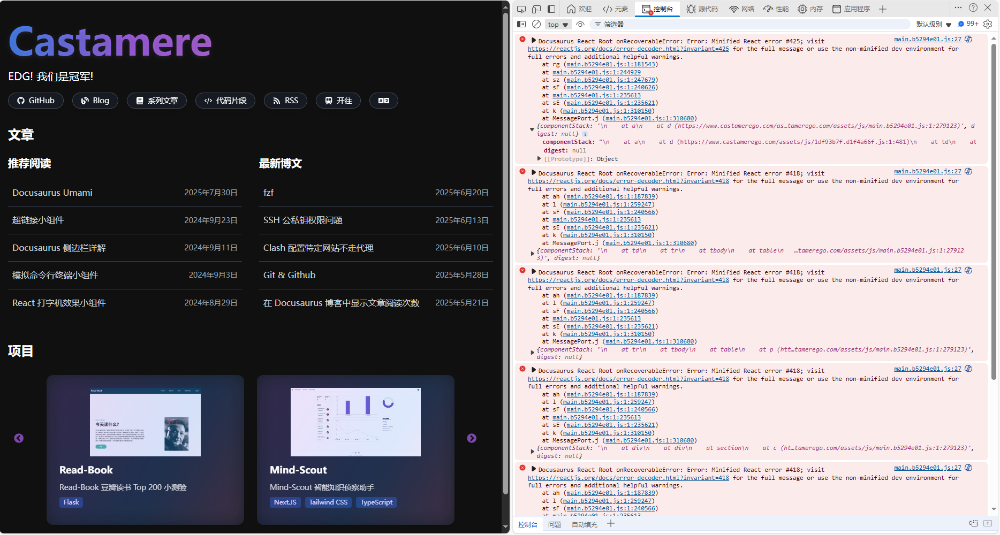
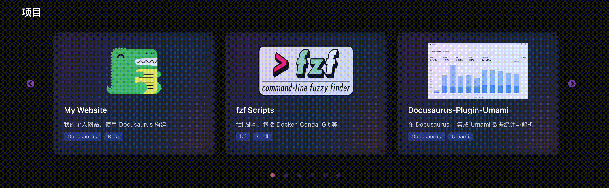

import { RoughNotation } from "react-rough-notation";

# React SSR 水合问题

前端真是噩梦啊

新做的首页展示博客和项目的组件，悄悄的在 F12 中报错，没有影响到使用，也就没发现，但一看到就受不了了

研究发现是 SSR 水合问题(*Server Side Rendering Hydration Problem*)，遂写一篇记录一下历程

:::info
SSR 水合问题（Server Side Rendering Hydration Problem）是指在服务端渲染（SSR）应用中，服务端生成的 HTML 与客户端 JavaScript 接管后的状态不一致，导致 React 需要重新渲染整个组件树的问题
:::

至于为什么叫水合问题，请往下看

<!--truncate-->

## 缘起

起因是按开了 F12 突然看到了一大堆报错，但之前使用时却没有任何感觉



然后研究过程中爆出了几个关键字，遂觉得有必要写一篇文章记录一下

## 分析

首先去 React 查了一下这个[报错 #418](https://react.dev/errors/418?invariant=418)

:::danger 报错
Hydration failed because the server rendered HTML didn't match the client. As a result this tree will be regenerated on the client. This can happen if a SSR-ed Client Component used:

- A server/client branch `if (typeof window !== 'undefined')`.
- Variable input such as `Date.now()` or `Math.random()` which changes each time it's called.
- Date formatting in a user's locale which doesn't match the server.
- External changing data without sending a snapshot of it along with the HTML.
- Invalid HTML tag nesting.

It can also happen if the client has a browser extension installed which messes with the HTML before React loaded.
:::

博客里逛了一圈发现只有主页会报这个错，那就好办了，这个页面就四个组件，二分法找问题

```tsx title="src/pages/index.tsx"
<div className="flex flex-col mt-10 gap-4">
  <HomepageHeader />
  <SiteNavigation />
  <Articles />
  <ProjectShowcase />
</div>
```

结果发现下面两个组件都有问题

首先来说，这个问题就是 SSR 水合问题，即服务端渲染后，客户端发现 HTML 和服务端渲染的 HTML 不一致，导致 React 重新渲染了整个页面。虽然说用起来没什么感觉(也是为什么我一直没发现)，但还是想解决一下

:::tip
Docusaurus 官方提供了 [Browser Only](https://docusaurus.io/docs/advanced/ssg#browseronly) 组件的解决方案，但使用过后，发现和我的问题不太一样
:::

接下来先讲一下什么是 SSR 水合问题，再讲具体 bug 和解决方法

## SSR 水合问题

### SSR

先说什么是 SSR。在笔者之前写的 React 系列文章中介绍过，点击[这里](http://localhost:3000/docs/React/Next/Fundamentals#服务端渲染server-side-rendering)可以跳转查看，这里也会简单介绍一下

SSR (*Server Side Rendering*) 即 服务端渲染。是指在服务器端将动态页面内容和数据渲染成完整的 HTML 页面，然后将整个页面发送给客户端。客户端收到的是已经包含完整内容的 HTML 页面

SSR 优点有很多，这里重点讲一下 SSR 的缺点:

- 无法监听浏览器事件
- 无法访问浏览器 API
- 无法维护状态(Maintain state)
- 无法使用 effects

### 水合

水合，即 *Hydration*，叫这个名字主要是类比化学中的水合。在化学中，水合是指干燥的物质与水分子结合，形成含水化合物的过程。比如：

- 无水硫酸铜（白色） + 水 → 五水硫酸铜（蓝色）

SSR 水合的过程如下:

- "干燥"状态：服务端渲染的静态 HTML（无交互能力）
- "水合"过程：客户端 JavaScript 为这些静态 DOM 节点添加事件监听器、状态管理等
- "活跃"状态：完全交互的 React 应用

服务端渲染可以直接渲染好整个页面，但有些组件是要在客户端渲染出交互能力的，比如按钮点击事件、输入框输入事件等

用人话就是: 水合就是<RoughNotation type="highlight" show={true} color="rgba(251, 205, 2, 0.5)" strokeWidth={1} iterations={1} multiline={true} >动态的组件</RoughNotation>(水)，插入到<RoughNotation type="highlight" show={true} color="rgba(251, 205, 2, 0.5)" strokeWidth={1} iterations={1} multiline={true} >静态的 HTML 中</RoughNotation>(干燥的物质)，使其变成<RoughNotation type="highlight" show={true} color="rgba(251, 205, 2, 0.5)" strokeWidth={1} iterations={1} multiline={true} >可以交互的组件</RoughNotation>(活跃状态)

### 水合问题

水合问题，就是服务端渲染出的 HTML 和客户端渲染出的 HTML 不一致，导致 React 重新渲染了整个页面

常见的原因，React 在上面那个报错都给我们列出来了

:::danger 报错
- 服务器/客户端分支 `if (typeof window !== ‘undefined’)`
- 变量输入，如 `Date.now()` 或 `Math.random()`，每次调用时都会改变
- 用户本地化设置中的日期格式与服务器不匹配
- 外部数据发生变化但未随 HTML 一起发送快照
- HTML 标签嵌套无效
:::

很幸运的，笔者一个页面中的两个组件，就各犯了一条... (天降 blog 话题)

下面就是两个组件的具体问题和解决方法了

## ProjectShowcase 组件

先处理 ProjectShowcase 组件

结果最后发现是，在 tsx 组件中静态注入了 `<style>` 标签导致的

```tsx title="/src/components/Homepage/ProjectShowcase.tsx"
return (
  <section className="mt-4 mb-16">
    ...
    {/* 注入高级悬浮动效样式 */}
    <style>{`
      .project-card {
        box-shadow: 0 4px 24px 0 #a259e6a0, 0 1.5px 8px 0 #3b82f680;
      }
      ...
    `}</style>
  </section>
)
```

但路上又发现了别的问题: 在首次加载时，项目的展示图片会先 '填满' 整个 div，再突变为正常 Size

首先，初始的 div 长这样，可以在[这里](https://github.com/Casta-mere/My-Website/blob/4b90bcc74c27adca4ca216c02f5303a085ee4175/src/components/Homepage/ProjectShowcase.tsx)找到之前版本的文件

```tsx title="/src/components/Homepage/ProjectShowcase.tsx"
<div className="...">
  
</div>
```

笔者首先了尝试这样的解决方法。即添加一个状态变量，在 img 加载好之前不透明度为 0，加载好后变为 100%，还可以添加一个过渡动画

```tsx title="/src/components/Homepage/ProjectShowcase.tsx"
  // git-add-next-line
+ const [isImageLoaded, setIsImageLoaded] = useState(false);
  ...
  <div className="..">
     setIsImageLoaded(true)}
    />
  </div>
```

感觉没什么问题，但是仅限 dev 版本，build 好之后还是有问题，甚至 build 好之后，图片直接不显示了。F12 发现他的 opacity 还是 0, 而且没有任何报错

分析了好一阵，大致原因如下：

1. 服务端渲染时 useState(false) 初始化，图片的 opacity 为 0
2. 客户端水合时，图片可能已经被浏览器缓存，导致 img.complete 为 true
3. 此时 onLoad 事件不会触发，因为图片已经加载完成
4. 结果 isImageLoaded 永远是 false，导致图片的 opacity 一直是 0，就隐形了...

和 copilot 研究了半天，最后用了这种方式解决:

给图片添加一个 ref，这样不管是如何渲染，以及不管是否有缓存，都可以确保图片加载完成后正常显示


```tsx title="/src/components/Homepage/ProjectShowcase.tsx"
  const [isImageLoaded, setIsImageLoaded] = useState(false);

  // git-add-start
+ useEffect(() => {
+   const img = imgRef.current;
+   if (img) {
+     if (img.complete && img.naturalWidth > 0) {
+       setIsImageLoaded(true);
+     } else {
+       const timer = setTimeout(() => {
+         if (img.complete && img.naturalWidth > 0) {
+           setIsImageLoaded(true);
+         }
+       }, 100);
+       return () => clearTimeout(timer);
+     }
+   }
+ }, [proj.title]);
  // git-add-end

  ...
  <div className="..">
     setIsImageLoaded(true)}
    />
  </div>
```

然后经过观察又发现了一个小 bug，慢放之后看得出来，在图片从 opacity 0 变为 100% 之后，不透明度又突变了一下，突然变暗了一点



搞了很久才明白原因，虽然一般不太会注意这种地方。我在整个 card 外面是有一个 glass 的效果，但和图片位于了一个图层，只要把 glass 的层级提升到图片上面就好了

```tsx title="/src/components/Homepage/ProjectShowcase.tsx"
// git-remove-next-line
<div className="... z-0 project-card-glass"></div>
// git-add-next-line
<div className="... z-10 project-card-glass"></div>
{proj.img && (
  <div className="...">
    
  </div>
)}
```

前端真是噩梦

## Articles 组件

然后是 Articles 组件，神奇的是两个组件报同样的错，却是不同的原因

这个组件主要是用来展示推荐文章的，中间有个逻辑是这样，会在所有打了 `recommended` 标签的文章中随机抽取 5 篇进行展示

```tsx title="/src/components/Homepage/Articles.tsx"
const recommendedArticles = shuffleArray(allRecommendedArticles)
  .slice(0, 5)
  .sort((a, b) => new Date(b.date).getTime() - new Date(a.date).getTime());
```

问题就出在这里，服务端渲染时随机抽取了 5 篇文章，客户端水合时又随机抽取了 5 篇文章，结果就不一样了

解决方法也很简单，直接用一个状态变量标记是否是客户端渲染就好了

```tsx title="/src/components/Homepage/Articles.tsx"
import { useEffect, useState } from "react";

const [isClient, setIsClient] = useState(false);

// 只在客户端渲染时才会执行
useEffect(() => {
  setIsClient(true);
}, []);

...

const recommendedArticles = isClient
  ? shuffleArray(allRecommendedArticles)
      .slice(0, 5)
      .sort((a, b) => new Date(b.date).getTime() - new Date(a.date).getTime())
  : allRecommendedArticles
      .slice(0, 5)
      .sort((a, b) => new Date(b.date).getTime() - new Date(a.date).getTime());
```

## 后记

给自己几个提醒吧

首先，没报错不代表没问题，还好这次是没经过多少次 commit 就发现了这个 bug

然后尽量避免在 tsx 组件中直接写 `<style>` 标签，改成 css 文件或者 css-in-js 的方式

知其所以然确实很有意思