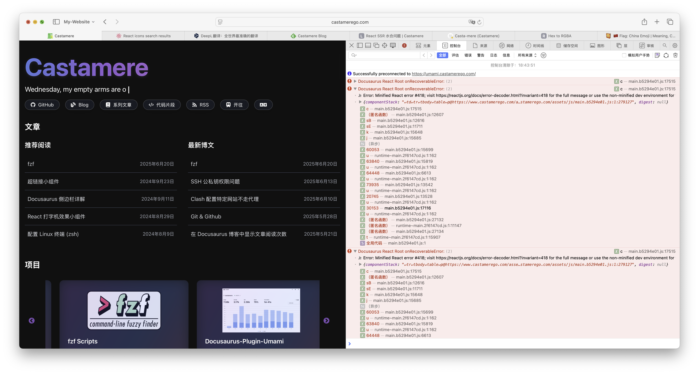

# React SSR 水合问题

<!--truncate-->

## 缘起

## 分析

:::danger 报错
Hydration failed because the server rendered HTML didn't match the client. As a result this tree will be regenerated on the client. This can happen if a SSR-ed Client Component used:

- A server/client branch `if (typeof window !== 'undefined')`.
- Variable input such as `Date.now()` or `Math.random()` which changes each time it's called.
- Date formatting in a user's locale which doesn't match the server.
- External changing data without sending a snapshot of it along with the HTML.
- Invalid HTML tag nesting.

It can also happen if the client has a browser extension installed which messes with the HTML before React loaded.
:::