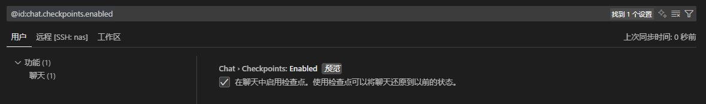

# 杂谈 001 · VScode / Copilot 25.08 更新

2025.08.08 , VS code 发布八月更新，同一天 Copilot 也更新了 GPT-5, 浅体验一下

VS code 更新

- [发行说明更新](/blog/talk-001#发行说明更新)
- [显示 AI 比例](/blog/talk-001#显示-ai-比例)

Copilot 更新

- [对话回溯 checkpoints](/blog/talk-001#对话回溯-checkpoints)
- [进度列表](/blog/talk-001#进度列表)
- [Katex 支持](/blog/talk-001#katex-支持)

笔者只列出了一些觉得有意思的(且自己会用到的)更新，完整的发行说明请参考[这里](https://code.visualstudio.com/updates/v1_103)

<!-- truncate -->

## VS Code 更新

AI 内容的更新，后面统一和 [Copilot 更新](/blog/talk-001#copilot-更新)一起说

### 发行说明更新

一进来就有一个小优化，之前好像没见过，现在发行说明有侧边栏跳转了，确实很方便

### 显示 AI 比例

笔者觉得这次更新最好玩的是这个:

> 启动 AI 统计功能，该仪表表示 24 小时内 AI 插入的代码量与手动输入的代码量的比例

一个百分比的小进度条，瞟一眼就不太好意思 tab tab tab 了，简直是天才

## Copilot 更新

### 对话回溯 checkpoints

这个功能蛮实用的，如果在多次对话中修改了同一个文件，假如你一直没有点 apply。可能在某一次对话之后，代码崩了，前面 AI 搞出来有用的代码也回不去了

现在添加了 checkpoint 之后，可以直接回溯到某次对话前，你就理解为每次对话都有一个快照就 ok 了，痛过的自然懂

设置中搜索 `@id:chat.checkpoints.enabled`，启用即可

### 进度列表

当你用 agent 模式时，让 AI 处理一个比较复杂的问题，它会先把它拆分成很多步骤，然后逐个执行

但事与愿违，有时候 AI 渐行渐远，不知道干哪去了

今天更新出了一个新功能，AI 拆分步骤之后，会出来一个列表

现在就可以更好的跟踪 AI 走到了哪一步，也方便你及时把有用的步骤先存下来，搭配上面的对话回溯功能，感觉会不错

### Katex 支持

AI 的回复中，可以直接渲染公式。可能在验证公式正确性时有点用

## GPT-5

GPT-5 首发直接进 copilot, 1x 倍率，先体验几天看看吧

初步体验感觉分析的总时长不变，但会"卡一会"。就是问了问题之后，先便秘一阵，再窜稀一样叽里呱啦说一大堆出来

## 后记

完整的发行说明可以在[这里](https://code.visualstudio.com/updates/v1_103)找到，但没有翻译就是了