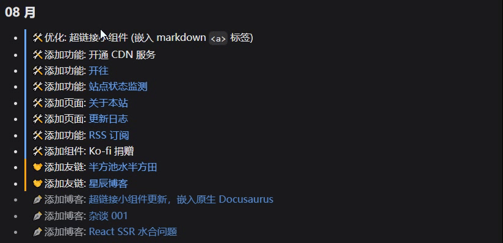
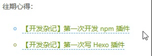

import Link from "@site/src/components/Link/Link";
import { RoughNotation } from "react-rough-notation";
import Link1 from "./components/Link1";
import Link2 from "./components/Link2";
import Link3 from "./components/Link3";

<div className="tailwind">
  <div className="text-2xl">
    <Link
      title="这还是一个超链接"
      url="/blog/Link-update-2025-08"
      open="sameTab"
      badge={true}
    />
  </div>
</div>



这次更新制作了一个悬浮窗动画效果，可以根据链接的不同类型渲染不同样式。其次是将部分功能封装，并嵌入了 docusaurus 的 mdx `<a>` 标签，就可以在 markdown 文件中，使用 `[text](url)` 语法来调用

并且放到了 [Github](https://github.com/Casta-mere/Link) 上，欢迎大家使用和二创

{/* truncate */}

## 缘起

在翻看 [@wuanqin](https://blog.uuanqin.top/) 的博客时，发现博主的超链接，会有一个悬浮的小框，显示外链/内链



顺带还有些功能也想实现，以及重构代码，就一起搞了

## 悬浮框

做这个悬浮框分两部分，一个是样式，一个是区分内外链接

### 内外链接判断

笔者把引用的链接分为了三种:

- 站外链接
- 站内文章
- 页面内跳转

页面内跳转是，比如从 `/blog/Link-update-2025-08` 跳转到 `/blog/Link-update-2025-08#内外链接判断`，即跳到当前页面内的某一 part

站外文章最好判断，不以 `/` 开头的都算，其他就就属于站内文章。判断是否是页面内跳转比较麻烦，首先判断链接内是否有 `#`；然后把 `#` 及之后的内容去掉，和当前路径做对比

```tsx title="链接类型判断" showLineNumbers
import { useLocation } from "@docusaurus/router";
const currentPath = useLocation().pathname;

const isExternalLink = !href.startsWith("/");
const isAnchorLink = href.includes("#") && href.split("#")[0] === currentPath;
```

但这样在 docusaurus 中会有一个问题，`uselocation` 返回的是包括 i18n 在内的路径，也就是类似 `/en/blog/` 这种，而我们在 markdown 里的路径就是一个纯净路径，是 docusaurus 的的多语言支持给我们正确添加 i18n 的

:::tip
这部分是 Docusaurus 的 `@docusaurus/Link` 组件的功能
:::

举个栗子，如果使用 `[超链接小组件](/blog/Link)` 这样的语法，那么在英文版，会自动给我们添加 `/en` 的前缀跳转，这样避免语言间的混乱。但文中的 href 还是原始的 `/blog/Link`

所以笔者自制了一个 hook，用于在 docusaurus 中获取当前的纯净路径。其实也不复杂，就是区别 defaultLocale 和 其他 Locale 的情况

```tsx title="usePlainLocation" showLineNumbers
import { useLocation } from "@docusaurus/router";
import useDocusaurusContext from "@docusaurus/useDocusaurusContext";

export function usePlainLocation(): string {
  const { i18n } = useDocusaurusContext();
  const currentPath = useLocation().pathname;

  if (i18n.currentLocale === i18n.defaultLocale) {
    return currentPath;
  }

  const localePrefix = `/${i18n.currentLocale}`;
  if (currentPath.startsWith(localePrefix)) {
    const plainPath = currentPath.slice(localePrefix.length);
    return plainPath || "/";
  }

  return currentPath;
}
```

然后这样用就可以了

```tsx title="链接类型判断" showLineNumbers
import { usePlainLocation } from "@site/src/hooks/usePlainLocation";
const currentPath = useLocation().pathname;

const isExternalLink = !href.startsWith("/");
const isAnchorLink =
  href.includes("#") && href.split("#")[0] === usePlainLocation();
```

## 悬浮框样式

想做一个类似聊天气泡，下面有个小尖尖那种，一点点来

### 基础样式

先让他显示出来：通过外层的 relative 来定位这个链接的宽度，再在中间显示出来，一个圆角矩形+一个小啾啾

```tsx
return (
  <span className="tailwind">
    <span className="relative inline-block">
      一个链接
      <LinkBadge />
    </span>
  </span>
);
```

<Link1 />

<details>

<summary>LinkBadge</summary>

```tsx title="LinkBadge.tsx" showLineNumbers
import React from "react";
const LinkBadge: React.FC = () => {
  return (
    ...
    <span
      className={classNames({
        "absolute -top-8 left-1/2 transform -translate-x-1/2": true,
        "px-2 py-1 text-xs rounded shadow-lg": true,
        "pointer-events-none": true,
        "whitespace-nowrap": true,
        "text-white": true,
        "bg-orange-500": true,
      })}
    >
      站外链接
      <span
        className={classNames({
          "absolute top-full left-1/2 transform -translate-x-1/2": true,
          "border-l-4 border-r-4 border-t-4": true,
          "w-0 h-0": true,
          "border-transparent": true,
          "border-t-orange-500": true,
        })}
      />
    </span>
    ...
  );
};

export default LinkBadge;
```

</details>

### 渲染不同种类链接内容

第二步，根据不同类型的链接，渲染不同内容。把之前获取的 `isExternalLink`, `isAnchorLink` 传入

<Link2 />

```tsx title="LinkBadge.tsx" showLineNumbers
  import React from "react";
  // git-add-start
+ interface LinkBadgeProps {
+   isExternalLink: boolean;
+   isAnchorLink: boolean;
+ }
  // git-add-end

  // git-remove-next-line
- const LinkBadge: React.FC = () => {
  // git-add-start
+ const LinkBadge: React.FC<LinkBadgeProps> = ({
+   isExternalLink,
+   isAnchorLink,
+ }) => {
  // git-add-end
    return (
      ...
      <span ... >
        // git-remove-next-line
-       站外链接
        // git-add-start
+       {isExternalLink && 站外链接}
+       {isAnchorLink && 页面内跳转}
+       {!isExternalLink && !isAnchorLink && 站内文章}
        // git-add-end
        <span ... />
      </span>
      ...
    );
  };

  export default LinkBadge;
```

### 上色

第三步给不同类型的链接加上不同的颜色

<Link3 />

为了方便之后加新的类型，将颜色放到一个单独的 color.ts 中

```tsx title="color.ts" showLineNumbers
interface BadgeColorScheme {
  badgeColor: string;
  arrowColor: string;
}

export const badgeColors: Record<string, BadgeColorScheme> = {
  external: {
    badgeColor: "bg-orange-500",
    arrowColor: "border-t-orange-500",
  },
  internal: {
    badgeColor: "bg-blue-500",
    arrowColor: "border-t-blue-500",
  },
  inpage: {
    badgeColor: "bg-violet-500",
    arrowColor: "border-t-violet-500",
  },
};
```

然后在组件中使用

```tsx title="LinkBadge.tsx" showLineNumbers
  // git-add-next-line
+ import { badgeColors } from "./colors";
  ...
  const LinkBadge: React.FC<LinkBadgeProps> = ({
    isExternalLink,
    isAnchorLink,
  }) => {

  // git-add-start
+ const type: keyof typeof badgeColors = isExternalLink
+   ? "external"
+   : isAnchorLink
+   ? "inpage"
+   : "internal";
+ const { badgeColor, arrowColor } = badgeColors[type];
  // git-add-end
    return (
      ...
      <span
        className={classNames({
          ...
          // git-remove-next-line
-         "bg-orange-500": true,
          // git-add-next-line
+         [badgeColor]: true,
        })}>
        {isExternalLink && 站外链接}
        {isAnchorLink && 页面内跳转}
        {!isExternalLink && !isAnchorLink && 站内文章}
        <span
          className={classNames({
            ...
            // git-remove-next-line
-           "border-t-orange-500": true,
            // git-add-next-line
+           [arrowColor]: true,
          })}/>
      </span>
      ...
    );
  };

  export default LinkBadge;
```

### 添加悬浮效果

在翻看 [@wuanqin](https://blog.uuanqin.top/) 的超链接时，发现他的悬浮效果应该就是单纯的 `hover` 时 `opacity-100` ，不 `hover` 时 `opacity-0`。但这个样式会存在一定的割裂感


之前在制作这个超链接组件时，[这一章](/blog/Link#4-优化)详细介绍了笔者想要的效果

即:

> **不管是鼠标快速扫过还是悬浮不动，下划线都会先全拉满，再进行下一步的操作**

针对这个悬浮框也一样，不管是鼠标快速扫过，还是悬浮到上面，都会<RoughNotation type="highlight" show={true} color="rgba(251, 205, 2, 0.5)" strokeWidth={1} iterations={1} multiline={true} >完整的显示一次动画</RoughNotation>


好消息是，hover 的逻辑之前已经实现过了，直接当一个参数传入用就行

:::tip
实现逻辑请参考[这里](/blog/Link#5-更有甚者)
:::

```tsx title="LinkBadge.tsx" showLineNumbers
  ...
  interface LinkBadgeProps {
    // git-add-next-line
+   isVisible: boolean;
    isExternalLink: boolean;
    isAnchorLink: boolean;
  }

  const LinkBadge: React.FC<LinkBadgeProps> = ({
    // git-add-next-line
+   isVisible,
    isExternalLink,
    isAnchorLink,
  }) => {
    ...

    return (
      <span
        className={classNames({
          // git-add-next-line
+         "opacity-0 scale-75": !isVisible,
          // git-add-next-line
+         "opacity-100 scale-100": isVisible,
        })}
      >
        ...
      </span>
    );
  };\
```

### i18n

最后把 i18n 加上，对于不知道 `docusaurus` 的这个功能的朋友，请参考[这里](/docs/Server/Docusaurus-FAQ#生成翻译)

```tsx title="LinkBadge.tsx" showLineNumbers
  // git-add-next-line
+ import Translate from "@docusaurus/Translate";
  ...
  const LinkBadge: React.FC<LinkBadgeProps> = ({
    ..
    return (
      // git-delete-start
-     {isExternalLink && 站外链接}
-     {isAnchorLink && 页面内跳转}
-     {!isExternalLink && !isAnchorLink && 站内文章}
      // git-delete-end
      // git-add-start
+     {isExternalLink && <Translate>站外链接</Translate>}
+     {isAnchorLink && <Translate>页面内跳转</Translate>}
+     {!isExternalLink && !isAnchorLink && <Translate>站内文章</Translate>}
      // git-add-end
    )
    ...
  )
```

总之最后封装好的组件代码如下:

<details>

<summary>LinkBadge</summary>

```tsx title="LinkBadge.tsx" showLineNumbers
import Translate from "@docusaurus/Translate";
import classNames from "classnames";
import React from "react";
import { badgeColors } from "./colors";
interface LinkBadgeProps {
  isVisible: boolean;
  isExternalLink: boolean;
  isAnchorLink: boolean;
}

const LinkBadge: React.FC<LinkBadgeProps> = ({
  isVisible,
  isExternalLink,
  isAnchorLink,
}) => {
  const type: keyof typeof badgeColors = isExternalLink
    ? "external"
    : isAnchorLink
    ? "inpage"
    : "internal";
  const { badgeColor, arrowColor } = badgeColors[type];

  return (
    <span
      className={classNames({
        "absolute -top-8 left-1/2 transform -translate-x-1/2": true,
        "px-2 py-1 text-xs rounded shadow-lg": true,
        "transition-all duration-300": true,
        "opacity-0 scale-75": !isVisible,
        "opacity-100 scale-100": isVisible,
        "pointer-events-none": true,
        "whitespace-nowrap": true,
        "text-white": true,
        [badgeColor]: true,
      })}
    >
      {isExternalLink && <Translate>站外链接</Translate>}
      {isAnchorLink && <Translate>页面内跳转</Translate>}
      {!isExternalLink && !isAnchorLink && <Translate>站内文章</Translate>}
      <span
        className={classNames({
          "absolute top-full left-1/2 transform -translate-x-1/2": true,
          "w-0 h-0": true,
          "border-l-4 border-r-4 border-t-4": true,
          "border-transparent": true,
          "text-white": true,
          [arrowColor]: true,
        })}
      />
    </span>
  );
};

export default LinkBadge;
```

</details>
