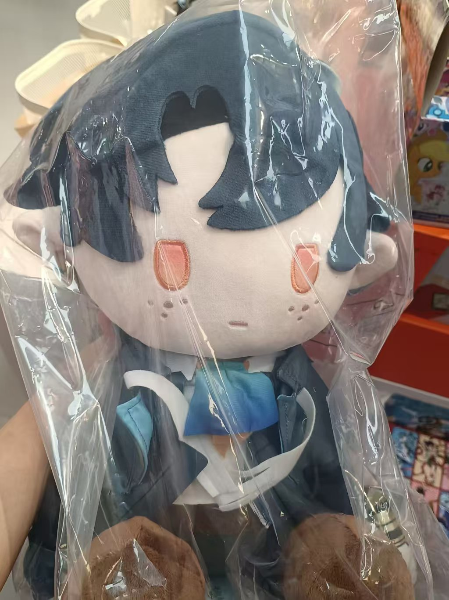
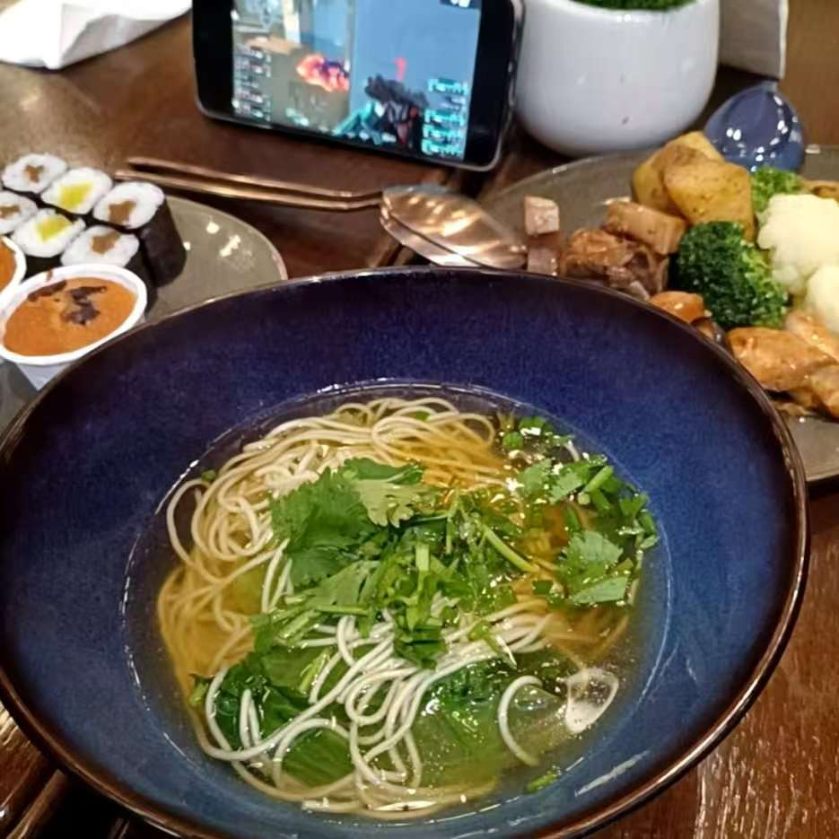
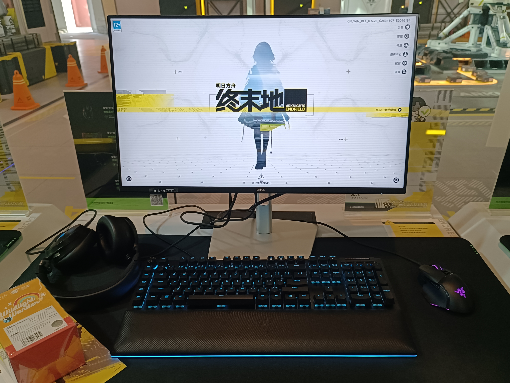
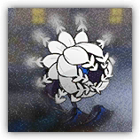
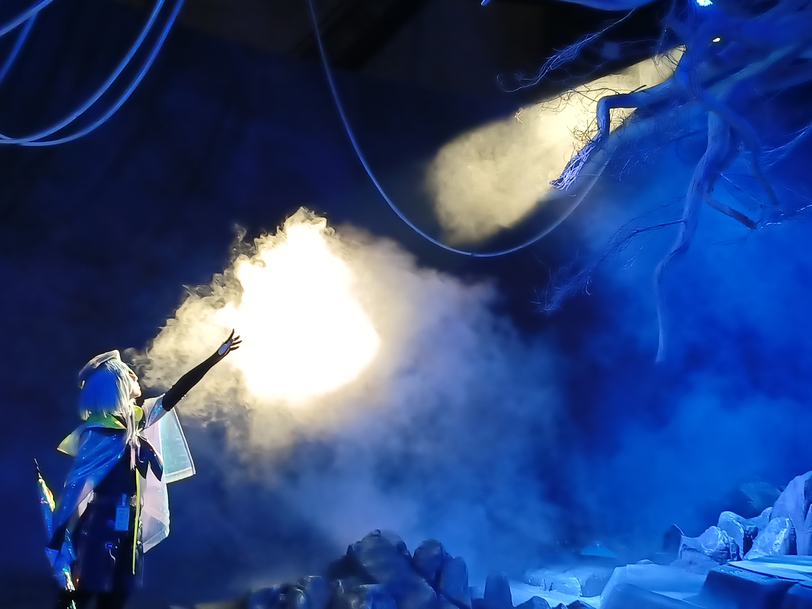
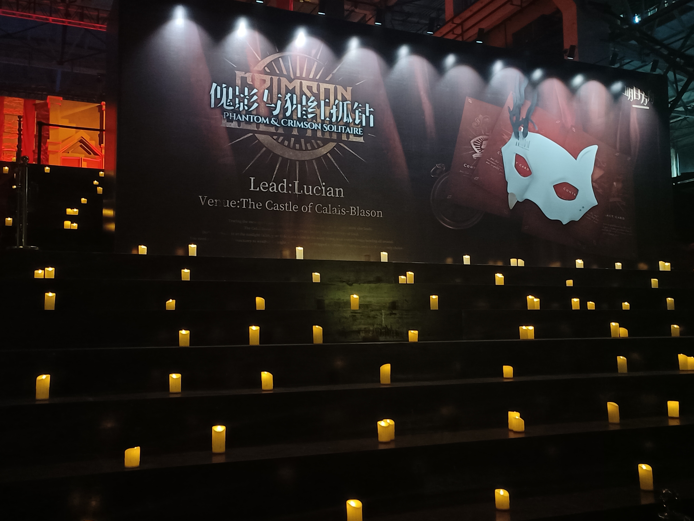
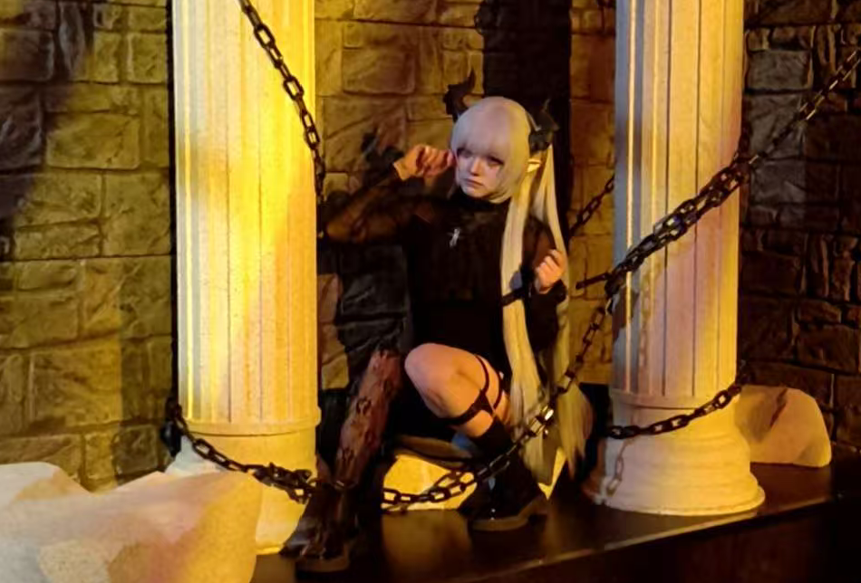
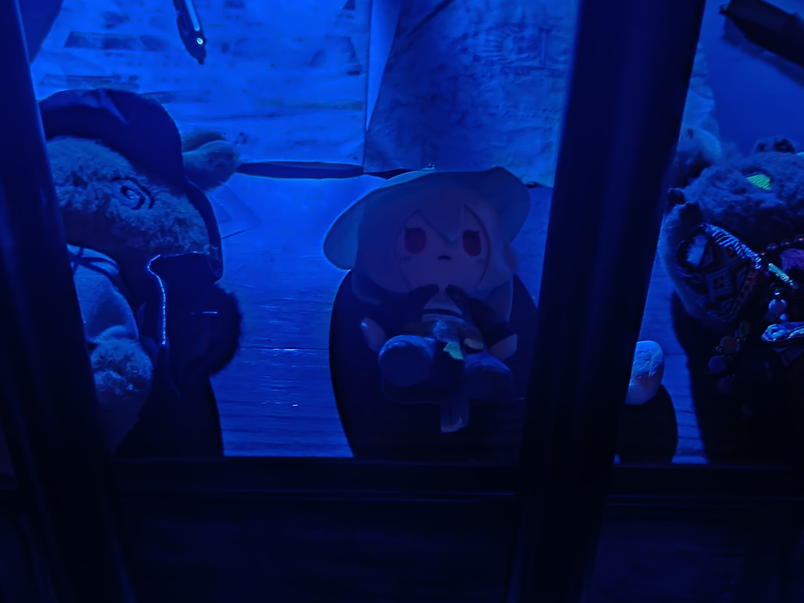

import { RoughNotation } from "react-rough-notation";

# 杂谈 002 · 上海

时隔四个月，再战上海

周一请了一天年假，三天两晚小游

<!-- truncate -->

## 来去

杭州西—虹桥 一等；上海南—杭州东 商务，似乎成了标配

## 停留

这次旅行计划了有一个多月，但直到出发也并没有确定行程。其实确定了大概要去哪，但具体流程没定下来就是了

最主要的原因应该是再上周，小韦带表妹去住了趟[浦东希尔顿 Double Tree](https://doubletree.com.cn/zh-cn/hotel/Shanghai/doubletree-shanghai-shaspdi/index.html)。她一直喜欢 Double Tree 的曲奇，但上周末旅行体验并不完美。游览过于疲惫，深夜才回到酒店，说是房间住满了，升级了套房，第二天还有早餐提供

但种种原因第二天没有吃到，总之体验没有很好吧，导致她不是很开心

后来想到了之前收到的邮件，说希尔顿有个 E-StandBy。(大致就是可以预订这个服务，到了入住日，若酒店当天有空房，就能以低于市场价的价格升级房间)。上次和 cd 住过[南京香格里拉](https://www.shangri-la.com/cn/nanjing/shangrila/)的行政，行政酒廊的体验很好，想着带小韦体验一下

其实说是没有确定行程，倒不如说是确定了两个行程，有行政酒廊和没有的。没有行政酒廊的话，就会多几餐需要安排

我们订的是[上海虹桥希尔顿祥源酒店](https://www.hilton.com.cn/zh-cn/hotel/Shanghai/hilton-shanghai-hongqiao-SHASHHI/index.html)，四月份去 Avicii 演出时住过一次。这次一开始也是订了普通的房间，然后加了个行政的 E-StandBy

到了酒店说是可以再 +200 左右，升级到雅致套房。想着体验一下就升了
    
## 上海水族馆

到酒店是周六中午，还没有空房，寄存了行李就先去门口的蟹太太干饭。其实上次来小韦就说想试试

吃完回去也就十二点出头，还是没有空房，想着先去水族馆了

## 新世界城

最近上海有方舟和潮玩星球联动的餐厅，会卖一些限定的谷子，只有在那里买得到，而且是必须进去用餐才能去买谷子。小韦一直想去，但这两天根本约不到，抱着去看看的心态，我们去线下看了看

从陆家嘴坐地铁到人民广场，走地下通道去新世界城

新世界

但那段地下通道好像是一个时光隧道，那里的店、布局、灯光、招牌，都让我想起十几年前的下元商贸城和服装城(太原)。身在魔都，却把自己定格在了十几年前，有一种和上海格格不入的反差感。甚至不止是这些，那种环境，那种嘈杂，那种压抑的层高和路宽，都把我压回了过去

谷店都在四楼，坐着扶梯一层层上去，缓了口气过来。一边逛一边找，先去抽了发通行证，出了个精二的红，她的最爱。之前一番赏还出了个大流明，手气还算不错

然后就是走马观花挨个逛，似乎和工联 CC / 湖滨88 差不太多

很呆的绕了一大圈，最后才在电梯的反方向找到了联动餐厅。费解的是，明明预约都是满的，但是 byd 正儿八经用餐的就两桌，还有两三个顾客在商店区，太难崩了。见没什么人，我们溜进了商店区，问了一下，说是必须有餐厅预约才能买东西，店员还小声说可以让其他顾客代买(好人还是多)

嘴炮了一个在疯狂买谷的小姑娘，说是可以帮忙买，小韦就开心的去挑了。最后还和那个小姑娘换了一个满赠的肥鸭

到这差不多任务完成。准备打道回府，想着赶一下行政酒廊的下午茶

## 行政酒廊

回到酒店下午茶已经快结束了，房间倒是已经安排好了，套房确实不错。双卫浴，一个客厅和一个卧室，两米五左右的床吧。唯一不满意的是，可能是由于楼层太高，导致浴缸的水压不是很高

行政酒廊总的来说不如香格里拉，下午茶就初见端倪。吃了点小蛋糕和曲奇

晚饭倒是还行，样式、种类都还好。蘑菇很好吃，中规中矩的自助吧

回去洗漱完也比较早，早点睡觉备战第二天的游览

## 方舟集成战略展

先讲背景知识

上海方舟肉鸽展有 N 馆和 A 馆。N 馆是购物区，A 馆是展览区，两馆之间是有点距离的

A 馆: 门票 358，额外包含一个 N 馆的入场资格(而且和单独买 N 馆票，商店是不一样的)。分上/下午两场

N 馆：门票 30，买票进只有一个商店，但是会给一个 30 元购物券，相当于门票只用于限流。是每个小时的票单独售卖，总之有很多场

### 起

我们买的是早上的 A 馆票，10 点开始，但我们可以先去 N 馆购物，小韦想抢一个方舟的马甲(确实不好抢)

早起去行政酒廊吃了早餐，然后打车直接去了西岸美术馆，应该是 8:30 之前就到了 N 馆门口。打车来的方向，刚好看到一个排队的队伍，我们直接排上去了

排了一会小韦感觉不对，有个易拉宝写着这是 30 元门票的派对区，我去问了一个志愿者，说是 358 的要去下面一点排。主要此时我们并不知道 N 馆中有两个商店，分别是给不同票种的顾客的，好在是过去另一边还没开始排队，大家都在树荫下站着

但我们过去直接走到了排队的地方，结果后面哗啦啦都跟着过来了，有一种本来大家都很默契的乘凉，结果被我们违反规则，都着急了的感觉。很不好意思。好在是直接放我们去前面的安检区排了，那里在棚下，也不会晒，所以也还好

排了一阵，到点后要安检 + 验票，我们基本上是前十个进入到商店的。其他商品基本都不需要抢，只有马甲和一个光栅画需要。进去之后，我叫小韦直接去跟着前面那几个姐，去找马甲，我来拿篮子

在进去前，前面的几个人就问了下店员，说是马甲在左边，然后他们一股脑冲过去了，包括小韦。我看她们都围在那里，我也不好进，就继续向前走，走到右边的区域了

结果一个低头，发现了一摞马甲，直接拿了两个，好像是 L 码吧。我就反过去找小韦，结果她说这里好像不是马甲，都找不到。我：看看这是什么

这个马甲是可以挂通行证，也算是比较有特色，虽然说不是限定，但官网买，要 6 个月之后才能拿到了。而且店里似乎只有不到 20 件，我能拿到两件，也是运气很好了

### 承

九点半进商店，十点要去 A 馆，因为我们还买了下午 N 馆的票，所以不需要着急购物，随便买了点，就准备去 A 馆了

往出口走的路上看到了终末地的展区，时间还充足，就进去看了看

讲道理，之前对终末地没什么印象，然后因为去的比较早，有很多空位可以试玩

浅体验了一会，感觉画面确实是不错，很流畅的动作。但也就打了会怪，具体游戏内容还是不太了解，只是看起来自动化的内容和异星工场很像，等正式发布，可能会考虑玩玩

### 没什么转

出门去 A 馆，是有点距离的，过去排队，等入场，小韦期待了很久，做了很多功课。包括游玩的顺序

进门会给一个小包，里面是一些周边和打卡册

### 水月

先去水月展区，这个展区是个交互式情景剧场

排队的地方有只归溟幽灵鲨，进去剧场先是讲故事，然后进入一个房间进行解密

说是解密，其实就是书架上有很多书，要把一些拉出来才能打开下一个门。设定上是找到一些笔记，分散在房间里面，但一波人大概有 20 个左右，基本也很快就开门了

门开之后的下一个房间会有一个花癫疯出来追，jump scare 还是很吓人的

再之后会到一个锁着的大门前，此时水月出场

表演确实很投入，水月会和我们互动，然后打开了大门

进去就是深蓝之树，然后水月思维开始混乱，思绪似乎在多个时间之中跳跃(没看过水月肉鸽的剧情)，总之最后濒临崩溃

coser 的表演、灯光、泡沫、音效都很到位，当然音乐确实很熟悉，我就是水月肉鸽那会入坑的

出来之后会有集章和贴纸拿

### 傀影

拿完贴纸，水月出口的对面就是傀影展区

傀影展区是几个展区中最大的，首先入口处就分为两条，分别是地牢线和古堡线。具体来说，就是第一和第二个场景会不同，这个稍后再说

在排队的地方有个社牛工作人员老哥，真是特别社牛，一直爆梗出来。拿着好多兔兔，也会和游客合照，还会和一些 coser 游客互动

这段时间等的比较久，上去之后，继续排队，先是在外面有个暮落的 coser，小韦很想去拍照，但又有点社恐。总之最后还是第一个跑过去集邮，还带着之前刚买的斯卡蒂兔兔，后面也有几个女生跟着过去集邮了

再往前走到了地牢，门口有一个傀影肉鸽仙人跳的 coser (贴贴拍的，像素实在是难评)

地牢里本应是有个 npc，但我们到的时候没有，基本就是大家把一些兔兔什么的放到牢里面拍照

### 萨米

### 合

### 再起

## 尾声
