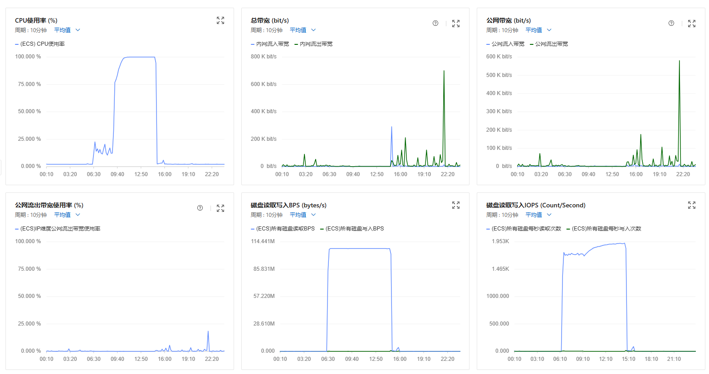
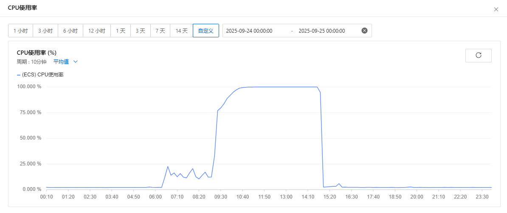

import RecentGames from "@site/src/components/Steam/RecentGames";
import Terminal from "./components/Terminal";

# 记一次服务器宕机

一觉睡醒，服务器的 CPU 爆炸，磁盘疯狂读写，还以为服务器被搞了，记录一下吧



<!-- truncate -->

## 缘起

起因是前一天搞 steam 自动化脚本，获取游玩时长，就是下面这个

<RecentGames />

想看一下 `crontab` 有没有正常运行，结果发现 ssh 直接连不上服务器。同时 [umami](https://umami.castamerego.com/share/EplxZVQRe6OkyBt3/castamerego.com) 和[本站](https://castamerego.com)也进不去了。但有意思的是 [uptimerbot](https://umami.castamerego.com/share/EplxZVQRe6OkyBt3/castamerego.com) 却没有显示任何问题，现在想想可能是 CDN 的原因吗

## 等待

总之上了阿里云控制台，发现 CPU 到 90% 以上，磁盘读写也很高

但好在公网带宽没有任何异常，至少不是 DDOS

第一想法是重启一下，但服务那么多，有点懒得重开，但连不上根本找不来原因。想着先放着吧，下午再来看看



下午再来刚好是三点出头，CPU 刚刚掉下来。现在想想，兴许没掉下来的话，真重启了

检查了一下，各个网页和服务都起来了，ssh 连上去发现 steam 自动化脚本似乎没有成功，但时间点其实也对不上，也不是这个的问题

## 排查

起来了之后就可以排查了，把最上面的截图直接喂给了 AI, 让它帮我分析一下

<Terminal />

可以看出来从2025-09-24 06:21 开始，到 14:48 结束，系统在这段时间里跑 unattended-upgrades，自动安装系统更新，导致 CPU 和磁盘 IO 飙升


## 后记

建议把 ssh 的优先级调到最高，以防之后连不上，干着急

```bash
sudo systemctl set-property ssh.service CPUWeight=10000 IOWeight=10000
```

:::info
可以安些工具 `sudo apt update && sudo apt install -y sysstat iotop htop`
:::