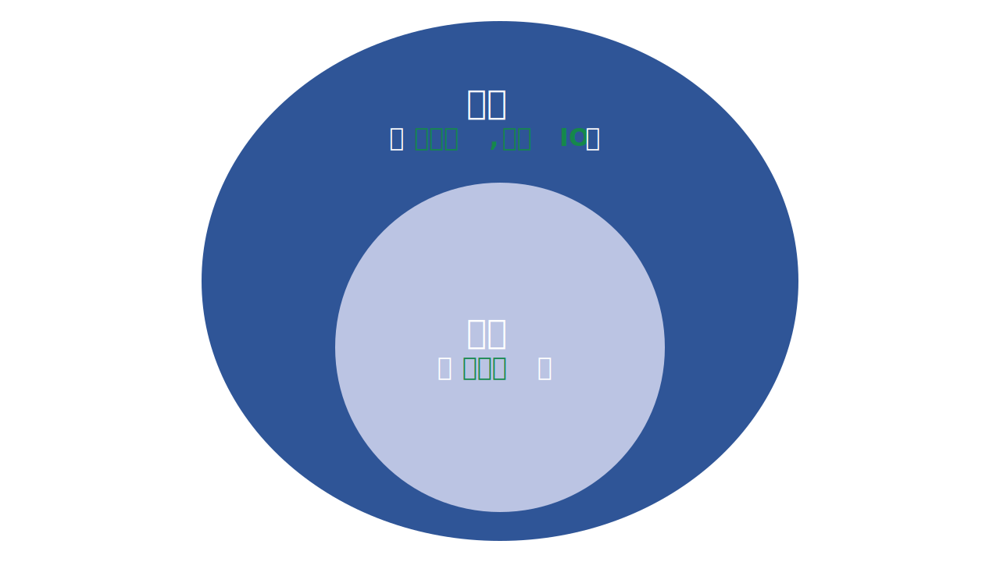
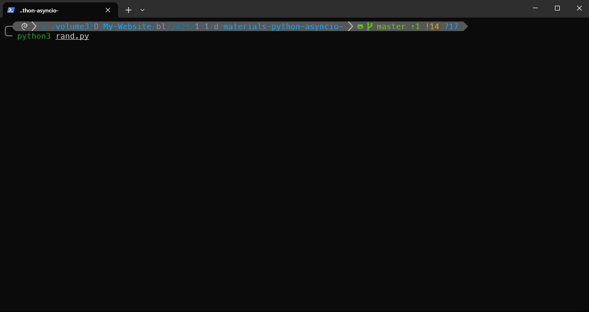

import Terminal from "./components/Terminal";
import Terminal1 from "./components/Terminal1";
import Terminal2 from "./components/Terminal2";
import Terminal3 from "./components/Terminal3";

Python 的 `asyncio` 库允许使用 `async` 和 `await` 关键字来编写并发代码。其核心构件是可等待对象 (awaitable objects)，通常为**协程 (coroutines)**。这些可等待对象由事件循环 (event loop) 调度并以异步方式执行。这种编程模型能够在单线程环境下，高效地管理大量 I/O 密集型任务

本教程将介绍 Python `asyncio` 的工作原理; 如何定义并运行协程; 以及在处理 I/O 密集型任务的应用中何时使用异步编程以获得更好的性能

**读完本文，你将了解**：

- Python `asyncio` 提供了一个使用**协程**、**事件循环**和**非阻塞 I/O 操作**来编写单线程并发代码的框架
- 对于 I/O 密集型任务，异步 I/O **通常比多线程 (multithreading) 更高效**，尤其是在管理大量并发任务时，因为它避免了线程调度与同步带来的开销
- 当应用程序在等待 **I/O 操作**(如网络请求或文件访问)上花费大量时间，且希望在不额外创建线程(threads)或进程(processes)的情况下**并发执行大量相似任务**时，应当使用 `asyncio`

:::important 重要
本篇是笔者翻译的 [Python's asyncio: A Hands-On Walkthrough](https://realpython.com/async-io-python/#other-async-io-features-in-python)，**仅作中文翻译及学习交流使用**，如有侵权请联系删除
:::

<!-- truncate -->

# Python's AsyncIO 实践指南

:::tip
[点击这里](./demo/materials-python-asyncio-.zip)下载本篇中用到的代码
:::

## 写在前面

笔者会在术语第一次出现时标注英文，以减少歧义

[文末](/blog/PythonAsyncIO#术语表)会提供一个简短的术语表，供读者参考

## 初见 Async I/O

:::warning 译者注 
原文中 `Async I/O` 和 `asyncio` 有多处混用，笔者会根据自己的理解进行区分

- **`Async I/O`** 指异步 I/O 这种并发模型
- **`asyncio`** 指 Python 标准库中的 `asyncio` 包
:::

在深入探讨 `asyncio` 之前，不妨花点时间将异步 I/O 与其他并发模型进行比较，看看它如何融入 Python 宏大(~~眼花缭乱~~)的生态体系。以下是几个关键概念：

- **并行 (Parallelism)**: 同时执行多个操作
- **多进程 (Multiprocessing)**: 实现并行的一种方式，可将任务分配到多个 CPU 核心上。多进程适合 CPU 密集型任务，例如计算密集的[循环](https://realpython.com/python-for-loop/)，数学计算等
- **并发 (Concurrency)**: 比并行更宽泛，它表示多个任务可以以重叠方式推进；**并发不一定意味着并行**
- **线程 (Threading)**: 一种并发执行模型，多个线程轮流执行任务。一个进程可以包含多个线程。由于[全局解释器锁 (GIL)](https://realpython.com/python-gil/)，Python 与线程的关系较为复杂，本文不做展开

多线程对于 [I/O 密集型任务](https://realpython.com/ref/glossary/io-bound-task/)表现更佳。I/O 密集型任务的特点是大量等待[输入/输出 (I/O)](https://realpython.com/ref/glossary/input-output/) 操作完成，而 [CPU 密集型任务](https://realpython.com/ref/glossary/cpu-bound-task/)通常从开始到结束都会持续占用 CPU 核心

Python [标准库](https://realpython.com/ref/glossary/standard-library/)通过 `multiprocessing`、`concurrent.futures` 和 `threading` 包为这些并发模型[提供了长期支持](https://docs.python.org/3/library/concurrency.html)

近年来，另一种模型已更全面地融入 [CPython](https://realpython.com/cpython-source-code-guide/)：**异步 I/O (async I/O)**。该模型由标准库的 [`asyncio`](https://realpython.com/ref/stdlib/asyncio/) 包以及 [`async`](https://realpython.com/python-keywords/#the-async-keyword) 和 [`await`](https://realpython.com/python-keywords/#the-await-keyword) 关键字提供

:::note
异步 I/O 并不是一个新概念。它已经存在于其他语言中，或者正在被引入其他语言，例如 [Go](https://gobyexample.com/goroutines)、[C#](https://docs.microsoft.com/en-us/dotnet/csharp/async) 和 [Rust](https://doc.rust-lang.org/book/ch17-00-async-await.html) 
:::

Python 官方文档将 `asyncio` 描述为[用于编写并发代码的库](https://docs.python.org/3/library/asyncio.html)。但异步 I/O 并非建立在多线程或多进程之上

异步 I/O 是一种单线程、单进程并基于[协作式多任务 (Cooperative Multitasking)](https://en.wikipedia.org/wiki/Cooperative_multitasking) 的技术。即便只在单进程的单线程中运行，仍可呈现并发效果。 [协程 (coroutines)](https://realpython.com/ref/glossary/coroutine/) 是异步 I/O 的核心抽象：**可被并发调度，但它们本身并不具备并发性**

再重申一下，异步 I/O 是并发编程模型，但它并不能并行。相比于多进程，异步 I/O 更接近于多线程，但它与两者都有所不同，是并发生态系统中的独立成员

接下来，还有一个术语需要解释。说了半天，到底什么是 **异步 (asynchronous)**? 这里为了本教程更易懂，给出一个非严格的定义，仅考虑两个关键点：

1. **异步例程 (asynchronous routines)** 在等待结果时，可以暂停它的执行，并允许其他代码在此期间运行
2. **异步代码 (asynchronous code)** 通过协调异步例程，促进任务的并发执行

这里给出一张图，帮助理解。白色的术语代表概念，绿色的术语代表 Python 中的实现方式：



本篇只关注异步 I/O，如果想深入了解多线程，多进程和异步 I/O 之间的区别，可以暂停一下，阅读这篇 [Speed Up Your Python Program With Concurrency](https://realpython.com/python-concurrency/)

### Async I/O 原理

初见 Async I/O 可能会觉得有些反直觉，甚至自相矛盾。它是如何在单线程、单 CPU 核心中实现并发代码的呢？Miguel Grinberg 在 [PyCon](https://realpython.com/pycon-guide/) 的演讲对此给出了精彩阐释

> 国际象棋大师 Judit Polgár 主持了一场国际象棋展览赛，期间她与多名业余选手对弈。她有两种方式来进行这场展览赛：同步和异步
>
> 假设:
> - 24 名对手
> - Judit 每次走棋耗时 5 秒
> - 对手每次走棋耗时 55 秒
> - 平均每局棋 30 个回合 (共 60 步)
>
> **同步版本**: Judit 一次只进行一局比赛，绝不同时进行两局，直到比赛结束。每局比赛耗时 (55 + 5) * 30 == 1800 秒，即 30 分钟。整场展览赛耗时 24 * 30 == 720 分钟，即 **12 小时**
>
> **异步版本**: Judit 在各个棋桌间穿梭，每次在每张桌子上走一步棋。她离开棋桌，让对手在等待期间走下一步棋。所有 24 局比赛各走一步棋耗时 Judit 24 * 5 == 120 秒，即 2 分钟。整场展览赛耗时 120 * 30 == 3600 秒，即仅 **1 小时** ([来源](https://youtu.be/iG6fr81xHKA?t=4m29s))

只有一个 Judit Polgár，每次只能走一步棋。异步下棋可以把展览赛的时间从 12 小时缩短到 1 小时。这就是异步 I/O 的原理。在异步 I/O 中，程序的事件循环(后面会详细介绍)会运行多个任务，使每个任务都能在最佳时机轮流执行

异步 I/O 会处理那些耗时较长的[函数](https://realpython.com/defining-your-own-python-function/)，例如上面提到的完整国际象棋比赛，这些函数会阻塞程序的执行(就像 Judit Polgár 的时间)。它通过特殊机制管理这些操作，使其他函数能在等待期间继续运行。在国际象棋的例子中，Judit Polgár 会在前一个对手走棋时与另一个对手下棋

### Async I/O 并不简单

要写出经得起折腾的多线程代码并不容易，还很容易埋下 bug。异步 I/O 可以规避多线程设计中的不少坑，但这并不意味着在 Python 中进行[异步编程](https://realpython.com/ref/glossary/asynchronous-programming/)就是件轻松的事

深入一些就会发现，Python 的异步编程很棘手。Python 的异步模型是围绕一组概念构建的：回调(callbacks)、协程(coroutines)、事件(events)、传输(transports)、协议(protocols) 以及 [Future 对象](https://docs.python.org/3/library/asyncio-future.html#asyncio.Future)，光是这些术语听起来就足够让人犯怵

话虽如此，如今 Python 的异步编程生态系统已经成熟了许多。`asyncio` 包日趋稳定，并提供了可靠的 [API](https://realpython.com/ref/glossary/api/)。文档也经过大幅度的修订，同时社区里也涌现出了不少高质量的资源

## Python 的 Async I/O: `asyncio`

了解了异步 I/O 的并发模型之后，我们来看看 Python 的实现。 Python 的 `asyncio` 包与两个关键字 [`async`](https://realpython.com/python-keywords/#the-async-keyword) 和 [`await`](https://realpython.com/python-keywords/#the-await-keyword) 各司其职，把它们组合起来，就可以声明、构建、执行以及管理异步代码

### 协程与协程函数

上文提到，异步 I/O 的核心是[**协程**](https://realpython.com/ref/glossary/coroutine/)的概念。它是一种可以暂停并在稍后恢复执行的对象。在此期间，它可以把控制权交还给事件循环，由后者去执行其他协程。协程对象来自于调用[**协程函数**](https://realpython.com/ref/glossary/coroutine-function/)，也称为**异步函数**，使用 `async def` 定义

在开始写异步代码前，先来看一个同步运行的示例:

```python title="synchronous.py" showLineNumbers
import time

def count():
    print("One")
    time.sleep(1)
    print("Two")
    time.sleep(1)

def main():
    for _ in range(3):
        count()

if __name__ == "__main__":
    start = time.perf_counter()
    main()
    elapsed = time.perf_counter() - start
    print(f"{__file__} executed in {elapsed:0.2f} seconds.")
```

这段代码很简单，`count()` 会[打印](https://realpython.com/python-print/) `One`, 休眠 1 秒, 再打印 `Two`, 然后再休眠 1 秒。主函数调用 `count()` 三次，并计时

[运行](https://realpython.com/run-python-scripts/)这段代码，会有如下输出：

<Terminal />

代码会交替打印 `One` 和 `Two`，每次之间间隔一秒，总耗时略多于 6 秒

下面用 Python 的异步 I/O 模型重写这段代码：

```python title="countasync.py" showLineNumbers
import asyncio

async def count():
    print("One")
    await asyncio.sleep(1)
    print("Two")
    await asyncio.sleep(1)

async def main():
    await asyncio.gather(count(), count(), count())

if __name__ == "__main__":
    import time

    start = time.perf_counter()
    asyncio.run(main())
    elapsed = time.perf_counter() - start
    print(f"{__file__} executed in {elapsed:0.2f} seconds.")
```

使用 `async` 把 `count()`  定义为协程函数。在 `count()` 中用 `await` 关键字等待 `asyncio.sleep()` 执行时，会把控制权交还给事件循环，并表示：*我将休眠 1 秒。期间请继续执行其他任务*

`main()` 也是一个协程函数，它使用 [`asyncio.gather()`](https://realpython.com/async-io-python/#other-asyncio-tools) 并发运行三个 `count()` 实例。然后用 `asyncio.run()` 启动[`事件循环`](https://realpython.com/async-io-python/#the-async-io-event-loop)来执行 `main()`

执行效果如下:

<Terminal1 />

得益于异步 I/O，总耗时从 6 秒降低到了 2 秒。体现了 `asyncio` 在 I/O 密集型任务中的效率优势

用 `time.sleep()` 和 `asyncio.sleep()` 演示看似简单，但能代表包含等待时间的耗时过程。其中 `time.sleep()` 模拟阻塞型调用，而 `asyncio.sleep()` 模拟非阻塞型调用

下一节会讲到，像 `asyncio.sleep()` 这样的非阻塞等待的优势在于：可以暂时将控制权让出给其他可立即执行的函数。相反，`time.sleep()` 这种阻塞型调用会阻塞整个事件循环，使其他协程在睡眠期间无法前进，因此与异步 Python 代码并不兼容

### `async` 和 `await` 关键字

接下来有必要对 `async`, `await` 及其创建的协程函数进行更正式的定义：

- `async def` 语法可以用来定义 `协程函数` 或者 [**异步生成器**](https://realpython.com/ref/glossary/asynchronous-generator/)
- `async with` 和 `async for` 语法分别用来构造 `异步上下文管理器` 和 `异步 for` **循环**
- `await` 关键字会暂停所在协程的执行，并将控制权交还给事件循环

这里再用一个例子解释一下最后一条：当 Python 在执行 `g()` 协程时遇到 `await f()`, `await` 就会告诉事件循环: *暂停 g() 的执行直至 f() 返回结果，期间允许其他任务运行*

体现到代码里大概是这样:

```python
async def g():
    result = await f()  # 暂停执行 g(), 等 f() 执行完再回来
    return result
```

`async` 和 `await` 有一套严格的使用规则：

- 使用 `async def` 可以构造协程函数，在协程函数中可以选择性地使用 `await`, `return` 和 `yield`
  - `await` 和 `return` 都可以用在普通的协程函数中。调用时必须要用 `await` 获取结果，或者直接在事件循环中运行
  - 在 `async def` 的函数中用 `yield` 替换 `return`, 就构造出了异步生成器。可通过 [`async for` 循环或列表推导式](https://realpython.com/async-io-python/#async-iterators-loops-and-comprehensions) 迭代该生成器
  - 和普通的生成器不同，在异步生成器中不能使用 `yield from`, 否则直接报 [`SyntaxError`](https://realpython.com/invalid-syntax-python/)
- 仅能在协程中使用 `await` 关键字，在外部使用同样会报 [`SyntaxError`](https://realpython.com/invalid-syntax-python/)

以下是一些简单的示例，概括了这些规则：

```python title="summary" showLineNumbers
async def f(x):
    y = await z(x)  # ✔️ - `await` and `return` allowed in coroutines
    return y

async def g(x):
    yield x  # ✔️ - this is an async generator

async def m(x):
    yield from gen(x)  # ❌ - SyntaxError

def n(x):
    y = await z(x)  # ❌ - SyntaxError (no `async def` here)
    return y
```

最后，当我们使用 `await f()` 时，需要 `f()` 是一个[**可等待对象**](https://realpython.com/ref/glossary/awaitable/)。也就是两种情况：要么是一个协程，要么是实现了 `.__await__()` [特殊方法](https://realpython.com/python-magic-methods/)的对象。虽然但是，大多数情况考虑协程就好了

下面这个样例更直观地展示异步 I/O 如何缩短等待时间。定义一个协程函数 `makerandom()`，该函数持续生成[0, 10]范围内的随机整数，并在其中一个数值超过阈值时返回。在下面的示例中，将并发调用该函数三次。为区分每次调用，用不同颜色标记：

```python title="rand.py" showLineNumbers
import asyncio
import random

COLORS = (
    "\033[0m",  # End of color
    "\033[36m",  # Cyan
    "\033[91m",  # Red
    "\033[35m",  # Magenta
)

async def main():
    return await asyncio.gather(
        makerandom(1, 9),
        makerandom(2, 8),
        makerandom(3, 8),
    )

async def makerandom(delay, threshold=6):
    color = COLORS[delay]
    print(f"{color}Initiated makerandom({delay}).")
    while (number := random.randint(0, 10)) <= threshold:
        print(f"{color}makerandom({delay}) == {number} too low; retrying.")
        await asyncio.sleep(delay)
    print(f"{color}---> Finished: makerandom({delay}) == {number}" + COLORS[0])
    return number

if __name__ == "__main__":
    random.seed(444)
    r1, r2, r3 = asyncio.run(main())
    print()
    print(f"r1: {r1}, r2: {r2}, r3: {r3}")
```

执行结果如下:



代码中定义了 `makerandom()` 协程，并且用三组不同输入异步运行。大多数异步代码都是像这样，首先有一个小型的模块化协程，以及一个用来[链接](https://realpython.com/async-io-python/#coroutine-chaining)协程的包装函数。然后在 `main()` 函数中把它们打包起来。这三个 `makerandom()` 就构成了**任务池**

虽然生成随机数是 CPU 密集型的操作，但这里的影响可以忽略不计。这里 `asyncio.sleep()` 模拟 I/O 密集型任务，强调只有 I/O 密集型或其他非阻塞型任务，才更适合异步 I/O

### Async I/O 事件循环

在异步编程中，事件循环 (event loop) 是一个[持续运行的循环](https://realpython.com/python-while-loop/#intentional-infinite-loops)，用于跟踪协程的等待状态，并在空闲时调度其他可运行任务。当某个协程的等待条件被满足时，就可以将其唤醒

在现代 Python 中，启动事件循环的推荐方式是使用 [`asyncio.run()`](https://docs.python.org/3/library/asyncio-runner.html#asyncio.run)。该函数负责获取事件循环，运行任务直至完成，最后关闭循环。当同一代码中存在其他正在运行的异步事件循环时，不可调用此函数

也可以通过 `get_running_loop()` 函数获取当前运行中的事件循环实例：

```python
loop = asyncio.get_running_loop()
```

上述 `loop` 对象是程序内与事件循环交互的主要接口。我们可以使用 `.is_running()` 和 `.is_closed()` 来检查 `loop` 对象的状态。例如需要[调度一个回调](https://docs.python.org/3/library/asyncio-eventloop.html#asyncio-example-lowlevel-helloworld)时，可以把 `loop` 对象作为参数传入。注意：若当前没有正在运行的事件循环，调用 `get_running_loop()` 会抛 [`RuntimeError`](https://realpython.com/ref/builtin-exceptions/runtimeerror/)

除此之外，更重要的是要理解事件循环的底层运转机制：

- 协程在被绑定到事件循环前本身作用有限
- Python 的异步事件循环是在单 CPU 核心的单线程上运行的。在大多数 `asyncio` 应用中通常仅有一个事件循环，且一般运行在主线程。虽然技术上可以在不同线程中运行多个事件循环，但一般用不上，也不推荐这样做
- 事件循环是可插拔 (pluggable) 的，可以自己实现一个事件循环，然后用它来调度任务(而不用 `asyncio` 自带的)

对于上面的第一点，下面的代码很好地解释了：若协程需等待其他协程完成，则单独调用该协程几乎毫无意义

```python
>>> import asyncio

>>> async def main():
...     print("Hello...")
...     await asyncio.sleep(1)
...     print("World!")
...

>>> routine = main()
>>> routine
<coroutine object main at 0x1027a6150>
```

在这个例子中，直接调用 `main()` 函数会返回一个协程对象，该对象不能单独使用。需要用 `asyncio.run()` 将 `main()` 协程调度到事件循环中执行：

```python
>>> asyncio.run(routine)
Hello...
World!
```

换句话说，本质上就是用一层 `asyncio.run()` 包装 `main()` 协程。当然，在协程中用 `await` 调用别的协程不需要考虑这个问题

最后，事件循环的*可插拔性*意味着可以替换为任意兼容的实现，并且与协程完全解耦。事实上，仅 `asyncio` 包内就有两种[事件循环实现](https://docs.python.org/3/library/asyncio-eventloop.html#event-loop-implementations)

默认事件循环实现取决于平台和Python版本。在Unix系统中，默认通常采用 [SelectorEventLoop](https://docs.python.org/3/library/asyncio-eventloop.html#asyncio.SelectorEventLoop)，而 Windows 则采用 [ProactorEventLoop](https://docs.python.org/3/library/asyncio-eventloop.html#asyncio.ProactorEventLoop) 以获得更优的子进程和 I/O 支持

此外还可使用第三方的事件循环，比如 [uvloop](https://github.com/MagicStack/uvloop) 库也有自己的事件循环，而且号称比 `asyncio` 更快

### `asyncio` REPL 交互环境

Starting with [Python 3.8](https://realpython.com/python38-new-features/), the asyncio module includes a specialized interactive shell known as the [asyncio REPL](https://docs.python.org/3/library/asyncio.html#asyncio-cli). This environment allows you to use await directly at the top level, without wrapping your code in a call to `asyncio.run()`. This tool facilitates experimenting, debugging, and learning about `asyncio` in Python

To start the [REPL](https://realpython.com/ref/glossary/repl/), you can run the following command:

```
$ python -m asyncio
asyncio REPL 3.13.3 (main, Jun 25 2025, 17:27:59) ... on darwin
Use "await" directly instead of "asyncio.run()".
Type "help", "copyright", "credits" or "license" for more information.
>>> import asyncio
>>>
```

Once you get the >>> prompt, you can start running asynchronous code there. Consider the example below, where you reuse the code from the previous section:

```python title="asyncio repl"
>>> import asyncio

>>> async def main():
...     print("Hello...")
...     await asyncio.sleep(1)
...     print("World!")
...

>>> await main()
Hello...
World!
```

This example works the same as the one in the previous section. However, instead of running `main()` using `asyncio.run()`, you use await directly

## Common Async I/O Programming Patterns

Async I/O has its own set of possible programming patterns that allow you to write better asynchronous code. In practice, you can *chain coroutines* or use a [queue](https://realpython.com/ref/glossary/queue/) of coroutines. You’ll learn how to use these two patterns in the following sections

### Coroutine Chaining

A key feature of coroutines is that you can *chain* them together. Remember, a coroutine is awaitable, so another coroutine can await it using the `await` keyword. This makes it easier to break your program into smaller, manageable, and reusable coroutines

The example below simulates a two-step process that fetches information about a user. The first step fetches the user information, and the second step fetches their published posts:

```python title="chain.py" showLineNumbers
import asyncio
import random
import time

async def main():
    user_ids = [1, 2, 3]
    start = time.perf_counter()
    await asyncio.gather(
        *(get_user_with_posts(user_id) for user_id in user_ids)
    )
    end = time.perf_counter()
    print(f"\n==> Total time: {end - start:.2f} seconds")

async def get_user_with_posts(user_id):
    user = await fetch_user(user_id)
    await fetch_posts(user)

async def fetch_user(user_id):
    delay = random.uniform(0.5, 2.0)
    print(f"User coro: fetching user by {user_id=}...")
    await asyncio.sleep(delay)
    user = {"id": user_id, "name": f"User{user_id}"}
    print(f"User coro: fetched user with {user_id=} (done in {delay:.1f}s).")
    return user

async def fetch_posts(user):
    delay = random.uniform(0.5, 2.0)
    print(f"Post coro: retrieving posts for {user['name']}...")
    await asyncio.sleep(delay)
    posts = [f"Post {i} by {user['name']}" for i in range(1, 3)]
    print(
        f"Post coro: got {len(posts)} posts by {user['name']}"
        f" (done in {delay:.1f}s):"
    )
    for post in posts:
        print(f" - {post}")

if __name__ == "__main__":
    random.seed(444)
    asyncio.run(main())
```

In this example, you define two major coroutines: `fetch_user()` and `fetch_posts()`. Both simulate a network call with a random delay using `asyncio.sleep()`

In the `fetch_user()` coroutine, you return a mock user [dictionary](https://realpython.com/python-dicts/). In `fetch_posts()`, you use that dictionary to return a list of mock posts attributed to the user at hand. Random delays simulate real-world asynchronous behavior like network latency

The coroutine chaining happens in the `get_user_with_posts()`. This coroutine awaits `fetch_user()` and stores the result in the user [variable](https://realpython.com/python-variables/). Once the user information is available, it’s passed to `fetch_posts()` to retrieve the posts asynchronously

In `main()`, you use `asyncio.gather()` to run the chained coroutines by executing `get_user_with_posts()` as many times as the number of user IDs you have

Here’s the result of executing the script:

<Terminal2 />

If you sum up the time of all the operations, then this example would take around 7.6 seconds with a synchronous implementation. However, with the asynchronous implementation, it only takes 2.68 seconds

The pattern, consisting of awaiting one coroutine and passing its result into the next, creates a **coroutine chain**, where each step depends on the previous one. This example mimics a common async workflow where you get one piece of information and use it to get related data

### Coroutine and Queue Integration

The `asyncio` package provides a few [queue-like classes](https://realpython.com/queue-in-python/#using-asynchronous-queues) that are designed to be similar to [classes](https://realpython.com/python-classes/) in the [queue](https://docs.python.org/3/library/queue.html#module-queue) module. In the examples so far, you haven’t needed a queue structure. In `chained.py`, each task is performed by a coroutine, which you chain with others to pass data from one to the next

An alternative approach is to use **producers** that add items to a [queue](https://realpython.com/ref/glossary/queue/). Each producer may add multiple items to the queue at staggered, random, and unannounced times. Then, a group of **consumers** pulls items from the queue as they show up, greedily and without waiting for any other signal

In this design, there’s no chaining between producers and consumers. Consumers don’t know the number of producers, and vice versa

It takes an individual producer or consumer a variable amount of time to add and remove items from the queue. The queue serves as a throughput that can communicate with the producers and consumers without them talking to each other directly

A queue-based version of chained.py is shown below:

```python title="chained.py" showLineNumbers
import asyncio
import random
import time

async def main():
    queue = asyncio.Queue()
    user_ids = [1, 2, 3]

    start = time.perf_counter()
    await asyncio.gather(
        producer(queue, user_ids),
        *(consumer(queue) for _ in user_ids),
    )
    end = time.perf_counter()
    print(f"\n==> Total time: {end - start:.2f} seconds")

async def producer(queue, user_ids):
    async def fetch_user(user_id):
        delay = random.uniform(0.5, 2.0)
        print(f"Producer: fetching user by {user_id=}...")
        await asyncio.sleep(delay)
        user = {"id": user_id, "name": f"User{user_id}"}
        print(f"Producer: fetched user with {user_id=} (done in {delay:.1f}s)")
        await queue.put(user)

    await asyncio.gather(*(fetch_user(uid) for uid in user_ids))
    for _ in range(len(user_ids)):
        await queue.put(None)  # Sentinels for consumers to terminate

async def consumer(queue):
    while True:
        user = await queue.get()
        if user is None:
            break
        delay = random.uniform(0.5, 2.0)
        print(f"Consumer: retrieving posts for {user['name']}...")
        await asyncio.sleep(delay)
        posts = [f"Post {i} by {user['name']}" for i in range(1, 3)]
        print(
            f"Consumer: got {len(posts)} posts by {user['name']}"
            f" (done in {delay:.1f}s):"
        )
        for post in posts:
            print(f"  - {post}")

if __name__ == "__main__":
    random.seed(444)
    asyncio.run(main())
```

In this example, the `producer()` function asynchronously fetches mock user data. Each fetched user dictionary is placed into an `asyncio.Queue` object, which shares the data with consumers. After producing all user objects, the producer inserts a [sentinel value](https://en.wikipedia.org/wiki/Sentinel_value)—also known as a [poison pill](https://realpython.com/queue-in-python/#killing-a-worker-with-the-poison-pill) in this context—for each consumer to signal that no more data will be sent, allowing the consumers to shut down cleanly

The `consumer()` function continuously reads from the queue. If it receives a user dictionary, it simulates fetching that user’s posts, waits a random delay, and prints the results. If it gets the sentinel value, then it breaks the loop and exits

This decoupling allows multiple consumers to process users concurrently, even while the producer is still generating users, and the queue ensures safe and ordered communication between producers and consumers

The queue is the communication point between the producers and consumers, enabling a scalable and responsive system

Here’s how the code works in practice:

<Terminal3 />

Again, the code runs in only 2.68 seconds, which is more efficient than a synchronous solution. The result is pretty much the same as when you used chained coroutines in the previous section

## Other Async I/O Features in Python

Python’s async I/O features extend beyond the `async def` and `await` constructs. They include other advanced tools that make asynchronous programming more expressive and consistent with regular Python constructs

In the following sections, you’ll explore powerful async features, including async loops and comprehensions, the `async with` statement, and exception groups. These features will help you write cleaner, more readable asynchronous code

### Async Iterators, Loops, and Comprehensions

Apart from using `async` and `await` to create coroutines, Python also provides the `async for` construct to iterate over an [asynchronous iterator](https://realpython.com/ref/glossary/asynchronous-iterator/). An asynchronous iterator allows you to iterate over asynchronously generated data. While the loop runs, it gives control back to the event loop so that other async tasks can run

:::note
Note: To learn more about async iterators, check out the [Asynchronous Iterators and Iterables in Python](https://realpython.com/python-async-iterators/) tutorial
:::

A natural extension of this concept is an [**asynchronous generator**](https://realpython.com/ref/glossary/asynchronous-generator/). Here’s an example that generates powers of two and uses them in a loop and comprehension:

```python title="asynchronous generator" showLineNumbers
>>> import asyncio

>>> async def powers_of_two(stop=10):
...     exponent = 0
...     while exponent < stop:
...         yield 2**exponent
...         exponent += 1
...         await asyncio.sleep(0.2)  # Simulate some asynchronous work
...

>>> async def main():
...     g = []
...     async for i in powers_of_two(5):
...         g.append(i)
...     print(g)
...     f = [j async for j in powers_of_two(5) if not (j // 3 % 5)]
...     print(f)
...

>>> asyncio.run(main())
[1, 2, 4, 8, 16]
[1, 2, 16]
```

There’s a crucial distinction between synchronous and asynchronous generators, loops, and comprehensions. Their asynchronous counterparts don’t inherently make iteration concurrent. Instead, they allow the event loop to run other tasks between iterations when you explicitly yield control by using `await`. The iteration itself is still sequential unless you introduce concurrency by using `asyncio.gather()`

Using `async for` and `async with` is only required when working with asynchronous iterators or context managers, where a regular `for` or `with` would raise errors

### Async `with` Statements

The [`with` statement](https://realpython.com/python-with-statement/) also has an [asynchronous](https://realpython.com/ref/glossary/asynchronous-programming/) version, `async with`. This construct is quite common in async code, as many [I/O-bound tasks](https://realpython.com/ref/glossary/io-bound-task/) involve setup and teardown phases

For example, say you need to write a coroutine to check whether some websites are online. To do that, you can use [aiohttp](https://docs.aiohttp.org/en/stable/index.html), which is a third-party library that you need to install by running `python -m pip install aiohttp` on your command line

Here’s a quick example that implements the required functionality:

```python title="async with" showLineNumbers
>>> import asyncio
>>> import aiohttp

>>> async def check(url):
...     async with aiohttp.ClientSession() as session:
...         async with session.get(url) as response:
...             print(f"{url}: status -> {response.status}")
...

>>> async def main():
...     websites = [
...         "https://realpython.com",
...         "https://pycoders.com",
...         "https://www.python.org",
...     ]
...     await asyncio.gather(*(check(url) for url in websites))
...

>>> asyncio.run(main())
https://www.python.org: status -> 200
https://pycoders.com: status -> 200
https://realpython.com: status -> 200
```

In this example, you use `aiohttp` and `asyncio` to perform concurrent [HTTP GET](https://realpython.com/api-integration-in-python/#get) requests to a list of websites. The `check()` coroutine fetches and prints the website’s status. The `async with` statement ensures that both `ClientSession` and the individual HTTP response are properly and asynchronously managed by opening and closing them without blocking the event loop

In this example, using `async with` guarantees that the underlying network resources, including connections and sockets, are correctly released, even if an error occurs

Finally, `main()` runs the `check()` coroutines concurrently, allowing you to fetch the URLs in parallel without waiting for one to finish before starting the next

### Other `asyncio` Tools

In addition to `asyncio.run()`, you’ve used a few other package-level functions, such as `asyncio.gather()` and `asyncio.get_event_loop()`. You can use [`asyncio.create_task()`](https://docs.python.org/3/library/asyncio-task.html#asyncio.create_task) to schedule the execution of a coroutine object, followed by the usual call to the `asyncio.run()` function:

```python title="asyncio" showLineNumbers
>>> import asyncio

>>> async def coro(numbers):
...     await asyncio.sleep(min(numbers))
...     return list(reversed(numbers))
...

>>> async def main():
...     task = asyncio.create_task(coro([3, 2, 1]))
...     print(f"{type(task) = }")
...     print(f"{task.done() = }")
...     return await task
...

>>> result = asyncio.run(main())
type(task) = <class '_asyncio.Task'>
task.done() = False
>>> print(f"result: {result}")
result: [1, 2, 3]
```

This pattern includes a subtle detail you need to be aware of: if you create tasks with `create_task()` but don’t await them or wrap them in `gather()`, and your `main()` coroutine finishes, then those manually created tasks will be canceled when the event loop ends. You must await all tasks you want to complete

The `create_task()` function wraps an awaitable object into a higher-level [`Task`](https://docs.python.org/3/library/asyncio-task.html#asyncio.Task) object that’s scheduled to run concurrently on the event loop in the background. In contrast, awaiting a coroutine runs it immediately, pausing the execution of the caller until the awaited coroutine finishes

The `gather()` function is meant to neatly put a collection of coroutines into a single **future object**. This object represents a placeholder for a result that’s initially unknown but will be available at some point, typically as the result of asynchronous computations

If you await `gather()` and specify multiple tasks or coroutines, then the loop will wait for all the tasks to complete. The result of `gather()` will be a list of the results across the inputs:

```python title="gather" showLineNumbers
>>> import time

>>> async def main():
...     task1 = asyncio.create_task(coro([10, 5, 2]))
...     task2 = asyncio.create_task(coro([3, 2, 1]))
...     print("Start:", time.strftime("%X"))
...     result = await asyncio.gather(task1, task2)
...     print("End:", time.strftime("%X"))
...     print(f"Both tasks done: {all((task1.done(), task2.done()))}")
...     return result
...

>>> result = asyncio.run(main())
Start: 14:38:49
End: 14:38:51
Both tasks done: True

>>> print(f"result: {result}")
result: [[2, 5, 10], [1, 2, 3]]
```

You probably noticed that `gather()` waits for the entire result of the whole set of coroutines that you pass it. The order of results from `gather()` is deterministic and corresponds to the order of awaitables originally passed to it

Alternatively, you can loop over `asyncio.as_completed()` to get tasks as they complete. The function returns a synchronous iterator that yields tasks as they finish. Below, the result of `coro([3, 2, 1])` will be available before `coro([10, 5, 2])` is complete, which wasn’t the case with the `gather()` function:

```python title="asyncio.as_completed()" showLineNumbers
>>> async def main():
...     task1 = asyncio.create_task(coro([10, 5, 2]))
...     task2 = asyncio.create_task(coro([3, 2, 1]))
...     print("Start:", time.strftime("%X"))
...     for task in asyncio.as_completed([task1, task2]):
...         result = await task
...         print(f'result: {result} completed at {time.strftime("%X")}')
...     print("End:", time.strftime("%X"))
...     print(f"Both tasks done: {all((task1.done(), task2.done()))}")
...

>>> asyncio.run(main())
Start: 14:36:36
result: [1, 2, 3] completed at 14:36:37
result: [2, 5, 10] completed at 14:36:38
End: 14:36:38
Both tasks done: True
```

In this example, the `main()` function uses `asyncio.as_completed()`, which yields tasks in the order they complete, not in the order they were started. As the program loops through the tasks, it awaits them, allowing the results to be available immediately upon completion

As a result, the faster task (`task1`) finishes first and its result is printed earlier, while the longer task (`task2`) completes and prints afterward. The `as_completed()` function is useful when you need to handle tasks dynamically as they finish, which improves responsiveness in concurrent workflows

### Async Exception Handling

Starting with [Python 3.11](https://realpython.com/python311-new-features/), you can use the [ExceptionGroup](https://realpython.com/python311-exception-groups/) class to handle multiple unrelated exceptions that may occur concurrently. This is especially useful when running multiple coroutines that can raise different exceptions. Additionally, the new `except*` syntax helps you gracefully deal with several errors at once

Here’s a quick demo of how to use this class in asynchronous code:

```python title="3.11+" showLineNumbers
>>> import asyncio

>>> async def coro_a():
...     await asyncio.sleep(1)
...     raise ValueError("Error in coro A")
...

>>> async def coro_b():
...     await asyncio.sleep(2)
...     raise TypeError("Error in coro B")
...

>>> async def coro_c():
...     await asyncio.sleep(0.5)
...     raise IndexError("Error in coro C")
...

>>> async def main():
...     results = await asyncio.gather(
...         coro_a(),
...         coro_b(),
...         coro_c(),
...         return_exceptions=True
...     )
...     exceptions = [e for e in results if isinstance(e, Exception)]
...     if exceptions:
...         raise ExceptionGroup("Errors", exceptions)
...
```

In this example, you have three coroutines that raise three different types of [exceptions](https://realpython.com/python-built-in-exceptions/). In the `main()` function, you call `gather()` with the coroutines as arguments. You also set the `return_exceptions` argument to `True` so that you can grab the exceptions if they occur

Next, you use a list comprehension to store the exceptions in a new list. If the list contains at least one exception, then you create an `ExceptionGroup` for them

To handle this exception group, you can use the following code:

```python title="python 3.11+" showLineNumbers
>>> try:
...     asyncio.run(main())
... except* ValueError as ve_group:
...     print(f"[ValueError handled] {ve_group.exceptions}")
... except* TypeError as te_group:
...     print(f"[TypeError handled] {te_group.exceptions}")
... except* IndexError as ie_group:
...     print(f"[IndexError handled] {ie_group.exceptions}")
...
[ValueError handled] (ValueError('Error in coro A'),)
[TypeError handled] (TypeError('Error in coro B'),)
[IndexError handled] (IndexError('Error in coro C'),)
```

In this code, you wrap the call to `asyncio.run()` in a [`try`](https://realpython.com/ref/keywords/try/) block. Then, you use the `except*` syntax to catch the expected exception separately. In each case, you print an error message to the screen

## Async I/O in Context

Now that you’ve seen a healthy dose of asynchronous code, take a moment to step back and consider when async I/O is the ideal choice—and how to evaluate whether it’s the right fit or if another concurrency model might be better

### When to Use Async I/O

Using `async def` for functions that perform blocking operations—such as standard file I/O or synchronous network requests—will block the entire event loop, negate the benefits of async I/O, and potentially reduce your program’s efficiency. Only use `async def` functions for [non-blocking operations](https://realpython.com/ref/glossary/non-blocking-operation/)

The battle between async I/O and multiprocessing isn’t a real battle. You can use both models [in concert](https://youtu.be/0kXaLh8Fz3k?t=10m30s) if you want. In practice, multiprocessing should be the right choice if you have multiple CPU-bound tasks

The contest between async I/O and threading is more direct. Threading isn’t simple, and even in cases where threading seems easy to implement, it can still lead to hard-to-trace bugs due to [race conditions](https://realpython.com/python-thread-lock/#race-conditions) and memory usage, among other things

Threading also tends to scale less elegantly than async I/O because threads are a system resource with a finite availability. Creating thousands of threads will fail on many machines or can slow down your code. In contrast, creating thousands of async I/O tasks is completely feasible

Async I/O shines when you have multiple I/O-bound tasks that would otherwise be dominated by blocking wait time, such as:

- **Network I/O**, whether your program is acting as the server or the client
- **Serverless designs**, such as a peer-to-peer, multi-user network like a group chat
- **Read/write operations** where you want to mimic a [fire-and-forget](https://en.wikipedia.org/wiki/Fire-and-forget) style approach without worrying about holding a lock on the resource

The biggest reason not to use async I/O is that `await` only supports a specific set of objects that define a particular set of methods. For example, if you want to do async read operations on a certain [database management system (DBMS)](https://en.wikipedia.org/wiki/Database#Database_management_system), then you’ll need to find a Python wrapper for that DBMS that supports the `async` and `await` syntax

### Libraries Supporting Async I/O

You’ll find several high-quality third-party libraries and frameworks that support or are built on top of `asyncio` in Python, including tools for web servers, databases, networking, testing, and more. Here are some of the most notable:

- Web frameworks:
  - [FastAPI](https://fastapi.tiangolo.com/): Modern async web framework for building [web APIs](https://realpython.com/python-api/)
  - [Starlette](https://www.starlette.io/): Lightweight [asynchronous server gateway interface (ASGI)](https://en.wikipedia.org/wiki/Asynchronous_Server_Gateway_Interface) framework for building high-performance async web apps
  - [Sanic](https://sanic.dev/): Async web framework built for speed using `asyncio`
  - [Quart](https://github.com/pallets/quart): Async web microframework with the same API as [Flask](https://realpython.com/flask-project/)
  - [Tornado](https://github.com/tornadoweb/tornado): Performant web framework and asynchronous networking library
- ASGI servers:
  - [uvicorn](https://www.uvicorn.org/): Fast ASGI web server
  - [Hypercorn](https://pypi.org/project/Hypercorn/): ASGI server supporting several protocols and configuration options
- Networking tools:
  - [aiohttp](https://docs.aiohttp.org/): HTTP client and server implementation using `asyncio`
  - [HTTPX](https://www.python-httpx.org/): Fully featured async and sync HTTP client
  - [websockets](https://websockets.readthedocs.io/): Library for building WebSocket servers and clients with `asyncio`
  - [aiosmtplib](https://aiosmtplib.readthedocs.io/): Async SMTP client for [sending emails](https://realpython.com/python-send-email/)
- Database tools:
  - [Databases](https://www.encode.io/databases/): Async database access layer compatible with [SQLAlchemy](https://realpython.com/python-sqlite-sqlalchemy/) core
  - [Tortoise ORM](https://tortoise.github.io/): Lightweight async object-relational mapper (ORM)
  - [Gino](https://python-gino.org/): Async ORM built on SQLAlchemy core for [PostgreSQL](https://realpython.com/python-sql-libraries/#postgresql)
  - [Motor](https://motor.readthedocs.io/): Async [MongoDB](https://realpython.com/introduction-to-mongodb-and-python/) driver built on `asyncio`
- Utility libraries:
  - [aiofiles](https://github.com/Tinche/aiofiles): Wraps Python’s file API for use with `async` and `await`
  - [aiocache](https://github.com/aio-libs/aiocache): Async caching library supporting [Redis](https://realpython.com/python-redis/) and Memcached
  - [APScheduler](https://github.com/agronholm/apscheduler): A task scheduler with support for async jobs
  - [pytest-asyncio](https://pytest-asyncio.readthedocs.io/): Adds support for testing async functions using [pytest](https://realpython.com/pytest-python-testing/)

These libraries and frameworks help you write performant async Python applications. Whether you’re building a web server, fetching data over the network, or accessing a database, `asyncio` tools like these give you the power to handle many tasks concurrently with minimal overhead

## Conclusion

You’ve gained a solid understanding of Python’s `asyncio` library and the `async` and `await` syntax, learning how asynchronous programming enables efficient management of multiple I/O-bound tasks within a single thread

Along the way, you explored the differences between concurrency, parallelism, threading, multiprocessing, and asynchronous I/O. You also worked through practical examples using coroutines, event loops, chaining, and queue-based concurrency. On top of that, you learned about advanced `asyncio` features, including async context managers, async iterators, comprehensions, and how to leverage third-party async libraries

Mastering `asyncio` is essential when building scalable network servers, web APIs, or applications that perform many simultaneous I/O-bound operations

**In this tutorial, you’ve learned how to**:

- **Distinguish** between concurrency models and identify when to use asyncio for I/O-bound tasks
- **Write**, **run**, and **chain coroutines** using `async def` and `await`
- **Manage the event loop** and schedule multiple tasks with `asyncio.run()`, `gather()`, and `create_task()`
- Implement async patterns like **coroutine chaining** and **async queues** for producer–consumer workflows
- **Use advanced async features** such as `async for` and `async with`, and integrate with **third-party async libraries**

With these skills, you’re ready to build high-performance, modern Python applications that can handle many operations asynchronously

:::tip
Get Your Code: [Click here to download the free sample code](./demo/materials-python-asyncio-.zip) that you’ll use to learn about async I/O in Python
:::

## Frequently Asked Questions

Now that you have some experience with `asyncio` in Python, you can use the questions and answers below to check your understanding and recap what you’ve learned

These FAQs are related to the most important concepts you’ve covered in this tutorial. Click the *Show/Hide* toggle beside each question to reveal the answer

<details>
<summary>What is `asyncio` in Python and why should you use it?</summary>

You use `asyncio` to write concurrent code with the async and await keywords, allowing you to efficiently manage multiple I/O-bound tasks in a single thread without blocking your program
</details>

<details>
<summary>Is `asyncio` better than multithreading for I/O-bound tasks?</summary>

You typically get better performance from `asyncio` for I/O-bound work because it avoids the overhead and complexity of threads. This allows thousands of tasks to run concurrently without the limitations of Python’s GIL
</details>

<details>
<summary>When should you use `asyncio` in your Python programs?</summary>

Use `asyncio` when your program spends a significant amount of time waiting on I/O-bound operations—such as network requests or file access—and you want to run many of these tasks concurrently and efficiently
</details>

<details>
<summary>How do you define and run a coroutine with `asyncio`?</summary>

You define a coroutine using the `async def` syntax. To run it, either pass it to `asyncio.run()` or schedule it as a task with `asyncio.create_task()`
</details>

<details>
<summary>What role does the event loop play in `asyncio`?</summary>

You rely on the event loop to manage the scheduling and execution of your coroutines, giving each one a chance to run whenever it awaits or completes an I/O-bound operation
</details>

## 附录

### 术语表

| 术语     | 英文                   | 术语     | 英文                |
| -------- | ---------------------- | -------- | ------------------- |
| 并发     | Concurrency/Concurrent | 并行     | Parallelism         |
| 协程     | Coroutine              | 事件循环 | Event Loop          |
| 线程     | Thread                 | 进程     | Process             |
| 多线程   | Multithreading         | 多进程   | Multiprocessing     |
| 同步     | Synchronous            | 异步     | Asynchronous(async) |
| I/O 密集 | IO-bound               | CPU 密集 | CPU-bound           |

REPL: Read-Eval-Print-Loop 可译为`交互式解释器`