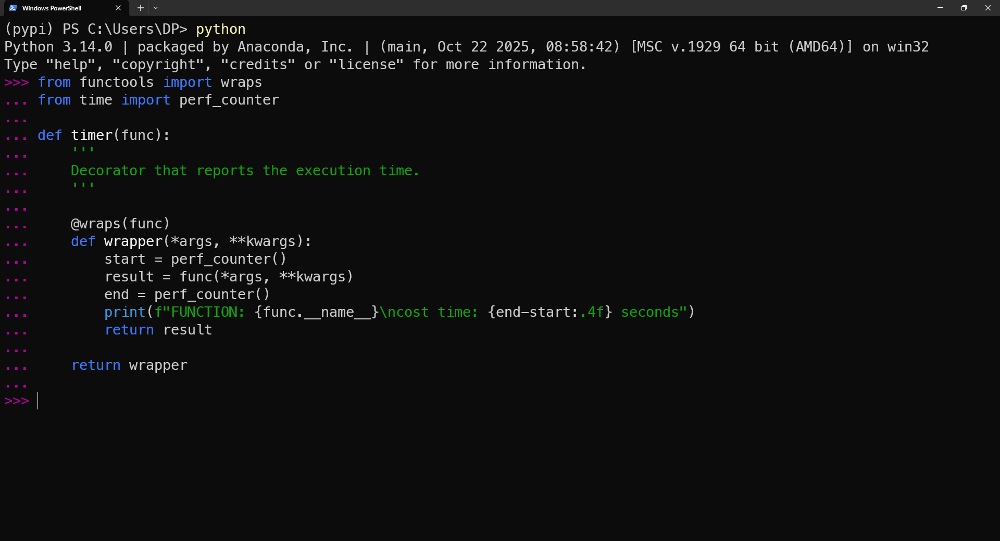
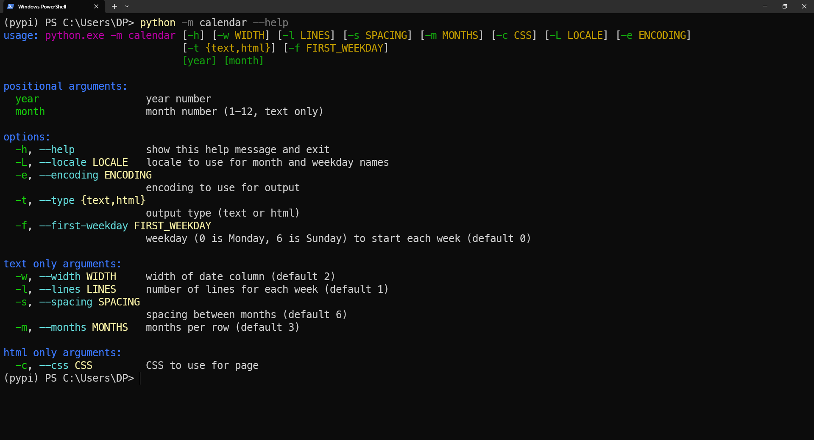
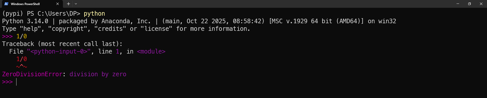
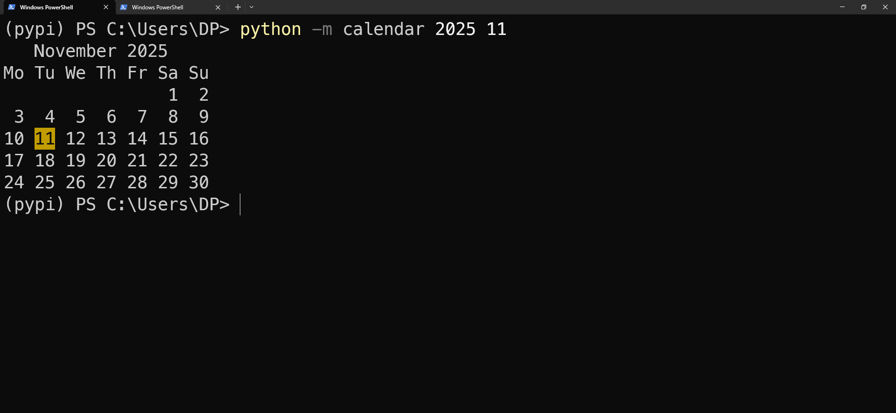
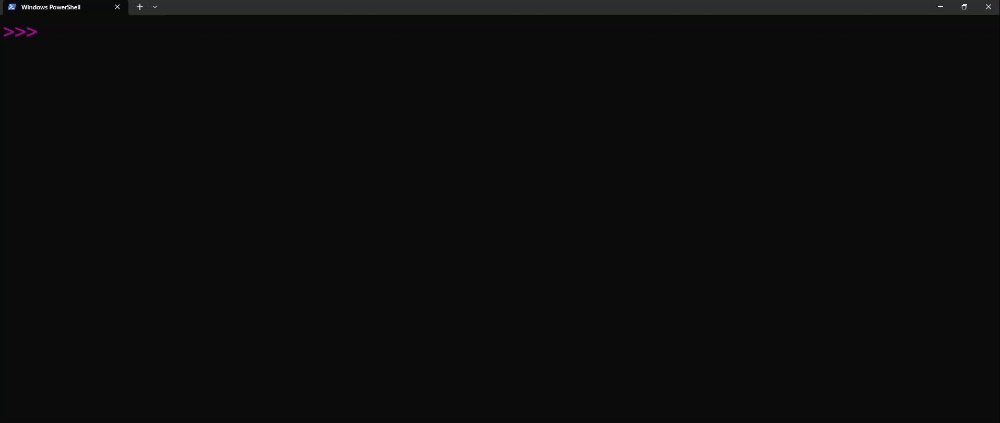
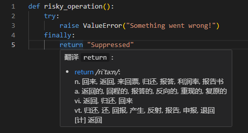
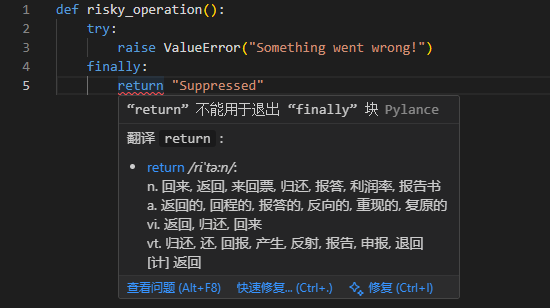

import Terminal from "./components/Terminal";
import Terminal2 from "./components/Terminal2";
import Terminal3 from "./components/Terminal3";
import Terminal4 from "./components/Terminal4";
import Terminal5 from "./components/Terminal5";
import Terminal6 from "./components/Terminal6";
import Terminal7 from "./components/Terminal7";
import Terminal8 from "./components/Terminal8";

# Python π

2025 年 10 月 7 日发布了 Python 3.14，今天来看看更新了什么

本篇介绍以下内容

- [REPL 更新](/blog/PythonPi#repl)
- [template-string](/blog/PythonPi#template-string)
- [更好的报错](/blog/PythonPi#更好的报错)
- [except & except*](/blog/PythonPi#except--except)
- [try...finally 中的 warning](/blog/PythonPi#tryfinally-中的-warning)
- [Free-threaded mode (No GIL)](/blog/PythonPi#free-threaded-mode-no-gil)

<!-- truncate -->

## REPL

- 终于支持 clear 清屏了
- 跨行编辑更舒服了
- 不需要 exit() 了，直接 exit 即可
- [Python 语法高亮](/blog/PythonPi#语法高亮)
- [import tab 补全](/blog/PythonPi#import-tab-补全)
- 使用 `F1` 键可以打开帮助文档
- 使用 `F2` 键可以打开历史记录
- 使用 `F3` 键可以进入粘贴模式

### 语法高亮

REPL 现在支持 python 语法高亮



而且部分标准库也添加了语法高亮，比如：

- help 文档也有高亮



- 报错也可以高亮



- 一些 print 也有高亮



:::tip
可以通过设定如下环境变量来关闭语法高亮:

> NO_COLOR=1
> 
> PYTHON_COLORS=0

设定如下环境变量来还原默认设置:

> PYTHON_BASIC_REPL=1
:::

### import tab 补全

在 import 和 from ... import 语句中，REPL 现在支持模块名的 tab 补全，类似 zsh 的路径补全



## template-string

在 python 3.14 中，新增了 template-string。其写法和 f-string 类似，刚上手不知道为什么要新增这个东西。来仔细研究一下吧

:::tip
f-string(*formatted string literals*)：在 Python 3.6 引入，写法为 `f"..."`，可以在字符串中嵌入表达式: `f"{expression}"`

t-string(*template string literals*): 在 Python 3.14 引入，写法为 `t"..."`, 同样可以在字符串中嵌入表达式: `t"{expression}"`
:::

先看一个例子

<Terminal2 />

f-string 在运行时，会把表达式的值直接嵌入字符串中，并直接返回一个 `str`，而 t-string 则是返回一个 `Template` 对象

:::info

之前就有 `string.Template` 类，这次新增的 `string.templatelib.Template` 和它是两个不同的类

| 类                          | 功能                                                                |
| --------------------------- | ------------------------------------------------------------------- |
| string.Template             | 在 Python 2.4 中引入，用 $variable 语法进行简单的变量替换           |
| string.templatelib.Template | 在 Python 3.14 中引入，自定义字符串处理逻辑，以安全性为核心设计理念 |

:::

**除额外说明，下文中的 `Template` 均指 `string.templatelib.Template` 类**

### 属性 & 方法

先来看一下 `Template` 对象有哪些内置**方法**

<Terminal />

总的来说就这三个比较重要: `interpolations`, `strings`, `values`; 以及 `__iter__` 方法，接下来我们慢慢讲

#### strings & interpolations

先回头看一眼 `t"Hello, {name}!"`，`Template` 对象会把这个字符串拆分成三部分: `["Hello, ", "{name}", "!"]`，即**根据插值的位置将其拆分**。然后把纯字符串部分存到 `strings` 里，把插值部分放到 `interpolations` 里，都以 tuple 的形式存储

也就是上面的 `greetings_t`，格式化一下

```python
Template(
    strings=('Hello, ', '!'),
    interpolations=(Interpolation('castamere', 'user', None, ''),)
)
```

刚看到这个对象可能有点懵，拼接成字符串时，里面每个值的位置是怎么确定的呢？笔者一开始疑惑这玩意不应该要额外存位置吗？后面反应了很久才想明白

t-string 会**根据插值的位置将其拆分**，那完整的字符串就是通过 `strings` 和 `interpolations` **交替拼接起来的**。而且 `strings` 和 `interpolations` 里的元素数量最多相差 1

但此时又有一个问题，笔者上面的例子是 `t"Hello, {name}!"`，存起来是 

```python
strings=('Hello, ', '!'),
interpolations=(Interpolation('castamere', 'user', None, ''),)
```

要拼接的话应该是 `strings[0] + interpolations[0] + strings[1]`，也就是先从 `strings` 里取，但如果开头就是插值要怎么办？比如 `t"{name}, Greetings!"`，不就应该是
`interpolations[0] + strings[0]` 吗？不应该有个新的字段来标记开头是字符串还是插值吗？

t-string 用了一个更简单的办法：规定**拼接时总是先从 `strings` 里取**，如果开头就是插值，就会把 `strings` 里的第一个元素设为空字符串 `''`。所以 `t"{name}, Greetings!"` 存起来其实是

```python 
Template(
    strings=('', ', Greetings!'),
    interpolations=(Interpolation('castamere', 'user', None, ''),)
)
```

**当需要拼接为字符串时，严格按照 `strings, interpolations` 的顺序交替取值即可**。这里就可以延申出来：`strings` 的长度总是等于 `interpolations` 的长度或者比它多 1

此时我们再回头看前面的内置属性：

<Terminal />

- `interpolations`: 插值部分的(Interpolation Obj tuple)
- `strings`: 纯字符串部分(str tuple)

这两个比较好理解，就是把 `Template` 里的 `interpolations` 和 `strings` 字段返回而已

#### values

而 `values` 则是把 `interpolations` 里的每个插值的**值**取出来，组成一个 tuple 返回

这里比较绕，简单来说就是，interpolations 里存的是 `Interpolation` 对象，而 `values` 里存的就是我们传入的值，传入的值是 str 反而不好理解，我们看下面这个例子

<Terminal3 />

在这里，我们的插值是一个字典，可以看到，在 `values` 里，存的就是我们传入的字典对象

这样，我们就可以用如下代码进行 t-string 的拼接，使用 zip_longest 是比较 pythonic 的写法

```python title="render.py"
from itertools import zip_longest

def render(template: Template) -> str:
    result = []
    for string, values in zip_longest(template.strings, template.values, fillvalue=''):
        result.append(string)
        if values: result.append(str(values))
    return ''.join(result)
```

当然，上面这个是最简单的拼接逻辑，如果真的只需要这样拼接，也用不上 t-string

#### `__iter__`

前面我们说到，`Template` 类实现了 `__iter__` 方法，那就是可以让我们直接对 `Template` 对象进行迭代

然后就可以开心的把上面的拼接代码改成这样:

```python title="render.py"
def render(template: Template) -> str:
    result = [i for i in template]
    return ''.join(result)
```

然后就报错了..

<Terminal4 />

其实不难定位，上面我们说过， `Template` 有 `strings`, `interpolations`, `values` 三个属性，而 `__iter__` 方法返回的是 `strings` 和 `interpolations` 交替组成的迭代器，而不是 `strings` 和 `values` 交替组成的迭代器

所以我们在迭代 `Template` 对象时，取到的插值部分是 `Interpolation` 对象，而不是我们传入的值

要实现我们想要的效果，可以改一点点:

```python title="render.py"
def render(template: Template) -> str:
    result = [i for i in template if not isinstance(i, Interpolation) else str(i.value)]
    return ''.join(result)
```

当然，到目前为止，我们用的都是最简单的例子，还没有看到 t-string 有什么特别的优势

### t-string 的优势

> 有了 t-字符串，开发者可以编写专用系统来无害化 SQL，执行安全的 shell 操作，改进日志记录，处理 Web 开发中的现代概念(HTML, CSS 等等)，以及实现轻量级的自定义业务 DSL

参考 [t-string 的应用场景](https://www.cnblogs.com/pythonista/p/18852424)

## 更好的报错

现在的报错会显示更多有用的信息

<Terminal5 />

旧版本的报错相比之下就有点逆天，只会告诉你 `invalid syntax`:

<Terminal6 />

## except & except*

except 多个异常时，可以不用加括号了

```python title="except.py"
try:
    ...
except ValueError, TypeError:
    print("Caught ValueError or TypeError") 
```

但是如果要使用 as 的话，还是需要加括号

```python title="except_as.py"
try:
    ...
except (ValueError, TypeError) as e:
    print(f"Caught an exception: {e}")
```

## try...finally 中的 warning

python 的 try...except...finally `语句中，finally` 一般用于清理资源，比如关闭文件、释放锁等。看一下下面这个例子：如果我们在 `try` 块中抛出一个异常，然后在 `finally` 块中使用 `return`，此时异常就被吞掉了，调用这个函数永远不会看到这个异常，debug 时将十分痛苦

<Terminal7 />

在 Python 3.14 中，如果在 `finally` 块中使用了 `return`, `break`, `continue`。解释器会发出一个 `SyntaxWarning`，提醒开发者注意这种潜在的问题

<Terminal8 />

切换解释器后，vscode 里也会有这个 warning

3.13:



3.14:



可以用这个 warning 来改旧代码，把 `return`, `break`, `continue` 从 `finally` 块中移到后面即可

## Free-threaded mode (No GIL)

Python 3.14 正式引入了无 GIL 版本，给 Python 带来了真正的多线程支持，对于之前用 multiprocessing 模块来实现多进程的场景，现在有了新的方式。但真正用起来怎么样，还是得以后找合适的机会研究了

## 后记

在 [improved modules](https://docs.python.org/3.14/whatsnew/3.14.html#improved-modules) 一节，还提到了很多更新了的内置模块，感兴趣的可以去看看官方文档