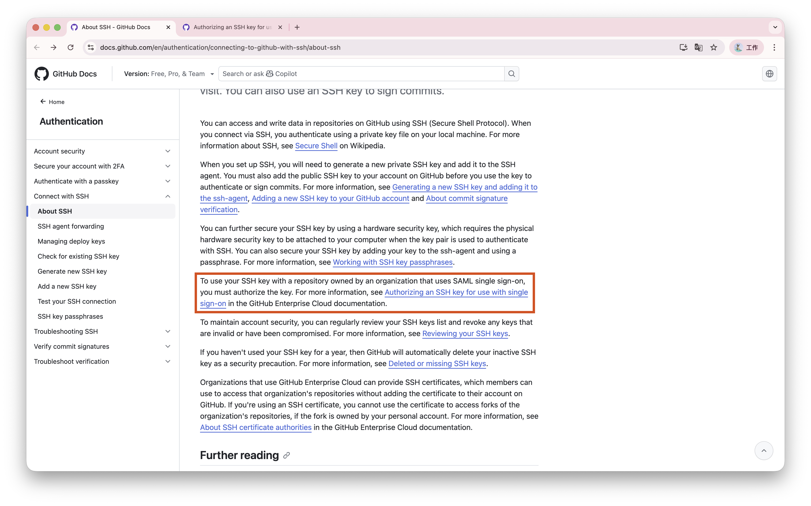
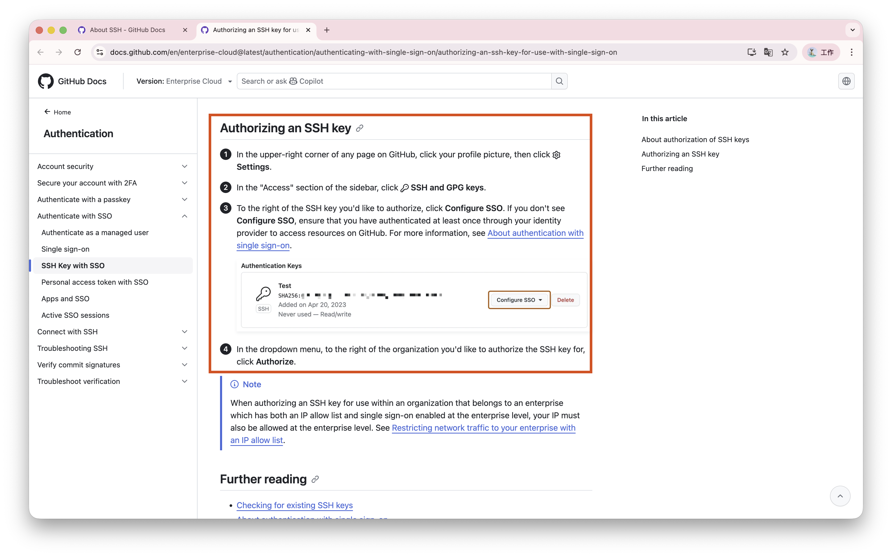
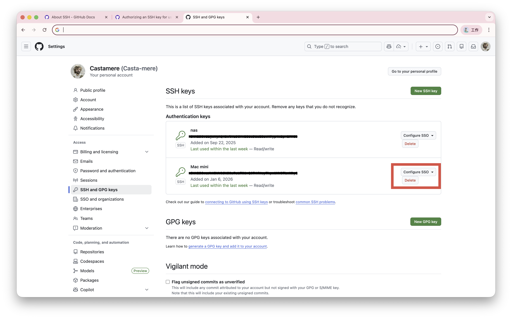

# Github SAML SSO 问题

解决 Github SAML SSO 导致无法 clone 代码的问题

:::danger Error
Cloning into 'xxx'...

remote: The 'xxx' organization has enabled or enforced SAML SSO.

remote: To access this repository, you must re-authorize the OAuth Application 'Visual Studio Code'.

fatal: unable to access 'xxx': The requested URL returned error: 403
:::

<!-- truncate -->

## 缘起

新公司用 github，拉进 organization 之后，发现本地无法 clone 代码。报错说要重新授权，记录一下

## 解决方案

首先尝试用 ssh 克隆，但还是失败，但给出了更详细的解决方案：要么用 HTTPS，要么给 SSH 授权

:::danger Error
Cloning into 'xxx'...

ERROR: The 'xxx' organization has enabled or enforced SAML SSO.

To access this repository, you must use the HTTPS remote with a personal access token or SSH with an SSH key and passphrase that has been authorized for this organization.

Visit https://docs.github.com/articles/authenticating-to-a-github-organization-with-saml-single-sign-on/ for more information.

fatal: Could not read from remote repository.

Please make sure you have the correct access rights and the repository exists.
:::

跟着它给出的文档，找到了如下的内容:



继续进一层，找到了如下内容:



最终解决办法如下:

1. 访问 [Github SSH Settings](https://github.com/settings/keys)
2. 在此处为对应 SSH 添加 SSO 权限

3. 再回到本地，即可成功 clone

## 后记

使用如下命令，可以在全局范围内将 https 的 github 地址替换为 ssh 地址，如 `go mod download` 也能用 ssh 拉取代码

```bash
git config --global url."git@github.com:".insteadOf "https://github.com/"
```