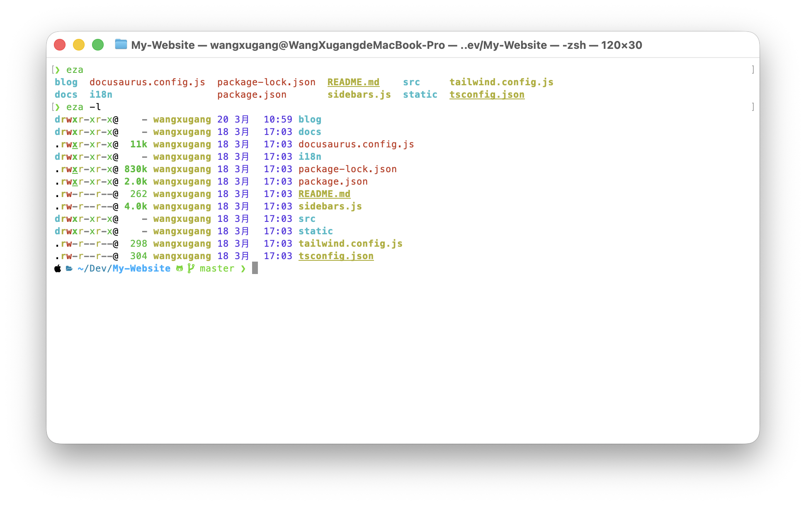
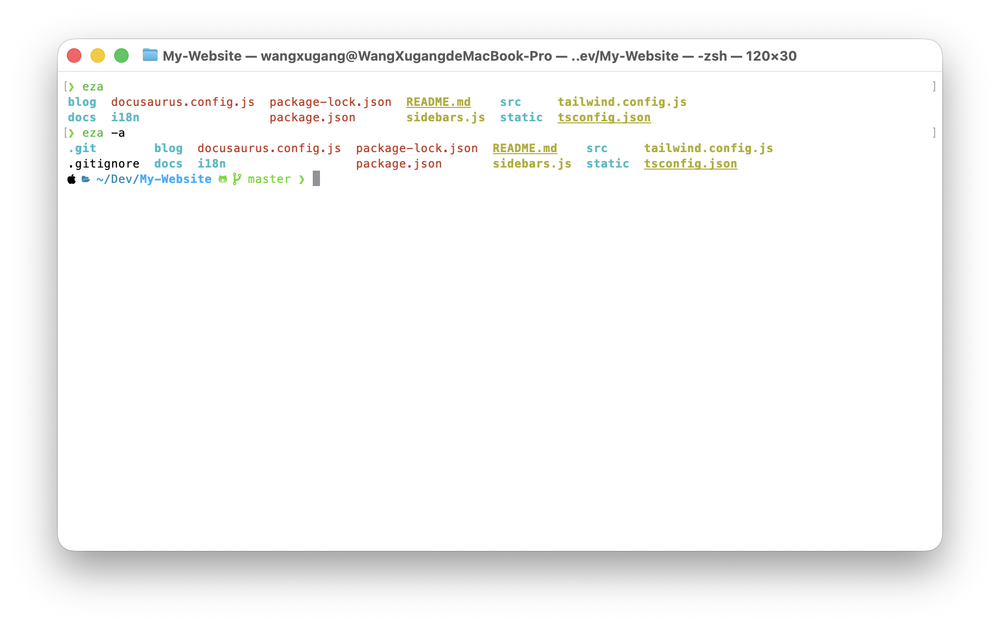
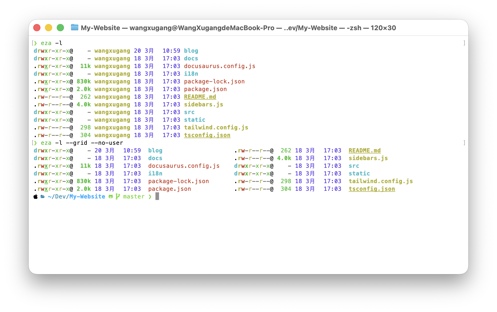
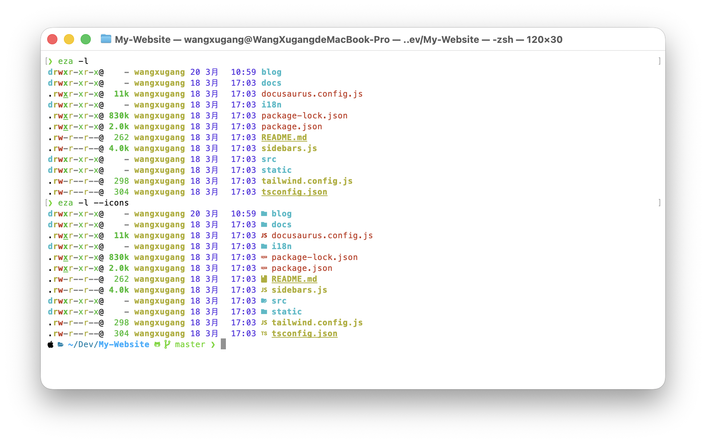
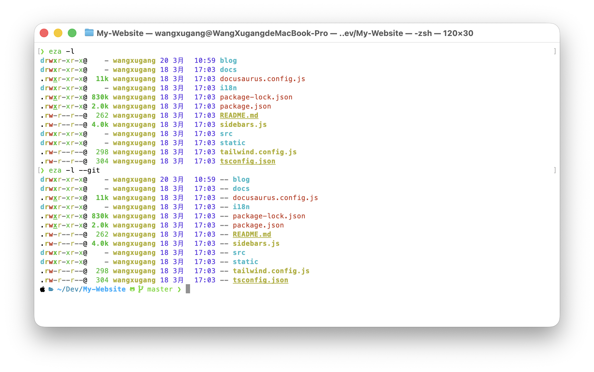
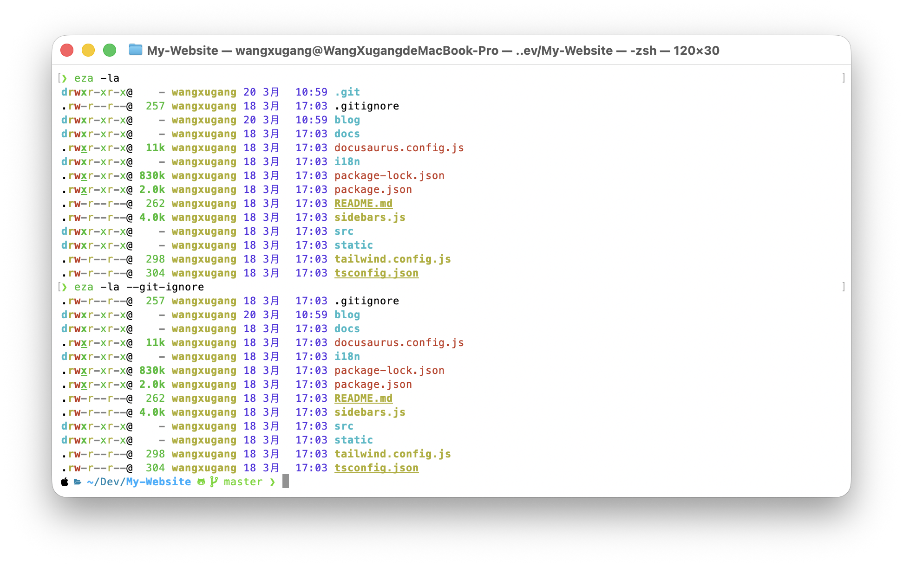
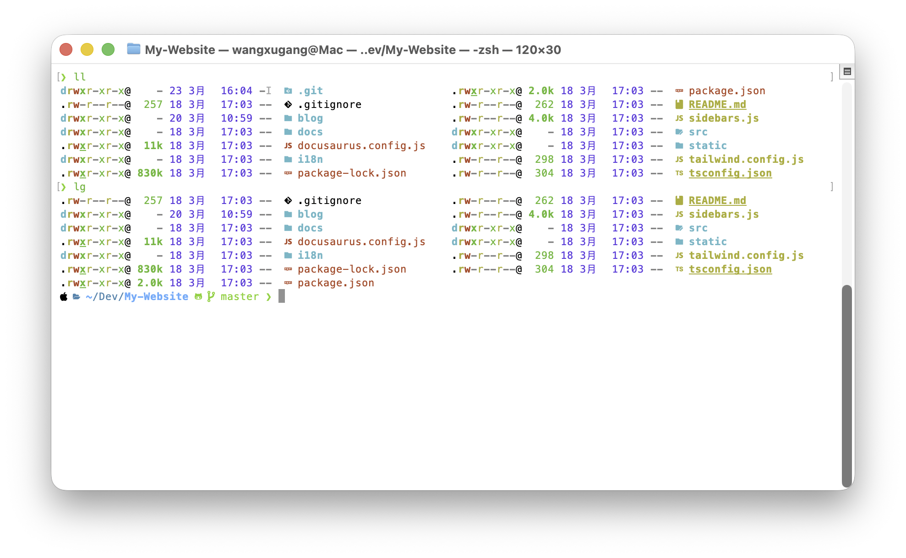
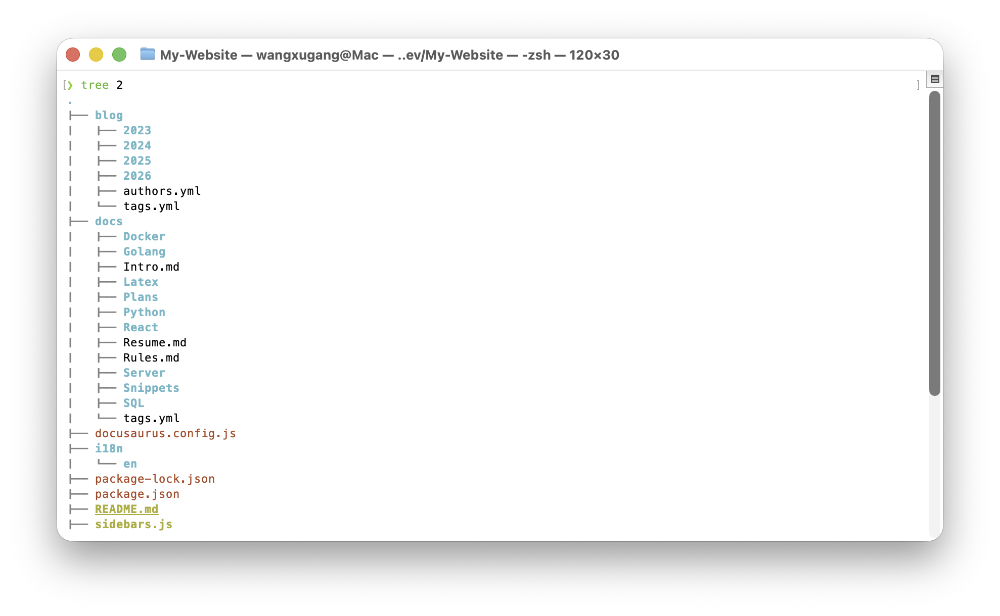

import TabItem from "@theme/TabItem";
import Tabs from "@theme/Tabs";

续上集 [配置 Linux 终端 (zsh)](/blog/LinuxTerminal)

<!--truncate-->

## 缘起

拿到新 Mac 后，配置新终端参考了之前的一些文章，也发现了一些新的小工具。而且之前只是适用于 Linux，这次也加上一些 MacOS 的内容

## eza

[eza](https://github.com/eza-community/eza) 是一个现代化的 `ls` 替代品，提供了更丰富的功能和更美观的输出格式。它支持彩色输出、图标显示、Git 状态等功能


安装方式如下，更多平台可以参考 [eza install](https://github.com/eza-community/eza/blob/main/INSTALL.md)

<Tabs groupId="operating-systems">
  <TabItem value="MacOS" label="MacOS">
  
```bash
brew install eza
```
  
  </TabItem>
  <TabItem value="Linux" label="Linux">
  
```bash
sudo mkdir -p /etc/apt/keyrings
wget -qO- https://raw.githubusercontent.com/eza-community/eza/main/deb.asc | sudo gpg --dearmor -o /etc/apt/keyrings/gierens.gpg
echo "deb [signed-by=/etc/apt/keyrings/gierens.gpg] http://deb.gierens.de stable main" | sudo tee /etc/apt/sources.list.d/gierens.list
sudo chmod 644 /etc/apt/keyrings/gierens.gpg /etc/apt/sources.list.d/gierens.list
sudo apt update
sudo apt install -y eza
```

  </TabItem>
</Tabs>

<Tabs groupId="operating-systems">
  <TabItem value="MacOS" label="MacOS">Use Ctrl + C to copy.</TabItem>
  <TabItem value="Linux" label="Linux">Use Command + C to copy.</TabItem>
</Tabs>

### 参数

这里笔者列出一些比较实用的参数：

- `-l`：以长格式显示文件信息



- `-a`：显示所有文件，包括隐藏文件



- `--grid`：以网格格式显示文件列表



- `--icons`：显示文件类型图标



- `--git`：显示 Git 状态信息



- `--git-ignore`：根据 .gitignore 忽略文件



### 个人预设

笔者添加了以下预设

```bash title="~/.zshrc"
alias ll='eza -la --grid --git --icons=auto --no-user'
alias lg='ll --git-ignore'
alias tree='eza -T -L'
```

效果如下, `ll` 命令以网格显示所有文件，`lg` 命令额外忽略 gitignore 中的文件:



`tree` 命令需要后加层级数，例如 `tree 2` 显示两层目录结构


 
## lazygit

[lazygit](https://github.com/jesseduffield/lazygit)

```bash
brew install lazygit
```

## btop

[btop](https://github.com/aristocratos/btop)

```bash
brew install btop
```

## Glow

[Glow](https://github.com/charmbracelet/glow)

```bash
brew install glow
```

## Ranger

[Ranger](https://github.com/ranger/ranger)
