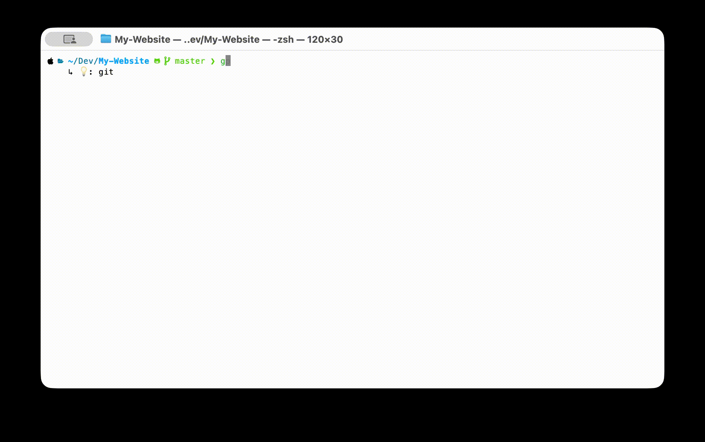

import GitHubRepo from "@site/src/components/GitHubRepo";

alias 用多了之后就有一个问题：敲 `gco` 的时候记得它是 `git checkout`，但 `gcb` 是什么来着？`dcu` 又是什么？通常的做法是 `which gcb` 看一眼再回来重敲一遍，挺打断思路的。笔者写了个 Zsh 插件，在敲命令的时候直接把 alias 展开后的内容显示在 message area，免去这一步



<!--truncate-->

## 缘起

笔者 `~/.zshrc` 里 alias 越攒越多 —— eza 的几个变体、git 的若干缩写、docker compose 一坨。短 alias 敲起来是省事，但回头看历史记录或者教别人用的时候，经常要 `which xxx` 一下才想起来到底展开成什么

之前也想过把 `which` 绑个快捷键，但本质上还是要打断输入流。笔者想要的是 IDE 里那种 inline hint —— 边敲边看，眼角余光扫一眼就够了。Zsh 的 message area（提示符下面那一行）正好闲着，于是就有了这个插件

## 功能


主要功能有：

- 实时预览 alias 展开后的命令，显示在 message area
- 可以配置只对感兴趣的命令展示，避免被 `ll` 之类的低价值预览刷屏
- 长命令自动截断，不会撑爆下面那一行
- 仅在内容变化时重绘，避免输入过程中的闪烁

## 安装

:::tip
如果还没装过 Zsh 和 Oh My Zsh，可以先看 [配置 Linux 终端 (zsh)](/blog/LinuxTerminal) 把基础环境搭好
:::

目前是 Oh My Zsh manual install。先把仓库 clone 到 custom plugins 目录：

```bash
git clone https://github.com/Casta-mere/zsh-alias-preview \
    ${ZSH_CUSTOM:-~/.oh-my-zsh/custom}/plugins/zsh-alias-preview
```

然后在 `~/.zshrc` 的 `plugins=(...)` 里加上 `zsh-alias-preview`，最后 source 一下：

```bash
source ~/.zshrc
```

## 配置

默认只对 `git` 和 `docker` 这两个命令的 alias 显示预览 —— 笔者的高频场景就这俩，其他的不太常需要看展开。想加别的命令，在 `~/.zshrc` 里做如下修改即可：

```zsh title="~/.zshrc"
typeset -ga ALIAS_PREVIEW_COMMANDS=(git docker ls kubectl)
```

规则很简单：alias 展开后第一个 token 在数组里就显示预览，不在就什么都不做。例如 `gco='git checkout'` 会显示，`ll='ls -alF'` 默认不会，加 `ls` 进去之后就会

## 实现思路

整个插件没有引入任何依赖，全靠 Zsh 自身的 ZLE (Zsh Line Editor) 机制。核心就三件事

**挂钩重绘事件。** Zsh 提供了 `add-zle-hook-widget`，可以在 ZLE 的几个生命周期点（`line-init` / `line-pre-redraw` / `line-finish` 等）注入自己的 widget。这里挂在 `line-pre-redraw` 上 —— 每次行内容变化、重绘前都会触发：

```zsh
add-zle-hook-widget line-pre-redraw _preview_alias_message
```

**解析当前命令行的第一个 token。** ZLE 把当前输入暴露在 `$BUFFER` 变量里。去掉前导空格、取第一个空格之前的部分，就是用户正在敲的命令。然后用 `${aliases[$first_word]}` 查 Zsh 内置的 `aliases` 关联数组（所有 alias 都在这里），有就拿到展开字符串：

```zsh
local trimmed="${BUFFER#"${BUFFER%%[! ]*}"}"
local first_word="${trimmed%% *}"
local expanded="${aliases[$first_word]}"
```

**写到 message area。** `zle -M <text>` 就是往提示符下面那行写消息的标准 API，输入下一个字符就会自然刷新。再配一个 `_alias_preview_last` 缓存，避免内容没变时的重复重绘 —— 这就是「不闪烁」的全部秘密：

```zsh
zle -M "    ↳ 💡: ${expanded}"
```

剩下两个细节：

- **过滤命令** 用 `${ALIAS_PREVIEW_COMMANDS[(Ie)$exp_cmd]}` —— `(Ie)` 是 Zsh 数组的精确匹配下标语法，返回索引，存在则非零
- **避开补全菜单** 通过判断 `$LASTWIDGET` 是否包含 `complete` 等关键字，否则会和 `_complete` 冲突，把补全列表覆盖掉

## 后记

插件还很新，已知有几个地方没处理好，记录一下：

- **嵌套 alias 不展开。** 如果 `gco='git checkout'`、`gcm='gco main'`，敲 `gcm` 时只会看到 `gco main` 这一层，不会再继续把 `gco` 展开成 `git checkout`
- **function 形式的 alias 看不到。** Zsh 里很多人会用 `function name() { ... }` 替代 alias，这种东西不在 `${aliases[]}` 里，本插件不处理
- **全局 alias（`alias -g`）没考虑。** 全局 alias 可以出现在命令的任意位置，按「第一个 token」匹配的策略会漏掉
- **截断长度暂时写死 80。** 之后想抽成可配置项

笔者自己用够了，先这样。有边界情况欢迎开 issue 或者 PR

<GitHubRepo owner="Casta-mere" repo="zsh-alias-preview" />