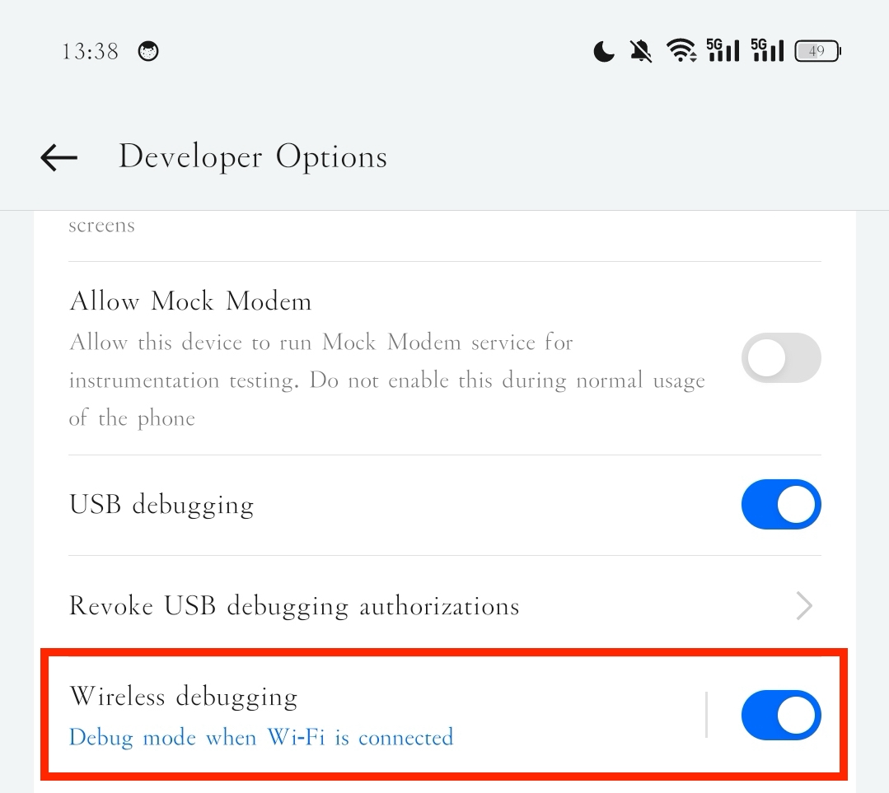
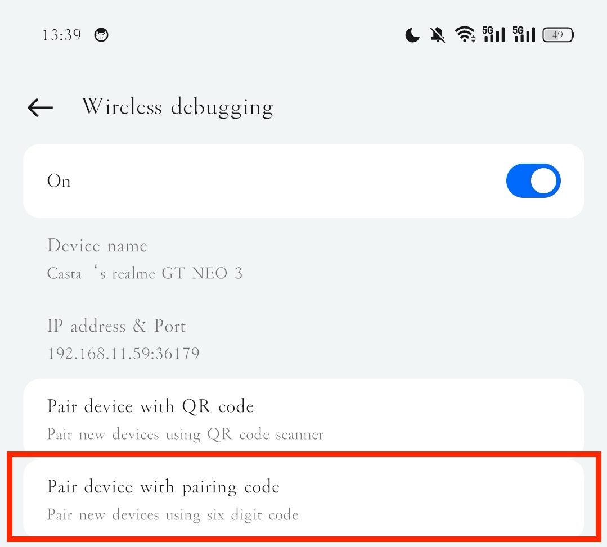
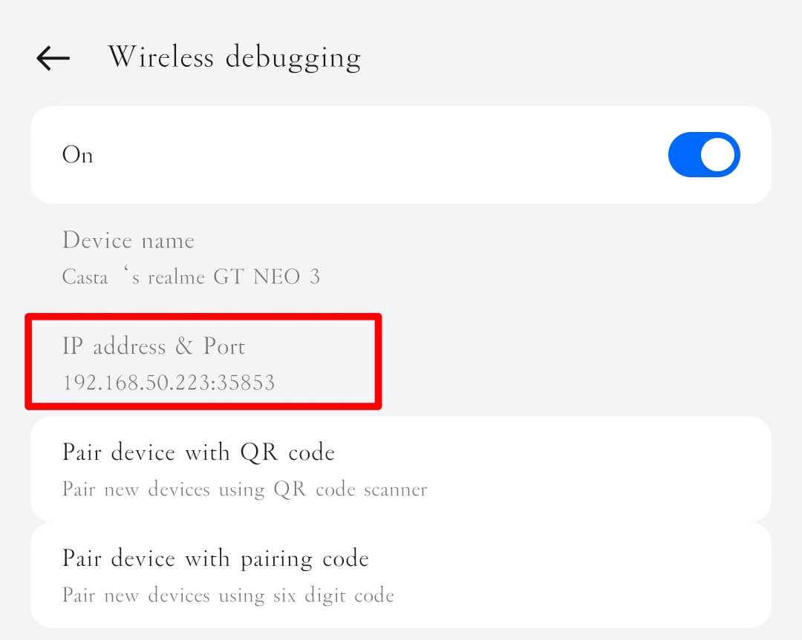

# 在 Mac 上无线调试 Android 设备

记录如何在 Mac 上通过 ADB 无线调试 Android 设备，以及首次配对和后续快速连接的操作步骤

<!--truncate-->

## 连接流程

首先确保手机和电脑连接在同一 Wi-Fi 下，然后按照以下步骤进行操作：

1. 手机端: 打开 developer mode
2. 电脑端: 安装 Android Platform Tools，可以通过 Homebrew 安装：`brew install android-platform-tools`
3. 手机端: 进入 developer options，找到 `Wireless debugging` 选项并启用

4. 手机端: 进入 `Wireless debugging` 的设置
5. 手机端: 点击 `Pair device with pairing code`，记下显示的 pairing code 和 IP

6. 电脑端: 在终端输入以下命令进行配对：

   ```bash
   adb pair <IP_ADDRESS>:<PORT> 
   ```

   在提示输入 pairing code 时，输入手机上显示的 code 进行配对
7. 手机端: 配对成功后，记录下设备的 IP 地址和端口号


8. 电脑端: 电脑端输入以下命令连接设备，使用上一步的 IP 地址和端口号：

   ```bash
   adb connect <IP_ADDRESS>:<PORT>
   ```
## 后续连接

后续再次连接时，只要确保手机和电脑在同一 Wi-Fi 下，手机端只要打开 `Wireless debugging` 就会自动重连