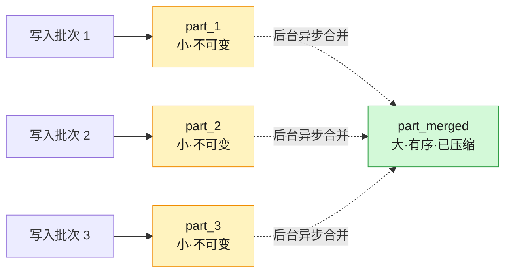
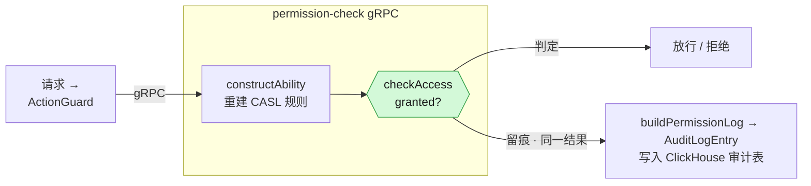
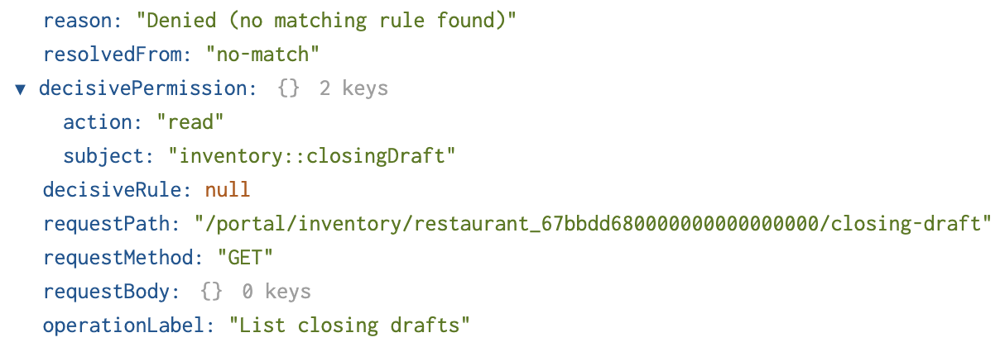

import Terminal from "./components/Terminal";
import Compression from "./components/Compression";
import Dictionary from "./components/Dictionary";

# ClickHouse：Audit Log 的存储革命

一次排班的修改, 一次权限的开关, 当下不过是系统里再普通不过的一条记录；可几个月后, 它可能突然成为所有人都在追问的问题——「三个月前这家店的菜单是谁改的？」。审计日志(audit log)里有答案, 但要把它留得住, 查得动, 背后是一次存储与查询的革命

本篇包括以下内容：

- ClickHouse 和 Audit Log 
- 三个笔者在生产实践中遇到的问题，以及引发的思考

<!--truncate-->

## 缘起

笔者目前在 FeedMe 负责 hrm-service。FeedMe 是餐饮行业的 operating system——从前台点单到后厨出餐, 从排班到结算, 整套系统每天要承载约 300 万次操作：订单, 支付, 菜单变更, 员工操作, 库存变动, 报表生成, 最终全都沉淀在这里

hrm-service 管的是其中和「人」有关的那部分：员工, 角色, 权限, passcode, 排班(timesheet)。这里的每一个敏感动作, 都要先过一道权限校验——后端用 CASL 定义能力, 每个接口挂上 `@Action({action, subject, condition, operationLabel})` 装饰器, 再由 `ActionGuard` 拦下来判断这个人能不能做这件事。而判断的结果, 无论 `allowed`, `denied` 还是 `skipped`, 连同是谁(`userId`), 对什么(`subject`), 做了什么(`action`), 都会被原样写进一张审计表。换句话说, 审计不是某个角落里的附加功能, 它缝在了每一个受保护的接口上

这些记录平时是隐形的, 淹没在每天数以万计的校验里, 没人会多看一眼。直到某一天, 它们中的某一条突然成为会议室里最重要的问题：谁在三个月前改了这家店的权限？那次排班调整是谁批的, 改之前是什么？这类问题从不提前打招呼, 等它出现时, 答案要么在, 要么不在

**最大的挑战不是流量, 是时间**

300 万次操作听上去不少, 但拆到每秒, 再配合现代数据库的吞吐, 这个量级其实并不可怕。真正改变一切的, 从来不是峰值流量。**The challenge is not extreme traffic. The challenge is time.**

马来西亚的相关法规通常要求销售及审计相关的数据保留 7 年。留一个月的数据谁都做得到, 但要把每一条操作原封不动地留够七年, 并且这七年里的任何一天都能被翻出来追查, 是另一个完全不同量级的问题

矛盾就摆在这里：

- 数据太贵, 留不住——存储成本随时间线性累积, 七年足以让任何「先存着再说」的方案破产, 最后只能忍痛丢掉历史
- 数据太冷, 查不动——就算咬牙全留下来, 传统行式存储面对「三年前某家店的全部权限变更」这类查询时, 也慢到没人愿意等
 
失去历史, 或失去用处, 二选一

## ClickHouse & Audit Log

ClickHouse 恰好是为打破这个二选一而生的。把审计日志的特征摊开来看, 会发现它和 ClickHouse 的设计几乎严丝合缝

| 审计日志特点               | ClickHouse 优势                              |
| -------------------------- | -------------------------------------------- |
| 字段重复率高               | 列式存储 + 压缩                              |
| 不可变, 仅追加写入         | MergeTree 引擎                               |
| 临时查询为主, 难以预建索引 | 原生 OLAP 查询能力/可以对原始数据执行SQL操作 |

### 列式存储 & 压缩

最直接的红利来自列式存储。要理解它为什么对审计日志这么关键, 得先看一次典型的审计查询要查询什么——「过去一个月这家店的权限变更」, 它过滤的是 `businessId`, `subject`, `timestamp`, 最后也只取这么几列。传统行式存储把一整行的所有字段连续摆在一起, 哪怕只问三列, 磁盘也得把每一行整条读出来再丢掉大半；列式存储反过来, 把同一列的值连续排布, 查询几列就只读几列, 其余字段安安静静躺在磁盘上不被打扰

而列式存储真正的杠杆在压缩。同一列的值连续排布, 排序之后, 相同的值彼此相邻——审计日志的字段重复率又高得惊人：`subject`, `action`, `outcome`, `country` 这些字段, 在几百万行里翻来覆去也就那么几十个取值。这种连续的重复模式, 正是压缩算法最爱啃的骨头。ClickHouse 官方 docs 里跑过一份 Stack Overflow `posts` 表的基准：低基数列的压缩比能冲到 27 倍(`PostTypeId`), 甚至上千倍(`FavoriteCount` 高达 1853 倍)。审计日志的形状比那还要规整, 压缩空间只多不少

<Compression />

在自动压缩之上, 还有两层可以手动加的杠杆

第一层是 `LowCardinality(String)`, 思路是字典编码(哈希表)：把一列里反复出现的字符串收进一张小字典, 行里只存指向字典的整数下标。审计日志几乎每一列都像是为它量身定做的

- `action` 死死锁在 CASL 的 `manage / create / read / update / delete` 五个动作上, 
- `subject` 是 `::` 分层的资源名(`business::hrm::teamMember`, `business::menu::item`, ...)
- `country` 是 ISO 国家码, 来回也就那几十个取值

把这些列从裸 `String` 换成 `LowCardinality(String)`, 再叠一层 `ZSTD`, 几乎是白捡的压缩

<Dictionary />

第二层是给特定形状的列挑专门的 **CODEC** (coder/decoder)。最典型的是时间戳：`timestamp` 是单调递增的序列, 相邻两条记录的差值往往只有几秒, 存差值远比存绝对值划算——这正是 `Delta` 编码的用武之地, 它先把序列转成一串小差值, 再交给 `ZSTD`([*Zstandard*](https://github.com/facebook/zstd)) 去压。官方对可观测性数据的建议很直白：「`ZSTD` all the way」, 字符串, 数值列统统上 `ZSTD`, 时间戳再额外加一层 `Delta`。几样叠起来, 同一份审计数据的落盘体积能压到行式存储的零头

### MergeTree

写入模式也契合。审计日志本质上是 immutable 的——一条记录一旦落库就**不该**再改, 它不像业务表那样有「更新某个字段」的需求, 只会随着时间不断追加新行。这种「只增不改」的形式, 恰好是 ClickHouse `MergeTree` 引擎的设计理念

`MergeTree` 的工作方式简单说就是「先快写, 再慢合」。每一批写入都按排序键(`ORDER BY`)排好序, 落成磁盘上一个独立的, 不可变的 part——这一步是纯顺序写, 极快。之后后台再异步地把小 part 合并成大 part, 顺手做整理与压缩。查询时它靠的是一份稀疏主键索引(默认 `index_granularity = 8192`, 每 8192 行才留一个标记), 配合排序键快速跳过整段无关数据, 而不必像 B-Tree 那样为每一行维护索引。对一张只增不改, 按时间和 `businessId` 天然有序的审计表来说, 这套机制几乎不费力



### OLAP

最后是 OLAP (Online Analytical Processing) 查询能力, 而这恰恰是审计场景最吃紧的地方。审计里最棘手的从来不是高频的固定查询, 而是那些临时调查(ad hoc investigation)：「谁在三个月前改了这家店的权限」「这个被拒绝的操作之前, 那个账号还做过什么」——没人能提前预测会被问到什么, 自然也无从为它预建索引

传统的行式 OLTP (Online Transaction Processing)数据库擅长的是「精确点查一行, 再改掉它」, 可一旦问题变成「扫过去三年某家店的全部权限变更, 再按人聚合」, 它就得逐行翻遍整张表, 慢到没人愿意等。ClickHouse 是为这类问题而生的——列式存储让它只读相关的几列, 向量化执行让它一次处理一整批数据, 几亿行的聚合也能压到秒级。换句话说, 它允许你直接用 SQL 在原始审计数据上提问, 而不必为每一种可能的提问预先铺好路

开头那个会议室里的问题, 实际的 SQL 上不过是几行——给定一家店, 过去一个月里谁动过它的权限, 哪些尝试被拒绝了：

```sql title="investigate.sql"
SELECT timestamp, userId, action, outcome
FROM hrm_audit_log
WHERE businessId = 'biz_8f2c'
  AND subject = 'business::hrm::teamMember'
  AND timestamp >= now() - INTERVAL 1 MONTH
ORDER BY timestamp DESC
```

运行结果如下：

<Terminal />

## 审计日志

### 日志的生成

先来介绍一下审计日志, 它的入口是一个装饰器——每个受保护的接口都挂着 `@Action`, 声明这次操作的 `level`（`0/1/2`, 对应 FeedMe / Business / Restaurant 三个层级）、`subject`、`action`, `condition` 以及一个 `operationLabel`：

```ts title="timesheet.controller.ts"
@Action({
  level: Permission.Level.restaurant,
  subject: Permission.Subject.Business.hrm_employee,
  action: Permission.Action.read,
  operationLabel: 'View timesheets',
})
```

除了静态的 Str, `operationLabel` 还可以传入函数, 按请求体动态生成——portal-user 接口上就写着 `Add new team member: {email}`, pos-role 上是 `Add new employee role: {name}`, 运行时把真实的邮箱、角色名填进去, 各个使用者可以根据业务需求定制自己的 `operationLabel` 模板, 让审计日志里记录的操作更具可读性, 也更方便后续调查时的搜索和过滤

请求进来, `ActionGuard` 读出 `@Action` 元数据, 连同 `userId`、`businessId`、`restaurantId`、请求路径与方法, 一起发送给后端。真正干活, 也真正写审计的, 是另一头那个独立的 permission-check gRPC 服务——它用 `constructAbility` 重建这个人的 CASL 规则, 跑 `checkAccess` 得出 `granted`/`denied`, 再调 `buildPermissionLog` 把结果打包成一条 `AuditLogEntry`, 最后写进 ClickHouse



**判定与留痕同源**：放行与否的那次计算, 和写进审计表的那条记录, 出自同一份 `checkAccess` 结果, 不存在「日志和实际行为对不上」的缝隙

### 日志的内容

最初版本的日志表如下：

```sql title="hrm_audit_log Clickhouse DB schema"
CREATE TABLE default.hrm_audit_log (
  `timestamp` DateTime,
  `userId` String,
  `subject` String,
  `action` String,
  `field` Nullable(String),
  `businessId` Nullable(String),
  `restaurantId` Nullable(String),
  `country` Nullable(String),
  `outcome` Enum8('allowed' = 1, 'denied' = 2, 'skipped' = 3),
-- highlight-next-line
  `metadata` String
)
ENGINE = MergeTree
ORDER BY (timestamp, userId)
SETTINGS index_granularity = 8192
```

值得单独说一句的是 `metadata` 里装的东西。它不只记下「结果是 allowed 还是 denied」，更记下**为什么**：`resolvedFrom` 标明这次判定是被哪一类规则命中的（`admin`、`staff`、`permissionSet`、`systemPermissionSet`，或者干脆 `no-match`），`decisiveRule` 和 `decisivePermission` 钉住那条起决定作用的具体规则，`trace` 留下推导的面包屑，外加 `requestPath`、`requestMethod`、`operationLabel`。普通日志告诉你「门没开」，这条记录能告诉你「是哪把锁、按的哪条规矩没开」——这正是审计区别于排障日志的地方

比如下面就是一个样例：

Permission Granted:


Permission Denied:



## Bug 1 - Order By 导致的性能问题

## Bug 2 - 合并策略

## Bug 3 - metadata 字段过大