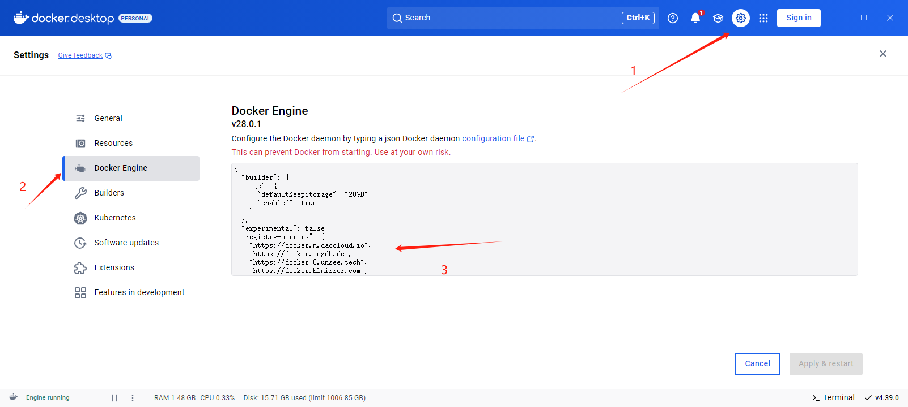

# Docker 基础

## Docker 安装

### Linux

```bash title="安装 Docker"
curl -fsSL get.docker.com -o get-docker.sh
sudo sh get-docker.sh --mirror Aliyun
```

正常来说，安装好会自动启动 Docker，如果没有成功就用以下命令启动

```bash title="启动 Docker"
sudo systemctl enable docker
sudo systemctl start docker
```

使用 `docker run hello-world` 来验证是否安装成功。如果拉取镜像超时/缓慢，参考 [Docker 换源]

### Windows

点击 [链接] 下载 Docker Desktop for Windows

下载好之后双击 Docker Desktop Installer.exe 开始安装

## Docker 换源

Docker 换源，在对应配置文件添加如下内容即可


```bash
# 添加如下内容
{
    "registry-mirrors": [
     "https://docker.m.daocloud.io",
     "https://docker.imgdb.de",
     "https://docker-0.unsee.tech",
     "https://docker.hlmirror.com",
     "https://docker.1ms.run",
     "https://func.ink",
     "https://lispy.org"
    ]
}
```

### Windows



### Linux

```bash
vi /etc/docker/daemon.json
```

重启 docker 服务

```bash
systemctl daemon-reload && systemctl restart docker
```
[Docker 换源]: /docs/Docker/Basic#docker-换源
[链接]: https://desktop.docker.com/win/main/amd64/Docker%20Desktop%20Installer.exe