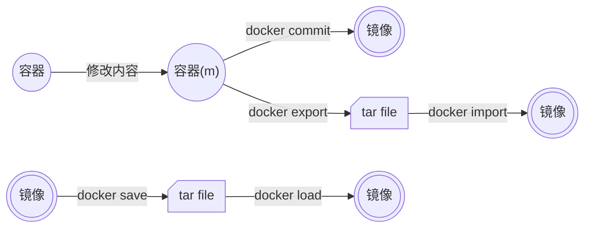

import Terminal1 from "./components/Command/Terminal1";
import Terminal2 from "./components/Command/Terminal2";
import Terminal3 from "./components/Command/Terminal3";

# Docker 命令

本篇将 Docker 命令分为以下几个部分介绍

- 镜像命令
- 容器命令
- 镜像容器持久化命令
- 其他命令

:::tip
docker build 相关参考

docker compose 相关参考
:::

## 镜像

### 拉取镜像 (pull)

```bash
docker pull REPO[:TAG]
```

### 列出现有镜像 (iamges)

```bash
docker images
```

### 删除镜像 (image rm)

```bash
docker image rm IMAGEID
```

### 其他技巧

组合起来删除所有镜像

```bash
docker image rm $(docker image ls -q)
```

## 容器

### 列出容器 (ps)

```bash
docker ps
docker ps -a  # 列出所有容器(包括停止的)
docker ps -aq # 只列出容器 id (用于批量删除)
```

### 创建容器 (run)

```bash
docker run IMAGENAME
docker run -it IMAGENAME # 交互式运行容器，并分配一个伪终端
docker run -d IMAGENAME # 后台运行容器
# ps： 容器是否会长久运行，是和 docker run 指定的命令有关，和 -d 参数无关。
# 其他参数

# --name: 指定容器名字
# -p: 端口映射，格式为 host_port:container_port
# -v: 挂载卷，格式为 host_dir:container_dir
# --rm: 用完即删
# -e: 环境变量
```
:::info
可以查看下方的[样例](/docs/Docker/Command#样例)进行练习
:::

### 进入容器 (attach)

"**进入**" 容器，可以使用 `docker attach CONTAINERID` 命令，但并不推荐，原因在下面会说。该命令是直接连接到容器中运行的 tty

### 启动容器 (start)

"**启动**"容器和上面的"**创建**"容器容易造成歧义。

创建: 镜像的实例化，创建后一般会直接启动
启动：是对 exit 的容器，进行重启

当使用 `docker run -it` 创建容器后，此时使用 `exit` 命令，会发现容器为退出状态

<Terminal1 />

此时如果我们想要使用 `docker attach CONTAINERID` 进入容器，就会报错 

<Terminal2 />

我们需要先使用 `docker start CONTAINERID` 命令启动容器，再进入容器。或者直接使用 `docker start -i CONTAINERID`，即可直接连入容器，其等价于 `docker start CONTAINERID  && docker attach CONTAINERID`

### 删除容器 (rm / prune)

```bash
docker rm CONTAINERID # 删除停止的容器
docker rm -f CONTAINERID # 可以删除正在运行的容器
docker container prune # 删除所有停止的容器
```

### 容器运行命令 (exec)

`docker exec` 是一个很强大的命令，它的作用是在指定的容器中执行命令，其用法如下

```bash
docker exec CONTAINERID CMD
dokcer exec -it CONTAINERID CMD # 在容器中交互式执行 CMD 
docker exec -d CONTIANERID CMD # 在容器中后台执行 CMD
```

可能听起来比较抽象，但是多用几次就明白了，最常用的就是　`docker exec -it CONTAINERID bash`。用这种方法也可以连接到容器中，而且如果从这个 stdin 中 exit，**不会导致容器的停止**。这也是这种方式比 `docker attach` 更好的原因

其他比较常用的有

```bash
docker exec -it CONTAINERID mysql -uroot -p
docker exec -d CONTIANERID npm run dev
```

### 查看容器配置 (inspect)

```bash
docker inspect CONTAINERID
```

### 查看容器日志 (logs)

```bash
docker logs CONTAINERID
docker logs -f CONTAINERID # 跟随输出，类似 tail -f
docker logs --tail n CONTAINERID # 输出最后 n 行
```

### 样例

<Terminal3 />

:::tip
在 docker 中，ID 都是可以缩写的，确保不重复即可。比如上文中的容器 ID 为　8f08....bfd55 ，在调用时可以只取前几位，只要不和其他容器冲突即可
:::

## 镜像容器持久化命令

这部分包含以下几个内容:

- 容器打包为镜像
- 容器打包
- 镜像打包

各个命令的作用如下图，在使用前，要搞清楚自己要做什么。一般常见的两个需求是：

- 要将修改好的容器持久化为镜像，以创建更多的容器 —— 使用 `docker commit`
- 要将本地的镜像打包为文件，以传输到其他设备使用 —— 使用 `docker save` & `docker load`




一般不推荐使用 `docker export`

### 容器打包为镜像 (commit)

```bash
docker commit CONTAINERID REPO:TAG
# 部分参数
--author "Castamere <castamerego@gmail.com>" 
--message "修改了nginx网页" 
```

打包好可以用 `docker images` 查看

### 镜像打包 (save & load)

把镜像打包为一个文件，用于在多个设备之间传输

```bash
docker save -o FILENAME REPO:TAG 
# 可以将需要的多个镜像打包为一个文件，方便传输
docker save -o FILENAME REPO:TAG REPO2:TAG2 REPO3:TAG3 ...
```

:::warning
使用 `docker save -o FILENAME IMAGEID` 也可以打包，有时会不小心使用该命令。但会导致再次导入时，丢失镜像元信息，库和版本等信息会全部丢失。有时莫名其妙导入之后，信息全是 None，就是这个原因
:::

在另一台设备用 `docker load -i FILENAME` 即可导入

### 容器打包 (export & import)

该命令可以将容器打包为一个 tar 文件

```bash
docker export -o FILENAME IMAGEID
```

该命令可以将这个 tar 文件重新导入为**镜像**。注意，是**镜像**

```bash
docker import FILENAME [REPO]:[TAG]
```

关于 `docker export` 的问题，笔者会再写一篇文章单独讲，省流版就是: 一般用不到，别用

## 其他命令

### 查看储存占用

```bash 
docker system df
```