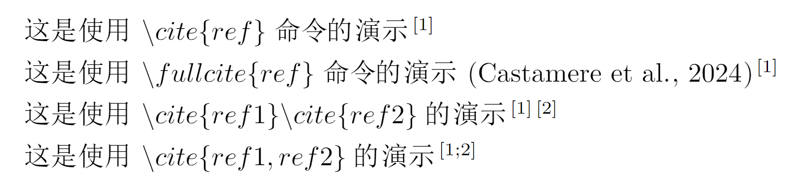
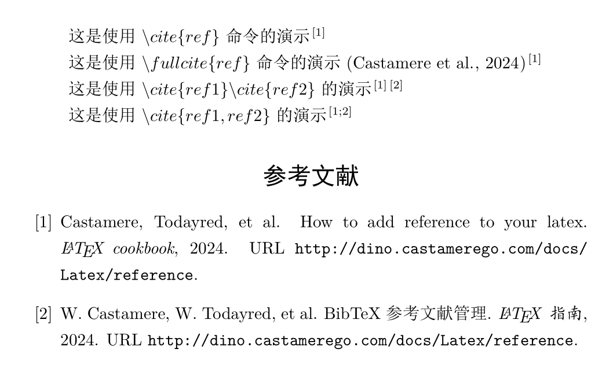
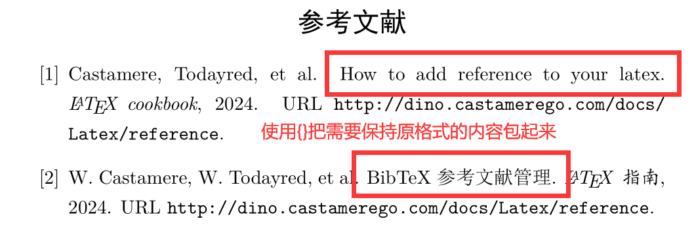

# 参考文献

使用 BibTeX 进行参考文献管理

## 写在前面

本篇介绍如何在 $ \large \LaTeX $ 中添加参考文献。教程包含以下内容:

- 完整 BibTeX 参考文献管理教程
- 如何编译含 BibTeX 的 LaTeX 文档
- 如何修改文内引用的格式
- 如何修改文末"参考文献"处的格式
- 完整 Demo
- 其他 BibTeX 常见问题及解决方式

:::tip
本篇均建立在安装好 TeXworks，使用 VS Code 编写编译，并在 VS Code 中安装 LaTeX Workshop 插件的基础上
:::

## BibTeX 参考文献管理

$ \Large \mathrm {B\mathbf {\scriptstyle \text{IB}}} \TeX $ 是一款用于格式化参考文献列表的参考文献管理软件，名字来源于引用一词 $(bibliography)$ 和 $\TeX$ 排版工具。使用 BibTeX 进行参考文献管理包含以下几个步骤，建议读者[点击这里](./demo/01-reference.zip)下载 Demo ，跟着下面的指南进行对照学习

1. 创建一个 BibTeX 数据库文件(`.bib`文件)
2. 在 `.bib`文件中添加参考文献条目
3. 设置文内引用与参考文献格式
4. 在文章内部使用命令进行引用
5. 在文末使用命令列出参考文献

### 步骤一：创建 BibTeX 数据库文件

首先，笔者建议的项目结构如下：使用 VS Code 打开项目根文件夹后，在该目录下创建`thesis.tex`，创建`reference`文件夹并在内创建`references.bib`文件

并且最好在 VS Code 内创建**工作区设置文件**，即创建`.vscode`文件夹，并在内创建`settings.json`来修改工作区设置。其原因有二，一是在不同的需求下，可能要使用不同的编译顺序，这样就可以在不影响全局设置的前提下保证每个项目都能正常运行；其二是把项目移动到其他设备，或者发给别人(比如一些伸手党 or 学弟学妹)时，保证能编译成功

```txt
项目结构:
│  thesis.tex
│
├─.vscode
│       settings.json
│
└─references
        references.bib
```

### 步骤二：在`.bib`文件中添加参考文献条目

`.bib`文件是一种类似 Json 的文件格式。在`.bib`文件中含了一系列条目，每个条目都代表一份参考文献，并按照特定的格式存储文献的详细信息。`.bib` 文件中的每一个条目都是以下面的一般格式开始的：

```
@类型{引用关键词,
    字段名1 = {条目信息1},
    字段名2 = {条目信息2},
    ...
}
```

:::info
参考文献条目的格式通常以`@类型`开始，紧接着是一组花括号。在这组花括号内，第一个字段是唯一标识符`key`，它允许你通过`\cite{key}`命令在文中引用该参考文献。其余部分由一系列以键值对形式出现的各种属性构成，用于详细描述参考文献的相关信息。
:::

在[常见 BibTeX 参考文献类型](#bibtex-参考文献类型)一章中，笔者列出了参考文献规范和 BibTeX 参考文献类型。下面列出 Demo 中的`.bib`文件作例子：

```txt
@article{Castamere2024AddReference,
  author  = {Castamere and Todayred and others},
  title   = {How to add Reference to your LaTeX},
  journal = {\LaTeX \enspace cookbook},
  url     = {http://dino.castamerego.com/docs/Latex/reference},
  year    = {2024}
}

@article{Castamere2024如何添加,
  author  = {W. Castamere and W. Todayred and others},
  title   = {{BibTeX} 参考文献管理},
  journal = {\LaTeX \enspace 指南},
  url     = {http://dino.castamerego.com/docs/Latex/reference},
  year    = {2024}
}
```

`.bib`文件的格式有一些常见问题，具体可以看[BibTeX 常见问题](#bibtex-常见问题)这一章

接下来是如何找到 BibTeX 格式的引用。在知网中并没有 BibTeX 风格的引用，故笔者推荐使用谷歌学术。读者们可以先在其他网站或平台找一些论文(比如一些 AI paper review 网站: [semless])，然后再去[谷歌学术]中直接搜索这些文章，点击"引用"，弹出框中找到"BibTeX"，点击就会弹出 BibTeX 格式的引用，直接复制，添加到 `.bib` 文件中即可


### 步骤三：设置文内引用与参考文献格式

修改样式这部分包含三个内容

- 修改参考文献被列出的样式 (即 期刊类：作者. 题名 [J]. 刊名, 出版年份, 卷号 (期号): 起止页码. 这类的内容)
- 修改文内引用的样式 (即被引用处显示[1], (1), 还是 (Castamere et al., 2024)[1])
- 修改最后的“参考文献”字样 (即最后显示“参考文献”还是“Reference”，以及修改字体字号)

#### 修改参考文献被列出的样式

在使用`BibTeX`时，要引入`hyperref`和 `natbib` 库。使用`\bibliographystyle{}`指令来修改参考文献被列出的样式，常见的样式在下面列出来了，如果没有特别的需求(比如只是做一个小作业)推荐使用`unsrtnat`，该预设可以按照引用出现的顺序排列

```latex
\RequirePackage{natbib}          % BibTeX 库
\usepackage[hidelinks]{hyperref} % 用于超链接
\bibliographystyle{unsrtnat}     % 参考文献被列出的样式
```

- plainnat: 作者-年份格式的排序按作者的姓氏字母顺序
- abbrvnat: 类似于 plainnat，但是名字和月份会被缩写
- unsrtnat: 作者-年份格式，但引用按出现的顺序排列
- apalike: APA 格式，如美国心理学会 (American Psychological Association) 出版物的样式
- alpha: 基于作者姓氏和出版年份的标签系统，不是完整的作者-年份文献引用格式

#### 修改文内引用的样式

:::tip
下文均以 Demo 中的 `unsrtant` 样式为准
:::

使用`\bibpunct`函数可以修改文内引用的样式，其第一，二个参数为括号样式，一般使用中括号或小括号。第三个参数为引用多个文献时的分隔符。同时也可以使用`\newcommand`来自定义引用指令

```latex
\bibpunct{[}{]}{;}{s}{,}{,} % 第一，二个参数为括号样式，可以换成小括号
\newcommand{\fullcite}[1]{(\citeauthor{#1}, \citeyear{#1})\cite{#1}} % 自定义引用指令
```

#### 修改最后的“参考文献”字样

想要修改最后的“参考文献”字样，可以使用`\renewcommand`函数，他的作用是重写某个已有的函数，第一个参数为这个已有函数的名字，第二个参数为具体函数实现。想要修改时，把该指令添加到文件引言部分即可(注意要添加到`\RequirePackage{natbib}  `之后)

```latex
\RequirePackage{natbib}

% 如显示“参考文献”，居中，四号则如下
% \sihao 为笔者自定义函数，非内置，此处仅作演示
\renewcommand{\refname}{\begin{center} \sihao 参考文献 \end{center}}

% 或者想要“Reference”，向左对齐
\renewcommand{\refname}{Reference}
```

### 步骤四：在文章内部使用命令进行引用

在文章内部可以使用`\cite`函数来直接引用。为了以(Castamere et al., 2024)[1]的形式引用，笔者写了`\fullcite`函数供使用，具体演示如下图。读者可在[Demo](./demo/01-reference.zip)中研究一下

```latex
\newcommand{\fullcite}[1]{(\citeauthor{#1}, \citeyear{#1})\cite{#1}} % 自定义引用指令
```



### 步骤五：在文末使用命令列出参考文献

在文末可以使用`\bibliorgraphy`函数来列出参考文献，其参数为`.bib`文件的**相对路径**，注意并不包含文件名后缀

- ✔ references/references
- ✖ references/references.bib

但使用该命令并不会自动在目录中添加“参考文献”，此时可以使用`\phantomesection`函数来向目录中添加。此法同样适用于引言、关键词、附录等不想使用`\section`函数的地方

```latex
% 下面这句用来在目录中添加“参考文献”或“Reference”
\phantomsection\addcontentsline{toc}{section}{Reference}
\phantomsection\addcontentsline{toc}{section}{参考文献}

% 引用放在references/references.bib内
\bibliography{references/references}
```

## 完整 Demo

[点击此处 Download Demo](./demo/01-reference.zip)

本处笔者提供一个简单的 demo，在安装好`Texworks`，使用`VS Code`，并安装`latex-workshop`插件的基础上可以直接编译



```txt
项目结构：
demo-01-reference:
│  templates.pdf
│  templates.tex
│
├─.vscode
│       settings.json
│
└─references
        references.bib
```

```latex showLineNumbers
% Author: Castamere
\documentclass{ctexart} % 使用ctex以支持中文字符

\RequirePackage{natbib}          % BibTeX 库
\usepackage[hidelinks]{hyperref} % 用于超链接
\bibliographystyle{unsrtnat}     % 参考文献被列出的样式
\bibpunct{[}{]}{;}{s}{,}{,} % 第一，二个参数为括号样式，可以换成小括号
\newcommand{\fullcite}[1]{(\citeauthor{#1}, \citeyear{#1})\cite{#1}} % 自定义引用指令

\pagestyle{empty} % 去掉页眉页脚等，与引用无关

\begin{document}

% 使用\cite{}进行文内引用
这是使用$\backslash cite\{ref\}$命令的演示\cite{Castamere2024AddReference}

% 使用自定义命令\fullcite{}进行文内引用
这是使用$\backslash fullcite\{ref\}$命令的演示\fullcite{Castamere2024AddReference}

% 引用多个文献演示(分开引用[1][2])
这是使用$\backslash cite\{ref1\}\backslash cite\{ref2\}$的演示\cite{Castamere2024AddReference}\cite{Castamere2024如何添加}

% 引用多个文献演示(合并引用[1;2])
这是使用$\backslash cite\{ref1, ref2\}$的演示\cite{Castamere2024AddReference, Castamere2024如何添加}

\phantomsection\addcontentsline{toc}{section}{参考文献} % 在目录中添加“参考文献”

\bibliography{references/references} % 使用\bibliography{}在此处列出所有参考文献

\end{document}
```

## 如何编译含 BibTeX 的 LaTeX 文档

一篇简单的，纯文字的文章如果需要使用 LaTeX 来排版，在包含中文字符的情况下，只需要使用 XeLaTeX 编译一遍即可。但在编写论文时，需要用到最重要的两个特性：图表编号和引用，参考文献引用，则需要更复杂的编译

:::info
XeLaTeX(XƎTEX) 是一种使用 Unicode 的 TeX 排版引擎

XeLaTeX 原生支持 Unicode，并默认其输入文件为 UTF-8 编码。可以在不进行额外配置的情况下直接使用操作系统中安装的字体包括 OpenType (.otf) 和 TrueType (.ttf) 字体。因此，用户可以很容易地使用不同的字体，包括多字节字符集，如中文、日文、韩文等
:::

为了完成图表编号和引用，以及参考文献引用，笔者使用的编译配置如下`xelatex -> bibtex -> xelatex -> xelatex`。在 [Demo](./demo/01-reference.zip) 中的 .vscode/settings.json 中有详细内容，本节末尾`latex-workshop配置`处也有详细配置内容，不关心原理的同学可以直接拿去用

### 编译原理

第一次 `xelatex` 编译：处理 LaTeX 源文件，并生成一个 `.aux` 辅助文件，其中包含了图表、公式、文献引用的标签等信息。但是在这个阶段，交叉引用的标签还没有解析，所以引用处仅仅标记为问号(?)

`bibtex` 编译：处理 `.aux` 文件，并根据里面的引用(例如 `\cite{...}` 命令)到 `.bib` 文件中查找对应的文献条目，然后生成一个文献引用列表(通常是 `.bbl` 文件)，此列表将在后续的 LaTeX 编译过程中被引入

第二次 `xelatex` 编译：再次处理 LaTeX 源文件，这次它会读取 `.bbl` 文件并且将正确的引用插入到文档中。同时，它会更新 `.aux` 文件中的交叉引用信息

第三次 `xelatex` 编译：最后一次编译是为了确保所有交叉引用(包括那些在引用文献或图表编号后出现的)都能正确解析。由于交叉引用可能依赖文献引用(可能影响引用的编号)，因此还需要一次编译来确保一切都已解析完毕，文档中的所有引用都是正确的

### VS Code 插件 latex-workshop 配置

即前文提及 `.vscode` 文件夹下 `setttings.json` 中的内容

<details>
  <summary>latex-workshop配置</summary>

```json showLineNumbers title="latex-workshop配置" icon="vscode"
{
  "latex-workshop.latex.tools": [
    {
      "name": "xelatex",
      "command": "xelatex",
      "args": [
        "-synctex=1",
        "-interaction=nonstopmode",
        "-shell-escape",
        "-file-line-error",
        "-pdf",
        "%DOCFILE%"
      ]
    },
    {
      "name": "bibtex",
      "command": "bibtex",
      "args": ["%DOCFILE%"]
    }
  ],
  "latex-workshop.latex.recipes": [
    {
      "name": "Castamere",
      "tools": ["xelatex", "bibtex", "xelatex", "xelatex"]
    }
  ]
}
```

</details>

## BibTeX 参考文献类型

### 参考文献类型与标识代码

根据 **[GB/T 7714-2015 信息与文献 参考文献著录规则]**

| 参考文献类型 | 标识代码 | 参考文献类型 | 标识代码 |
| :----------- | :------: | :----------- | :------: |
| 普通图书     |    M     | 会议录       |    C     |
| 汇编         |    G     | 报纸         |    N     |
| 期刊         |    J     | 学位论文     |    D     |
| 报告         |    R     | 标准         |    S     |
| 专利         |    P     | 数据库       |    DB    |
| 计算机程序   |    CP    | 电子公告     |    EB    |
| 档案         |    A     | 舆图         |    CM    |
| 数据集       |    DS    | 其他         |    ZB    |

| 电子资源载体类型   | 标识代码 | 电子资源载体类型 | 标识代码 |
| :----------------- | :------: | :--------------- | :------: |
| 磁带(magnetictape) |    MT    | 磁盘(disk)       |    DK    |
| 光盘(CD-ROM)       |    CD    | 联机网络(online) |    OL    |

### BibTeX 参考文献类型

**期刊类 [J]**

- @article

  期刊杂志的论文

  - 必要字段: author, title, journal, year.
  - 可选字段: volume, number, pages, month, note.

**专著类 [M]**

- @book

  公开出版的图书

  - 必要字段: author/editor, title, publisher, year.
  - 可选字段: volume/number, series, address, edition, month, note.

- @incollection

  书籍中带独立标题的章节

  - 必要字段: author, title, booktitle, publisher, year.
  - 可选字段: editor, volume/number, series, type, chapter, pages, address, edition, month, note.

**会议论文类 [A] in: [C]**

- @proceedings

  会议论文集

  - 必要字段: title, year.
  - 可选字段: editor, volume/number, series, address, month, organization, publisher, note.

- @inproceedings

  等价于 @conference

  - 必要字段: author, title, booktitle, year.
  - 可选字段: editor, volume/number, series, pages, address, month, organization, publisher, note.

**学位论文类 [D]**

- @mastersthesis

  硕士论文

  - 必要字段: author, title, school, year.
  - 可选字段: type, address, month, note.

- @phdthesis

  博士论文

  - 必要字段: author, title, year, school.
  - 可选字段: address, month, keywords, note.

## BibTeX 常见问题

### 转义字符

有时候引用报错可能是文章名出现 LaTeX 需要转义的字符，比如 `_%&` 这些，最常见就是因为下划线导致编译失败，需要在 BibTeX 中也进行转义

| 需转义字符 | Latex 指令 | 需转义字符 | Latex 指令 |
| :--------: | :--------: | :--------: | :--------: |
|     \_     |    \\\_    |     \{     |    \\\{    |
|     %      |    \\%     |     \}     |    \\\}    |
|     &      |    \\&     |     ^      |    \\^     |
|     $      |    \\$     |     \      | \backslash |

### 大小写问题

BibTeX 中的部分字段如`title`,`booktitle`等，会自动将句中的字母全转为小写，将内容用`{}`包起来即可



```bibtex showLineNumbers
@article{Castamere2024AddReference,
  author  = {Castamere and Todayred and others},
  // highlight-start
  % 这里Reference中的R和LaTeX全部会转为小写
  title   = {How to add Reference to your LaTeX},
  // highlight-end
  journal = {\LaTeX \enspace cookbook},
  url     = {http://dino.castamerego.com/docs/Latex/reference},
  year    = {2024}
}

@article{Castamere2024如何添加,
  author  = {W. Castamere and W. Todayred and others},
  // highlight-start
  % 想要保持大写可以加上花括号
  title   = {{BibTeX} 参考文献管理},
  // highlight-end
  journal = {\LaTeX \enspace 指南},
  url     = {http://dino.castamerego.com/docs/Latex/reference},
  year    = {2024}
}
```

[$ \Large \mathrm {B\mathbf {\scriptstyle \text{IB}}} \TeX $]: https://en.wikipedia.org/wiki/BibTeX
[谷歌学术]: https://scholar.google.com/
[GB/T 7714-2015 信息与文献 参考文献著录规则]: https://lib.tsinghua.edu.cn/wj/GBT7714-2015.pdf
[semless]: https://seaml.es/science.html
