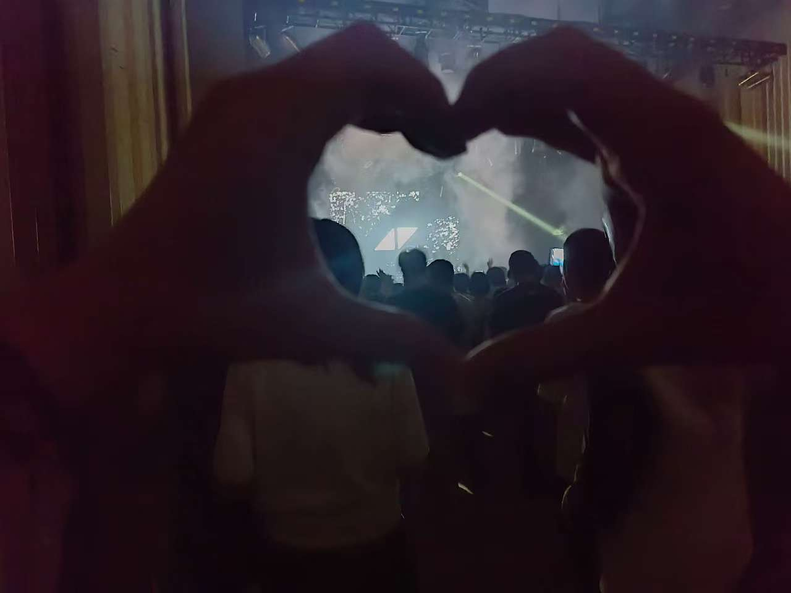

# 2025

# ◢◤

## Year Plan

设备添置

- [x] NAS
- [x] MAC (Mac mini)
- [x] Wooting (本来要买 60 HE, 但是小韦送了 80 HE。有方向键和 fn 键就是不一样)
- [x] Switch 2 (结果买了1)
- [ ] 主机

生活琐事

- [ ] Disney Land
- [x] AVICII 纪念派对

娱乐

- [x] CIVILIZATION VII 498
- [ ] Grand Theft Auto VI
- [ ] Subnautica II

## January

一月份莫名其妙就过去了

新的一年重新开始运动吧

把之前挖的坑慢慢补一下

> Cat's in the Bag...
>
> ...And the Bag's in the River

## February  

重新开始记账

> Nobody exists on purpose
>
> Nobody belongs anywhere
>
> everybody's gonna die
>
> come watch TV

## March

生日拿下了 switch，小韦还送了一把 wooting 80 he，有一种经常看到别人炫耀，现在真到自己头上的不真实感

还有 WWWV 送的 Baldur's Gate Ⅲ

还买了一坨游戏

- [x] 超级马里奥奥德赛 卡带 265
- [x] 塞尔达传说 旷野之息 卡带 289
- [x] 马里奥派对 卡带 272
- [x] 马里奥赛车8 卡带 255
- [x] 里奥的财富 18.6
- [x] Unrailed 34.4

等待购买

- [ ] 星之卡比 探索发现
- [ ] 宝可梦朱/紫
- [ ] 集合!动物森友会

这个月主要在学 Docker，把之前的 [Read-Book](https://github.com/Casta-mere/Read-Book) 容器化了，更好部署了。虽然是很旧的屎山，但拿来练手 Docker 还是不错的。

本月支出指数 1.49，还是在没存房租的情况下，等六月结束，感觉会好起来的，加油吧

> 『Ticking away』 - VARLORANT
> 
> Why!
>
> Am I playing with time as it's ticking away
>
> Why, we run for our lives, not a second to waste?

## April

- [ ] 制作一个 favicon

月初去了趟南京

4.19 AVICII 纪念派对

本月支出系数 1.13

> 『Without You』 - AVICII
>
> I gotta learn how to love without you
>
> I gotta carry my cross without you
>
> Stuck in the riddle and I'm just about to
>
> Figure it out without you

## May

发了 4k 的奖金，但本月支出系数 0.84

> 『愿与愁』 - 林俊杰
> 
> 分岔路口 我胸口 的伤口 贪与渴求
> 
> 渺小微弱像尘埃漂流
> 
> 等待花季烟雨稠
> 
> 再化降水驻守
> 
> 只为重逢的时候

## June 

搭建好了自己的 nas，部署了一些项目，学到了一些新技术

搭建的服务

- HomePage: 内网主页 [Tailscale](http://100.92.232.30:4869/), [Local](http://192.168.50.71:4869), [Public](https://app-4869-casta-dxp4800.cn14.ugdocker.link/)
- Tailscale: 内网穿透
- Minecraft Server: MC 服务器 [Tailscale](http://100.92.232.30:23333/), [Local](http://192.168.50.71:23333/), [Public](https://app-23333-casta-dxp4800.cn14.ugdocker.link/)
- My-Website Dev: 博客开发 [Tailscale](http://100.92.232.30:3000/), [Local](http://192.168.50.71:3000/), [Public](https://app-3000-casta-dxp4800.cn14.ugdocker.link/)
- Overleaf: Latex [Tailscale](http://100.92.232.30:8989/), [Local](http://192.168.50.71:8989/), [Public](https://app-8989-casta-dxp4800.cn14.ugdocker.link/)
- Bili-sync: 用于下载 bilibili 视频
- Terraria Server: Terraria 服务器

可能后面还会遇到有意思的东西，再部署吧

本月支出系数 1.03,慢慢步入正轨

> Do not go gentle to that good night - Interstellar

## July 

拿下了 Mac mini，体验苹果生态确实有意思

到了入职快一年的迷茫期。想要考后半年的系统架构设计师，11 月 8 日考，做出决定到开考还有整四个月，加油吧

本月还搞了一个新项目 [fzf_scripts](https://github.com/Casta-mere/fzf_scripts)，得加紧把首页项目展示做出来了

第一次付费搞了 copilot, 10$ 一个月，体验下来还 ok。月末几天高强度 coding, 给 blog 首页大改，加了很多东西，或许值得之后写写。现在的首页酷炫多了

本月支出系数 0.85 ，今年的设备感觉都买差不多了，得开始存钱了

- [ ] plugin-blog-enhance
- [ ] plugin-docs-enhance

> 『Funny』 - Zedd & Jasmine Thompson
> 
> The curtains are closed now
>
> Nothing to see
>
> But a dozen dying roses at our feet

## August

任务目标

- [ ] 学完视频课，完成选择题一轮复习
- [x] 写三篇博客
  - [x] [React SSR 水合问题](/blog/Hydration)
  - [x] [杂谈 001](/blog/talk-001)
  - [x] [超链接小组件更新，嵌入原生 Docusaurus](/blog/Link-update-2025-08)
- [ ] 完成 CPP-Ticket

开了一个新坑，[杂谈](/blog/tags/Talk)系列，记录一些比较短，但是又想记下来的东西

山河破碎风飘絮

本月支出系数 0.91，出游上海确实烧了一些。感觉有时候还是忍不住买东西。博客的任务倒是完成了，其他都没完成

> 『凄美地』 - 郭顶
> 
> 在这之前 别说再见
>
> 我已再经不起离别
>
> 在这之前 别说再见
>
> 我已经开始了想念

## September

买一台 iphone，深谙很多事情，不去争取就会从你手中溜走

陪小韦参加了一次团片，买了一个露营车，一天之内五次装车，打车全是卧车，后备箱还不够大，有一种窘迫。晚上蹭车，也许有一天我也会敢开车

算了一下今年到最后的收入支出，或许只能追平，感觉自己真的花了好多钱，持平之后要求变了。现在觉得攒钱似乎比花钱更爽，明年顺风的情况，预期是攒到 8W，加油吧

软考也是一拖再拖，似乎进入了低谷期

> 『September』 - Earth, Wind & Fire
> 
> ba di ya 
>
> dancing in September
>
> ba di ya
>
> never was a cloudy day

## October

这个月支出系数 2.59，攒钱确实比花钱爽

最近在看 『纸牌屋』，第二季开头就把 Zoe 干死了。自从奈德惨死之后，还没怎么看过这么突然的(可能再算上 Howard Hamlin)。目前只看到第二季，感觉后面几集节奏有点快了

面试了两场之后，开始再学一些东西。翻译了一篇文章[Python's AsyncIO 实践指南](/blog/PythonAsyncIO)。[Real Python](https://realpython.com/) 这个网站有很多 Python 优秀读物，后面尽量每个月转载翻译一篇

> 『不得不爱』 - 潘玮柏、弦子
> 
> 天天都需要你爱
>
> 我的心思由你猜
>
> I love you
>
> 我就是要你让我每天都精彩

## November

支出系数 0.58，交房租太猛了。准备提离职

> 『老男孩』 - 筷子兄弟
>
> 如果有明天祝福你亲爱的

## December

支出系数 0.93

今年就这样结束了，2026 新工作，新开始

> 『贝加尔湖畔』 - 李健
>
> 就在某一天 你忽然出现
>
> 你清澈又神秘 在贝加尔湖畔
>
> 你清澈又神秘 像贝加尔湖畔