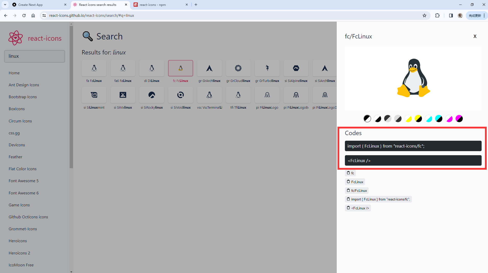

# 创建项目

## 创建项目

在[创建项目](/docs/React/Next/Fundamentals#安装创建项目)中可以找到相关内容，这里不再赘述

## First commit

创建好项目之后，在 global.css 中删除 liner-gradient 相关内容

```css title="/appglobal.css" showLineNumbers
  body {
    color: rgb(var(--foreground-rgb));
/* git-delete-start */
-   background: linear-gradient(
-       to bottom,
-       transparent,
-       rgb(var(--background-end-rgb))
-     ) rgb(var(--background-start-rgb));
/* git-delete-end */
  }
```

在 `/app/page.tsx` 中删除 Next.js 相关内容，仅返回一个 `<>Hello World!<>` 即可

```tsx title="/app/page.tsx"
export default function Home() {
  return (
    <>
      <h1>Hello World!</h1>
    </>
  );
}
```

完成以上步骤，即可进行第一次 commit

## 创建 NavBar

[本节代码链接](https://github.com/Casta-mere/Issue-Tracker/tree/73be2ebc2a99e94748c4c49b4a4eaa399ffa8980)

最简单的 NavBar 应该包含如下内容，包括一个 Logo 和几个 Link 用于导航。给他们都添加 `flex` 属性，即可横向布局，并添加一些边框，gap，垂直居中等样式

```tsx title="NavBar.tsx"
import Link from "next/link";

const NavBar = () => {
  return (
    <nav className="flex border-b mb-5 px-5 h-14">
      <Link href=""/>Logo</Link>
      <ul className="flex">
        <li><Link href="/">Dashboard</li>
        <li><Link href="/issues">Issues</li>
      </ul>
    </nav>
  );
};

export default NavBar;
```

### react-icon

然后我们使用 [react-icon] 来添加图标

```bash
npm i react-icon
```

在 [react-icon] 官网中找到想要的图标之后，可以直接 copy 代码使用



```tsx title="NavBar.tsx" showLineNumbers
  import Link from "next/link";
  // import进来
  // git-add-next-line
+ import { AiFillBug } from "react-icons/ai";

  const NavBar = () => {
    return (
      <nav className="flex border-b mb-5 px-5 h-14">
      {/*直接像这样使用即可*/}
      {/*git-add-next-line*/}
+       <Link href=""/><AiFillBug /></Link>
        <ul className="flex">
          <li><Link href="/">Dashboard</Link></li>
          <li><Link href="/issues">Issues</Link></li>
        </ul>
      </nav>
    );
  };

  export default NavBar;
```

### 为链接添加样式

```tsx title="NavBar.tsx"
...
  <li className="text-zinc-500 hover:text-zinc-800 transaition-colors" ><Link href="/">Dashboard</Link></li>
...
```

如果链接多起来，我们需要一个个去添加样式。我们可以将所有的链接提取出来，放到一个 array 里面，再 map 为一个个的 `<Link >` 标签，以减少冗余代码

```tsx title="NavBar.tsx"
import Link from "next/link";
import { AiFillBug } from "react-icons/ai";

const NavBar = () => {
  const links = [
    { label: "DashBoard", href: "/dashboard" },
    { label: "Issues", href: "/issues" },
  ];

  return (
    <nav className="flex border-b mb-5 px-5 h-14">
      <Link href=""/><AiFillBug /></Link>
      <ul>
        {links.map((link) => (
            <Link
              className="text-zinc-500 hover:text-zinc-800 transaition-colors"
              key={link.href}
              href={link.href}
            >{link.label}</Link>
          ));
        }
      </ul>
    </nav>
  );
};

export default NavBar;
```

### 为当前页面 Link 添加样式

比如我们目前在 `/Issue` 页面下，我们希望把这个链接凸显一下。首先我们需要使用 `usePathname()` 获取当前路径，然后我们在 links.map 中判断当前路径与 link.href 是否相等，若相等则应用另一个样式

```tsx title="NavBar.tsx"
  // 由于要获取用户端数据，使用 use client
// git-add-next-line
+ "use client";
  import Link from "next/link";
  import { AiFillBug } from "react-icons/ai";
  // 导入 usePathname
// git-add-next-line
+ import { usePathname } from "next/navigation";

  const NavBar = () => {
    // 获取当前路径
    // git-add-next-line
+   const currentPath = usePathname();

    const links = [
      { label: "DashBoard", href: "/dashboard" },
      { label: "Issues", href: "/issues" },
    ];

    return (
      <nav className="flex border-b mb-5 px-5 h-14">
        <Link href=""/><AiFillBug /></Link>
        <ul>
          {links.map((link) => (
              <Link
                className={
                  `${link.href === currentPath ? "text-zinc-900" : "text-zinc-500"}
                  hover:text-zinc-800 transaition-colors`}
                key={link.href}
                href={link.href}
              >{link.label}</Link>
            ));
          }
        </ul>
      </nav>
    );
  };

  export default NavBar;
```

但是随着判断条件越来越复杂，单行内代码越来越多，导致代码不宜于维护。这里使用 `classnames` 包来解决此问题，使用下面命令安装后，在代码内调用 classNames 函数，其参数为一个键值对，键为样式，值为一个 boolen 表达式，若值为 true 则代表应用该条样式，若为 false 则代表不应用该条样式

```bash
npm install classnames
```

```tsx title="NavBar.tsx" showLineNumbers
import classNames from "classnames";

...
<Link
  className={classNames({
    "text-zinc-900": link.href === currentPath,
    "text-zinc-500": link.href !== currentPath,
    "hover:text-zinc-800 transaition-colors": true,
  })}
  key={link.href}
  href={link.href}
>
...
```

### 其他优化点

最后，我们的代码应该尽量应用 oop 的原则，将部分内容抽象出来封装为函数，以提高代码可读性，可维护性

最终代码如下：

```tsx title="NavBar.tsx" showLineNumbers
"use client";
import classNames from "classnames";
import Link from "next/link";
import { usePathname } from "next/navigation";
import { AiFillBug } from "react-icons/ai";

const NavBar = () => {
  return (
    <nav className="flex border-b mb-5 px-5 h-14">
      <NavLinks />
    </nav>
  );
};

export default NavBar;

const links = [
  { label: <AiFillBug />, href: "/" },
  { label: "DashBoard", href: "/dashboard" },
  { label: "Issues", href: "/issues" },
];

const NavLinks = () => {
  const currentPath = usePathname();

  return (
    <ul className="flex gap-6 items-center">
      {links.map((link) => (
        <Link
          className={classNames({
            "text-zinc-900": link.href === currentPath,
            "text-zinc-500": link.href !== currentPath,
            "hover:text-zinc-800 transaition-colors": true,
          })}
          key={link.href}
          href={link.href}
        >
          {link.label}
        </Link>
      ))}{" "}
    </ul>
  );
};
```

[react-icon]: https://react-icons.github.io/react-icons/
