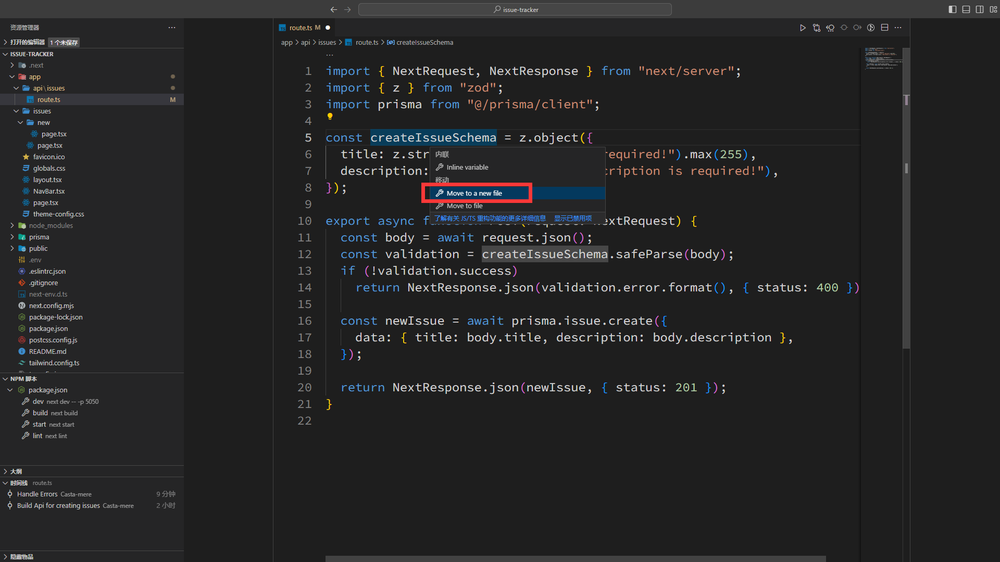

# 创建 Issue

## 配置 MySQL 与 Prisma

在[数据库](/docs/React/Next/Database)中可以找到相关内容，这里不再赘述

## 添加 model

[本节代码链接](https://github.com/Casta-mere/Issue-Tracker/tree/a137d6f68faceadf2e23dd7a4618b1448614496b)

```prisma title="schema.prisma" showLineNumbers
model Issue {
  id Int @id @default(autoincrement())
  title String @db.VarChar(255)
  description String @db.Text
  status Status @default(OPEN)
  createdAt DateTime @default(now())
  updatedAt DateTime @updatedAt()
}

enum Status {
  OPEN
  IN_PROGRESS
  CLOSED
}
```

使用以下指令同步到数据库

```bash
npx prisma format
npx prisma migrate dev
```

## 编写 API

[本节代码链接](https://github.com/Casta-mere/Issue-Tracker/tree/3815fcb7cb57c73f29c3ab48f19ddc1b18a0495b)

:::note
这里使用 zod 来验证表单，具体内容可参考[使用 zod 验证表单](/docs/React/Next/BuildAPI#使用-zod-验证表单)
:::

```ts title="/app/api/issues/route.ts" showLineNumbers
import { NextRequest, NextResponse } from "next/server";
import { z } from "zod";
import prisma from "@/prisma/client";

const createIssueSchema = z.object({
  title: z.string().min(1).max(255),
  description: z.string().min(1),
});

export async function POST(request: NextRequest) {
  const body = await request.json();
  const validation = createIssueSchema.safeParse(body);
  if (!validation.success)
    return NextResponse.json(validation.error.errors, { status: 400 });

  const newIssue = await prisma.issue.create({
    data: { title: body.title, description: body.description },
  });

  return NextResponse.json(newIssue, { status: 201 });
}
```

## Radix-UI

[本节代码链接](https://github.com/Casta-mere/Issue-Tracker/tree/65c735dbeab95b4f876fd7aaf39c210c0967bd0e)

[radix-ui] 也是一个类 DaisyUI 的组件库，使用如下指令安装

```bash
npm install @radix-ui/themes
```

安装好后，进行如下初始配置，将主 layout 中的所有内容用 `<Theme >` 标签包起来

```tsx title="/app/layout.tsx" showLineNumbers
  import type { Metadata } from "next";
  // git-add-next-line
+ import "@radix-ui/themes/styles.css";
  import { Inter } from "next/font/google";
  // git-add-next-line
+ import { Theme } from "@radix-ui/themes";
  import "./globals.css";
  import NavBar from "./NavBar";

  const inter = Inter({ subsets: ["latin"] });

  export const metadata: Metadata = {
    title: "Create Next App",
    description: "Generated by create next app",
  };

  export default function RootLayout({
    children,
  }: Readonly<{
    children: React.ReactNode;
  }>) {
    return (
      <html lang="en">
        <body className={inter.className}>
          {/*git-add-next-line*/}
+         <Theme>
            <NavBar />
            <main>{children}</main>
          {/*git-add-next-line*/}
+         </Theme>
        </body>
      </html>
    );
  }
```

## 创建新 Issue 页面

[本节代码链接](https://github.com/Casta-mere/Issue-Tracker/tree/a365dce77f7e912920c28b05cc6d53dfa7734f85)

```tsx title="/app/issues/new/page.tsx" showLineNumbers
"use client";
import { Button, TextArea, TextField } from "@radix-ui/themes";

const NewIssuePage = () => {
  return (
    <div className="max-w-xl space-y-3">
      <TextField.Root>
        <TextField.Input placeholder="Title" />
      </TextField.Root>
      <TextArea placeholder="Description" />
      <Button>Submit New</Button>
    </div>
  );
};
export default NewIssuePage;
```

显示效果如下


## Radix-UI 定义 UI 样式

[本节代码链接](https://github.com/Casta-mere/Issue-Tracker/tree/85e8bfd6780e77fcec742e24d600e8426700d155)

在 `layout.tsx` 中添加 `<Themepanel >`

```tsx title="/app/layout.tsx" showLineNumbers
// git-add-next-line
+ import { Theme, ThemePanel } from "@radix-ui/themes";
  ...
  return (
    <html lang="en">
      <body className={inter.className}>
        <Theme>
          <NavBar />
          <main className="p-5">{children}</main>
          {/*git-add-next-line*/}
+           <ThemePanel />
        </Theme>
      </body>
    </html>
  );
  ...
```

效果如下


调整好自己想要的样式之后点击 `Copy Theme`，将 copy 到的 `<Theme >` 标签替换掉原来的即可

```tsx title="/app/layout.tsx" showLineNumbers
  ...
  return (
    <html lang="en">
      <body className={inter.className}>
        {/*添加到这里即可*/}
        {/*git-add-next-line*/}
        <Theme appearance="light" accentColor="violet">
          <NavBar />
          <main className="p-5">{children}</main>
        </Theme>
      </body>
    </html>
  );
  ...
```

### 设置字体

在 Radix-UI 中设置字体需要以下步骤，可以参考 [radix-ui-font]

首先在 layout.tsx 中修改

```tsx title="/app/layout.tsx" showLineNumbers
  import { Theme } from "@radix-ui/themes";
  import "@radix-ui/themes/styles.css";
  import type { Metadata } from "next";
  import { Inter } from "next/font/google";
  import NavBar from "./NavBar";
  import "./globals.css";
// git-remove-next-line
- const inter = Inter({ subsets: ["latin"] });
// git-add-start
+ const inter = Inter({
+   subsets: ['latin'],
+   variable: '--font-inter',
+ });
// git-add-end
  export const metadata: Metadata = {
    title: "Create Next App",
    description: "Generated by create next app",
  };

  export default function RootLayout({
    children,
  }: Readonly<{
    children: React.ReactNode;
  }>) {
    return (
      <html lang="en">
        {/*git-remove-next-line*/}
-       <body className={inter.className}>
        {/*git-add-next-line*/}
+       <body className={inter.variable}>
          <Theme appearance="light" accentColor="violet">
            <NavBar />
            <main className="p-5">{children}</main>
          </Theme>
        </body>
      </html>
    );
  }
```

然后添加 `/app/theme-config.css` 并添加以下内容

```css title="/app/theme-config.css"
.radix-themes {
  --default-font-family: var(--font-inter);
}
```

最后在 `layout.tsx` 中 import 进来即可

```tsx
···
import "./theme-config.css";
···
```

## MarkDown Editor

[本节代码链接](https://github.com/Casta-mere/Issue-Tracker/tree/7ee6b2a08b9964815371fc9c2459df7ce7ee9567)

[react-simlemde-editor] 是一款集成式 MarkDown 编辑器，使用如下命令安装

```
npm install --save react-simplemde-editor easymde
```

效果如下：


## 提交表单

[本节代码链接](https://github.com/Casta-mere/Issue-Tracker/tree/f7617d72e54cb3fd3a1e2f5ea4886b53e3a78e99)

我们使用 [react-hook-form] 和 [axios] 进行表单提交

```bash
npm i react-hook-form
npm i axios
```

```tsx title="/app/issues/new/page.tsx" showLineNumbers
  "use client";
  import { Button, TextField } from "@radix-ui/themes";
  import { useRouter } from "next/navigation";
  // import
  // git-add-start
+ import axios from "axios";
+ import "easymde/dist/easymde.min.css";
+ import { Controller, useForm } from "react-hook-form";
+ import SimpleMDE from "react-simplemde-editor";
  // git-add-end

  // 使用 interface 表明 form 中有哪些内容
  // git-add-start
+ interface IssueForm {
+   title: string;
+   description: string;
+ }
  // git-add-end

  const NewIssuePage = () => {
    // 使用 React Hook Form
    // git-add-next-line
+   const { register, control, handleSubmit } = useForm<IssueForm>();
    // 使用 router 进行页面跳转
    // git-add-next-line
+   const router = useRouter();

    return (
      {/* 将最外层 div 换为 form */}
      {/* git-add-start */}
+     <form className="max-w-xl space-y-3"
+       onSubmit={handleSubmit(async (data) => {
          {/* 使用 axios 进行 post */}
+         await axios.post("/api/issues", data);
+         router.push("/issues");
+       })}>
      {/* git-add-end */}
        <TextField.Root>
          {/* 将该组件注册为 form 中的 title 字段 */}
          {/* git-add-next-line */}
+         <TextField.Input placeholder="Title" {...register("title")} />
        </TextField.Root>
        {/* 由于 simpleMDE 不能直接像上面的 Input 一样传入参数，我们这里使用 React Hook Form 中的 Controller */}
        {/* git-remove-next-line */}
-       <SimpleMDE placeholder="Description" />
        {/* git-add-start */}
+       <Controller
+         name="description"
+         control={control}
+         render={({ field }) => (
+           <SimpleMDE placeholder="Description" {...field} />
+         )}
+       />
        {/* git-add-end */}
        <Button>Submit New</Button>
      {/* git-add-next-line */}
+     </form>
    );
  };
  export default NewIssuePage;
```

<details>
  <summary>完整代码(非 git diff 版)</summary>

```tsx title="/app/issues/new/page.tsx" showLineNumbers
"use client";
import { Button, TextField } from "@radix-ui/themes";
import axios from "axios";
import "easymde/dist/easymde.min.css";
import { useRouter } from "next/navigation";
import { Controller, useForm } from "react-hook-form";
import SimpleMDE from "react-simplemde-editor";

interface IssueForm {
  title: string;
  description: string;
}

const NewIssuePage = () => {
  const { register, control, handleSubmit } = useForm<IssueForm>();
  const router = useRouter();

  return (
    <form
      className="max-w-xl space-y-3"
      onSubmit={handleSubmit(async (data) => {
        await axios.post("/api/issues", data);
        router.push("/issues");
      })}
    >
      <TextField.Root>
        <TextField.Input placeholder="Title" {...register("title")} />
      </TextField.Root>
      <Controller
        name="description"
        control={control}
        render={({ field }) => (
          <SimpleMDE placeholder="Description" {...field} />
        )}
      />
      <Button>Submit New</Button>
    </form>
  );
};
export default NewIssuePage;
```

</details>

效果如下：


## Handle Error

[本节代码链接](https://github.com/Casta-mere/Issue-Tracker/tree/b970f7a2323c5e41fa52f0c40978270cc385885a)

### 表单验证

之前说到，我们使用 zod 进行表单验证，可以在使用 zod 时，自定义报错内容

```tsx title="/app/api/issues/new/route.tsx" showLineNumbers
  ...
  const createIssueSchema = z.object({
    // 在定义时，可以加第二个参数，表示如果未满足该项时的报错
    // git-add-next-line
+   title: z.string().min(1, "Title is required!").max(255),
    // git-add-next-line
+   description: z.string().min(1, "Description is required!"),
  });

  export async function POST(request: NextRequest) {
    ...
    if (!validation.success)
    // 改为调用 validation.error.format()
    // git-remove-next-line
-     return NextResponse.json(validation.error.errors, { status: 400 });
    // git-add-next-line
+     return NextResponse.json(validation.error.format(), { status: 400 });
    ...
  }
```

### 报错显示

接下来实现一个这样的 Error Callout


在 `/app/issues/new/page.tsx` 中修改。把 `axios` 的相关内容放到一个 `try-catch` block 里

```tsx title="/app/issues/new/page.tsx" showLineNumbers
  "use client";
  ...
  const NewIssuePage = () => {
    ...
    // 添加 useState 变量
    // git-add-next-line
+   const [error, setError] = useState("");

    return (
        ...
        {/*若报错则显示一个 CallOut*/}
        {/* git-add-start */}
+       {error && (
+         <Callout.Root color="red" className="mb-5">
+           <Callout.Text>{error}</Callout.Text>
+         </Callout.Root>
+       )}
        {/* git-add-end */}
        <form
          className="space-y-3"
          onSubmit={handleSubmit(async (data) => {
            // 报错时设置 error
            {/* git-add-start */}
+           try {
+             await axios.post("/api/issues", data);
+             router.push("/issues");
+           } catch (error) {
+             setError("An unexpected Error occured!");
+           }
            {/* git-add-end */}
          })}
        >
        ...
  };
  export default NewIssuePage;
```

## 用户端验证

[本节代码链接](https://github.com/Casta-mere/Issue-Tracker/tree/472428108175e17b03ae1ebaca2254e4abbbba74)

### Zod schema

我们在用户端验证时，也需要用到刚刚 zod 中编辑的 schema，为此我们应该将其移动到一个单独的文件中。在 VS Code 中 可以方便的进行重构，将 createIssueSchema 移动到一个新文件中，并自动更新引用

首先右键想要重构的变量，点击 `重构`


然后选择 `move to a new file`



### 使用 Zod Schema 推断 interface

将刚刚移出的 schema 移动到 `/app` 目录下，重命名为 `validationSchema.ts`

之前在 new page 中，我们定义了一个 interface，用于定义表单，但其实与我们在 zod 中定义的内容是重复的，如果我们之后还需要增删内容，需要在两边修改，较为麻烦。我们可以直接使用刚刚的 zod schema 来定义 interface ，如下所示

```tsx title="/app/issues/new/page.tsx" showLineNumbers
  // git-add-next-line
+  import { createIssueSchema } from "@/app/validationSchema";
  // git-add-next-line
+  import { z } from "zod";
  // git-delete-start
- interface IssueForm {
-   title: string;
-   description: string;
- }
  // git-delete-end
  // git-add-next-line
+  type IssueForm = z.infer<typeof createIssueSchema>;
```

### 使用 hookform 集成 zod 验证表单

安装 `hookform/resolvers`，用于将 React Hook Form 插件使用表单验证插件(比如 zod)

```bash
npm i @hookform/resolvers
```

```tsx title="/app/issues/new/page.tsx" showLineNumbers
  "use client";
  ...
  // import
  // git-add-next-line
+ import { Button, Callout, Text, TextField } from "@radix-ui/themes";
  // git-add-next-line
+ import { zodResolver } from "@hookform/resolvers/zod";

  type IssueForm = z.infer<typeof createIssueSchema>;

  const NewIssuePage = () => {
    const {
      register,
      control,
      handleSubmit,
      // errors 则为验证结果
      // git-add-next-line
+     formState: { errors },
    } = useForm<IssueForm>({
      // 将 zodResoler 传入，以验证表单
      // git-add-next-line
+     resolver: zodResolver(createIssueSchema),
    });
    ...

    return (
      <div className="max-w-xl">
        ...
        <TextField.Root>
          <TextField.Input placeholder="Title" {...register("title")} />
        </TextField.Root>
        {/* 根据验证结果来显示提示，此处为 title 字段的信息 */}
        {/* git-add-start */}
+       {errors.title && (
+         <Text color="red" as="p">
+           {errors.title.message}
+         </Text>
+       )}
        {/* git-add-end */}
        <Controller
          name="description"
          control={control}
          render={({ field }) => (
            <SimpleMDE placeholder="Description" {...field} />
          )}
        />
        {/* 根据验证结果来显示提示，此处为 description 字段的信息 */}
        {/* git-add-start */}
+       {errors.description && (
+         <Text color="red" as="p">
+           {errors.description.message}
+         </Text>
+       )}
        {/* git-add-end */}
        ...
      </div>
    );
  };
  export default NewIssuePage;
```

最终效果如下：


### 将 ErrorMessage 封装

```tsx title="/app/components/ErrorMessage.tsx" showLineNumbers
import { Text } from "@radix-ui/themes";
import { PropsWithChildren } from "react";

const ErrorMessage = ({ children }: PropsWithChildren) => {
  if (!children) return null;
  return (
    <Text color="red" as="p">
      {children}
    </Text>
  );
};
export default ErrorMessage;
```

然后我们可以在 new Page 中直接调用

```tsx title="/app/issues/new/page.tsx" showLineNumbers
  "use client";
  ...
  // import
  // git-add-next-line
+ import ErrorMessage from "@/app/components/ErrorMessage";

    return (
      <div className="max-w-xl">
        ...
        {/* 根据验证结果来显示提示，此处为 title 字段的信息 */}
        {/* git-delete-start */}
-       {errors.title && (
-         <Text color="red" as="p">
-           {errors.title.message}
-         </Text>
-       )}
        {/* git-delete-end */}
        {/* git-add-next-line */}
+       <ErrorMessage>{errors.title?.message}</ErrorMessage>
        ...
        {/* git-delete-start */}
-       {errors.description && (
-         <Text color="red" as="p">
-           {errors.description.message}
-         </Text>
-       )}
        {/* git-delete-end */}
        {/* git-add-next-line */}
+        <ErrorMessage>{errors.description?.message}</ErrorMessage>
        ...
      </div>
    );
  };
  export default NewIssuePage;
```

## Button 优化技巧

[本节代码链接](https://github.com/Casta-mere/Issue-Tracker/tree/63558343d728eef54bfcc6a0022977b4215bd2dc)

首先我们可以添加一个 Spinner 给 Button。其次，我们可以给 Button 添加一个 disabled 属性，使得其只能被点击一次，避免多次提交表单

<details>
  <summary>Spinner 代码</summary>

```tsx title="/app/components/Spinner.tsx" showLineNumbers
const Spinner = () => {
  return (
    <div
      className="inline-block h-4 w-4 animate-spin rounded-full border-2 border-solid border-current border-e-transparent align-[-0.125em] text-surface motion-reduce:animate-[spin_1.5s_linear_infinite] dark:text-white"
      role="status"
    >
      <span className="!absolute !-m-px !h-px !w-px !overflow-hidden !whitespace-nowrap !border-0 !p-0 ![clip:rect(0,0,0,0)]">
        Loading...
      </span>
    </div>
  );
};
export default Spinner;
```

</details>

```tsx title="/app/issues/new/page.tsx" showLineNumbers
  // git-add-next-line
+ import Spinner from "@/app/components/Spinner";

  const NewIssuePage = () => {
  // git-add-next-line
+   const [isSubmitting, setSubmitting] = useState(false);

    return (
      <div className="max-w-xl">
        ...
        <form
          className="space-y-3"
          onSubmit={handleSubmit(async (data) => {
            try {
              // git-add-next-line
+             setSubmitting(true);
              await axios.post("/api/issues", data);
              router.push("/issues");
            } catch (error) {
              // git-add-next-line
+             setSubmitting(false);
              setError("An unexpected Error occured!");
            }
          })}
        >
          ...
          {/* git-add-start */}
+         <Button disabled={isSubmitting}>
+           Submit New Issue {isSubmitting && <Spinner />}
+         </Button>
          {/* git-add-end */}
        </form>
      </div>
    );
  };
```

## 最终版本

[本节代码链接](https://github.com/Casta-mere/Issue-Tracker/tree/63558343d728eef54bfcc6a0022977b4215bd2dc)

<details>
  <summary>最终版本完整代码(非 git diff 版)</summary>

```tsx title="/app/issues/new/page.tsx" showLineNumbers
"use client";
import { Button, Callout, Text, TextField } from "@radix-ui/themes";
import axios from "axios";
import "easymde/dist/easymde.min.css";
import { useRouter } from "next/navigation";
import { useState } from "react";
import { Controller, useForm } from "react-hook-form";
import SimpleMDE from "react-simplemde-editor";
import { zodResolver } from "@hookform/resolvers/zod";
import { createIssueSchema } from "@/app/validationSchema";
import { z } from "zod";
import ErrorMessage from "@/app/components/ErrorMessage";

type IssueForm = z.infer<typeof createIssueSchema>;

const NewIssuePage = () => {
  const {
    register,
    control,
    handleSubmit,
    formState: { errors },
  } = useForm<IssueForm>({
    resolver: zodResolver(createIssueSchema),
  });
  const router = useRouter();
  const [error, setError] = useState("");

  return (
    <div className="max-w-xl">
      {error && (
        <Callout.Root color="red" className="mb-5">
          <Callout.Text>{error}</Callout.Text>
        </Callout.Root>
      )}
      <form
        className="space-y-3"
        onSubmit={handleSubmit(async (data) => {
          try {
            await axios.post("/api/issues", data);
            router.push("/issues");
          } catch (error) {
            setError("An unexpected Error occured!");
          }
        })}
      >
        <TextField.Root>
          <TextField.Input placeholder="Title" {...register("title")} />
        </TextField.Root>
        <ErrorMessage>{errors.title?.message}</ErrorMessage>
        <Controller
          name="description"
          control={control}
          render={({ field }) => (
            <SimpleMDE placeholder="Description" {...field} />
          )}
        />
        <ErrorMessage>{errors.description?.message}</ErrorMessage>
        <Button>Submit New</Button>
      </form>
    </div>
  );
};
export default NewIssuePage;
```

</details>

[radix-ui]: https://www.radix-ui.com/
[radix-ui-font]: https://www.radix-ui.com/themes/docs/theme/typography#with-nextfont
[react-simlemde-editor]: https://www.npmjs.com/package/react-simplemde-editor
[react-hook-form]: https://react-hook-form.com/
[axios]: https://axios-http.com/
