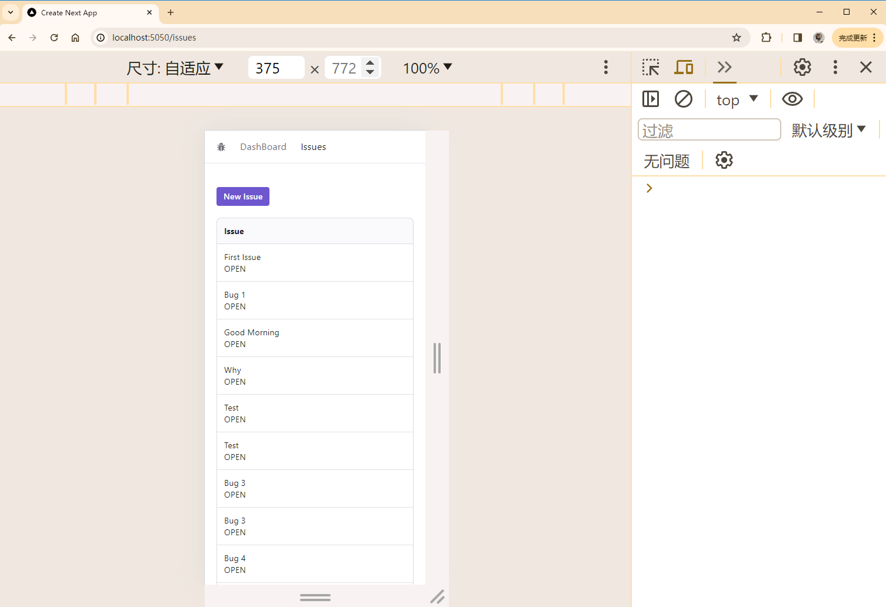
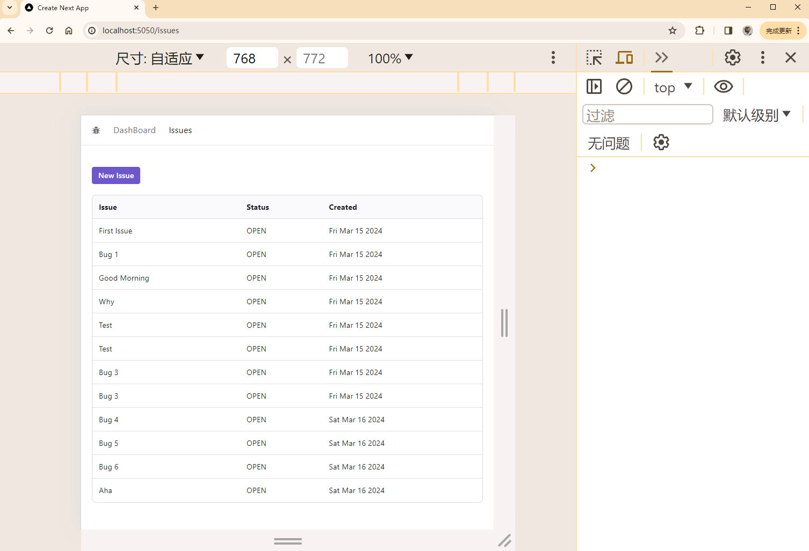
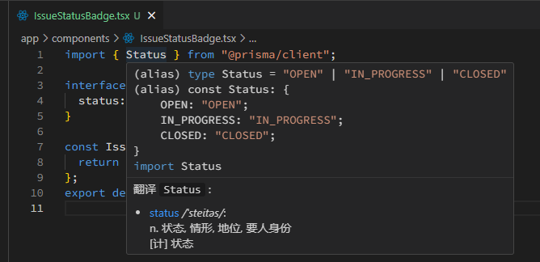
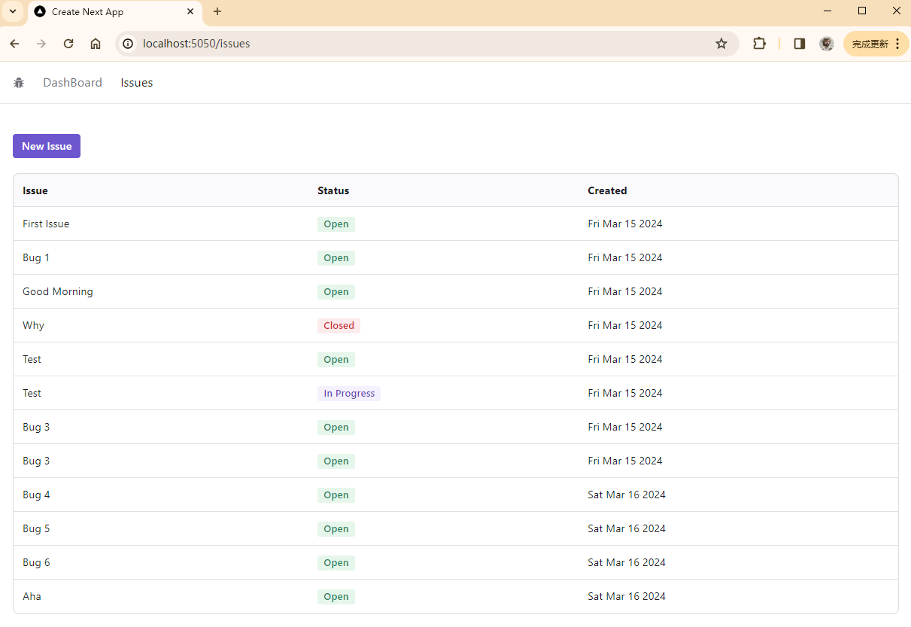
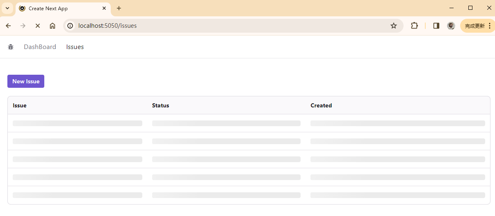
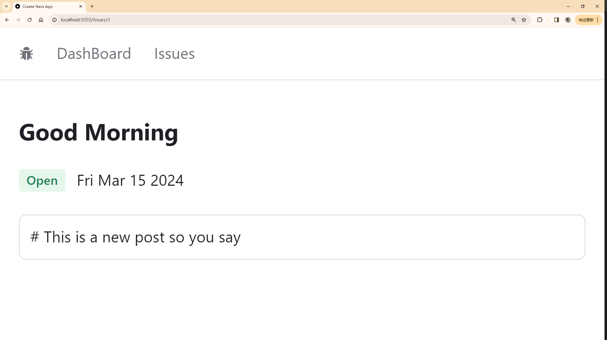
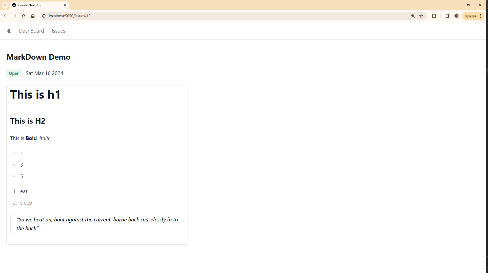
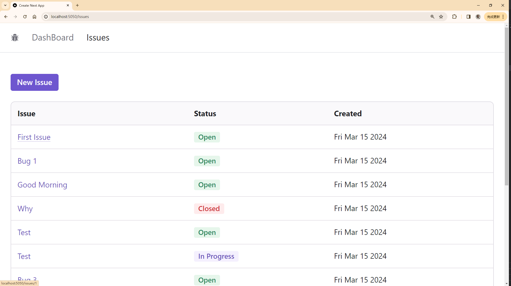
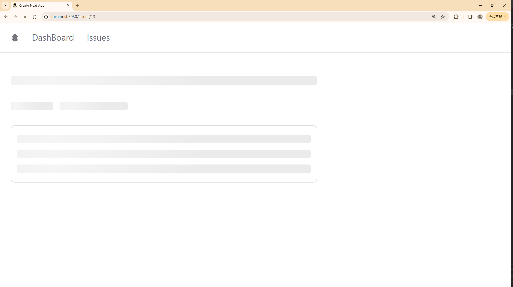
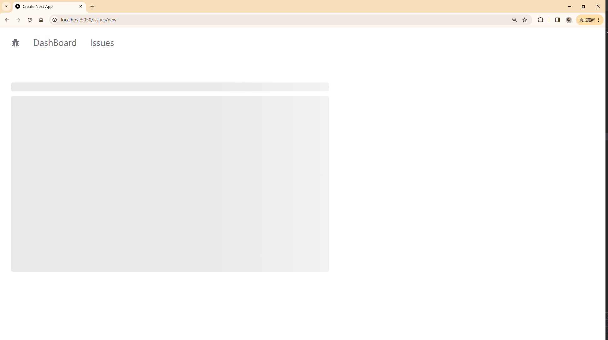

---
last_update:
  date: 16 Mar 2024 GMT
  author: Casta-mere
---

# 查看 Issue

## 展示 Issue

[本节代码链接](https://github.com/Casta-mere/Issue-Tracker/tree/13f0f6d123345ccd038f11363b11f570689a275d)

首先使用 prisma 获取所有的 issues，然后添加一个 Radix UI 中的 Table 组件

```tsx title="/app/issues/page.tsx" showLineNumbers
  import { Button, Table, TableColumnHeaderCell } from "@radix-ui/themes";
  import Link from "next/link";
  // git-add-next-line
+ import prisma from "@/prisma/client";

  const IssuesPage = async () => {
    // git-add-next-line
+   const issues = await prisma.issue.findMany();
    return (
      <div>
        <div className="mb-5">
          <Button>
            <Link href="/issues/new">New Issue</Link>
          </Button>
        </div>
        {/* Radix UI 中的 Table 组件 */}
        {/* git-add-start */}
+       <Table.Root variant="surface">
+         <Table.Header>
+           <Table.Row>
+             <TableColumnHeaderCell>Issue</TableColumnHeaderCell>
+             <TableColumnHeaderCell>Status</TableColumnHeaderCell>
+             <TableColumnHeaderCell>Created</TableColumnHeaderCell>
+           </Table.Row>
+         </Table.Header>
+         <Table.Body>
+           {issues.map((issue) => (
+             <Table.Row key={issue.id}>
+               <Table.Cell>{issue.title}</Table.Cell>
+               <Table.Cell>{issue.status}</Table.Cell>
+               <Table.Cell>{issue.createdAt.toDateString()}</Table.Cell>
+             </Table.Row>
+           ))}
+         </Table.Body>
+       </Table.Root>
        {/* git-add-end */}
      </div>
    );
  };
  export default IssuesPage;
```

然后我们可以给不同的列添加显示选项，以适配不同的屏幕大小

```tsx title="/app/issues/page.tsx" showLineNumbers
...
const IssuesPage = async () => {
  ...

  return (
    <div>
      ...
      <Table.Root variant="surface">
        <Table.Header>
          <Table.Row>
            <TableColumnHeaderCell>Issue</TableColumnHeaderCell>
            <TableColumnHeaderCell className="hidden md:table-cell">
              Status
            </TableColumnHeaderCell>
            <TableColumnHeaderCell className="hidden md:table-cell">
              Created
            </TableColumnHeaderCell>
          </Table.Row>
        </Table.Header>
        <Table.Body>
          {issues.map((issue) => (
            <Table.Row key={issue.id}>
              <Table.Cell>
                {issue.title}
                <div className="block md:hidden">{issue.status}</div>
              </Table.Cell>
              <Table.Cell className="hidden md:table-cell">
                {issue.status}
              </Table.Cell>
              <Table.Cell className="hidden md:table-cell">
                {issue.createdAt.toDateString()}
              </Table.Cell>
            </Table.Row>
          ))}
        </Table.Body>
      </Table.Root>
    </div>
  );
};
export default IssuesPage;
```

显示效果如下





## 制作 Badge

[本节代码链接](https://github.com/Casta-mere/Issue-Tracker/tree/73aec8b96b6d045ac1e696811b4164c6dc57c8b3)

在 Prisma 中添加的 Model 会自动为我们生成 Type ，方便拿来做 Interface



这里有一些技巧。首先，对于一些固定值的映射(比如这里 Issue 状态对 Badge 颜色/内容的映射)，我们可以使用一个 Record 来记录，其本质为一个键值对，我们可以使用 `< >` 来定义键和值的数据类型

```tsx title="/app/components/IssueStatusBadge.tsx" showLineNumbers
import { Status } from "@prisma/client";
import { Badge } from "@radix-ui/themes";

const statusMap: Record<
  Status,
  { label: string; color: "green" | "violet" | "red" }
> = {
  OPEN: { label: "Open", color: "green" },
  IN_PROGRESS: { label: "In Progress", color: "violet" },
  CLOSED: { label: "Closed", color: "red" },
};

const IssueStatusBadge = ({ status }: { status: Status }) => {
  return (
    <Badge color={statusMap[status].color}>{statusMap[status].label}</Badge>
  );
};
export default IssueStatusBadge;
```

最终效果如下



## Loading Skeleton

[本节代码链接](https://github.com/Casta-mere/Issue-Tracker/tree/9edfd4a09a70f6ab705f310059666371223c74b6)

本节我们想要实现一个如下的加载动画



安装 `delay` 包用于模拟网速较慢情况，`react-loading-skeleton` 包用于添加骨架动画

```bash
npm i delay
npm i react-loading-skeleton
```

首先，我们应该在页面中把不需要加载的部分(指不需要从外部获取数据的部分，一些写死的 Text, Link, Button 之类的)封装起来，

```tsx title="/app/issues/IssueAction.tsx" showLineNumbers
import { Button } from "@radix-ui/themes";
import Link from "next/link";

const IssueActions = () => {
  return (
    <div className="mb-5">
      <Button>
        <Link href="/issues/new">New Issue</Link>
      </Button>
    </div>
  );
};
export default IssueActions;
```

然后在 `page.tsx` 同目录下创建 `loading.tsx` (注意文件名必须是这个，大小写也不能改)。将 page.tsx 中 return 的内容都复制到里面，把**需要加载的字段换为 Skeleton 标签即可**

```tsx title="/app/issues/loading.tsx"
  import { Table, TableColumnHeaderCell } from "@radix-ui/themes";
  // import Skeleton
  // git-add-next-line
+ import Skeleton from "react-loading-skeleton";
  // git-add-next-line
+ import "react-loading-skeleton/dist/skeleton.css";
  import IssueActions from "./IssueActions";

  const LoadingIssuesPage = () => {
    // 显示 5 行 skeleton
    // git-add-next-line
+   const issues = [1, 2, 3, 4, 5];

    return (
      ...
      <Table.Body>
        {issues.map((issue) => (
          {/* 将所有需要数据的字段换为 <Skeleton />即可 */}
          {/* git-remove-next-line */}
-         <Table.Row key={issue.id}>
          {/* git-add-next-line*/}
+         <Table.Row key={issue}>
            <Table.Cell>
              {/* git-remove-next-line */}
-             {issue.title}
              {/* git-add-next-line*/}
+             <Skeleton />
              <div className="block md:hidden">
                {/* git-remove-next-line */}
-               <IssueStatusBadge status={issue.status} />
                {/* git-add-next-line*/}
+               <Skeleton />
              </div>
            </Table.Cell>
            <Table.Cell className="hidden md:table-cell">
              {/* git-remove-next-line */}
-             <IssueStatusBadge status={issue.status} />
              {/* git-add-next-line*/}
+             <Skeleton />
            </Table.Cell>
            <Table.Cell className="hidden md:table-cell">
              {/* git-remove-next-line */}
-             {issue.createdAt.toDateString()}
              {/* git-add-next-line*/}
+             <Skeleton />
            </Table.Cell>
          </Table.Row>
        ))}
      </Table.Body>
      ...
    );
  };
  export default LoadingIssuesPage;
```

我们可以在 page.tsx 中添加一个 `delay(2000)` 来模拟

```tsx title="/app/issues/page.tsx"
...
const IssuesPage = async () => {
  const issues = await prisma.issue.findMany();
  await delay(2000);
  ...
```

## Issue Detail Page

[本节代码链接](https://github.com/Casta-mere/Issue-Tracker/tree/68fede6d298c63d3f5e9efc0b3529efd4743f72f)

首先创建一个页面用于展示 Issue 细节 `/app/issues/[id]/page.tsx`。

```tsx title="/app/issues/[id]/page.tsx" showLineNumbers
import prisma from "@/prisma/client";
import { notFound } from "next/navigation";
interface Props {
  params: { id: string };
}
const IssueDeatilPage = async ({ params }: Props) => {
  // 判断 url 中的 id 是不是 number，比如 'issues/abc' 就直接404
  if (typeof params.id !== "number") notFound();

  // 获取 issue
  const issue = await prisma.issue.findUnique({
    where: { id: parseInt(params.id) },
  });

  // 如果 issue 不存在，也404
  if (!issue) notFound();

  return (
    <div>
      <p>{issue.title}</p>
      <p>{issue.description}</p>
      <p>{issue.status}</p>
      <p>{issue.createdAt.toDateString()}</p>
    </div>
  );
};
export default IssueDeatilPage;
```

然后在 `/app/issues/page.tsx` 中渲染表格时，添加一个 Link，用于跳转到 detail 页面

```tsx title="/app/issues/page.tsx" showLineNumbers
  const IssuesPage = async () => {
    return (
      ...
      <Table.Cell>
        {/* git-add-next-line */}
+       <Link href={`/issues/${issue.id}`}>{issue.title}</Link>
        <div className="block md:hidden">
          <IssueStatusBadge status={issue.status} />
        </div>
      </Table.Cell>
      ...
    );
  };
```

最后，我们应该为 "/app/issues" 下的每一个 `page` 都提供一个 `loading.tsx`，否则刚刚的 "/app/issues/loading.tsx" 会应用到 "/app/issues" 下的所有页面

### 添加样式

[本节代码链接](https://github.com/Casta-mere/Issue-Tracker/tree/2e65e7d911fe79267e2a17b85920756ad2ce52fe)

此处大量使用了 Radix UI 中的组件

```tsx title="/app/issues/[id]/page.tsx" showLineNumbers
const IssueDeatilPage = async ({ params }: Props) => {
  ...
  return (
    <div>
      <Heading as="h2">{issue.title}</Heading>
      <Flex gap="3" my="5">
        <IssueStatusBadge status={issue.status}></IssueStatusBadge>
        <Text>{issue.createdAt.toDateString()}</Text>
      </Flex>
      <Card>{issue.description}</Card>
    </div>
  );
};
```

效果如下



### MarkDown 渲染

[本节代码链接](https://github.com/Casta-mere/Issue-Tracker/tree/751bd7bf54726a64ee1c11fe58ae92de1ebe52d3)

首先，安装以下两个 package

```bash
npm i react-markdown
npm install -D @tailwindcss/typography
```

在 "/app/issues/[id]/page.tsx" 中，将 issue.description 用 `ReactMarkdown` 组件包起来即可

```tsx title="/app/issues/[id]/page.tsx" showLineNumbers
  const IssueDeatilPage = async ({ params }: Props) => {
    ...
    return (
      ...
      // git-remove-next-line
-     <Card>{issue.description}</Card>
      // git-add-start
+     <Card className="prose">
+       <ReactMarkdown>{issue.description}</ReactMarkdown>
+     </Card>
      // git-add-end
      ...
    );
  };
```

在 Tailwind 中，默认 h1, h2, ul, ol, strong 这些标签都是无样式的，我们需要手动进行设置。刚刚安装的 `tailwindcss/typography` 就是这个作用。首先，在 `tailwind.config.ts` 中，添加 plugin，然后在需要用到这些样式的 container 的 `className` 中添加 `prose` 即可

```ts title="tailwind.config.ts" showLineNumbers
  import type { Config } from "tailwindcss";

  const config: Config = {
    content: [
      "./pages/**/*.{js,ts,jsx,tsx,mdx}",
      "./components/**/*.{js,ts,jsx,tsx,mdx}",
      "./app/**/*.{js,ts,jsx,tsx,mdx}",
    ],
    theme: {
      extend: {
        backgroundImage: {
          "gradient-radial": "radial-gradient(var(--tw-gradient-stops))",
          "gradient-conic":
            "conic-gradient(from 180deg at 50% 50%, var(--tw-gradient-stops))",
        },
      },
    },
    // 在这里添加 @tailwindcss/typography"
    // git-add-next-line
+   plugins: [require("@tailwindcss/typography")],
  };
  export default config;
```

最终实现效果如下



## 自定义 Link Component

[本节代码链接](https://github.com/Casta-mere/Issue-Tracker/tree/48049124bc6135ca808beebed5d0abd11dd38d41)

我们想要同时应用 Next.js 中 Link 的客户端导航功能，和 Radix UI 中 Link 的样式，就可以进行如下改装，后期直接使用即可

```tsx title="/app/components/link.tsx" showLineNumbers
import NextLink from "next/link";
import { Link as RadixLink } from "@radix-ui/themes";

interface Props {
  href: string;
  children: string;
}

const Link = ({ href, children }: Props) => {
  return (
    <NextLink href={href} passHref legacyBehavior>
      <RadixLink>{children}</RadixLink>
    </NextLink>
  );
};
export default Link;
```

效果如下，其中 Link 的颜色会随着 Theme 的改变而改变



## Loading Skeletons

[本节代码链接](https://github.com/Casta-mere/Issue-Tracker/tree/d3a1ebcb4c00563eb82a541cdbf095d747c0f0e1)

```tsx title="/app/issues/[id]/loading.tsx" showLineNumbers
import IssueStatusBadge from "@/app/components/IssueStatusBadge";
import { Box, Card, Flex, Heading } from "@radix-ui/themes";
import ReactMarkdown from "react-markdown";
import Skeleton from "react-loading-skeleton";
import "react-loading-skeleton/dist/skeleton.css";

const LoadingIssueDetailPage = () => {
  return (
    <Box className="max-w-xl">
      <Skeleton />
      <Flex gap="3" my="5">
        <Skeleton width="5rem" />
        <Skeleton width="8rem" />
      </Flex>
      <Card className="prose">
        <Skeleton count={3} />
      </Card>
    </Box>
  );
};
export default LoadingIssueDetailPage;
```

```tsx title="/app/issues/new/loading.tsx" showLineNumbers
import { Box } from "@radix-ui/themes";
import Skeleton from "react-loading-skeleton";
import "react-loading-skeleton/dist/skeleton.css";

const LoadingNewIssuePage = () => {
  return (
    <Box className="max-w-xl">
      <Skeleton />
      <Skeleton height="20rem" />
    </Box>
  );
};
export default LoadingNewIssuePage;
```

显示效果如下





## 动态导入(关闭 SSR)

[本节代码链接](https://github.com/Casta-mere/Issue-Tracker/tree/ded6083962e9ad69aa4fca7c8196bc6822fef6a7)

SSR(_Server Side Render_) 相关内容可参考[组件的渲染](/docs/React/Next/Fundamentals#组件的渲染)

```tsx title="/app/issues/new/page.tsx"
// git-remove-next-line
- import SimpleMDE from "react-simplemde-editor";
// git-add-next-line
+ import dynamic from "next/dynamic";

// git-add-next-line
+ const SimpleMDE = dynamic(() => import("react-simplemde-editor"), {
// git-add-next-line
+   ssr: false,
// git-add-next-line
+ });
```

## 整理 imports

[本节代码链接](https://github.com/Casta-mere/Issue-Tracker/tree/f7a4b4461662544e529d961e43092fbe43261fd8)

我们可以在 Components 文件夹下添加 `index.ts`，将该文件夹下所有组件都注册到其中

```tsx title="/app/components/index.ts"
export { default as Link } from "./Link";
export { default as ErrorMessage } from "./ErrorMessage";
export { default as IssueStatusBadge } from "./IssueStatusBadge";
export { default as Spinner } from "./Spinner";
export { default as Skeleton } from "./Skeleton";
```

然后在其他页面，直接使用以下 import 语句即可

```tsx
import { ErrorMessage, Spinner } from "@/app/components";
```

[React Loading Skeleton]: (https://www.npmjs.com/package/react-loading-skeleton/v/3.3.0)
