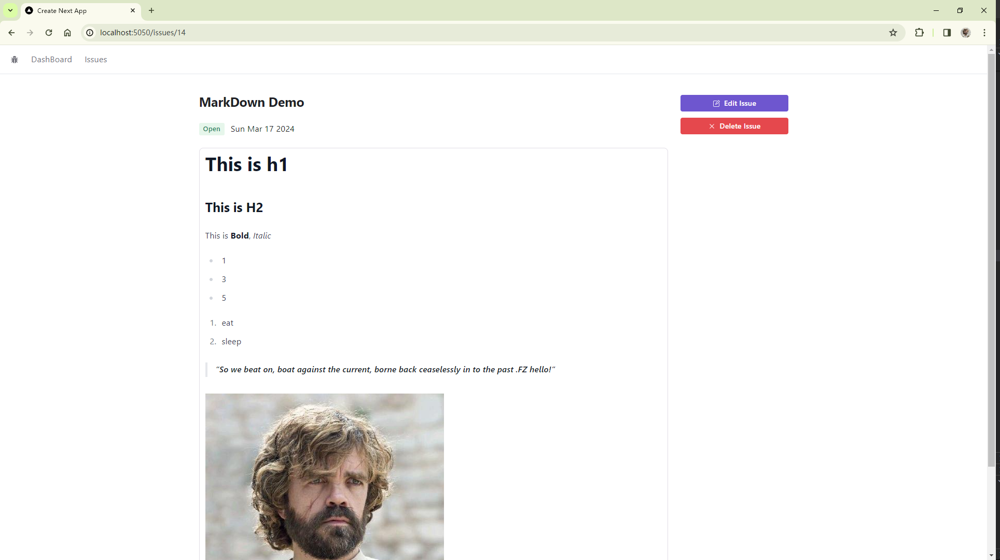
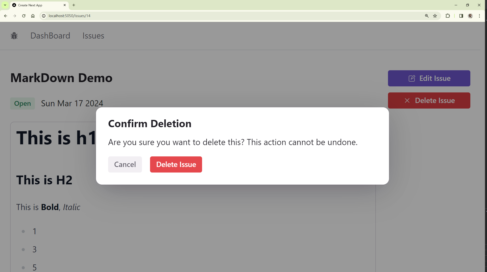
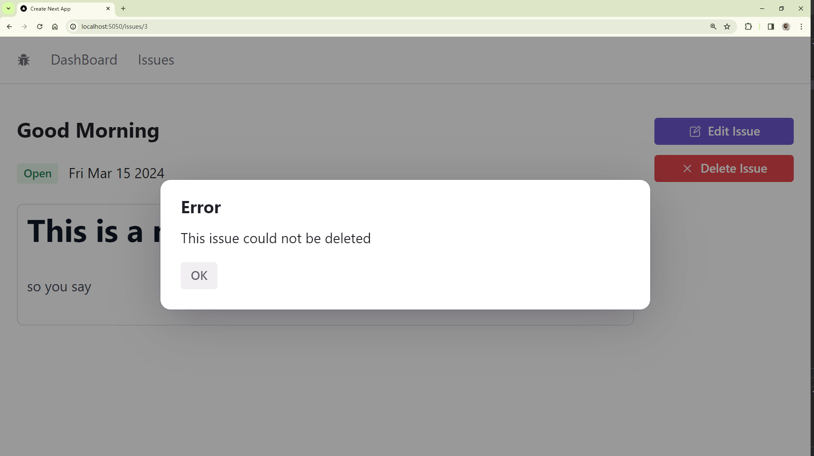

# 删除 Issue

## 添加删除 Button

[本节代码链接](https://github.com/Casta-mere/Issue-Tracker/tree/b129da3d69c60e979a2aeaae79a401891824246a)

这里我们主要关注布局的问题，我们调整 Grid 的 columns 与第一个 Box 的设置，使得在小设备上，两个 Box 上下排布，在中等及以上，左边 Box 占屏幕 80%

```tsx title="/app/issues/[id]/page.tsx" showLineNumbers
  const IssueDeatilPage = async ({ params }: Props) => {
    ...
    return (
      // git-add-next-line
+     <Grid columns={{ initial: "1", sm: "5" }} gap="5">
        // git-add-next-line
+       <Box className="md:col-span-4">
          <IssueDetails issue={issue} />
        </Box>
        <Box>
          <Flex direction="column" gap="3">
            <EditIssueButton issueId={issue.id} />
            {/* git-add-next-line */}
+           <DeleteIssueButton issueId={issue.id} />
          </Flex>
        </Box>
      </Grid>
    );
  };
  export default IssueDeatilPage;
```

其次，在 layout.tsx 中将 `<main >` 中所有内容用 Radix UI 中的 Container 包起来，以实现居中，最终显示效果如下



## 添加确认框

[本节代码链接](https://github.com/Casta-mere/Issue-Tracker/tree/48ffe01c38961dd0fa79949fc85c9bf706404644)

```tsx title="/app/issues/[id]/DeleteIssueButton.tsx" showLineNumbers
"use client";
import { AlertDialog, Button, Flex } from "@radix-ui/themes";
import { Cross2Icon } from "@radix-ui/react-icons";

const DeleteIssueButton = ({ issueId }: { issueId: number }) => {
  return (
    <AlertDialog.Root>
      <AlertDialog.Trigger>
        <Button color="red">
          <Cross2Icon />
          Delete Issue
        </Button>
      </AlertDialog.Trigger>
      <AlertDialog.Content>
        <AlertDialog.Title>Confirm Deletion</AlertDialog.Title>
        <AlertDialog.Description>
          Are you sure you want to delete this? This action cannot be undone.
        </AlertDialog.Description>
        <Flex mt="4" gap="4">
          <AlertDialog.Cancel>
            <Button variant="soft" color="gray">
              Cancel
            </Button>
          </AlertDialog.Cancel>
          <AlertDialog.Action>
            <Button color="red">Delete Issue</Button>
          </AlertDialog.Action>
        </Flex>
      </AlertDialog.Content>
    </AlertDialog.Root>
  );
};
export default DeleteIssueButton;
```

显示效果如下



## 删除 Issue

### API

[本节代码链接](https://github.com/Casta-mere/Issue-Tracker/tree/be50afb1a57089338c8e1d91a848511925436a53)

```tsx title="/app/api/issues/[id]/route.tsx" showLineNumbers
export async function DELETE(
  request: NextRequest,
  { params }: { params: { id: string } }
) {
  const issue = await prisma.issue.findUnique({
    where: { id: parseInt(params.id) },
  });
  if (!issue)
    return NextResponse.json({ error: "Invalid Issue" }, { status: 404 });

  await prisma.issue.delete({
    where: { id: issue.id },
  });

  return NextResponse.json({ status: 200 });
}
```

### 连接

[本节代码链接](https://github.com/Casta-mere/Issue-Tracker/tree/e2965f339623536b010ecf0c556e403fd2e4b2ce)

```tsx title="/app/issues/[id]/DeleteIssueButton.tsx" showLineNumbers
  ...
  // git-add-next-line
+ import axios from "axios";
  // git-add-next-line
+ import { useRouter } from "next/navigation";

  const DeleteIssueButton = ({ issueId }: { issueId: number }) => {
    // git-add-start
+   const router = useRouter();
+   const handleDelete = async () => {
+     await axios.delete("/api/issues/" + issueId);
+     router.push("/issues");
+     router.refresh();
+   };
    // git-add-end

    return (
      ...
      <AlertDialog.Action>
      {/* git-add-next-line */}
+       <Button color="red" onClick={handleDelete}>
          Delete Issue
        </Button>
      </AlertDialog.Action>
      ...
    );
  };
  export default DeleteIssueButton;
```

## 处理 error

[本节代码链接](https://github.com/Casta-mere/Issue-Tracker/tree/7610bbf68be86f4ff481310c0c47f28bf8e01129)

```tsx title="/app/issues/[id]/DeleteIssueButton.tsx" showLineNumbers
  ...
  // git-add-next-line
+ import { useState } from "react";

  const DeleteIssueButton = ({ issueId }: { issueId: number }) => {
    // git-add-next-line
+   const [error, setError] = useState(false);

    const handleDeleteIssue = async () => {
      try {
        await axios.delete("/api/issues/" + issueId);
        router.push("/issues");
        router.refresh();
      } catch (error) {
        // git-add-next-line
+       setError(true);
      }
    };

    return (
      <>
        <AlertDialog.Root>
        ...
        </AlertDialog.Root>
        {/* git-add-start */}
+       <AlertDialog.Root open={error}>
+         <AlertDialog.Content>
+           <AlertDialog.Title>Error</AlertDialog.Title>
+           <AlertDialog.Description>
+             This issue could not be deleted
+           </AlertDialog.Description>
+           <Button
+             color="gray"
+             variant="soft"
+             mt="4"
+             onClick={() => setError(false)}
+           >
+             OK
+           </Button>
+         </AlertDialog.Content>
+       </AlertDialog.Root>
        {/* git-add-end */}
     </>
    );
  };
  export default DeleteIssueButton;
```

效果如下，在发生错误时会弹出这样一个框



## 优化用户体验

[本节代码链接](https://github.com/Casta-mere/Issue-Tracker/tree/15bf7bc6c313f5ca63cfbb0b0a4b868981cb7d8a)

和[Button 优化技巧](/docs/React/Issue/Create#button-优化技巧)一章相同，我们可以添加一个 Spinner 和 Disable 来优化用户体验

```tsx title="/app/issues/[id]/DeleteIssueButton.tsx" showLineNumbers
  // git-add-next-line
+ import { Spinner } from "@/app/components";

  const DeleteIssueButton = ({ issueId }: { issueId: number }) => {
    // git-add-next-line
+   const [isDeleting, setDeleting] = useState(false);

    const handleDeleteIssue = async () => {
      try {
        // git-add-next-line
+       setDeleting(true);
        await axios.delete("/api/issues/" + issueId);
        router.push("/issues");
        router.refresh();
      } catch (error) {
        // git-add-next-line
+       setDeleting(false);
        setError(true);
      }
    };

    return (
      ...
      <AlertDialog.Trigger>
        {/* git-add-next-line */}
+       <Button color="red" disabled={isDeleting}>
          <Cross2Icon />
          Delete Issue
          {/* git-add-next-line */}
+         {isDeleting && <Spinner />}
        </Button>
      </AlertDialog.Trigger>
      ...
    );
  };
  export default DeleteIssueButton;
```
