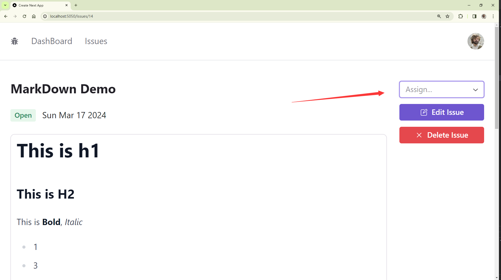
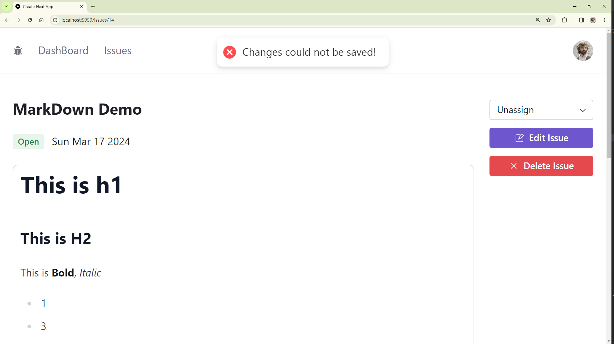

# 分配 Issue 给用户

[本节代码链接](https://github.com/Casta-mere/Issue-Tracker/tree/b154dfc8bfd175af48d037a92fb069636fcf4053)

## Select Button

```tsx title="/app/issues/[id]/AssigneeSelect.tsx" showLineNumbers
"use client";
import { Select } from "@radix-ui/themes";

const AssigneeSelect = () => {
  return (
    <Select.Root>
      <Select.Trigger placeholder="Assign..." />
      <Select.Content>
        <Select.Group>
          <Select.Label>Suggestions</Select.Label>
          <Select.Item value="1">Castamere</Select.Item>
        </Select.Group>
      </Select.Content>
    </Select.Root>
  );
};
export default AssigneeSelect;
```

效果如下



## 获取所有用户

[本节代码链接](https://github.com/Casta-mere/Issue-Tracker/tree/92351a6e3e7f211bdd23a927417a916ba627d861)

### 构建 API

```tsx title="/app/api/users" showLineNumbers
import { NextRequest, NextResponse } from "next/server";
import prisma from "@/prisma/client";

export async function GET(reques: NextRequest) {
  const users = await prisma.user.findMany({ orderBy: { name: "asc" } });
  return NextResponse.json(users);
}
```

### 客户端获取数据

```tsx title="/app/issues/[id]/AssigneeSelect.tsx" showLineNumbers
"use client";
import { User } from "@prisma/client";
import { Select } from "@radix-ui/themes";
import axios from "axios";
import { useEffect, useState } from "react";

const AssigneeSelect = () => {
  const [users, setUsers] = useState<User[]>([]);

  // highlight-start
  useEffect(() => {
    const getUsers = async () => {
      const { data } = await axios.get<User[]>("/api/users");
      setUsers(data);
    };
    getUsers();
  }, []);
  // highlight-end
  return (
    <Select.Root>
      <Select.Trigger placeholder="Assign..." />
      <Select.Content>
        <Select.Group>
          <Select.Label>Suggestions</Select.Label>
          {users.map((user) => (
            <Select.Item value={user.id} key={user.id}>
              {user.name}
            </Select.Item>
          ))}
        </Select.Group>
      </Select.Content>
    </Select.Root>
  );
};
export default AssigneeSelect;
```

## React-Query

### 配置 React-Query

[本节代码链接](https://github.com/Casta-mere/Issue-Tracker/tree/77f36e9df06d43350be135db23864d86004b89a4)

使用如下命令安装 React-Query

```bash
npm i @tanstack/react-query
```

安装好后，在 /app 目录下创建 `QueryClientProvider.tsx`

```tsx title="/app/QueryClientProvider.tsx" showLineNumbers
"use client";
import {
  QueryClient,
  QueryClientProvider as ReactQueryClientProvider,
} from "@tanstack/react-query";
import { PropsWithChildren } from "react";

const queryClient = new QueryClient();

const QueryClientProvider = ({ children }: PropsWithChildren) => {
  return (
    <ReactQueryClientProvider client={queryClient}>
      {children}
    </ReactQueryClientProvider>
  );
};
export default QueryClientProvider;
```

然后在 layout 中将 body 内所有内容用 QueryClientProvider 包起来

```tsx title="/app/layout.tsx"
export default function RootLayout({
  children,
}: Readonly<{
  children: React.ReactNode;
}>) {
  return (
    <html lang="en">
      <body className={inter.className}>
        <QueryClientProvider>
          <AuthProvider>
            <Theme appearance="light" accentColor="violet">
              <NavBar />
              <main className="p-5">
                <Container>{children}</Container>
              </main>
            </Theme>
          </AuthProvider>
        </QueryClientProvider>
      </body>
    </html>
  );
}
```

### 使用 React-Query

[本节代码链接](https://github.com/Casta-mere/Issue-Tracker/tree/eea9b9b95780e9a11c2e2649f2b0c381f6a05d36)

首先，在 "/app/issues/[id]/Assign" 中去掉之前的 useEffect 和 useState，之后参照下面修改

```tsx title="/app/issues/[id]/AssigneeSelect.tsx" showLineNumbers
  ...
  // git-add-next-line
+ import { useQuery } from "@tanstack/react-query";
  // git-add-next-line
+ import { Skeleton } from "@/app/components";

  const AssigneeSelect = () => {
    // git-add-start
+   const {
+     data: users,
+     error,
+     isLoading,
+   } = useQuery<User[]>({
    // git-add-end
      // 用于缓存的 key，在不同地方调用 useQuery 若 key 一样则不会重复获取
      // git-add-next-line
+     queryKey: ["users"],
      // 用于获取数据的函数
      // git-add-next-line
+     queryFn: () => axios.get<User[]>("/api/users").then((res) => res.data),
      // 数据缓存多久
      // git-add-next-line
+     staleTime: 60 * 1000,
      // 最多重复获取几次
      // git-add-start
+     retry: 3,
+   });
+   if (error) return null;
+   if (isLoading) return <Skeleton />;
    // git-add-end
    ...
  };
  export default AssigneeSelect;
```

<details>
  <summary>完整代码(非 git diff 版)</summary>

```tsx title="/app/issues/[id]/AssigneeSelect.tsx" showLineNumbers
"use client";
import { User } from "@prisma/client";
import { Select } from "@radix-ui/themes";
import { useQuery } from "@tanstack/react-query";
import axios from "axios";
import { Skeleton } from "@/app/components";

const AssigneeSelect = () => {
  const {
    data: users,
    error,
    isLoading,
  } = useQuery<User[]>({
    queryKey: ["users"], // 用于缓存的 key，在不同地方调用 useQuery 若 key 一样则不会重复获取
    queryFn: () => axios.get<User[]>("/api/users").then((res) => res.data), // 用于获取数据的函数
    staleTime: 60 * 1000, // 数据缓存多久
    retry: 3, // 最多重复获取几次
  });
  if (error) return null;
  if (isLoading) return <Skeleton />;

  return (
    <Select.Root>
      <Select.Trigger placeholder="Assign..." />
      <Select.Content>
        <Select.Group>
          <Select.Label>Suggestions</Select.Label>
          {users?.map((user) => (
            <Select.Item value={user.id} key={user.id}>
              {user.name}
            </Select.Item>
          ))}
        </Select.Group>
      </Select.Content>
    </Select.Root>
  );
};
export default AssigneeSelect;
```

</details>

## Prisma Relation

[本节代码链接](https://github.com/Casta-mere/Issue-Tracker/tree/39fb46c5fd4a90c4eb4b05617e1501a162a61da1)

我们需要在 Prisma 中的 Issue model 和 User model 创建一个 Relation

```prisma title="schema.prisma" showLineNumbers
  model Issue {
    id               Int      @id @default(autoincrement())
    title            String   @db.VarChar(255)
    description      String   @db.Text
    status           Status   @default(OPEN)
    createdAt        DateTime @default(now())
    updatedAt        DateTime @updatedAt()
    // git-add-next-line
+   assignedToUserId String?  @db.VarChar(255)
    // git-add-next-line
+   assignedToUser   User?    @relation(fields: [assignedToUserId], references: [id])
  }

  model User {
    id             String    @id @default(cuid())
    name           String?
    email          String?   @unique
    emailVerified  DateTime?
    image          String?
    accounts       Account[]
    sessions       Session[]
    // git-add-next-line
+   assignedIssues Issue[]
  }
```

## 更新修改 Issue API

[本节代码链接](https://github.com/Casta-mere/Issue-Tracker/tree/8221de08c6cafe6b1d306eb78d4ea166ee5067bd)

首先，添加一个新的 zod schema，其中 title, description, assignedToUserId 都设置为了 optional

```ts title="validationSchema.ts" showLineNumbers
import { z } from "zod";

export const issueSchema = z.object({
  title: z.string().min(1, "Title is required!").max(255),
  description: z.string().min(1, "Description is required!").max(65535),
});

export const patchIssueSchema = z.object({
  title: z.string().min(1, "Title is required!").max(255).optional(),
  description: z.string().min(1, "Description is required!").optional(),
  assignedToUserId: z
    .string()
    .min(1, "AssignedToUserId is required.")
    .max(255)
    .optional()
    .nullable(),
});
```

然后修改 "/app/api/issues/[id]/route.tsx"

```tsx title="/app/api/issues/[id]/route.tsx" showLineNumbers
  // git-add-next-line
+ import { patchIssueSchema } from "@/app/validationSchema";
  ...

  export async function PATCH(
    request: NextRequest,
    { params }: { params: { id: string } }
  ) {
    const session = await getServerSession(authOptions);
    if (!session) return NextResponse.json({}, { status: 401 });

    const body = await request.json();
    // 换成 patchIssueSchema
    // git-add-next-line
+   const validation = patchIssueSchema.safeParse(body);
    if (!validation.success)
      return NextResponse.json(validation.error.format(), { status: 400 });

    // 直接将 title, description, assignedToUserId 结构出来
    // git-add-next-line
+   const { title, description, assignedToUserId } = body;

    // 若 body 中有 assignedToUserId，则判断该用户是否存在
    // git-add-start
+   if (assignedToUserId) {
+     const user = await prisma.user.findUnique({
+       where: { id: assignedToUserId },
+     });
+     if (!user)
+       return NextResponse.json({ error: "Invalid user" }, { status: 400 });
+   }
    // git-add-end

    const issue = await prisma.issue.findUnique({
      where: { id: parseInt(params.id) },
    });
    if (!issue)
      return NextResponse.json({ error: "Invalid Issue" }, { status: 404 });

    const updatedIssue = await prisma.issue.update({
      where: { id: issue.id },
      // git-add-start
+     data: {
+       title,
+       description,
+       assignedToUserId,
+     },
      // git-add-end
    });

    return NextResponse.json(updatedIssue, { status: 200 });
  }
```

## 分配 Issue

[本节代码链接](https://github.com/Casta-mere/Issue-Tracker/tree/12c4a23f9d8fead585ccae4a8421dfc664b722a6)

```tsx title="/app/issues/[id]/AssigneeSelect.tsx" showLineNumbers
  ...
  const AssigneeSelect = ({ issue }: { issue: Issue }) => {
    ...

    return (
      <Select.Root
        // 设置初始显示值
        // git-add-next-line
+       defaultValue={issue.assignedToUserId || ""}
        // 当选择时，使用patch (不需要await)
        // git-add-start
+       onValueChange={(userId) => {
+         axios.patch("/api/issues/" + issue.id, {
+           assignedToUserId: userId === "Unassign" ? null : userId,
+         });
+       }}
        // git-add-end
      >
        <Select.Trigger placeholder="Assign..." />
        <Select.Content>
          <Select.Group>
            <Select.Label>Suggestions</Select.Label>
            {/* 添加一个 unassign */}
            {/* git-add-next-line */}
+           <Select.Item value="Unassign">Unassign</Select.Item>
            {users?.map((user) => (
              <Select.Item value={user.id} key={user.id}>
                {user.name}
              </Select.Item>
            ))}
          </Select.Group>
        </Select.Content>
      </Select.Root>
    );
  };
  export default AssigneeSelect;
```

## 显示 Toast

[本节代码链接](https://github.com/Casta-mere/Issue-Tracker/tree/142416a52bcc61895af7b4a04038faa989c462fa)

使用如下命令安装

```bash
npm i react-hot-toast
```

我们只需要在该组件任意地方添加 `<Toaster />` 组件，然后在需要报错的地方调用 toast() 函数即可

```tsx title="/app/issues/[id]/AssigneeSelect.tsx" showLineNumbers
  // git-add-next-line
+ import toast, { Toaster } from "react-hot-toast";

  const AssigneeSelect = ({ issue }: { issue: Issue }) => {

    return (
      <>
        <Select.Root
          defaultValue={issue.assignedToUserId || ""}
          onValueChange={ (userId) => {
            // git-add-start
+           axios
+             .patch("/api/issues/" + issue.id, {
+               assignedToUserId: userId === "Unassign" ? null : userId,
+             })
              // git-add-end
              // 调用 toast.error()即可
              // git-add-next-line
+             .catch(() => toast.error("Changes could not be saved!"));
            }
          }
        >
          ...
        </Select.Root>
        {/* git-add-next-line */}
+       <Toaster />
      </>
    );
  };
  export default AssigneeSelect;
```

效果如下


