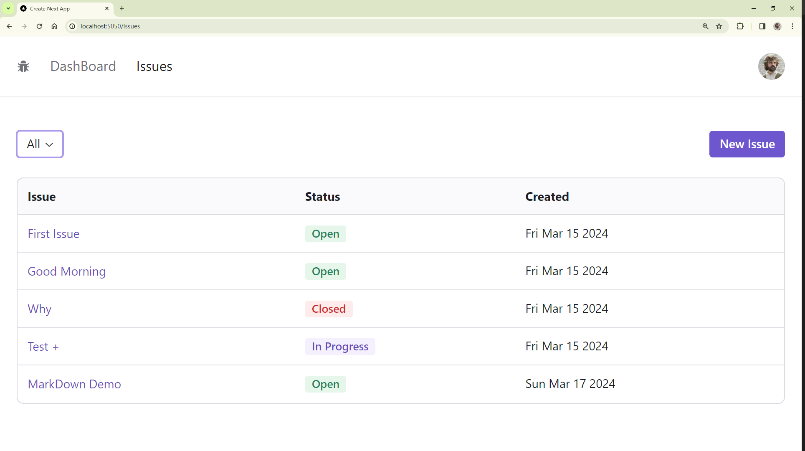
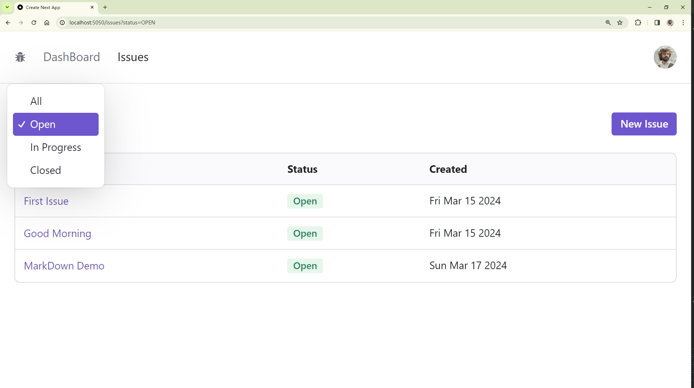

---
last_update:
  date: 17 Mar 2024 GMT
  author: Casta-mere
---

# 数据处理

## 筛选

### 添加筛选按钮

[本节代码链接](https://github.com/Casta-mere/Issue-Tracker/tree/dc84dba0cd1977fe17423800dbd08abea9235009)

```tsx title="/app/issues/IssueStatusFilter.tsx" showLineNumbers
"use client";
import { Status } from "@prisma/client";
import { Select } from "@radix-ui/themes";

// 将所有可选值存储到外置 const 里
const statuses: { label: string; value?: Status }[] = [
  { label: "All" },
  { label: "Open", value: "OPEN" },
  { label: "In Progress", value: "IN_PROGRESS" },
  { label: "Closed", value: "CLOSED" },
];

const IssueStatusFilter = () => {
  return (
    <Select.Root defaultValue=" ">
      <Select.Trigger placeholder="Filter by status..." />
      <Select.Content>
        {statuses.map((status) => (
          <Select.Item key={status.value} value={status.value || " "}>
            {status.label}
          </Select.Item>
        ))}
      </Select.Content>
    </Select.Root>
  );
};
export default IssueStatusFilter;
```

最终效果如下:



### 添加筛选参数

在刚刚的 IssueStatusFilter 中，为 Selet 添加 OnValueChage，使得在选项改变时，跳转至添加参数的页面 `/issues?status=`

```tsx title="/app/issues/IssueStatusFilter.tsx" showLineNumbers
  ...
  // git-add-next-line
+ import { useRouter } from "next/navigation";
  ...
  const IssueStatusFilter = () => {
    // git-add-start
+   const router = useRouter();
+   const setStatusFilter = (status: string) => {
+     if (status === "All") {
+       router.push("/issues");
+       return;
+     }
+     const query = status ? `?status=${status}` : "";
+     router.push("/issues" + query);
+   };
    // git-add-end

    return (
      // git-add-next-line
+     <Select.Root defaultValue="All" onValueChange={setStatusFilter}>
        ...
      </Select.Root>
    );
  };
  export default IssueStatusFilter;
```

### 处理筛选参数

```tsx title="/app/issues/page.tsx" showLineNumbers
  ...
  // git-add-start
+ interface Props {
+   searchParams: { status: Status };
+ }
  // git-add-end

  // git-add-next-line
+ const IssuesPage = async ({ searchParams }: Props) => {
  // 判断 status 是否合法，若合法则加入到筛选项，若不合法则换成 undefined
  // git-add-start
+   const status = Object.values(Status).includes(searchParams.status)
+     ? searchParams.status
+     : undefined;
    // git-add-end

    // prisma 获取数据时直接添加参数
    // git-add-start
+   const issues = await prisma.issue.findMany({
+     where: {
+       status,
+     },
+   });
    // git-add-end
    ...
  };
  export default IssuesPage;
```

最终效果如下



## 排序

[本节代码链接](https://github.com/Casta-mere/Issue-Tracker/tree/9aa7e7c212a0176b4ceed75ae00346e02a1c1cea)

本节更多的是 TypeScript 技巧

```tsx title="/app/issues/page.tsx" showLineNumbers
  ...

  interface Props {
    // git-remove-next-line
-   searchParams: { status: Status };
    // git-add-next-line
+   searchParams: { status: Status; orderBy: keyof Issue };
  }
  // 设置 className 为可选，对于一些固定值可以使用 keyof
  // git-add-start
+ const columns: { label: string; value: keyof Issue; className?: string }[] = [
+   { label: "Issue", value: "title" },
+   { label: "Status", value: "status", className: "hidden md:table-cell" },
+   { label: "Created", value: "createdAt", className: "hidden md:table-cell" },
+ ];
  // git-add-end

  const IssuesPage = async ({ searchParams }: Props) => {
    const status = Object.values(Status).includes(searchParams.status)
      ? searchParams.status
      : undefined;

    // 判断是否在其中可以使用 .includes()
    // 如果是判断一个对象数组中的某一个键，可以像下面这样，先map成一个数组，再 .includes()
    // git-add-start
+   const orderBy = columns
+     .map((column) => column.value)
+     .includes(searchParams.orderBy)
+     ? { [searchParams.orderBy]: "asc" }
+     : undefined;
    // git-add-end

    const issues = await prisma.issue.findMany({
      where: {
        status,
      },
      // got-add-next-line
+     orderBy,
    });

    return (
      <div>
        <IssueActions />
        <Table.Root variant="surface">
          <Table.Header>
            <Table.Row>
              {/* git-add-start */}
+             {columns.map((column) => (
+               <Table.ColumnHeaderCell
+                 key={column.label}
+                 className={column.className}
+               >
+                 <NextLink
+                   href={{
                      {/* git-add-end */}
                      {/* 使用 ... 展开数组*/}
                      {/* git-add-start */}
+                     query: { ...searchParams, orderBy: column.value },
+                   }}
+                 >
+                   {column.label}
+                   {column.value === searchParams.orderBy && (
+                     <ArrowUpIcon className="inline" />
+                   )}
+                 </NextLink>
+               </Table.ColumnHeaderCell>
+             ))}
              {/* git-add-end */}
            </Table.Row>
          </Table.Header>
          ...
        </Table.Root>
      </div>
    );
  };

  export const dynamic = "force-dynamic";

  export default IssuesPage;
```

这里更多的是讲，多个参数时的处理方式

```tsx title="/app/issues/IssueStatusFilter.tsx" showLineNumbers
  ...
  // git-add-next-line
+ import { useRouter, useSearchParams } from "next/navigation";


  const IssueStatusFilter = () => {
    const router = useRouter();
    // 获取搜索参数
    // git-add-next-line
+   const searchParams = useSearchParams();

    const setStatusFilter = (status: string) => {
      // 创建一个空的 searchParams
      // git-add-next-line
+     const params = new URLSearchParams();
      // 获取其他现有的 searchParams
      // git-add-next-line
+     if (searchParams.get("orderBy"))
+       params.append("orderBy", searchParams.get("orderBy")!);
      // 善用三元表达式
      // git-add-next-line
+     if (status) params.append("status", status === "All" ? "All" : status);
      // git-add-next-line
+     const query = params.size ? "?" + params.toString() : "";

      router.push("/issues" + query);
    };

    return (
      <Select.Root
        {/* 别忘了设置初始值 */}
        {/* git-add-next-line */}
+       defaultValue={searchParams.get("status") || "All"}
        onValueChange={setStatusFilter}
      >
        <Select.Trigger placeholder="Filter by status..." />
        <Select.Content>
          {statuses.map((status) => (
            <Select.Item
              key={status.value || "All"}
              value={status.value || "All"}
            >
              {status.label}
            </Select.Item>
          ))}
        </Select.Content>
      </Select.Root>
    );
  };
  export default IssueStatusFilter;
```

## Dummy Data

> Given the following prisma model, generate SQL statement to insert 20 records in the issues table. Use real-world titles and descriptions for issues. Status can be OPEN, IN_PROGRESS or CLOSED. Description should be a paragraph long with Mark down synatx. Provide different values for the createdAt and updatedAt columns.

## 分页

[本节代码链接](https://github.com/Casta-mere/Issue-Tracker/tree/d8efcc092192c6b55071aaf614f3a7bf3c209c0f)

import Tabs from "@theme/Tabs";
import TabItem from "@theme/TabItem";

<Tabs className="unique-tabs">

  <TabItem value="Pagination.tsx" label="Pagination.tsx" >

    ```tsx title="/app/components/Pagination.tsx" showLineNumbers
    "use client";
    import {
      ChevronLeftIcon,
      ChevronRightIcon,
      DoubleArrowLeftIcon,
      DoubleArrowRightIcon,
    } from "@radix-ui/react-icons";
    import { Button, Flex, Text } from "@radix-ui/themes";
    import { useRouter, useSearchParams } from "next/navigation";

    interface Props {
      itemCount: number;
      pageSize: number;
      currentPage: number;
    }
    const Pagination = ({ itemCount, pageSize, currentPage }: Props) => {
      const router = useRouter();
      const searchParams = useSearchParams();

      const changePage = (page: number) => {
        const params = new URLSearchParams(searchParams);
        params.set("page", page.toString());
        router.push("?" + params.toString());
      };

      const pageCount = Math.ceil(itemCount / pageSize);
      if (pageCount <= 1) return null;

      return (
        <Flex align="center" gap="2" mt="2">
          <Text size="2">
            Page {currentPage} of {pageCount}
          </Text>
          <Button
            color="gray"
            variant="soft"
            disabled={currentPage === 1}
            onClick={() => changePage(1)}
          >
            <DoubleArrowLeftIcon />
          </Button>
          <Button
            color="gray"
            variant="soft"
            disabled={currentPage === 1}
            onClick={() => changePage(currentPage - 1)}
          >
            <ChevronLeftIcon />
          </Button>
          <Button
            color="gray"
            variant="soft"
            disabled={currentPage === pageCount}
            onClick={() => changePage(currentPage + 1)}
          >
            <ChevronRightIcon />
          </Button>
          <Button
            color="gray"
            variant="soft"
            disabled={currentPage === pageCount}
            onClick={() => changePage(pageCount)}
          >
            <DoubleArrowRightIcon />
          </Button>
        </Flex>
      );
    };
    export default Pagination;
    ```

  </TabItem>

  <TabItem value="page.tsx" label="page.tsx" default>

    ```tsx title="/app/issues/page.tsx" showLineNumbers
      ...
      // git-add-next-line
    + import Pagination from "../components/Pagination";

      interface Props {
        // git-remove-next-line
    -   searchParams: { status: Status; orderBy: keyof Issue };
        // git-add-next-line
    +   searchParams: { status: Status; orderBy: keyof Issue; page: string };
      }

      ...

      const IssuesPage = async ({ searchParams }: Props) => {
        ...
        //  git-add-start
    +   const page = parseInt(searchParams.page) || 1;
    +   const pageSize = 10;
    +   const where = { status };
        // git-add-end

        const issues = await prisma.issue.findMany({
          // git-add-next-line
    +     where,
          orderBy,
          // git-add-next-line
    +     skip: (page - 1) * pageSize,
          // git-add-next-line
    +     take: pageSize,
        });
        // git-add-next-line
    +   const issueCount = await prisma.issue.count({ where });

        return (
          <div>
            <IssueActions />
            <Table.Root variant="surface">
              ...
            </Table.Root>
            {/* git-add-start */}
    +       <Pagination
    +         pageSize={pageSize}
    +         currentPage={page}
    +         itemCount={issueCount}
    +       />
            {/* git-add-end */}
          </div>
        );
      };

      export const dynamic = "force-dynamic";

      export default IssuesPage;
    ```

  </TabItem>
  
</Tabs>

## 重构与优化

[本节代码链接](https://github.com/Casta-mere/Issue-Tracker/tree/370038eee24f8fc62427dd23e55dcdd132a3406e)

<Tabs className="unique-tabs">

  <TabItem value="issueTable.tsx" label="issueTable.tsx" default>

    ```tsx title="/app/issues/issueTable.tsx" showLineNumbers
    import { ArrowUpIcon } from "@radix-ui/react-icons";
    import { Table } from "@radix-ui/themes";
    import NextLink from "next/link";
    import { IssueStatusBadge, Link } from "@/app/components";
    import { Issue, Status } from "@prisma/client";

    interface Props {
      searchParams: IssueQuery;
      issues: Issue[];
    }

    // 将 IssueQuery 定义为 interface
    export interface IssueQuery {
      status: Status;
      orderBy: keyof Issue;
      page: string;
    }

    const IssueTable = ({ searchParams, issues }: Props) => {
      return (
        <Table.Root variant="surface">
          <Table.Header>
            <Table.Row>
              {columns.map((column) => (
                <Table.ColumnHeaderCell
                  key={column.label}
                  className={column.className}
                >
                  <NextLink
                    href={{
                      query: { ...searchParams, orderBy: column.value },
                    }}
                  >
                    {column.label}
                    {column.value === searchParams.orderBy && (
                      <ArrowUpIcon className="inline" />
                    )}
                  </NextLink>
                </Table.ColumnHeaderCell>
              ))}
            </Table.Row>
          </Table.Header>
          <Table.Body>
            {issues.map((issue) => (
              <Table.Row key={issue.id}>
                <Table.Cell>
                  <Link href={`/issues/${issue.id}`}>{issue.title}</Link>
                  <div className="block md:hidden">
                    <IssueStatusBadge status={issue.status} />
                  </div>
                </Table.Cell>
                <Table.Cell className="hidden md:table-cell">
                  <IssueStatusBadge status={issue.status} />
                </Table.Cell>
                <Table.Cell className="hidden md:table-cell">
                  {issue.createdAt.toDateString()}
                </Table.Cell>
              </Table.Row>
            ))}
          </Table.Body>
        </Table.Root>
      );
    };

    // 将 columns 定义在这里
    const columns: { label: string; value: keyof Issue; className?: string }[] = [
      { label: "Issue", value: "title" },
      { label: "Status", value: "status", className: "hidden md:table-cell" },
      { label: "Created", value: "createdAt", className: "hidden md:table-cell" },
    ];

    // 只把需要的内容导出
    export const columnsNames = columns.map((column) => column.value);

    export default IssueTable;
    ```

  </TabItem>

  <TabItem value="page.tsx" label="page.tsx" >

    ```tsx title="/app/issues/page.tsx" showLineNumbers
    import prisma from "@/prisma/client";
    import { Status } from "@prisma/client";
    import Pagination from "../components/Pagination";
    import IssueActions from "./IssueActions";
    import IssueTable, { IssueQuery, columnsNames } from "./IssueTable";
    import { Flex } from "@radix-ui/themes";

    interface Props {
      searchParams: IssueQuery;
    }

    const IssuesPage = async ({ searchParams }: Props) => {
      const status = Object.values(Status).includes(searchParams.status)
        ? searchParams.status
        : undefined;

      const orderBy = columnsNames.includes(searchParams.orderBy)
        ? { [searchParams.orderBy]: "asc" }
        : undefined;

      const page = parseInt(searchParams.page) || 1;
      const pageSize = 10;
      const where = { status };

      const issues = await prisma.issue.findMany({
        where,
        orderBy,
        skip: (page - 1) * pageSize,
        take: pageSize,
      });

      const issueCount = await prisma.issue.count({ where });

      return (
        <Flex direction="column" gap="4">
          <IssueActions />
          <IssueTable searchParams={searchParams} issues={issues} />
          <Pagination
            pageSize={pageSize}
            currentPage={page}
            itemCount={issueCount}
          />
        </Flex>
      );
    };

    export const dynamic = "force-dynamic";

    export default IssuesPage;
    ```

  </TabItem>
  
</Tabs>
