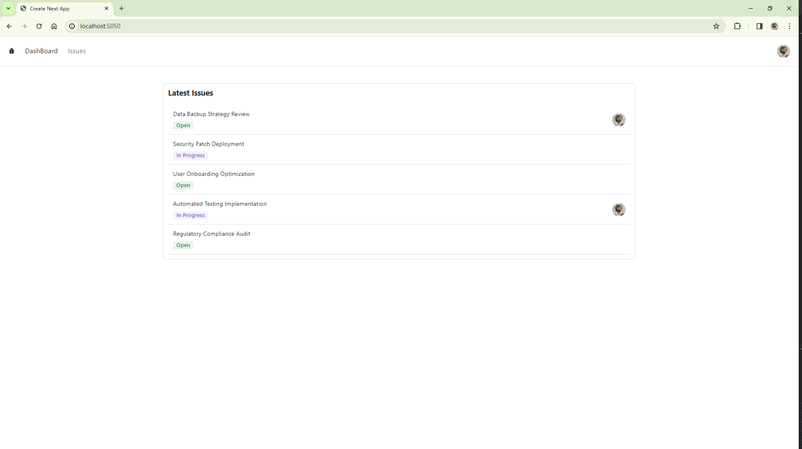
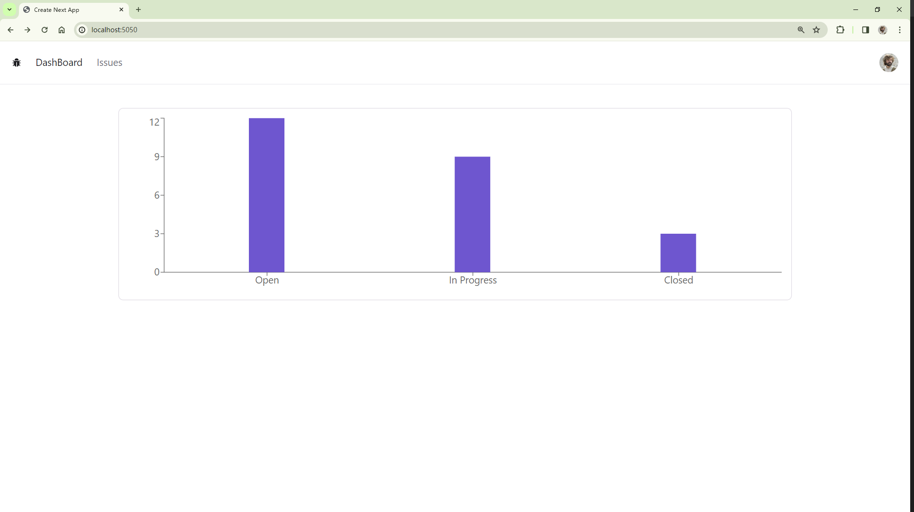
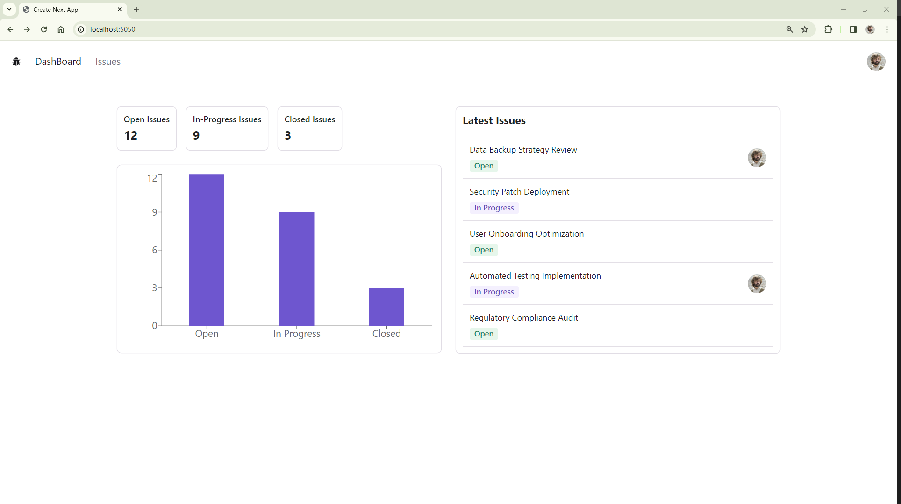

---
last_update:
  date: 17 Mar 2024 GMT
  author: Casta-mere
---

# Dashboard

## Latest Issue

[本节代码链接](https://github.com/Casta-mere/Issue-Tracker/tree/fdb10ee495380039d671a4c359d61e21e97387a5)

```tsx title="/app/LatestIssue.tsx" showLineNumbers
import prisma from "@/prisma/client";
import { Avatar, Card, Flex, Heading, Table } from "@radix-ui/themes";
import Link from "next/link";
import { IssueStatusBadge } from "./components";

const LatestIssue = async () => {
  const issues = await prisma.issue.findMany({
    orderBy: { createdAt: "desc" },
    take: 5,
    include: {
      assignedToUser: true,
    },
  });
  return (
    <Card>
      <Heading size="4" mb="4">
        Latest Issues
      </Heading>
      <Table.Root>
        <Table.Body>
          {issues.map((issue) => (
            <Table.Row key={issue.id}>
              <Table.Cell>
                <Flex justify="between">
                  <Flex direction="column" align="start" gap="2">
                    <Link href={`/issues/${issue.id}`}>{issue.title}</Link>
                    <IssueStatusBadge status={issue.status}></IssueStatusBadge>
                  </Flex>
                  <Flex align="center">
                    {issue.assignedToUserId && (
                      <Avatar
                        src={issue.assignedToUser?.image!}
                        fallback="?"
                        size="2"
                        radius="full"
                      />
                    )}
                  </Flex>
                </Flex>
              </Table.Cell>
            </Table.Row>
          ))}
        </Table.Body>
      </Table.Root>
    </Card>
  );
};
export default LatestIssue;
```

效果如下



## Issue Summary

[本节代码链接](https://github.com/Casta-mere/Issue-Tracker/tree/648026710c6e16379f90c2457dc68c4ffc5109e4)

```tsx title="/app/IssueSummary.tsx" showLineNumbers
import { Status } from "@prisma/client";
import { Card, Flex, Text } from "@radix-ui/themes";
import Link from "next/link";

interface Props {
  open: number;
  inProgress: number;
  closed: number;
}

const IssueSummary = ({ open, inProgress, closed }: Props) => {
  const containers: { label: string; value: number; status: Status }[] = [
    { label: "Open Issues", value: open, status: "OPEN" },
    { label: "In-Progress Issues", value: inProgress, status: "IN_PROGRESS" },
    { label: "Closed Issues", value: closed, status: "CLOSED" },
  ];
  return (
    <Flex gap="4">
      {containers.map((container) => (
        <Card key={container.label}>
          <Flex direction="column" gap="1">
            <Link
              className="text-sm font-medium"
              href={`/issues/?status=${container.status}`}
            >
              {container.label}
            </Link>
            <Text size="5" className="font-bold">
              {container.value}
            </Text>
          </Flex>
        </Card>
      ))}
    </Flex>
  );
};
export default IssueSummary;
```

效果如下

[Issue Summary](09-Dashboard.md)

## Issue Charts

[本节代码链接](https://github.com/Casta-mere/Issue-Tracker/tree/6c42d3df860387f6aea682e7c2110c1a25a8b742)

[Re-charts]

```bash
npm i recharts
```

[Re-charts]: https://recharts.org/zh-CN/

```tsx title="/app/IssueCharts" showLineNumbers
"use client";
import { Card } from "@radix-ui/themes";
import { Bar, BarChart, ResponsiveContainer, XAxis, YAxis } from "recharts";

interface Props {
  open: number;
  inProgress: number;
  closed: number;
}

const IssueChart = ({ open, inProgress, closed }: Props) => {
  const data = [
    { label: "Open", value: open },
    { label: "In Progress", value: inProgress },
    { label: "Closed", value: closed },
  ];
  return (
    <Card>
      <ResponsiveContainer width="100%" height={300}>
        <BarChart data={data}>
          <XAxis dataKey="label" />
          <YAxis />
          <Bar
            dataKey="value"
            barSize={60}
            style={{ fill: "var(--accent-9)" }}
          />
        </BarChart>
      </ResponsiveContainer>
    </Card>
  );
};
export default IssueChart;
```

效果如下



## Dashboard Layout

[本节代码链接](https://github.com/Casta-mere/Issue-Tracker/tree/d22da3aaf40fa22e6afbe7f417dc6e86ca5ee8b4)

```tsx title="/app/page.tsx" showLineNumbers
import prisma from "@/prisma/client";
import { Flex, Grid } from "@radix-ui/themes";
import IssueChart from "./IssueChart";
import IssueSummary from "./IssueSummary";
import LatestIssue from "./LatestIssue";

export default async function Home() {
  const open = await prisma.issue.count({ where: { status: "OPEN" } });
  const inProgress = await prisma.issue.count({
    where: { status: "IN_PROGRESS" },
  });
  const closed = await prisma.issue.count({ where: { status: "CLOSED" } });

  return (
    <Grid columns={{ initial: "1", md: "2" }} gap="5">
      <Flex direction="column" gap="5">
        <IssueSummary open={open} closed={closed} inProgress={inProgress} />
        <IssueChart open={open} closed={closed} inProgress={inProgress} />
      </Flex>
      <LatestIssue />
    </Grid>
  );
}
```

最终显示效果如下


