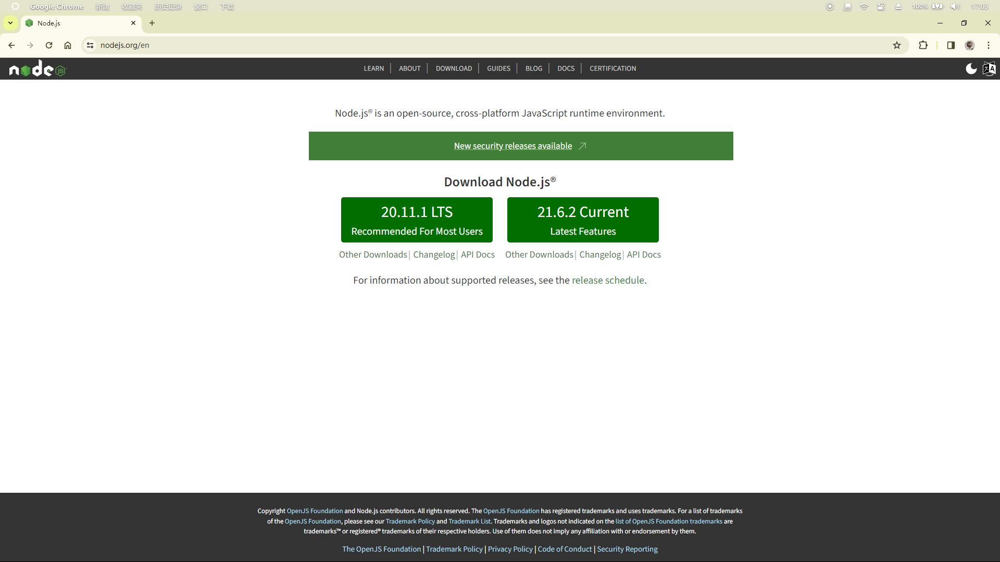
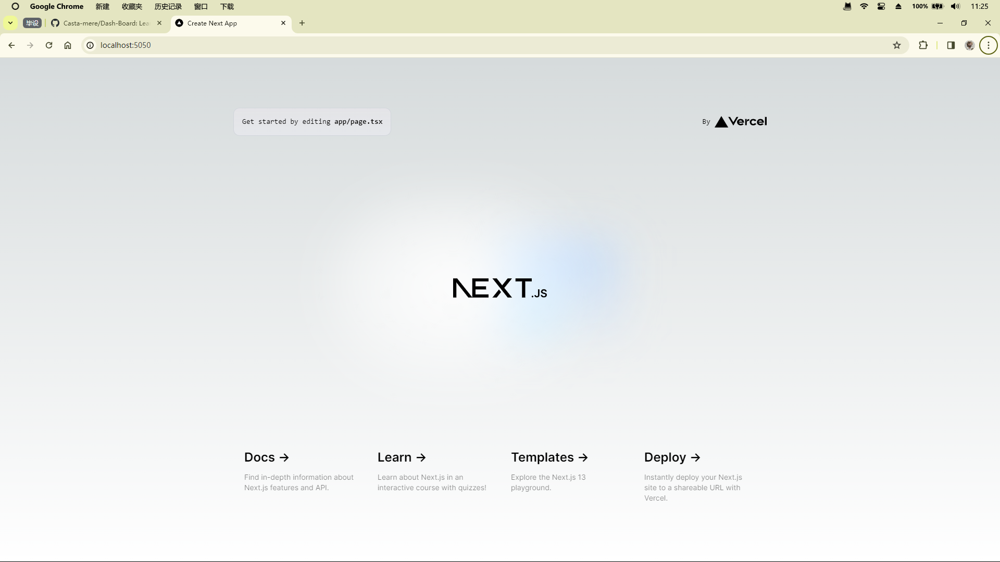
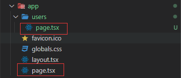
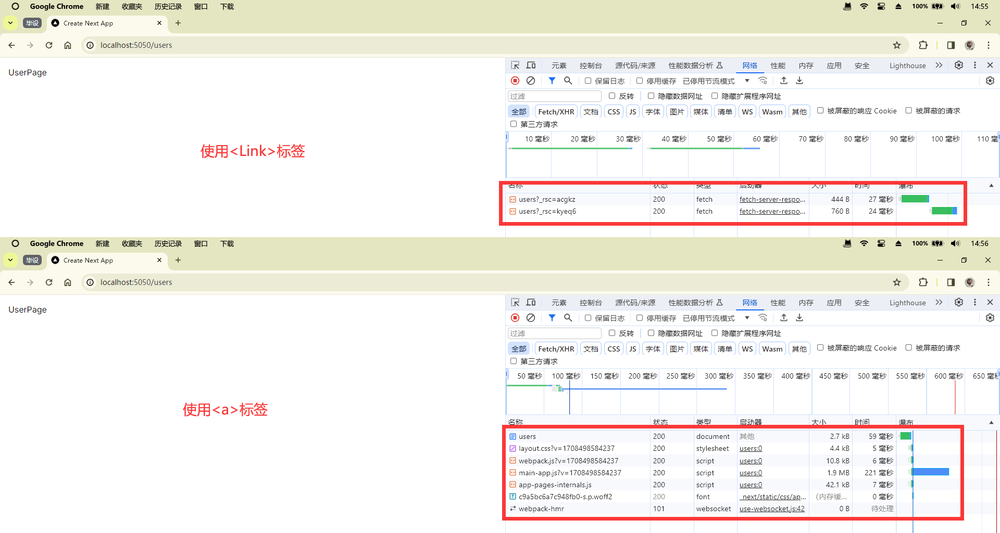
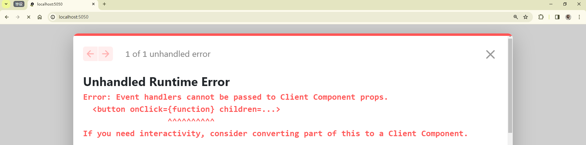

---
last_update:
  date: 21 Feb 2024 GMT
  author: Casta-mere
---

# 基础知识

本篇包括以下内容:

- Next.js 是什么
- 创建 Next.js 项目
- 客户端组件和服务器端组件
- 数据获取
- 缓存
- 静态渲染与动态渲染

## Next.js

> Next.js is a **framework** for building **fast** & **search-engine friendly** applications

Next.js 是一个流行的 React 框架，用于构建基于 React 的服务端渲染(SSR)和静态网站。它提供了许多功能和优势，使得构建现代、快速且可扩展的 React 应用变得更加简单

Next.js 的优势:

- **服务端渲染**(SSR)和静态生成：Next.js 支持服务端渲染和静态生成，可以在服务器端预先生成页面，提高页面加载速度和 SEO 表现
- 自动代码拆分：Next.js 会根据页面之间的依赖关系自动拆分代码，使得每个页面只加载其所需的代码，提升性能和加载速度
- 热模块替换：支持热模块替换，开发过程中可以实时更新页面，节省开发时间
- **文件系统路由**：Next.js 使用文件系统路由，使得页面和路由之间的映射变得简单明了
- 可插拔性：支持插件和自定义配置，可以根据项目需求灵活扩展和定制
- **静态导出**：除了服务端渲染和客户端渲染，Next.js 也支持将应用程序导出为静态 HTML 文件，方便部署到静态托管服务
- TypeScript 支持：Next.js 对 TypeScript 提供了原生支持，方便开发者使用 TypeScript 编写代码
- 优秀的社区支持：Next.js 有一个庞大活跃的社区，提供丰富的文档、示例和插件，便于开发者学习和交流

## 安装&创建项目

[本节代码链接](https://github.com/Casta-mere/Dash-Board/tree/063e0e4b8ae70a432dd69f98328afd4b8647a251)

### 安装 Node

前往[node]官网下载 Node.js 并安装(16.8 或更高)，安装当前的稳定版即可



### VS Code 插件

在 VS Code 拓展中查找以下插件 id，安装即可
| 插件名 | 插件 id |
| ------------------ | ------------------------------------- |
| ES7 + React | React:dsznajder.es7-react-js-snippets |
| TypeScript Nightly | ms-vscode.vscode-typescript-next |
| Tailwind CSS | bradlc.vscode-tailwindcss |
| Prettier | esbenp.prettier-vscode |
| Prisma | Prisma.prisma |

### 创建项目

使用以下命令创建 Next.js 项目。根据提示选择(除了项目名字，其他一路 Enter 就行)

```bash
npx create-next-app@13.4
```

```text
D:\Dash-Board [main ≡]> npx create-next-app@13.4
Need to install the following packages:
create-next-app@13.4.19
Ok to proceed? (y) y
// highlight-start
√ What is your project named? ... dash-board
// highlight-end
√ Would you like to use TypeScript? ... No / Yes
√ Would you like to use ESLint? ... No / Yes
√ Would you like to use Tailwind CSS? ... No / Yes
√ Would you like to use `src/` directory? ... No / Yes
√ Would you like to use App Router? (recommended) ... No / Yes
√ Would you like to customize the default import alias? ... No / Yes
Creating a new Next.js app in D:\Onedrive\OneDrive - txsxcy\Project\Dash-Board\dash-board.
```

安装完成后，使用`npm run dev`启动服务器

```
> dash-board@0.1.0 dev
> next dev -- -p 5050

   ▲ Next.js 14.1.0
   - Local:        http://localhost:5050

 ✓ Ready in 5.4s
 ○ Compiling / ...
 ✓ Compiled / in 5.1s (501 modules)
 ✓ Compiled in 417ms (240 modules)
 ○ Compiling /favicon.ico ...
 ✓ Compiled /favicon.ico in 2.1s (515 modules)
```

在浏览器打开生成的链接(默认是 localhost:3000)，看到如下，则创建成功



## Routing & Navigation

### 路由

Next.js 中的路由是基于文件夹结构的，在 app 文件夹中的每一个文件夹，俗称规定只有`page.tsx/js/jsx`为公共界面，其他诸如`component.tsx`, `layout.tsx`, `global.css`等等其他文件，均不能通过 url 访问。如下图的文件结构，`app/users/page.tsx` 则会自动生成 `localhost:3000/users` 路由



### 导航

在 Next.js 中，应当使用`<Link>`标签来替换`<a>`标签

```jsx showLineNumbers
import Link from "next/link";

export default function Home() {
  return (
    <main>
      <h1>Hello World!</h1>
      // highlight-next-line
      <Link href="/users">Users</Link>
    </main>
  );
}
```

从下图可以看到，使用`<Link>`标签来替换`<a>`标签可以有效减少网络消耗，减少重复的 js, css 文件请求，提升效率



## 组件的渲染

[本节代码链接](https://github.com/Casta-mere/Dash-Board/tree/5763cf964e38d7bfff1e0d203c97872ff24d8660)

客户端渲染 & 服务端渲染

### 客户端渲染(_Client-side Rendering_)

客户端渲染是指在浏览器端使用 JavaScript 来构建和渲染页面内容。一般情况下，整个页面的 HTML 结构和内容都通过 JavaScript 在客户端生成和填充。

特点：

- 交互性强：由于页面内容的动态生成和更新交由客户端 JavaScript 处理，可以实现丰富的交互效果和动画。

适用场景：

- 适用于对交互性要求较高的应用，如单页面应用(SPA)或需要频繁更新的页面。
- 对 SEO(搜索引擎优化)要求不是特别高的情况，因为搜索引擎对 AJAX 加载的内容的抓取和索引支持有限。

### 服务端渲染(_Server-side Rendering_)：

服务端渲染是指在服务器端将动态页面内容和数据渲染成完整的 HTML 页面，然后将整个页面发送给客户端。客户端收到的是已经包含完整内容的 HTML 页面。

特点：

- SEO 友好：由于服务器端已经生成包含内容的 HTML 页面，搜索引擎可以更容易地抓取和索引页面内容，有助于提高页面的搜索引擎排名。
- 首屏加载较快：用户在首次访问页面时能够快速看到页面内容，提高了用户体验。

适用场景：

- 适用于对 SEO 要求高的应用，如博客、新闻等需要被搜索引擎收录的页面。
- 对于内容频繁变化不大的情况，因为每次数据变化都需要重新向服务器请求渲染页面。

### Next.js

服务端渲染存在以下缺点：

- 无法监听浏览器事件
- 无法访问浏览器 API
- 无法维护状态(Maintain state)
- 无法使用 effects

**所以在 Next.js 中，通常把客户端组件(_Client Component_)和服务端组件(_Server Component_)一起使用，尽量只在必须的地方使用客户端渲染**。在 Next.js 中默认创建的均为服务端组件。如果像下面一样直接在 Server Component 中使用 `onClick` 监听用户操作，将会报 Runtime Error

```tsx title="Productcard.tsx" showLineNumbers
import React from "react";

const ProductCard = () => {
  return (
    <div>
      // highlight-next-line
      <button onClick={() => console.log("Click")}> Add to Cart</button>
    </div>
  );
};
```



想要解决这个问题，有两种方法。其一是直接把这个组件设置为客户端组件，如下代码所示

```tsx title="Productcard.tsx" showLineNumbers
// 在文件顶部添加"use client"使其变为客户端组件
// highlight-next-line
"use client";
import React from "react";

const ProductCard = () => {
  return (
    <div>
      <button onClick={() => console.log("Click")}> Add to Cart</button>
    </div>
  );
};
```

另一种方法则是将这个 button 封装成另一个组件，将其设置为客户端组件。这种方法可以有效地节约资源，尤其是在组件的数量上来之后，我们应该尽量**只将必须的部分设置为客户端组件**

```tsx title="Productcard.tsx" showLineNumbers
import React from "react";
import AddToCart from "./AddToCart"; // 封装出去

const ProductCard = () => {
  return (
    <div>
      <AddToCart />
    </div>
  );
};

export default ProductCard;
```

```tsx title="AddToCart.tsx" showLineNumbers
// 在文件顶部添加"use client"使其变为客户端组件
"use client";
import React from "react";

const AddToCart = () => {
  return (
    <div>
      <button onClick={() => console.log("Click")}> Add to Cart</button>
    </div>
  );
};

export default AddToCart;
```

## 数据获取

数据的获取也分为两种：即在客户端获取数据和在服务端获取数据

在客户端获取数据，直接使用 React 中的钩子(Hook) `useState() + useEffect()`即可

在服务端获取数据则可以使用 fetch 函数，比如下面这样

```jsx
const res = await fetch("https://jsonplaceholder.typicode.com/users");
const users: User[] = await res.json();
```

## 缓存

[本节代码链接](https://github.com/Casta-mere/Dash-Board/tree/0fbb14be7b0ed0b37e2cbcc2c398558d3361c417)

总所周知，可以从三个地方获取数据。即：内存(Memory)，储存(File System)，网络(Network)。其响应速度也是逐渐变慢。

在 Next.js 中会内置缓存，比如我们上面使用的 fetch 函数：

```jsx
const res = await fetch("https://jsonplaceholder.typicode.com/users");
const users: User[] = await res.json();
```

该函数只会取 fetch 一次，并储存到缓存里，也就是说，**如果数据来源是动态的，将不会自动更新**。我们可以用以下的两种办法来设置需要动态刷新的数据(比如时间戳)

```jsx showLineNumbers
const res = await fetch("https://jsonplaceholder.typicode.com/users", {
  // 设置不加缓存
  // highlight-next-line
  cache: "no-store",
  // 或者设置每10秒重新获取一次(刷新一次)
  // highlight-next-line
  next: { revalidate: 10 },
});
const users: User[] = await res.json();
```

## 静态渲染 & 动态渲染

[本节代码链接](https://github.com/Casta-mere/Dash-Board/tree/819cf3dbbeeab0eb9a9fbf19776e81274378cdf1)

当我们使用 `npm run build` build 我们的项目时，将把使用缓存的内容都直接静态渲染好，需要时直接取用

比如下面的这个 time 显示时间的组件，build 好后，时间会一直停留在 build 的那个时刻

```jsx
<p>{new Date().toLocaleTimeString()}</p>
```

```bash showLineNumbers
Route (app)                              Size     First Load JS
┌ ○ /                                    280 B          84.4 kB
├ ○ /_not-found                          882 B            85 kB
# highlight-next-line
└ ○ /users                               137 B          84.3 kB
+ First Load JS shared by all            84.1 kB
  ├ chunks/69-969bdb6d85338ea6.js        28.9 kB
  ├ chunks/fd9d1056-473e7e1246c7970a.js  53.4 kB
  └ other shared chunks (total)          1.87 kB

# highlight-next-line
○  (Static)  prerendered as static content
```

而我们取消掉 caching 后，再 build 我们的项目，则是如下的结果，可见 /users 页面的标志为 Dynamic，也就是在我们每次进入时，会自动更新(并不是在页面内自动更换数字)

```bash showLineNumbers
Route (app)                              Size     First Load JS
┌ ○ /                                    280 B          84.4 kB
├ ○ /_not-found                          882 B            85 kB
# highlight-next-line
└ λ /users                               137 B          84.3 kB
+ First Load JS shared by all            84.1 kB
  ├ chunks/69-969bdb6d85338ea6.js        28.9 kB
  ├ chunks/fd9d1056-473e7e1246c7970a.js  53.4 kB
  └ other shared chunks (total)          1.87 kB

# highlight-next-line
○  (Static)   prerendered as static content
# highlight-next-line
λ  (Dynamic)  server-rendered on demand using Node.js
```

[node]: https://nodejs.org/en
