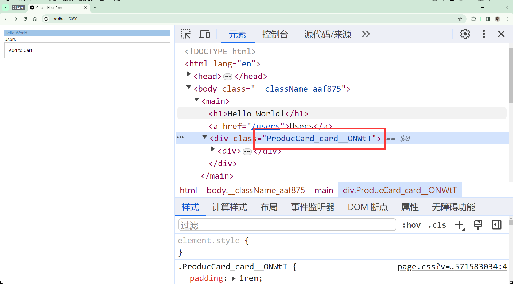

# 风格化

本篇包括以下内容:

- Global styles
- CSS modules
- Tailwind CSS
- Daisy UI

## Global styles

[本节代码链接](https://github.com/Casta-mere/Dash-Board/tree/9130076a87468c6f4b91ab53a69f363bb18b635e)

在 `\app\global.css` 中内容的为全局格式，尽量不要在其中写专用于某个页面或某个组件的 css，把这些内容放到对应的 CSS modules 中

```css showLineNumbers  title="\app\global.css"
@tailwind base;
@tailwind components;
@tailwind utilities;

:root {
  --foreground-rgb: 0, 0, 0;
}

@media (prefers-color-scheme: dark) {
  :root {
    --foreground-rgb: 255, 255, 255;
  }
}

body {
  color: rgb(var(--foreground-rgb));
  padding: 1rem;
}

/* 不推荐在该文件中添加这些内容 */
.user {
  color: xxx;
}
```

## CSS modules

[本节代码链接](https://github.com/Casta-mere/Dash-Board/tree/5827282ab172fff9e59e370433f0788c13d77cf9)

CSS moduls 是针对某个组件/页面的 css 文件

比如可以像下面这样，为 `ProductCard` 添加 CSS module，注意命名 css 文件后缀为 `.module.css`

```css title="ProductCard.module.css"
.card {
  padding: 1rem;
  border: 1px solid #ccc;
}
```

```jsx title="ProductCard.tsx" showLineNumbers
import React from "react";
import AddToCart from "../AddToCart";
// import 进来
// highlight-next-line
import style from "./ProducCard.module.css";

const ProductCard = () => {
  return (
    // 使用 style.类名来使用
    // highlight-next-line
    <div className={style.card}>
      <AddToCart />
    </div>
  );
};

export default ProductCard;
```

我们可以看到，最后生成的类名并不是`card`，而是 postcss 自动帮我们生成的类名



我们可以在 `postcss.config.js` 中查看，默认的插件为 tailwind 和 autoprefixer

```js title="postcss.config.js"
module.exports = {
  plugins: {
    tailwindcss: {},
    autoprefixer: {},
  },
};
```

## Tailwind CSS

[本节代码链接](https://github.com/Casta-mere/Dash-Board/tree/4ffdb120a601da58c5405f8f5a95c6a809c01cbb)

[Tailwind] 是一个高度可定制的 CSS 框架，它提供了一组原子类，使用这些类可以快速构建现代的用户界面。与传统的 CSS 框架不同，Tailwind CSS 不是基于预定义的组件或样式，而是在工作流程中提供了一组低级的原子类，这些类可以直接应用于 HTML 元素。

Tailwind CSS 的主要特点如下：

1. **高度可定制**：Tailwind CSS 允许根据项目需求进行高度定制，可以通过配置文件轻松地添加、删除或调整样式。
2. **原子类**：Tailwind CSS 提供了一组简洁明了的原子类，这些类可以代表特定的样式属性，例如颜色、字体大小、间距等。可以根据需要组合这些原子类来构建所需的样式。
3. **响应式设计**：Tailwind CSS 内置了一套响应式设计类，使得在不同的屏幕尺寸下，可以轻松地控制元素的显示和排列方式。
4. **高性能**：由于使用了原子类，并且不需要额外的运行时 JavaScript，Tailwind CSS 在性能方面表现出色。

**在 Next.js 中内置了 Tailwind**，可以像下面这样直接使用。他的优点是在你每次修改之后，会直接把非必须的 CSS 文件去除掉，以减轻最后 Bundle 的大小

```jsx title="ProductCard.tsx" showLineNumbers
import React from "react";
import AddToCart from "../AddToCart";

const ProductCard = () => {
  return (
    // 直接这样用，不需要任何 import
    // highlight-next-line
    <div className="p-5 my-5 bg-sky-400 text-whil text-xl hover:bg-sky-500">
      <AddToCart />
    </div>
  );
};

export default ProductCard;
```

## DaisyUI

[本节代码链接](https://github.com/Casta-mere/Dash-Board/tree/72b99e357bc04aed598157e02a0778f21ca272b7)

[DaisyUI]是一个 Tailwind 的集成插件，有很多高效美观的组件，类似于 bootstrap，但更易上手使用，安装也十分简单。可以直接使用下面的命令安装

```bash
npm i -D daisyui@latest
```

然后修改 `tailwind.config.js/ts` 即可

```js title="tailwind.config.js/ts" showLineNumbers
import type { Config } from "tailwindcss";

const config: Config = {
  content: [
    "./pages/**/*.{js,ts,jsx,tsx,mdx}",
    "./components/**/*.{js,ts,jsx,tsx,mdx}",
    "./app/**/*.{js,ts,jsx,tsx,mdx}",
  ],
  theme: {
    extend: {
      backgroundImage: {
        "gradient-radial": "radial-gradient(var(--tw-gradient-stops))",
        "gradient-conic":
          "conic-gradient(from 180deg at 50% 50%, var(--tw-gradient-stops))",
      },
    },
  },
  // 只修改这一行
  // highlight-next-line
  plugins: [require("daisyui")],
};
export default config;
```

完成以上步骤之后即可直接在 component 中使用，不需要任何 import

```tsx title="AddToCart.tsx" showLineNumbers
"use client";
import React from "react";

const AddToCart = () => {
  return (
    <div>
      {/* 直接这样用即可 */}
      {/* highlight-next-line */}
      <button className="btn btn-primary" onClick={() => console.log("Click")}>
        {" "}
        Add to Cart
      </button>
    </div>
  );
};

export default AddToCart;
```

[Tailwind]: https://tailwindcss.com/
[DaisyUI]: https://daisyui.com/
